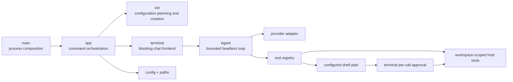

# Xana architecture

> Audience: Contributors and coding agents  
> Authority: Descriptive

This document describes what Xana is and how its implemented boundaries work.
Future system shapes belong in [proposals](../proposals/), while durable
constraints and philosophies belong in [Design Principles](../principles.md).

## System overview

Xana is one Rust binary crate with a blocking terminal frontend. `main.rs` is
the process composition root: it parses the optional `XANA_HOME` override and
delegates command execution to `app`. The application edge resolves paths,
loads configuration, initializes dependencies, and routes CLI commands.



`terminal` owns readline input, temporary conversation history, and human
rendering. `presentation` owns terminal-mark selection and its TTY,
monochrome, suppression, and fallback behavior. Neither concern enters the
headless agent loop.

## Agent and conversation boundary

`Agent` owns one concrete conversational provider, a deterministic tool
registry, the launch workspace, and an eight-round tool limit. It sends the
conversation to the provider, executes requested tools serially, appends
correlated results, and returns the final assistant message.

The provider-neutral conversation model carries ordered text, tool-call, and
tool-result content. Provider request and response shapes remain private to
their adapter. The OpenAI-compatible adapter separates its wire structs,
conversion rules, blocking HTTP client, and captured response fixtures.

`Agent` receives owned dependencies and limits. It does not load
configuration, inspect environment variables, resolve platform paths, or
render terminal output.

## Tool boundary

Xana exposes four host tools through an object-safe `Tool` trait and a
provider-neutral registry:

- `read_file` reads bounded UTF-8 content with an optional inclusive line
  range.
- `list_files` returns a bounded, sorted, non-recursive directory listing.
- `edit_file` replaces exactly one match in an existing bounded UTF-8 file.
- `run_command` executes one command string through a configured shell in an
  existing workspace directory after a fail-closed terminal approval. It
  returns status plus independently bounded stdout and stderr.

All tool paths are relative to Xana's launch workspace and must remain beneath
that workspace after lexical and canonical resolution. Reads and resulting
edits are capped at 64 KiB; directory listings are capped at 256 entries and
64 KiB of output.

The registry caches each validated definition beside its implementation,
dispatches model requests, and reports effect class separately from replay
safety. `run_command` is `Execute` plus `ReplaySafety::Never`; its exact program
argv, command, shell, and canonical cwd exist before approval and spawn. Shell
selection resolves once at the application edge: macOS/Linux support POSIX
`sh -lc`, while Windows supports PowerShell, Git Bash, and `cmd` through
explicit configurations. A custom compatible program path may replace the
default executable.

File tools currently execute under the configuration's automatic `allow`
mode. The command approval contract is a deliberately provisional frontend
adapter, not the proposed runtime permission protocol. Neither metadata,
workspace path checks, nor approval provides process containment. Tools run
with the Xana process's ordinary host access, and `edit_file` does not claim
atomic or crash-safe writes.

## CLI, configuration, and initialization

Bare `xana` starts terminal chat. The typed command boundary also exposes
`xana init`, `xana config path`, and `xana config check`.

Initialization collects interactive or explicit noninteractive answers,
builds a configuration draft without filesystem effects, renders the version
1 TOML shape, validates it through the production configuration loader, and
creates `config.toml` without replacing an existing file. Path and
configuration diagnostics do not construct an agent.

Xana loads a strict, versioned `config.toml`. It validates named
OpenAI-compatible provider connections and agent profiles, then resolves the
required default profile and shell configuration into owned values before
constructing `Agent`. Interactive initialization collects a platform shell
choice; noninteractive initialization accepts explicit shell kind and program
flags. Existing version 1 documents without `[shell]` use `platform`.

See [Configuration](../user/configuration.md) for the user-facing schema and
path rules.

## Paths and application identity

The canonical application identifier is:

```text
io.github.labcoder.xana
```

`ProjectDirs::from("io.github", "labcoder", "xana")` maps Xana-owned
configuration, data, cache, and runtime state to platform-standard locations.
The identifier is compatibility state: changing repository location or adding
a frontend does not justify orphaning existing user data.

An unset or empty `XANA_HOME` uses those platform defaults. A non-empty
override must be an absolute native path and maps Xana's backend state beneath
one portable root. Path resolution is pure policy; it does not create or
canonicalize the returned directories.

## Source organization

The crate establishes responsibility and I/O boundaries before it needs
physical package boundaries:

- `main.rs` composes the process.
- `app` owns command routing and dependency construction.
- `terminal` and `presentation` own frontend behavior.
- `agent` and `message` contain the headless loop and internal conversation
  model.
- `provider` and `tool` are narrow facades over private adapter and tool
  implementations.
- `config`, `paths`, and `init` own validated input and filesystem policy at
  the application edge.

Initialization separates pure planning from create-new filesystem writes.
Large private test suites live in child modules; package-level executable smoke
tests live under `tests/`.

See [Code organization](../development/code-organization.md) for the policy
that maintains these boundaries.

## Deliberate absences

Xana has no durable session store, unified permission broker, sandbox,
background runtime, workspace crate split, runtime profile switching,
streaming event protocol, scoped or persistent grants, permission audit store,
or crash-safe edit protocol. The `run_command` y/n prompt is the only approval
path and is explicitly temporary. These absences are implementation facts, not
predictions about which proposals will be accepted.
