# Xana architecture

> Audience: Contributors and coding agents  
> Authority: Descriptive

This document describes what Xana is and how its implemented boundaries work.
Future system shapes belong in [proposals](../proposals/), while durable
constraints and philosophies belong in [Design Principles](../principles.md).

## System overview

Xana is a local-first agent application running on Tokio's multi-thread
runtime. Native connections use one in-process foreground runtime; the Codex
connection supervises a vendor-owned app-server process. The root Cargo
application package named `xana` owns the installed `xana` executable, process
composition, headless agent, application policy, provider adapters, and
terminal frontends. The same Cargo workspace also contains `xana-desktop`, a
native GPUI application that embeds the matching root-package runtime through
a narrow repository-private boundary and carries graphical dependencies only
in the Desktop package.
The application edge resolves paths, loads configuration, initializes
dependencies, and routes CLI commands. Process startup gives that application
owner one named 4 MiB stack before it enters Tokio; this bounds the one extra
thread while preserving debug-build headroom for the large managed-runtime
future on platforms whose process-main stack is smaller. Tokio retains
ownership of asynchronous workers and cancellation beneath that edge.
The capability module owns validated capability/tool identifiers and an
immutable capability snapshot. Capability discovery remains pure metadata;
the headless agent is independently kept free of terminal, process-global,
and provider-wire concerns. See
[composition services](composition-services.md) for the capability,
self-documentation, and document-extraction boundaries.
[Connections, models, and managed runtimes](models-and-managed-runtimes.md)
describes native inference, Codex delegation, catalogs, selection, and
credential ownership.

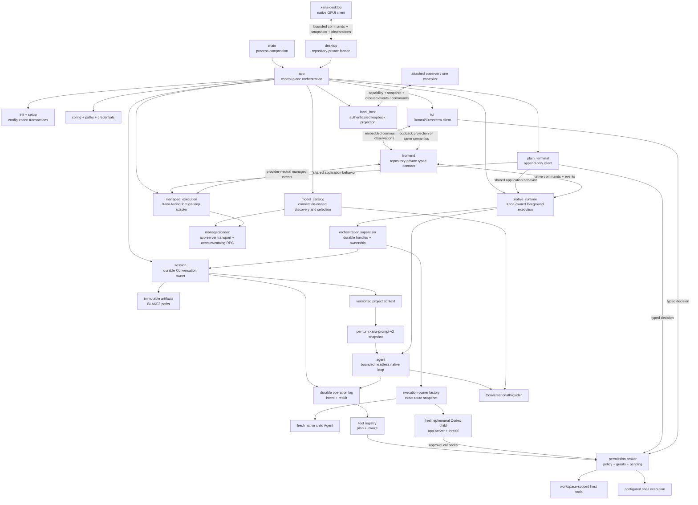

`native_runtime` owns the sole open native session writer, reduced conversation history, and
at most one active root operation. `frontend` owns the repository-private
versioned client vocabulary and the reference embedded adapter.
`plain_terminal` is a client that owns readline input, permission answers, and
append-only human rendering. `managed_execution` adapts a vendor-owned loop
into the same Xana conversation/frontend vocabulary without owning Codex's
inner loop.
`presentation` owns semantic presentation tokens, adaptive terminal-mark
selection, and the pure resolution of injected terminal facts plus bounded
machine-local preferences. The application edge samples TTY state, color
depth, background hints, Unicode, width, and reduced-motion preferences once
per surface. Redirected, dumb, monochrome, and `NO_COLOR` profiles resolve to
plain text with no control sequences. Preference failure falls back safely and
cannot change runtime policy. None of those frontend concerns enters the
headless agent loop.
Dark and light profiles additionally resolve base and raised surface colors;
all Ratatui presentation applies those styles below domain state. The TUI-owned
`intro` adapter applies one TachyonFX effect to the canonical presentation
portrait after terminal entry and before ordinary first paint. It is bounded to
1.5 seconds, consumes no runtime/provider state, is skippable, and is omitted by
resolved reduced-motion, ASCII, width, height, and noninteractive fallbacks.

Runtime and domain boundaries remain in the root `xana` application package.
The second real frontend now lives in `crates/xana-desktop`; it proved only the
smallest repository-private `desktop` facade, not a public engine SDK. That
facade is `pub` solely for sibling-package visibility and exports bounded
projection values plus typed intent. It does not export provider objects,
credentials, arbitrary filesystem authority, shell handles, or runtime
ownership. Further crate extraction still requires a demonstrated ownership or
build boundary rather than desktop, web, or mobile intent alone. See
[Desktop architecture](desktop.md).

The embedded client captures an initial snapshot before it begins forwarding
live events. The snapshot carries the native conversation, connection, model,
execution owner, child summaries, artifact-backed image references, and a
versioned semantic snapshot under explicit message-count and encoded-size
limits. The semantic snapshot freezes the validated configured resource policy
and provides bounded content, resource, usage, activity, attention, approval,
execution-fact, capability, disclosure, and completion families. Current native,
managed, TUI, and Desktop adapters project the implemented semantic families;
legacy observations remain repository-private compatibility input. An absent
semantic fact does not imply a false capability or outcome. See [Frontend
semantic protocol](frontend-semantics.md).
The embedded client then assigns monotonically
increasing sequence numbers to live observations and forwards them through a
256-entry bounded queue. An oversized observation becomes a bounded omission
fact. Under queue pressure, only replaceable live streaming deltas may be
omitted; final assistant messages, terminal operation states, approvals,
failures, and other authoritative facts receive a bounded five-second delivery
grace. A frontend that still cannot receive a critical fact is detached with a
typed stalled-observer error without blocking or cancelling runtime work.
Runtime shutdown, controller loss, runtime panic, observation stall, and
forwarder failure remain distinct terminal reasons. Dropping the embedded owner
closes the runtime command lane and follows the foreground cancellation path.

`local_host` projects a bounded repository-private host vocabulary over a
loopback-only WebSocket. `xana serve` is explicit and foreground; it never
daemonizes or accepts a non-loopback bind. An opened filesystem identity—not
canonical path spelling—selects one runtime descriptor and lock, so symlink,
junction, case, and Windows prefix aliases cannot create separate collision
domains for the same directory. The lock file advances a durable monotonic
owner generation on every successful claim. The protected version-2
descriptor carries that generation, a fresh per-launch capability, and the
endpoint, while normal logs and attach arguments carry neither. A competing
claim either owns the lock or returns the compatible lock-backed descriptor to
the attach path; it cannot become a second owner. The first bounded local-host
frame must match protocol version, host generation, filesystem identity,
capability, and requested role before any snapshot is sent. Browser handshakes
additionally require a loopback Origin.

The host observation hub captures its bounded workspace snapshot and installs
a 256-entry observer queue while holding one lock. Each later event receives
one monotonically increasing host sequence under the same lock, so attachment
has no snapshot/live race. A full queue drops that observer rather than
blocking host execution; reconnect and sequence gaps take a new snapshot
instead of guessing replay. Observers receive correlated rejections and
bounded audit events without crossing the runtime command lane. One client may
explicitly acquire the hosted Conversation's controller lease; acquisition,
renewal, reconnect, release, expiry, and takeover update the same snapshot/event
sequence. Protocol 6 adds authoritative committed-user observations so newly
attached clients retain the same bounded conversation and absolute positions
as the sender. Protocol 5 snapshots introduced the non-secret controller identity,
lease generation, connected/reconnecting state, takeover state, disconnect
reason, and remaining reconnect grace. A takeover confirmation binds the exact
observed controller identity and generation. The first competing confirmation
advances the generation; every stale contender is rejected with the new
authoritative lease instead of silently becoming the last writer. Controller
commands retain their independent command and operation ids and enter the same
embedded native owner or managed Codex driver used by local frontends.

A disconnected controller enters a three-second reconnect grace identified by
an in-memory per-lease capability. The bearer is rotated after acquisition,
renewal, and reconnect, and is omitted from snapshots, events, Debug output,
diagnostics, and durable state. Reconnect authenticates the same authority and
begins from a fresh snapshot; it may replace a stalled transport before its
close notification arrives without leaving both transports authoritative.
Grace expiry or explicit release drains pending approvals with deny/cancel and
interrupts the exact active operation. A pending native or managed approval
blocks takeover, and observers never inherit control. The workspace host
remains the sole root gate, so changing clients cannot create a competing
native or managed root.

`controller` is the transport-independent lease reducer shared by the
loopback host and the application `execution_host`. The latter keys leases by
Conversation, so different Conversations may have independent controllers;
every Desktop mutating command is checked against its current controller before
it reaches the embedded runtime. Controller changes are ordered host events,
Desktop-safe projections, and metadata-only Diagnostics facts. Restart creates
no authority from stale client state.
Host snapshots expose bounded conversation
metadata and a workspace hash/display name, not the canonical path, provider
secrets, credential references, or capability. Frames are capped at 1 MiB.

Client isolation is structural: at most 32 client tasks exist, each has a
256-event queue, a 256-frame-per-second inbound budget, and a two-second write
deadline. Queue overflow or transport failure removes only that subscriber.
The authenticated artifact adapter indexes at most 512 immutable records found
in visible frontend messages and semantic resource/attachment events. Protocol
5 lookup accepts `ArtifactId` plus a byte offset, never a path, streams the full
content through digest and file-identity verification, and retains at most one
64 KiB range. The result reports exact range offset, total length, and whether
more bytes follow. A symlink, non-regular file, replacement race, length
mismatch, or digest mismatch fails closed.

Host shutdown cancels intake and controller authority, then gives the exact
owned execution two seconds to close normally. A shared five-second hard
deadline aborts only its retained Tokio task handle and client tasks. Dropping
the native owner enters runtime/child structured shutdown; dropping a managed
driver drops the `kill_on_drop` app-server child. Descriptor cleanup is tied to
the verified host-generation lease, so stale PID metadata is diagnostic only
and never process-kill authority.

### Detached host and scheduled work

`autonomy` owns the typed, owner-authored job, schedule, budget, expiry and
receipt lifecycle. `storage::autonomy` persists it in SQLCipher with immediate
transactions, revision checks, indexed due/active-job lookups and bounded
payload reads. A task owns its own inspectable Conversation and an exact
workspace/Project/Profile/route/permission snapshot. Neither a focused client
nor learned text supplies its authority. The initial actions are local reminder
receipts and native tasks under an explicit read-only capability ceiling.
Managed execution and arbitrary effect tools are not supported by this path.

`app::autonomy_commands` composes protected custody and typed controls shared
by CLI, terminal/TUI commands and Desktop's Schedules panel. Explicit start
launches a detached CLI process; a spawn receipt is not a readiness receipt.
`autonomy::host` reuses authenticated loopback discovery, keyed by protected-home
filesystem identity. It retains the discovery lease until scheduled execution
has drained, so detaching every observer cannot create another scheduler or
allow a competing process to recover a live occurrence. Client control remains
separate from schedule authority; the background native runtime has no human
controller and rejects new permission questions and owner-only memory commands.

The protected-home background lease serializes scheduled runs and maintenance.
Foreground intent is held for an active operation, not an idle client, and
preempts background work before competing for the workspace root. Native
shutdown first requests acknowledgement, then aborts and joins its retained
worker on timeout; workspace/background leases remain held through that join
and the terminal receipt. Cancellation cannot establish that a remote request
stopped computing or charging. A claimed occurrence without a terminal receipt
recovers as Unknown/NeedsYou and is never automatically replayed.

One-shot times are absolute instants; daily times retain a bundled IANA zone.
The calendar selects the earlier repeated wall-clock time, advances a missing
time to the first valid instant and coalesces missed days into one evaluation.
Task admission retains the compiled job/day/queue ceilings and intersects lower
owner usage limits. A stop-policy transaction records the exact active job;
the owning host adds its bounded attached-client snapshot at acknowledgement.
That impact receipt names affected work without turning a stop request into an
unsupported completion or key-sealing claim.

`autonomy::startup` separately manages explicit, home-specific per-user login
registration: Windows HKCU Run, macOS LaunchAgents and Linux XDG autostart.
Typed arguments contain the executable and home identity, never task bodies or
credentials. Registration edits revoke protected startup permission first and
grant it last; OS registration and SQLCipher cannot be one transaction.
Available post-login keys remain required. See [durable schedules](../user/durable-schedules.md)
for exact controls, limits and unsupported profiles.

`autonomy::triggers` adds selected-directory metadata sampling and one explicitly
named GitHub Actions run. Source observations use frozen identity/scope and
revision-checked protected writes; changed sources coalesce to one pending
occurrence. Known Xana output revisions suppress writeback loops. Overflow,
changed authority and uncertain shell effects become NeedsYou, not broader
observation or unattended effects. GitHub polling uses only a selected credential,
conditional responses and bounded backoff, never ambient CLI authentication.

`autonomy::supervision` projects indexed work pages and exact review from the
same records. Desktop's passive observer consumes bounded metadata pages and
durable receipt edges, including source failures before execution admission.
First attachment/home changes establish a quiet baseline; deduplication and
redacted notification policy do not grant authority. Espejo and Schedules reuse
the shared projection rather than owning a scheduler.

### Retained workers and context operations

`orchestration::retained` persists a completed child's identity, goal, evidence,
original scope, expiry, bounded mailbox and execution receipts in
`storage::retained`. Explicit follow-up runs use the existing child supervisor
under the original parent and cumulative descendant/usage limits. Native and
managed runs are fresh bounded executions, not restored interpreter heaps or
implicit vendor-session resumes. The source Conversation writer lease prevents
a foreground owner and retained runner from mutating that journal concurrently.

Cumulative descendant admission is read from bounded indexed durable records,
not the hydrated execution view that intentionally omits completed children.
Malformed or incomplete accounting fails closed. Completion settlement fences
the execution/reservation identity while retaining follow-ups accepted during
execution; owner edits still require an exact record revision.

Privacy generation, configuration/grants and source identity are rechecked.
Unknown outcomes require explicit reconciliation without replaying the consumed
request. `orchestration::context_ops` implements a closed deterministic operation
set over selected immutable artifacts; full verification reads count toward
per-operation and cumulative byte limits. Derived artifacts retain lineage.
There is no arbitrary reducer code or model call hidden in these operations.
The CLI/TUI and background Desktop facade share these owners; GPUI stores form
and selection state only. See [retained workers](../user/retained-workers.md).

### Dedicated browser tasks

`browser` owns one optional, qualified native process tree, fresh profile,
mandatory recipient proxy, bounded CDP connection and typed task lifecycle.
`browser::tool` uses the existing Profile, tool-approval and outbound-review
boundaries. Fixed internal page scripts run in a private isolated world and
produce bounded untrusted observations and single-use element references; no
public arbitrary-evaluation seam exists. Approval binds the observed target and
supported form destination/method/non-secret field state, not just an opaque ID.
Page identity changes or takeover invalidate references before an effect.

The Windows adapter assigns the suspended process to its owned Job Object
before execution. Cleanup joins owned descendants and verifies profile identity
before removal. Failed cleanup remains a failed state, not an idle success.
The same close barrier joins the CDP reader and its policy tasks, closes the
transport writer even when page handles remain, and joins the proxy listener
and active tunnels. Startup failure uses this barrier too; abort-on-drop alone
is not evidence of a successful close.
Tracked ownership starts before process/profile allocation, survives a dropped
request, and fences new admission until shutdown joins the cleanup result.
Receipts/screenshots use protected storage; browser cache/login material is a
separate temporary boundary. Exact-recipient egress is not an effect sandbox
or OS firewall. Other native platforms remain unqualified and fail closed.

Runtime, TUI/plain and Desktop browser controls target that same owner.
Inspection/revocation bypasses the model queue but not frontend controller
authority; a weak event sender does not keep a stopped runtime alive. Only the
reviewed tool path can launch, navigate, act or resume. Managed Codex and
unattended schedules do not acquire this browser capability. See the
[browser guide](../user/local-browser.md) for supported operations and limits.

Before dispatching an effect, the owner persists a Conversation-bound pending
review intent. Uncertainty survives successful process cleanup and runtime
restart. A separate exact-receipt/revision owner command records a verified
applied/not-applied outcome; neither a model tool nor closing the browser can
clear the fence. Resolution is a receipt, not effect replay or an independently
verified external business-success claim.

Client commands use a provider-neutral, serializable value and an independent
correlation id. The embedded transport reports whether it accepted the
bounded command for delivery; semantic runtime outcomes remain ordered
observations. This contract is repository-private and makes no compatibility
promise to third-party clients or future network adapters.

`workspace_host` owns local-workspace conversation discovery and the
single-root admission gate shared by embedded native and managed clients. A
bounded snapshot combines reducible native session records with retained
opaque managed handles and native modification metadata. Explicit native
history inspection reduces one selected session; managed inspection returns no
invented transcript. The TUI caps the projection to 512 deterministic rows,
derives bounded titles only from retained user text, and keeps viewed history,
the runtime transcript, and unsent draft as separate state. Switching view
focus cannot transfer control or dispatch work. A versioned workspace/frontend
file persists only the wide-rail Boolean; runtime selection, activity,
unread/error state, and ownership are recomputed. The same filesystem-backed
collision identity used by `local_host` keys an OS file lock acquired only for
an active root turn. Each successful lease advances its durable generation;
the bounded host-id/PID/generation/conversation descriptor is diagnostic and
never authorizes process signalling. A second
plain client may hold an inactive session writer and draft input, but its turn
cannot cross the root gate. Dropping the active embedded client follows the
existing runtime cancellation path before its lease is released.

`execution_host` is the bounded application coordinator above those
workspace-scoped owners. It admits at most eight durable Conversations and
four simultaneous Runs, keys every command, observation, approval count,
failure, and terminal receipt by stable `ConversationId`, and never holds its
coordination lock while model or tool work executes. Filesystem identity—not
path spelling—groups aliases into one write-collision domain. Independent
workspaces may run concurrently; a second write-capable Run in the same
workspace is rejected unless its caller supplies the explicit collision-risk
acknowledgement. Xana never creates a worktree implicitly.

The host projects one atomic snapshot with a sequence watermark followed by a
bounded ordered event suffix. A retained cursor receives only later events; an
evicted or otherwise unprovable cursor receives a fresh snapshot. Slow clients
cannot make the host retain or retransmit an unbounded cumulative history.
Host restart reconstructs durable Conversation owners as idle and never
replays an interrupted Run. Desktop consumes this contract for persistent
multi-Conversation navigation, attaching as controller or observer to the
selected Conversation without transferring runtime ownership into the view.

Host lifecycle is an explicit `running → draining → persisting → closing →
stopped` reducer. Draining closes admission before cancellation and returns the
exact Conversation/Operation identities that execution owners must settle.
Every controller lease expires at that boundary. Finalization requires proof
that durable state was flushed and provably owned execution was cleaned up;
unproven cleanup leaves shutdown incomplete and emits a redacted host notice.
Any Run still active after the owner has settled is recorded as interrupted,
never completed. The idempotent shutdown receipt carries those exact identities
and cleanup facts.

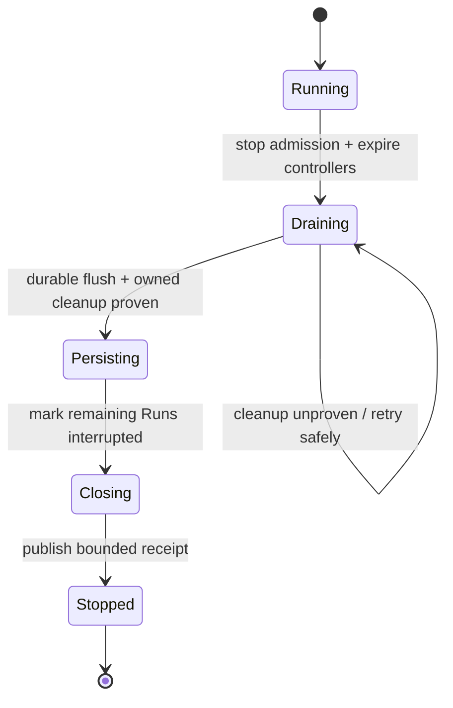

Xana-wide host failures, controller loss, recovery actions, resource pressure,
and storage failures are typed global notices outside Conversation messages.
The shared notification planner maps only approval, question, completion,
failure, controller-loss, and host-failure attention while a client is
unfocused or minimized. It applies bounded deduplication and fixed lock-screen-
safe copy; prompts, output, reasoning, paths, tool arguments, and secrets never
enter a notification. Platform delivery remains a narrow Desktop adapter.

Startup reconciliation extends the existing Diagnostics authority rather than
creating another log or crash store. A clean launch removes only unlocked,
regular artifact staging names matching Xana's `.UUID.tmp` grammar. Published
hash artifacts, symlinks, unrelated files, live locked writers, durable native
history, and managed thread identities are preserved. Repeated reconciliation
is bounded and idempotent and never resumes or replays provider/tool work.

Native and managed Conversations have one Xana-owned stable identity distinct
from their execution owner's handle. For native Conversations the UUID is
currently identical to the durable session UUID as a compatibility mapping;
managed Conversations persist a separate Xana UUID beside the opaque provider
thread id. Version-1 and version-2 managed-handle documents derive a stable
legacy identity when read, while new writes use version 3.

An explicit branch always creates a new Xana Conversation and preserves the
source. A native branch reuses the exact immutable entry records through the
chosen active-path entry, writes lineage before atomic publication, and shares
the source's immutable Profile snapshot and optional Project membership. A
managed owner-native fork is retained only when the adapter proves that
capability. Otherwise Xana records a fresh managed continuation with zero
claimed shared entries; it does not fabricate or translate vendor history.
An ordinary Profile-commit failure removes the just-staged native or managed
target before returning. Recovery from a process crash between the two durable
stores remains part of the M4 lifecycle/recovery work rather than an implied
cross-file atomicity guarantee.

The append-only terminal and one-shot adapter are permanent clients of this
boundary. One-shot accepts exactly one bounded argument or stdin source,
denies unresolved approvals, and writes only the final payload to stdout.
Human activity and diagnostics use stderr. Its version-2 JSON result envelope
is redacted and maps invalid input, configuration, connection, approval,
runtime, incomplete, and interruption outcomes to stable process categories.
`incomplete` means the operation committed progress and is awaiting an exact
round-budget decision; it is neither success nor failure. The envelope is a
terminal result contract, not an event stream.

Behind the embedded adapter, control values cross a bounded Tokio channel as
serializable `RuntimeCommand`s. One internal foreground receiver drains
serializable `AgentEvent`s from the runtime's unbounded channel into the
bounded client queue. Commands submit turns, clear idle
history, identify explicit recovery work, correlate permission and round-budget
decisions, and shut down the runtime. The dedicated CLI recovery controller consumes
`ResumeOperation`; merely opening a foreground chat never reconciles effects.
Events carry operation state, assistant deltas, permission requests and audit
facts, committed invocation facts, tool completion, round-budget suspensions
and decisions, final messages, failures, clearing, rejections, and attributed
child lifecycle/activity/reports. Except for explicit permission and
round-budget decisions, event delivery is passive: losing the receiver does not
alter an operation's result.

Each child has a 256-event bounded observation queue. Its permission-request
control lane remains separate so an activity flood cannot hide a decision that
must fail closed. The supervisor forwards at most 4,096 non-control child
events or 4 MiB of their serialized attribution and payload, then emits one
attributed truncation warning. Durable state records lifecycle and reports,
not transient deltas. The internal foreground root event stream remains a
single unbounded receiver; child contribution to it is bounded before
forwarding and frontend delivery is independently bounded.

Child list, detail, cancellation-request, and permission-decision commands
address the in-process supervisor. They do not imply a daemon or remote runtime
host. A cancellation-request event confirms only that the signal was accepted;
the committed terminal lifecycle/report is the stop acknowledgement.

## Child supervision boundary

When a native root has configured task routes, the application creates one
`ChildSupervisor` actor and registers `spawn_agent`, `spawn_many`,
`await_agent`, `collect_agents`, `cancel_agent`, and `delegate_agent` only in the root tool
registry. The
model-facing convenience calls the supervisor's distinct `spawn_agent` and
`await_agent` operations in one tool execution, so no outer model response is
needed between admission and collection. `AgentId` is the
durable handle key. A session's root `AgentId` is deterministically derived
from its public `SessionId`, keeping lineage stable across resume without a
write-on-open migration.

Admission prepares the exact route, execution owner, connection/model,
immutable capability/authority snapshot, and explicit task before a child
record exists. Native preparation also freezes its provider, prompt, and tool
registry; managed preparation freezes its Codex launch, model options, policy,
and bounded handoff. The root capability snapshot is a hard ceiling: a child
route may select a subset, never a capability absent from its parent. A
runtime-owned `BudgetLedger` reserves fan-out, total admitted descendants,
tool rounds, context capacity, report bytes, and artifact bytes in
one actor mutation. `spawn_many` validates and reserves every member before a
single durable batch record or observer event exists. Queued work is kept in a
FIFO admission queue and starts only while the root profile's concurrency
capacity is available. The child deadline begins at admission, so queue time is
bounded too. Failed pre-commit admission rolls back its reservation. Durable
descendant and aggregate reservations remain charged for the session so
sequential work cannot evade the total bounds; only running concurrency slots
are released at terminal state.

Single admission preserves explicit `admitted` and `queued` durable facts;
batch admission commits all queued handles in one atomic record. `running` is
always committed before its event. The supervisor, not the tool future, owns
the Tokio task and permission broker. Dropping or timing out an await therefore
leaves the child supervised unless cancel-on-timeout was explicit. Repeated
await/cancel operations are idempotent after terminal state. A terminal report
is committed before completed/failed/cancelled/interrupted events and contains
typed attribution. Usage is represented as measured, estimated, or unknown;
unknown is never treated as zero.

Each admission fixes a result schema (`summary` or canonical JSON). Completed
output at or below `max_report_bytes` stays inline. Larger output is written to
the immutable content-addressed artifact store, with `ArtifactRegistered`
committed before the child report that references it; the handle and collection
surface retain only a bounded preview and reference. When the durable store
recovers after a lifecycle-transition failure, the still-owned child records a
bounded attributed failed report. A continuing persistence failure remains a
typed live durability error and never creates an unregistered reference.
Collection verifies artifact length and digest by streaming bytes without
loading artifact bodies into model context.

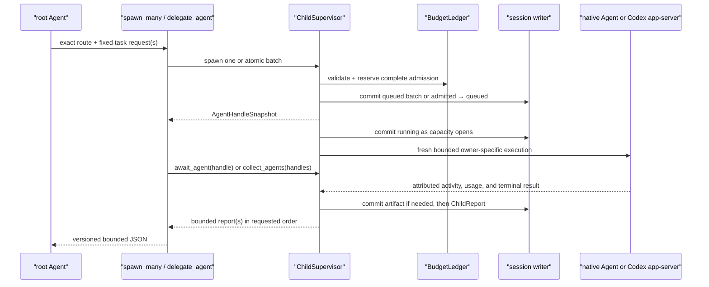

Native cancellation is structured: the supervisor marks the request, closes
the child's permission broker, signals its cancellation token, drops the
in-flight provider/tool future at the execution boundary, and waits for one
terminal completion. The command does not equate signalling with success.
Managed Codex execution observes the same token inside its owner adapter,
sends one correlated `turn/interrupt`, and continues reading the terminal race
until one absolute three-second deadline established when cancellation is
observed before returning cancellation or completion. Cancellation can also win during process startup,
account validation, or thread creation, and no turn starts after cancellation
has been observed. If an incompatible app-server
rejects interruption, shutting down that child process is the bounded fallback
and the child fails with the typed remote error rather than being mislabeled
cancelled.
Queued cancellation commits `Cancelled` without starting its prepared execution.
Runtime shutdown applies the same path to every queued/running child and waits
for terminal commits while the runtime continues servicing commit acks. A
bounded grace expiry aborts only the unresponsive task and commits
`Interrupted`; abort is not the normal cancellation path.

On restoration, the reducer leaves committed records unchanged. Its inspection
projection maps any nonterminal child prefix to `Interrupted` with an explicit
projection marker, performs no provider/tool call, and appends no
reconciliation fact. Active `/agents`, `/agent`, and `/cancel-agent` commands
reach only the owning foreground process. `xana session inspect` in another
process is read-only and cannot claim to cancel foreground work. List and
detail control events project only bounded handle metadata and report
references; full report bodies remain on await and collection paths.

The child receives Xana's identity/guidelines, its exact task, applicable
bounded root `AGENTS.md`, environment facts, and only the tools selected by its
profile. A request may add a fixed set of parent-selected text previews and
immutable artifact-reference metadata. These sources keep explicit
`parent_handoff` provenance, remain untrusted prompt data, and pass through the
same context budget; artifact bodies and the parent transcript are never
copied. Its registry never contains orchestration tools, so child depth is
structurally one. Native children run in stable admission order up to the root
profile's bounded concurrency. Every native provider uses the same execution
contract while its adapter maps optional token fields; Xana aggregates a field
only when every request supplied it and separately measures request count.
`collect_agents` snapshots a fixed set of unique handles atomically, returns
entries in caller order regardless of completion timing, and preserves each
terminal status, attribution, typed usage, and report reference. Its explicit
continue-on-error or fail-fast policy never erases results already observed;
timeout and cancellation are separate choices. Collection serialization has a
hard bound independent of durable artifact size and makes no model call.
A managed Codex child uses the same supervisor, budget ledger, permission
owner, lifecycle, report, artifact overflow, and collection path. Its internal
owner seam starts one app-server and a fresh ephemeral thread per admission;
it never resumes the foreground managed handle or another child's thread.
Codex receives Xana's identity developer instruction, the explicit task, exact
route model/options, workspace policy, and only bounded parent-selected
handoff data. It owns inference, inner history, project discovery, tools, and
sandbox. App-server activity is re-attributed to the child for terminal
projection; approval callbacks cross the child permission broker. `deny` maps
to no managed Codex child route: the current app-server contract cannot prove
that all inner tool effects are disabled, so route resolution fails closed.
`ask` and `allow` remain workspace-write; no route maps to
danger-full-access. Token-usage notifications map to measured
fields when emitted; otherwise the fields and spend remain unknown. One
managed turn is counted as one request without claiming knowledge of private
upstream calls. No outer conversational-provider call summarizes or relays the
managed result.

Xana session grants remain owned by Xana: every authorized app-server callback
receives only a one-effect `accept`, even when the broker reused a matching
grant, and session-only vendor acceptance fails closed. Managed JSON framing is
cancellation-safe, and cancellation has priority over continuously ready input
so the interrupt boundary cannot lose a partial frame or be starved by activity.

`OrchestrationPlan` is the separate closed child-work domain; the existing
prompt-selection `ContextPlan` is unchanged. A pure structural validator
checks the versioned, byte-bounded spawn/await/collect/cancel graph and only
prior spawn-handle references. The supervisor then resolves every exact route
and performs a reserve/release dry check of the aggregate ledger before any
record is appended. Execution commits `OrchestrationPlanStarted`, atomically
admits the complete static spawn set through the canonical batch path, and
executes remaining steps through the same await, collect, and cancel methods.
The durable start fingerprint rejects repeated plan ids across restoration;
each child admission carries plan id, spawn step id, and output index. No plan
interpreter, evaluator state, loop, branch, recursion, or second scheduler
exists.

`OperationId`, `StepId`, `ToolInvocationId`, `ToolResultId`, and `NamedValueId`
are distinct UUID v4 newtypes.
An operation moves through running or suspended state and always reports a
finished completed, failed, declined, or interrupted outcome. Conversation,
operation states, permission audits, artifacts, and context metadata have
separate durable records. Live deltas and events remain transient and are not
treated as a replay log.

## Agent and conversation boundary

`Agent` owns one asynchronous `ConversationalProvider`, a deterministic tool
registry, the session workspace, a base `PromptSnapshot`, and a configured
soft tool-round tranche. The runtime supplies a project-context-aware snapshot for
each accepted root turn; that snapshot is unchanged across the turn's provider
calls. Before each provider call the agent charges the complete current
history and prepends the snapshot's system message. It executes
requested tools serially, appends correlated results, and returns the final
assistant message. The foreground runtime commits immutable user, assistant,
and tool-result entries and moves the thread head separately.

Exhausting the configured `max_tool_rounds` tranche is not a failed Turn. The
runtime first commits a `RoundBudgetReached` suspension containing the exact
operation and suspension identities, cumulative and last-tranche round counts,
an immutable 256-round root ceiling, cumulative provider usage, committed
step/invocation/result counts, repeated exact tool-call-pattern diagnostics,
and the currently allowed actions. A correlated `Continue` record moves the
same operation back to running and admits only the next configured tranche; it
does not add another user message, discard tool results, or reset token,
wall-time, cost, child, permission, or external-effect accounting. `Stop` is an
atomic terminal `Declined` decision. At the hard ceiling only Stop is exposed.

The suspension and decision are durable session facts. Restart re-emits the
same unresolved suspension identity rather than silently continuing. Stale,
duplicate, mismatched, or disallowed decisions are rejected. A crash after a
Continue decision has committed leaves explicit unfinished running work; the
normal operation-recovery boundary can terminate it as interrupted but never
replays another provider or tool call automatically. The suspension's repetition
metric includes requested calls rejected during preparation, not only execution
intents. A separate, enforced no-progress guard fails a native turn after three
matching failed calls in a 32-failure window or six consecutive tool errors.
Successful work resets the consecutive-error count and matching failure history;
successful polling and distinct successful pages do not trip the guard. The
guard reconstructs from the current owner turn on tranche continuation. Remaining
calls in an already-committed batch receive correlated skipped/error results, not
effects or an invented successful answer. A new owner turn resets this guard.

Permission denials are typed outcomes, not parsed tool prose. The broker also
suppresses re-asking for the same operation and normalized prepared request,
including omitted/null defaults and reordered object keys. It retains at most
1,024 denial hashes per broker lifetime; at capacity, new Ask requests fail
closed rather than evicting a denial. This is separate from session allow grants.
Unfinished-operation audits and intents seed these denials on runtime restart;
completed-operation audits leave the bounded execution projection. An older
checkpoint's retained intents also preserve denial authority. Historical allow
decisions never become new allow grants.

The provider-neutral conversation model carries ordered text, image,
tool-call, and tool-result content. Provider request and response shapes remain
private to their adapter. The native generation boundary is the focused
`ConversationalProvider`; account control, catalog discovery, credential
storage, and managed agent runtimes remain outside it. Native and managed
composition are described in [Provider contracts](providers.md) and
[Connections, models, and managed runtimes](models-and-managed-runtimes.md).

The OpenAI-compatible adapter accepts coexisting `reasoning_content`, `reasoning`,
and `reasoning_text` fields, preferring one populated field in that order. It
streams that field to activity under a separate 2 MiB allowance; it does not add
it to final answer text. Literal thinking tags inside untyped content are not
stripped or interpreted as proof that arbitrary prose is internal reasoning.

The native HTTP adapters share one incremental, line-oriented SSE decoder. It
supports arbitrary chunk boundaries, LF and CRLF frames, comments, multi-line
data, and bounded frames. Each adapter additionally caps aggregate text,
tool-input, and content-block accumulation for the complete response; a peer
cannot bypass the turn bound with many individually valid frames. Indexed
OpenAI-compatible tool-call deltas accumulate id, name, and JSON argument
fragments before they become one provider-neutral assistant message. Live text
deltas are rendered immediately but only the completed message becomes
conversation history.

The provider-neutral conversation model includes a system role. The
OpenAI-compatible adapter serializes that role and the changing conversation
at its private wire boundary; exact tool schemas remain a separate request
field.

`Agent` receives owned dependencies and limits. It does not load
configuration, inspect environment variables, resolve platform paths, or
render terminal output. It also does not read prompt or project files.

## Focused-service route boundary

Focused operations do not extend `ConversationalProvider`. A typed
`FocusedServiceAdapter` declares exact operation/media/editing/format/limit/
cancellation/usage capabilities, and a `FocusedServiceRegistry` resolves one
named route against the frozen profile. The route binds operation, service
connection, adapter, model, bounded options, description, optional default,
credential reference, and the intersection of route/profile egress policy.

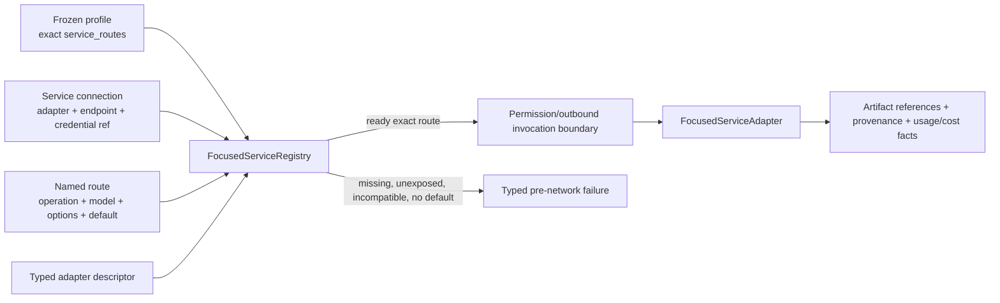

Resolution performs no credential lookup and no network request. One declared
default is deterministic; otherwise selection is explicit. Adapter failures do
not trigger fallback. Provider wire types and binary output remain behind the
adapter, while domain results carry route/connection/adapter/model/options
provenance and immutable artifact records.

## Prompt and project-context boundary

The application edge owns a `PromptAssembler` built from embedded,
non-replaceable identity and guideline files; a concise tool catalog derived
from the immutable registry; active connection/model; owned operating-system,
canonical session workspace, configured-shell, and CLI-surface values; and
one model-aware budget plan. When a
root turn is accepted, the runtime refreshes durable project context and
assembles one `xana-prompt-v2` snapshot. That snapshot freezes the selected
model, effective context limit, reserves, context selection, and compacted
continuation for every provider call and tool round in the turn. Native
composition supplies a concise
product-documentation layer that names the readable logical ids exposed by the
bounded `xana_docs` tool; documentation bodies are fetched only when needed.
The runtime layer is authoritative for current connection, model, workspace,
and shell facts, and the guidelines prohibit invoking a tool merely to
rediscover those supplied facts. `xana_docs` reads only immutable embedded
product documentation, so an unmatched `ask` default authorizes its typed
built-in-resource scope without a controller prompt; matching user rules and a
default deny remain authoritative.

Layers have transient ids, purpose, origin, trust, provenance, estimated cost,
and deterministic order. Dynamic layer text and attributes are XML-escaped,
line endings are canonicalized to LF, only outer blank lines are trimmed, and
layers are separated by one empty line. These properties make unchanged input
byte-stable across supported platforms. The labels are prompt structure, not a
security boundary.

Root `AGENTS.md` is optional, must be a non-symlink regular UTF-8 file no larger
than 64 KiB. Its complete bounded contents reach prompt assembly; there is no
silent 1,024-token head preview of an instruction file. If required instructions
do not fit the model-aware request budget, submission fails before provider I/O.
Its discovery does not walk parents or nested directories and ignores
`XANA.md`. A separate `SkillCatalog` indexes bounded Agent Skills metadata from
user `.agents/skills/`, workspace `.agents/skills/`, and enabled-plugin sources;
only exact activated bodies and necessary contained references enter prompt
planning as `SkillInstructions` with qualified source/digest provenance.
Project instructions and skills can guide work but cannot mutate tools,
configuration, permission state, egress, or Xana's non-replaceable core.

Native budgeting starts with the selected catalog descriptor. A known model
context limit is authoritative; optional `[context].max_context_tokens` can
only narrow it. Missing metadata uses the documented conservative 32,768-token
fallback, while contradictory limits fail rather than overclaim capacity.
Output, reasoning, tool, and retained-conversation reserves are derived before
rendered system layers, exact tool schemas, selected previews, actual history,
tool results, and attachments are charged. The versioned UTF-8 heuristic charges
ASCII at one token per three bytes and non-ASCII at one per UTF-8 byte, rounded
up; this deliberately avoids applying English compression to CJK or emoji.
Image blocks reserve a
provider-neutral, pixel-based conservative estimate instead of a textual
placeholder. Neither estimate is a provider tokenizer. Over-budget required
input or history fails before provider I/O. A bounded, redacted prompt-plan
ledger reports category estimates, reserves, omissions, attachment counts and
bytes, and unavailable provider cache observations without copying prompt
content. It updates at every provider request, including tool rounds, and
separates runtime facts, parent handoff, tool evidence, and conversation content.
Personal-memory selections now occupy their separately bounded data-only slot;
retrieved evidence is accounted through its materialized source/tool content.
Native prompt assembly also carries a budgeted runtime memory-readiness fact,
including unavailable legacy homes and disabled use. Free-form chat uses the
selected model's ordinary `memory_lookup`, `memory_remember`, `memory_correct`
and `memory_forget` tool loop; there is
no phrase interception or extra classifier call. Recall is nonmutating and does
not authorize inventing a fact to save. Only explicit management commands (such
as `memory say`) use the bounded phrase grammar and commit locally without a
model call. Canonical commands retain literal code and multiline payload support.
Both paths share scoped protected storage, provenance and consent checks, with
no workspace-file fallback. See [protected storage](protected-storage.md).
Output/reasoning reserves remain in the
budget, not misreported as sent input. Authored instructions must fit completely
or assembly rejects the request; optional evidence can still be omitted with
an explicit source ID. These estimates are neither a guaranteed token bound
for an unknown tokenizer nor evidence of a provider cache hit.

Native child composition applies the same compiler with the smaller of its
route ceiling and catalog limit. Attributed child ledgers cannot overwrite the
root plan. Complete large tool results are registered in the existing artifact
store before a 4 KiB preview and typed reference enter model history. The root
operation writer and recovery path own registration. Nondurable child loops
receive only an injected evidence sink: it performs bounded artifact I/O off
the async worker and awaits the parent's registration acknowledgement. The
headless Agent does not own a database or session writer. Semantic projection
turns these references into inert inspectable resources in both live events and
restored history; a tool result does not finish an assistant stream. Compaction
carries the artifact ID and digest independently of prose extraction.
Range and literal-search previews remain bounded, Unicode-safe, and
provenance-bearing.

Prompt-layer ids are transient to one snapshot. Durable `ContextRecord`s carry
id, monotonic version, artifact reference, kind, BLAKE3 hash, logical size,
provenance, trust, and owner. `ContextViewRecord`s bind source id/version,
selector, selected-content hash, and byte/token budgets. Full, inclusive line,
and capped literal-line-search selectors materialize from verified immutable
artifact bytes. Only the resulting bounded text can enter a prompt.

Root context refresh occurs only when a new turn is accepted. Unchanged bytes
reuse the version; changed bytes append one artifact/context version; a missing
live source does not erase the prior version. Opening or inspecting a session
does not read live project files. When estimated native input crosses the
configured threshold, Xana commits a lossy continuation
checkpoint before provider I/O, then sends that structured summary plus a
verbatim recent tail. `/compact` requests the same boundary while idle. A
checkpoint records its predecessor, operation and reason, exact source entry
range and BLAKE3 digest, tail boundary, structured goal/progress/constraints/
decisions/unresolved/references, and the budget/model provenance that produced
it. Repeated compaction summarizes only the newly retired span; source history
is never edited or deleted. Managed runtimes continue to own their context and
report Xana compaction as unavailable. The bounded catalog and `xana_docs`
tool are included in the resolved production tool snapshot.

The deterministic extractor remains the default. An explicitly evaluated and
enabled exact native connection/model may perform one bounded no-tool semantic
helper request before checkpoint commit. Preparation and commit retain the
source digest/range and check protected privacy generation; the protected append
checks generation and source exclusions in the same transaction as the write.
Helper output is derived task data, not instructions, authority or completion
evidence. Failure retains the deterministic candidate when source policy still
allows it; cancellation or changed source/privacy state leaves the previous
checkpoint intact. Optional semantic provenance binds the exact helper route,
evaluation and summary digest. Helper protocol v3 sends the prior checkpoint as
typed JSON and requests separate current facts with superseded values replaced.
It requests zero-temperature sampling only from adapters that declare support,
currently Ollama; this neither changes normal chat nor guarantees determinism.
Reopened original proofs yield between bounded
worker reads (128 rows/2 MiB); no store guard crosses an await. The exact source
and privacy snapshot is rechecked after helper-lane admission, before disclosure,
and again before commit. Prompt preflight borrows history instead of cloning
and discarding complete provider requests. Context-phase telemetry separates
local preparation/commit from helper latency without logging source content.
The unchanged v2 evaluator has forty cases/fifty cycles, including actual summary
reuse and later corrections. Reports also bind the helper protocol version;
missing or mismatched versions cannot qualify the current helper. Prior checkpoint
evidence remains readable, and unrelated processing grants remain valid.
Summary-only retention excludes historical references
and recent-tail recovery. Typed failure/usage/timing evidence includes fixed
assertion IDs and active-field/reference matches, not raw provider text. An
explicit single-case synthetic inspection can display up to two validated
bounded summaries separately from the persisted report; it cannot inspect
private runtime history or enable a route. Fixtures cannot enable a production route. See
[semantic compaction](../user/semantic-compaction.md).

Image attachments are reference-based and artifact-backed; see
[Image input and media resolution](vision.md). OpenAI-compatible and Anthropic
adapters resolve bytes only at the wire edge; Codex receives checked local
paths under the managed workspace.

## Session and artifact boundary

Native bare, plain, and default one-shot chat create
`data/sessions/<SessionId>.jsonl` and one thread before any conversation entry.
`xana --continue` chooses the latest reducible session from a bounded directory
scan only when its canonical workspace matches. `xana --resume SESSION_ID`
performs bounded read-only
inspection and pure ordered reduction, explicitly opens the verified file for
append, verifies the launch workspace matches, and restores the selected
conversation path. The optional `xana
session inspect SESSION_ID` reports bounded metadata without conversation
content and never opens for writing.

The canonical Conversation CLI exposes the same lifecycle to non-TUI clients:
`conversation continue` selects the latest compatible owner, `conversation
attach ID` acquires one exact inactive retained Conversation, and `conversation
preview ID` reads a bounded native history page without acquiring control.
Managed preview remains unavailable because its runtime owns the transcript;
the API reports that boundary instead of creating a partial Xana mirror.

Managed Codex threads remain Codex-owned and are not mirrored into Xana's
native session log. Xana stores a bounded version-2 catalog of opaque thread
ids per connection and canonical workspace, including the current selection,
then delegates `thread/resume` to Codex on the next
process's first interactive turn. The bounded, atomically written handle is
neither history nor a credential. `--resume` therefore applies only to native
conversations; managed one-shot starts fresh unless `--continue` selects the
workspace handle. `/clear` deselects the current handle and starts a new
thread while retaining the prior catalog entry. `session archive` and
the TUI's `/sessions archive` atomically remove one inactive local handle; they
do not call a vendor deletion API or claim to delete managed history.

Every compact newline-terminated envelope has format version 1, record id,
session id, and one typed record. The initial record owns the thread and
canonical workspace. Other kinds append immutable conversation entries,
separate head moves, accepted operations, steps, invocation intents/results,
operation states and outcomes, permission and recovery decisions, named
durable values, artifact metadata, context versions, context views, and
named-context moves. The reducer rejects wrong or duplicate identities,
unknown references, non-monotonic versions, invalid heads/parents, second
creation, invalid transitions, mismatched preallocated result ids, second
results, terminal operations with pending invocations, and malformed,
duplicated, stale, or source-mismatched compaction checkpoints. Only the
head-to-root conversation path becomes model history.

Read-only session inspection reports bounded compaction metadata—including
reason, source range/digest, predecessor, selected connection/model, estimated
limits, threshold, and retained tail—without printing the derived summary or
conversation content. At most the newest 64 checkpoint records are rendered
while the total count remains visible.

Inspection is bounded to 256 KiB per record, 10,000 records, and 16 MiB per
session. A malformed physical tail after a valid newline-terminated prefix
returns a truncate plan; a complete object without its final newline is also
uncommitted tail data. Interior malformed records are corruption. Opening for
resume acquires the writer lock before rechecking the inspected length and
BLAKE3 hash or truncating a tail, so repair cannot discard a concurrent
append. The same byte and record limits apply to active appends, not only
later inspection. Each record is semantically validated before it is written,
then incrementally applied to the in-memory projection after the append
succeeds; invalid state never enters the journal and appends do not replay the
full history. An append writes one object plus newline and flushes before a
corresponding committed runtime event is emitted. This promises process-crash
record boundaries, not power-loss durability or `fsync`. An append I/O failure
poisons that writer so later bytes cannot turn a partial tail into interior
corruption.

Artifact bytes live at `data/artifacts/<blake3-hex>`. The historical `put`
entry remains capped at 4 MiB; resource adapters use an explicit narrower
caller limit beneath the compiled 512 MiB source ceiling.
Publishing writes and flushes a create-new temporary file, then uses a
non-overwriting hard link as the final publication step; the temporary name is
removed afterward. A racing or existing final path is reused only after length
and digest verification. Reads enforce the caller bound and verify the record's
length, digest, regular-file status, and opened-file identity. A verified range
streams the complete artifact through BLAKE3 while retaining only the requested
bytes, so partial presentation never weakens immutable identity. Logical
`ArtifactId`, media type, and owner remain distinct from byte equality.

The foreground runtime owns the only open `SessionStore`. A companion lock file
uses the standard library's nonblocking exclusive file lock, so a second
process cannot open the same session for writing or recovery concurrently.
There is no session deletion, garbage collection, or portable-workspace
rewrite. Interactive launch and `--continue` use a bounded, canonical-workspace
latest-session query. Restore reports unfinished operation
states but performs no provider, tool, context-refresh, or replay effect.

## Durable operation and recovery boundary

Each accepted root turn binds its committed input entry. Every assistant
tool-call batch starts one step and executes serially. For each invocation,
Xana plans normalized arguments and canonical scope, authorizes the exact
plan, commits its audit fact, preallocates a result id, and appends and flushes
intent before executing. The result and any bounded named output commit after
the effect and before the correlated conversation result. An append failure
before intent performs no effect; an intent without result means the external
outcome is unknown.

Built-in tool contract version starts at 1. `read_file`, `list_files`,
`find_files`, `grep_files`, `read_document`, and `xana_docs` declare
`ReplaySafety::Safe`; `write_file`, `edit_file`, and `run_command` declare
`Never`.
Recovery never infers safety from a tool name or effect class: an exact
invocation is eligible only when saved and current declarations are both
`Safe`, the installed name/version still matches, replanning produces the same
arguments and scope, and current authorization permits it.

`xana operation plan --session SESSION_ID OPERATION_ID` reduces and classifies
records without effects or argument disclosure. `xana operation resume
--session SESSION_ID OPERATION_ID` is the only implemented reconciliation
controller. It preserves completed results, handles the first missing result
in original call order, and reauthorizes a safe replay. Unsafe, missing,
changed, or denied work gets a correlated declined/interrupted result with the
preallocated id and is not executed. Recovery then terminates the interrupted
operation; it does not call the provider to invent a continuation.

Committed-fact events follow successful appends. Live text deltas remain
transient. Large output uses an immutable artifact; bounded inline JSON,
artifact references, and context id/version pairs are the only authoritative
named values. No heap, process, channel, socket, or open file is recovery
state. These guarantees cover process crashes at flushed record boundaries,
not power loss, general filesystem transactions, effect idempotency, or
containment. `write_file` overwrite and `edit_file` stage, sync, and atomically
rename one replacement on the target filesystem; create may leave a partial
new file after an I/O failure and no operation claims multi-file atomicity.
Unknown `Never` outcomes may require manual reconciliation.

## Tool boundary

Xana exposes ten tools through a capability-resolved, provider-neutral
registry:

- `read_file` reads bounded UTF-8 content with either an optional inclusive
  line range or deterministic byte paging with an exact continuation offset.
- `list_files` returns a bounded, sorted, non-recursive directory listing.
- `find_files` performs bounded, sorted, gitignore-aware recursive path
  discovery without following symlinks.
- `grep_files` searches bounded UTF-8 files in stable path/line order with a
  literal query or bounded Rust regular expression and explicit skip and
  truncation facts.
- `write_file` explicitly creates an absent UTF-8 file or atomically replaces
  an existing regular file while preserving its permissions.
- `edit_file` atomically applies one or more exact, unique, non-overlapping
  replacements against the original bounded UTF-8 bytes.
- `run_command` executes one command string through a configured shell in an
  existing directory inside the launch workspace after runtime authorization.
  Relative paths are preferred; an absolute cwd is accepted only when its
  canonical target remains inside that workspace. It returns status plus
  independently bounded stdout and stderr, and an immutable per-call timeout
  ceiling stops an owned process that runs too long.
- `web_fetch` retrieves one exactly reviewed public HTTPS text resource through
  pinned public-address resolution, no proxy or credentials, an explicit
  redirect chain, bounded response/extraction work, and untrusted attributed
  text with immutable source overflow.
- `read_document` performs one bounded workspace read and extracts bounded
  UTF-8 text or CSV-as-Markdown without executing or fetching content.
- `xana_docs` lists and reads Xana's curated, version-matched documentation by
  logical id.

Listing, discovery, and search roots are relative to Xana's launch workspace.
`read_file`, `write_file`, and `edit_file` additionally support one exact
absolute external file through `ExternalPath` review; that authority never
becomes recursive discovery. A command cwd may use an absolute spelling only
when its canonical target remains inside the workspace. Execution revalidates
the planned canonical path and filesystem identity; open reads verify the
opened handle, while creates and replacements bind the canonical parent and
the target's planned presence/identity. This rejects ordinary replacement or
symlink-retargeting races between permission planning and execution without
claiming OS containment.

Reads and resulting edits are capped at 64 KiB; writes accept at most 256 KiB.
Directory listings are capped at 256 entries and 64 KiB of output. Shared
recursive discovery caps depth at 32, selected results at 1,000, visited
entries at 50,000, encoded output at 64 KiB, and elapsed walking at two
seconds. It follows no symlink, ignores user-global Git rules, and applies the
workspace and nested repository ignore rules. Grep additionally caps a file
at 2 MiB, total scanned bytes at 16 MiB, matches at 1,000, query bytes at
1,024, and regex program/DFA construction. Binary, invalid UTF-8, oversized,
changed, and failed paths are counted. Truncated discovery/search has no
unstable cursor or hidden full result; callers narrow the next request.

The registry caches each validated, versioned definition beside its
implementation and reports effect class separately from replay safety. It is
the one invocation path: resolve a tool, build an immutable plan, authorize
the plan, durably bracket its effect when a session is active, and execute only
an allowed plan. Plans contain normalized final JSON arguments, canonical
scope, and type-erased executable data created and consumed by the same
concrete tool. No registry executor bypasses planning and authorization.

File scopes are canonical target paths beneath the canonical launch workspace.
Command scopes contain the selected shell, exact command, and canonical cwd.
Invalid arguments and escaping paths fail before policy evaluation. Planning
may validate metadata but performs no write, process, network, or external
effect.

`run_command` is `Execute` plus `ReplaySafety::Never`; its exact program argv,
command, shell, canonical cwd, and bounded timeout exist before authorization
and spawn. The default timeout is 30 seconds and the immutable ceiling is 120
seconds. Timeout or owner cancellation drops a kill-on-drop child. Stdout and
stderr are drained concurrently after their independent 32 KiB retention
limits, so child output cannot force unbounded capture memory or deadlock on a
full pipe. Shell selection resolves once at the application edge: macOS/Linux support POSIX
`sh -lc`, while Windows supports PowerShell, Git Bash, and `cmd` through
explicit configurations. A custom compatible program path may replace the
default executable.

`web_fetch` is `Network` plus `ReplaySafety::Safe`. Planning canonicalizes one
URL and up to three caller-declared redirect destinations without network I/O.
The complete chain and a digest of its GET request become one `WebFetch`
recipient identity and `prompt_text` outbound item. Outbound saved-deny and
exact-review policy commit before transport. Each connection resolves its host,
rejects private and special-use IPv4, IPv6, and IPv4-mapped addresses, pins the
accepted address set into a no-proxy/no-redirect client, and rejects credentials,
fragments, downgrade redirects, compressed responses, active content, and
unsupported MIME or character encodings. A returned redirect not already in
the reviewed chain stops before the next request. Successful results expose a
typed generic link-preview card with requested and final URL, bounded site and
title text, time, MIME, byte count, digest, redirects, truncation, and an
untrusted marker; immediate text is capped at 24 KiB and complete bounded source
overflow is content-addressed in the artifact store. Rendering or retaining the
original link performs no fetch: preview remains an explicit reviewed action.
The tool does not provide
search, cookies, authentication, JavaScript, conditional cache revalidation, or
browser authority.

One runtime-owned broker task owns policy, memory-only session grants, pending
requests, and controller presence for every built-in tool. Pure policy combines
all matching user rules with deny-before-ask-before-allow precedence, then uses
the configured default. An explicit or default deny cannot be overridden by a
grant. An ask suspends its operation and accepts deny, allow once, or an exact
current-session scope from the foreground terminal. Grants also bind tool and
effect and cover only the same or a narrower workspace scope or an exact
command scope. Exact duplicate grants reuse one entry and the in-memory set is
capped at 256. Unknown, stale, duplicate, mismatched, scope-widening, lost, and
unattended decisions fail closed.

Each outcome emits a `PermissionAuditFact` binding operation and
invocation ids, tool/effect, final arguments, scope, policy outcome, optional
controller decision, and effective decision. The runtime commits the fact as a
non-conversation session record before forwarding its audit event. Neither policy, metadata, workspace path
checks, nor authorization provides process containment. Tools run
asynchronously with the Xana process's ordinary host access. Atomic
single-file replacement prevents a partially rewritten visible target; it is
not a sandbox, multi-file transaction, or universal power-loss promise.

## CLI, configuration, and initialization

Bare `xana` chooses the Ratatui/Crossterm full-screen frontend only when stdin
and stdout are interactive. `--plain` selects the permanent append-only client;
non-TTY launch chooses it automatically, and `--tui` makes terminal
initialization mandatory. The TUI owns an explicit state/update/view architecture,
consumes the same bounded embedded snapshot/events as plain native chat, and
emits only typed runtime commands. It paints a local starting frame before
configuration/provider composition. The startup header is expanded identity
and status state, collapses on draft input, and reopens through the same update
model. It adapts side panes into drawer labels at medium/narrow widths, hides a
wide sessions panel at zero width, and bounds composer, message, activity,
staged images, and an ordered follow-up queue. Frontend protocol version 14
retains version 5's stable semantic command identifiers, version 7's frozen
execution/completion facts, and version 8's Desktop Conversation controls, then
retains Espejo/host supervision and classified prompt accounting, and adds
committed native user messages with bounded history positions for reconnect.
It also carries same-owner browser inspection/revocation and bounded lifecycle
receipts without routing those controls through the model's command queue.
It adds typed terminal diagnostics and bounded finite-work evidence, including
an explicit finite-turn command. See [completion evidence](completion-evidence.md)
for the distinction between delivery, observed checks and task correctness.
Native adapter correlation and derived-input commands preserve exact durable
outcomes and keep specialist-generated analysis out of owner-memory authority.
See the [optional Desktop adapter capabilities](desktop.md#optional-native-adapter-capabilities)
for receipt, scope, custody and no-replay boundaries.
Native and managed Runs publish
authoritative execution facts and deterministic completion receipts. One
application-owned catalog now
projects command names, aliases, argument shapes, authority, availability,
confirmation, and outcome codes into CLI, plain, TUI, and Desktop without
moving validation or effects out of their runtime/domain handlers. The native
TUI maps keyboard,
mouse, bracketed-paste, and runtime events through one terminal-independent
update model; slash input and the searchable palette share one typed command
registry. Native runtime and managed Codex are two private adapters to one TUI
runner, which owns input ordering, follow-up dispatch, shutdown, and a dirty
frame clock capped at roughly 60 draws per second. Input and execution events
mark view state dirty; a biased frame tick renders the newest state and skips
missed ticks, so streaming text and pointer motion cannot force one synchronous
full redraw per event. An active operation adds one ephemeral conversation-tail
work marker. A separate skipped-tick 250 ms timer advances its dots only when
full motion is enabled; reduced-motion mode keeps the marker static. This
presentation state is neither persisted nor projected into model context.
Registry rows separate command names, modes/parameters,
descriptions, and optional exact palette arguments. A Ratatui stateful table
keeps its heading fixed and selected row visible; normalized search accepts an
optional leading slash and indexes modes as well as names. One shared layout
calculation owns both rendering rectangles and mouse hit-testing. The sessions
title owns a distinct hide action instead of falling through to its first row.
The composer grows through six visual rows, then uses a cursor-following
bounded viewport. Conversation rendering selects a bounded suffix, measures
visual rows, anchors at the bottom, and interprets scroll state as rows rather
than messages. A bounded terminal-input adapter preserves ordinary keys but
uses a short, adaptive quiet window to coalesce key-stream paste, including
fallback newlines, before command interpretation. Once a paste is detected, a
wider quiet window absorbs terminal delivery jitter. Key releases carry no TUI
action and are discarded before burst detection without extending its timer;
press/repeat actions and control/mouse boundaries retain their semantics.
The adapter consumes Tokio's cooperative budget for each raw event so a large
ready queue, including discarded releases, yields to other runtime tasks.
Replaceable pointer-drag motion is sampled at its latest queued coordinate
instead of replaying stale
cursor positions through separate renders. Bracketed and detected fallback
paste therefore enter one normalized confirmation as untrusted draft data
rather than repeated submits. Model
selection persists through `ModelManager` and restarts into a new conversation
rather than translating history. Activity visibility is presentation state,
not reasoning configuration. The bounded activity projection groups typed
cards by root, native child, managed Codex item, and approval identity. It
labels exposed reasoning separately, never requests an extra summary, and
forces approvals and critical failures into a modal even when activity is
hidden. Native and managed decisions return through their original correlated
control path rather than through display text.
Ratatui supplies terminal-native layout/widgets and its deterministic test
backend; Crossterm owns input and terminal modes. Xana keeps the composer,
session projection, and command policy as small domain modules instead of
adding a second opinionated widget framework. Current textarea crates would
still require Xana-owned byte bounds, sanitization, paste confirmation, Enter
policy, and pointer semantics, so they do not yet pass the deletion test. The direct `unicode-width`
dependency is the shared visual-column metric for composer rendering, cursor
placement, scrolling, and pointer hit-testing.
Conversation-only normal-drag selection is Xana-owned because terminal mouse
reporting is process-global rather than panel-aware. It retains only the
explicitly selected cells from the bounded visible Ratatui projection. Ctrl+C
copies the retained text and otherwise remains the exact interrupt key;
mouse-down panel targets remain independent and an ordinary click away clears
the selection. Copying uses a lazy, long-lived text-only `arboard` adapter. The
adapter disables image features, initializes only after an explicit copy, and
keeps Linux clipboard ownership alive for the TUI session. Clipboard failure is
reported as presentation status and does not affect runtime authority. The
same overlay boundary renders bounded management output without reconstructing
the terminal. Current inline adapters cover side-effect-free `mcp list` and the
typed global `profile create` form; the latter pre-fills the active
connection/model and delegates the actual mutation to the existing profile
command transaction. Other control families retain the foreground restart
boundary rather than receiving ad hoc TUI implementations. The
typed `/sessions new` action is idle-only: it shuts down the current frontend
owner and re-enters the application composition boundary with `NewNative` or
`NewManaged`, preserving the prior session and current resolved configuration
without translating history. The workspace root gate prevents the action while
a root turn is active.
The Conversation picker separates ownership from inspection: Enter requests an
exact idle attach/resume, Space opens a read-only preview, and
`/conversation attach ID` names the same attach operation directly. Before a
TUI owner is rebuilt, the update model rejects active source Runs, queued source
input, and active, controlled, observable, unavailable, missing, or execution-
owner-incompatible targets. Frontend-local drafts retain composer cursor and
selection, staged image references, selected vision route, and queued input by
exact `ConversationRef`; history and execution authority remain canonical in
their existing owners.

`tui::espejo` is a full-screen Ratatui projection over the bounded workspace-host
snapshot and current frontend observations. It classifies at most 512 rows into
Needs-you, in-motion, blocked, failed, or idle state, preserves `Ungrouped` in
Project scope, and exposes host collision, current Run/queue/approval, observed
tool/child/artifact Activity, and usage facts. Missing performance and completion
receipt facts remain visibly unavailable. The current global scope is explicitly
local to one workspace, and no empty scheduler or remote capability is inferred.
One idempotent terminal lifecycle owner restores raw mode, alternate screen,
cursor, mouse capture, and bracketed paste after normal exit, input EOF,
transport error, cancellation, panic unwind, or partial initialization.
Implicit initialization failure restores then falls back to plain; explicit
failure exits nonzero. Managed Codex runs behind a bounded actor that owns the
app-server and thread store while the TUI consumes provider-neutral events.
The actor keeps event delivery bounded, routes approval replies exactly once,
supports exact cancellation and in-thread advertised model/reasoning changes,
and shuts app-server down with the embedded frontend.

Rich conversation presentation is derivative frontend state. A bounded
Rust-native parser sanitizes terminal controls and bidi controls, retains only
supported Markdown/link metadata, and produces semantic lines for the current
viewport. The renderer visits a height-derived window (never more than 128
messages), not the complete projected transcript. Historical native sessions
use a two-pass journal index: the first bounded scan retains entry ancestry and
byte offsets, and the second reads only the requested page of at most 128
messages and 2 MiB of encoded entries. The reader limits each `read_until`
before allocation, including malformed unterminated records. TUI and Desktop
retained windows cap 512 messages, 2 MiB of text and 128 resource references;
the TUI also caps 4 MiB of derived rich-text body per window. While inspecting
saved history it keeps a separately bounded live tail. Saved pages alone own
durable cursors: local command results appear separately, live events update
the tail, and submitting restores that tail without changing the draft. A new
history inspection refreshes its source cursor from the journal. Older-page
admission evicts newer rows; forward admission keeps the first unseen rows.
Selection is invalidated when its cells change, not the composer draft.
Desktop releases evicted operation indexes and admits decoded image previews
only within its separate preview byte/count limits. Unchanged Chat snapshots
reuse an Arc. A changed streamed snapshot still copies the bounded window
because the pinned component API owns `String` content: this is not claimed
as changed-row-only projection or unlimited-history storage. Durable records
remain authoritative; the legacy 10,000-record/16-MiB session cap is unchanged.

The shared frontend projection applies the same inert principle before a
specialized renderer. Whole fenced code/diff, tables, constrained display
math, and safe links gain typed parts; ambiguous input remains bounded Markdown
or text. Tool-call arguments are never copied into the projection. Rich, text,
metadata, and unsupported tiers always include a readable fallback, while link
preview/open and artifact inspect/copy/save/reveal/open remain separate explicit
intents. Runtime resource inspection applies aggregate and kind limits before
I/O, retains only a bounded probe while verifying the whole artifact, keeps
declared and detected types distinct, and never decodes or executes SVG,
Lottie, remote markup, or unknown binary content.

Artifacts stay immutable content-addressed records. A visible reference may
open an explicit action card for bounded preview, draft-reference insertion,
OS reveal, or OS open. Rendering has no side effect. Before an OS action the
artifact store re-verifies declared size, content location, and digest; raw
artifact paths and bytes never enter frontend snapshots.

The TUI stages typed local resources through the runtime-owned ingestor rather
than reading bytes in presentation code. Workspace-relative acquisition uses
workspace authority; a canonical external path requires an exact allow-once
decision before I/O. The ingestor applies configured aggregate and compiled
hard limits, retains only a bounded signature probe while streaming the full
file into the immutable artifact store, and projects declared type, detected
type, provenance, and independent capability facts. Only validated PNG, JPEG,
and GIF resources currently cross an exact image-capable provider route. Other
recognized resources remain useful as metadata/artifact references but are not
disclosed to a provider.

The embedded observer advances its own bounded semantic snapshot before each
observation is delivered. The TUI copies that snapshot after every native
event, so `/usage` renders the same deduplicated request deltas, cumulative
managed snapshots, prompt-plan ledgers, execution facts, completion receipts,
and unavailable states as other frontends. Rendering never polls an account or
relabels process-local observations as durable Conversation totals.

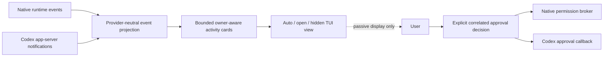

Native
chat creates a session; `--continue` selects the latest compatible execution
owner/workspace conversation and `--resume SESSION_ID` resumes only an exact
native session. `-p`/`--print` runs one noninteractive turn with text or
versioned JSON output. The typed
command boundary exposes initialization/configuration, session inspection,
explicit operation recovery, unified `xana model`, and advanced `xana
connection` commands for static keys and Codex account control. Read-only
`xana route list` and `xana route check NAME` resolve exact child profile,
connection, configured/cached model, capabilities, permission ceiling, and
limits without provider network access or managed-process startup. This
diagnostic remains read-only. During native chat, a separately composed root
`delegate_agent` tool can admit one exact native child through the runtime
supervisor; route diagnostics themselves never start work.

Managed chat also exposes `/reasoning`, `/reasoning-summary`, `/activity`, and
`/details`. Model, effort, and summary selections persist separately from
human-authored configuration and apply to subsequent turns without replacing
the Codex thread. Activity level is process-local presentation of typed
runtime events and never changes model effort.

Provider-neutral guided setup is the canonical first-run and rerunnable entry.
Bare interactive `setup` first chooses Start with one connection (the retained
Quick path), Full customize, Blank, or a focused setup path; Quick is the
setup-path default and `--quick` selects it directly. This default
does not recommend or preselect a provider. The Quick connection flow stages a
typed native or managed connection without filesystem effects,
establishes the endpoint/executable and credential/account, and performs a
non-persistent live catalog fetch before accepting model and managed reasoning
choices. Interactive terminals use a keyboard-driven full-screen selector with
search, paging, fixed guidance, real theme swatches, and one alternate-screen
lifecycle. Cursor movement redraws through Ratatui's diff buffer; it does not
clear the screen per key. Text/secret fields, advanced appearance and policy
choices, and review remain in that shell. Escape returns from a nested step to
setup home, while top-level cancellation restores the terminal and succeeds
without a write. The append-only `setup --plain` surface pages large catalogs
and accepts exact ids or filters without dumping every model. Both surfaces show
only catalog-backed modality, tool, reasoning, limit, and pricing facts. The
validated version 3 document and any hidden OS-store secret stay
in memory through the bounded redacted review. After confirmation, the prior
file is backed up exactly and config is atomically replaced; secret mutation
and the separate foreground model selection are reconciled within the same
rollback boundary, so a stale selection cannot outlive a replaced default
connection. Those mutations are rolled back if the config commit fails. Codex
OAuth is vendor-owned and is
reported outside that transaction. Bare interactive startup and `/setup`
enter the same application operation after restoring any full-screen terminal;
non-TTY startup emits the exact flag-driven form. The legacy hidden `init`
command remains create-new compatibility only. Chat/setup/doctor/control
transitions return through one iterative application lifecycle; they do not
recursively await another chat launcher. Path and configuration
diagnostics do not construct an agent.

Blank setup is a distinct versioned acknowledgement at
`data/setup/state.json`, not a degenerate `config.toml`. It creates no provider,
connection, model, Profile, or credential. Readiness, Doctor, capabilities, and
bare startup preserve that distinction and point to Connect; a successful
configuration transaction clears the marker, and setup reset owns its removal.

The `settings` module is the deep post-setup configuration seam. It owns a
stable secret-free catalog, effective/default/source/target/effect metadata,
bounded value parsing, transactional drafts, complete config/presentation
validation, optimistic revision checks, the shared config lock, exact config
backup, coordinated atomic replacement, and rollback. CLI, Ratatui, and native
Desktop settings surfaces are adapters over that interface; none parses or
writes TOML.
Ordinary scalar preferences are exposed directly. Connections, credentials,
model selection, profile/project lifecycle, permission-rule collections,
Skills, Agent Plugins, MCP/A2A, focused routes, and recovery stay in their deep
task-specific modules and appear only as status plus an exact next action.

`xana settings` enters one persistent Ratatui workspace when both process
streams are terminals and degrades to the same grouped catalog otherwise.
`xana config list|get|explain|set|reset` supplies stable scriptable inspection,
dry-run, and redacted receipt forms. `/settings [SECTION]` first shuts down the
native or managed foreground owner, restores the terminal, and returns through
the application restart loop. Machine-local presentation can apply while the
same conversation resumes; global defaults classified as new-conversation
state never rewrite an active immutable snapshot.

Desktop projects the same catalog and draft transaction into twelve responsive
sections, then routes connections, credentials, model selection, Projects,
Profiles, permissions, capabilities, media limits, Workbench preferences, and
maintenance to focused typed managers. Missing configuration enters graphical
setup. Invalid, incompatible, or interrupted state enters a distinct graphical
maintenance surface whose Doctor view is read-only; repair, migration, reset,
and support export each retain their exact planning, confirmation, redaction,
backup, revision, and receipt boundaries. Stored credential values never enter
the Desktop projection.

Full Custom Setup extends that staged transaction across shell, permission
rules, logical capabilities, exact profiles/routes, orchestration limits, and
machine-local presentation. Focused connection, permissions/shell, and
profiles/routes operations use `toml_edit` to preserve unrelated fields and
comments, then validate the complete document before one atomic replacement.
Appearance is a separately versioned frontend file and applies immediately;
when included in Full Custom, its write participates in config/credential
rollback. Receipts classify managed model/reasoning as subsequent-turn state
and resolved owner/policy/profile changes as new-conversation state. No setup
operation mutates an already running agent or managed thread implicitly.
When valid state already contains named connections, Quick/focused setup can
revalidate and select any existing connection/model or add/update another;
structural merging continues to preserve all unrelated valid connections.
The completion receipt derives config, backup, data, and cache locations from
`XanaPaths`, identifies API keys as OS-store state, and prints only commands
Xana actually implements.

The installer-facing `setup --if-needed` operation is a thin readiness owner
over that same setup transaction. It classifies the bounded local config as
healthy, missing, invalid, incompatible, or indeterminate through Xana's
existing schema and path policy. Healthy state returns without credential,
provider, or filesystem effects; recognized repair state enters canonical
setup only when both input and output are terminals. Otherwise Xana emits a
versioned pending receipt and distinct process status. Shell installers consume
that outcome but never parse, migrate, or repair configuration themselves.

The diagnostic boundary emits a versioned redacted set of stable findings
across the production config/credential/model/path/presentation/terminal/host
state and configured interoperability declarations. Default doctor performs
only bounded local inspection: it starts no provider, Codex app-server, MCP
process, or external-agent request. `doctor --probe-connections` separately
admits bounded live native-catalog and Codex executable/account/catalog probes;
native catalog checks remain non-persisting. Neither form constructs an agent
or mutates Xana state. `doctor --fix` admits only
typed deterministic repairs: owner-only Unix modes and exact stale descriptor
removal after proving the owner lock is free. Its preview and confirmation are
separate from observation. Missing versioned private interoperability records
produce a migration-required finding with `xana config migrate --apply`; the
read-only inspection never creates them. Invalid, unsupported, or unreadable
records produce a separate error without echoing their contents.

Process diagnostics are a separate, non-authoritative product. Ownership
boundaries emit fixed typed metadata into a bounded `try_send` queue only after
identifier sanitization; runtime work never awaits the writer. One Xana-owned
thread writes pre-serialized versioned JSONL, rotates at mandatory file limits, and cleans
only recognized regular files inside a validated non-symlink root. Session
journals, permission audits, prompts, tool payloads, files, and model text never
enter this stream. Queue pressure and sink faults are counters, not execution
backpressure.

Provider adapters attach `FailureDetails` at the typed HTTP/stream boundary,
before errors acquire frontend prose. Only fixed categories/stages, bounded
numeric HTTP status, and validated-and-hashed request identifiers cross into
this diagnostic contract. `Agent` retains the typed source error and emits its
origin to diagnostics and the critical consumer stream before usage settlement;
the native owner adds its correlated `TerminalDiagnostic` before cleanup can fail
independently. Origin observations remain available if a queued shutdown wins
over completion handling; later cancellation or suspension is not a rewrite of
the provider fact. Managed owners use
the same envelope without inventing vendor HTTP detail. The envelope is an
observation, not a new execution outcome or retry grant. Protocol 13 carries it
as a critical event; snapshots retain the most recent 64, and Desktop exposes
the same pure DTO. Existing transcript and permission views remain separate
from this content-free metadata.

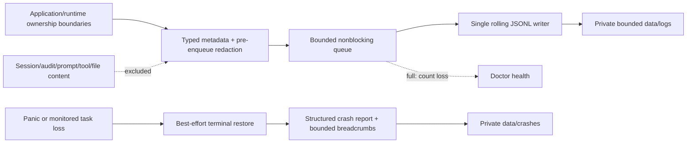

The process retains an exclusive lock on one run marker. Clean shutdown flushes
for a total 750 ms acknowledgement budget and removes that marker only after
confirmed flush/sync and health persistence. Missing acknowledgement or sink
failure retains the marker and a writer-fault count; a later process can identify an
unlocked stale marker without confusing a concurrently running Xana process.
Panic reports contain hashes rather than panic text, source paths, or raw
backtraces. OS termination may leave only a marker. `doctor` and `logs`
inspection deliberately do not start the writer, preserving their read-only
contract. Support export reparses known records, applies a second secret-shaped
scan, writes a new bounded local JSON document, and has no upload path.

Manual config editing stages an owner-protected bounded sibling file, invokes
an exact editor executable without a shell, validates the complete schema,
detects a concurrent live-file change, writes an exact backup, and atomically
replaces config. Invalid or failed drafts never replace live state. Scoped
`reset`/`clean` derives exact setup, session, cache, and referenced credential
targets from typed paths. It unlinks symlinks, refuses active workspace locks,
confirms filesystem and OS-credential effects separately, and removes config
last. Every scope preserves Codex-owned authentication/conversations and
unverified runtime state. The hidden `init` implementation is deprecated
compatibility during the 0.5.x preview; provider-neutral setup is canonical.

Xana loads a strict version 1, 2, 3, or 4 `config.toml`, capped at 1 MiB. It validates
named native and managed connections, tagged credential references,
connection-owned model overrides, complete agent profiles, exact task routes,
Codex-only fields, shell policy, permission rules, and bounded orchestration
limits. Schema 4 also models user-global identity and activation references,
declarative plugin sources, MCP servers, external agents, focused service
connections/routes, and named outbound-data policies. These declarations are
configuration only: they do not confer runtime authority or imply that a
package, endpoint, or service is available.
Model selection (64 KiB maximum) and bounded non-secret catalogs (8 MiB each)
are stored separately so the control plane does not rewrite a user's normal
selection into TOML. Structured connection removal preserves comments,
migrates legacy profile `provider` keys to canonical `connection`, writes
version 4, and validates the complete result. Connection addition and update
instead share setup's stronger establish, live-catalog validation, review,
atomic commit, backup, and rollback transaction. Read-only connection tests
leave both configuration and catalogs unchanged; repair replaces only the
derived catalog after a successful probe. Credential deletion and managed
logout remain distinct confirmed authority changes. Existing version 1-3
documents remain readable.

Managed Codex login remains a vendor-owned external operation. Xana starts one
exact app-server login attempt, presents its browser or device-code
instructions, waits for the correlated completion event, and forwards Ctrl+C
to `account/login/cancel`. A completed account change is never rolled back by
silently logging out; cancellation and logout have distinct typed receipts.

The provider-neutral connect hub is a navigation surface, not a discovery
engine. Focused image/vision setup and MCP add/remove operations are explicit
configuration transactions: they stage exact typed declarations and
profile-level exposure, preview or require `--yes`, validate the entire schema,
retain the exact prior config as `config.toml.bak`, and atomically replace the
live file. No provider, MCP process, or endpoint is started by configuration.

Seven runtime-owned, versioned JSON records live under the data root's
`interoperable/` directory: the project registry and conversation membership,
local project bindings, installed-package/lock state, endpoint trust, external
agent state, outbound decisions, and the bounded metadata-only outbound audit
journal.
They are separately bounded, owner-protected where the platform supports it,
strictly decoded, and atomically replaced. Version 2 preserves the version-1
domain fields; host/controller generations, transient attention, Run recovery,
and usage observations remain with their existing runtime/session owners or are
derived rather than being duplicated speculatively. They contain references
and decisions, never resolved credentials.

Provider and account usage inspection is an explicit control-plane operation.
Native requests preserve provider-reported token categories and cost plus
locally measured prompt/tool-schema bytes; managed Codex emits correlated
cumulative token and context observations. `usage_observation` normalizes these
facts and official Codex/OpenRouter account responses into the shared semantic
usage model. Its 256 KiB per-connection cache lives under `cache/usage/`, is
fresh for 60 seconds by default, and falls back to explicitly stale facts after
a bounded refresh failure. Ordinary startup and rendering perform no usage
poll. OpenAI/Anthropic organization facts remain permission-gated until Xana
has a separately configured management credential; Ollama and generic
compatible endpoints report account inspection as unsupported.

Configuration migration is an explicit plan/review/apply transaction. The
read-only plan snapshots the exact config bytes, validates semantic equivalence,
and classifies each private record as healthy, missing, migratable, invalid, or
unsupported. Apply holds the configuration transaction lock and one global
private-state mutation lock, rejects any bytes changed since review, writes
exact source records beneath
`data/interoperable/migration-backups/<transaction-id>/`, and installs all
missing or version-1 records behind a bounded versioned recovery journal.
`config.toml` is then atomically replaced as the final marker. A successful
commit retains both the config backup and private backup while removing the
journal.

Every ordinary private-state update takes the same global mutation lock and
refuses to proceed while a recovery journal exists. On explicit retry, source
config bytes cause byte-for-byte rollback before migration is retried; target
config bytes cause forward validation and finalization. A config value matching
neither side, an altered target, a corrupt/future record, or an unreadable
journal fails closed with an exact migration/Doctor action. Recovery never
touches session journals, managed-provider history, artifacts, or Run records
and never replays work.

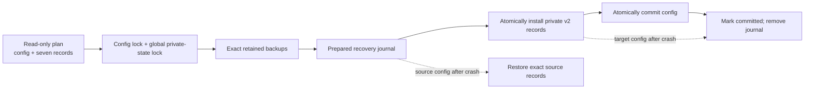

## Optional project registry

Projects are optional runtime-owned organization, not workspace containers.
The private project registry assigns a UUID project identity to a display name,
one canonical existing workspace directory, an active/archived lifecycle, and
timestamps. Canonical filesystem identity—not a string prefix or project
name—enforces at most one registered project per workspace. Creating, renaming,
archiving, unarchiving, relinking, or forgetting a project never writes into or
deletes from that workspace.

Conversation membership is a separate relation in the same atomically replaced
record. Any conversation may remain ungrouped. Assigning within the same
canonical workspace preserves the conversation identity and history; forgetting
a project removes only its membership relations. A cross-workspace continuation
plan allocates a new conversation identity and states that the execution owner
must start fresh; it never mutates the source or silently copies transcript
text. Presentation surfaces execute and explain the same application plan.

The current application edge now executes that plan explicitly. Review is the
default; `--apply` either assigns the existing same-workspace conversation or
creates a fresh owner-correct target, then commits project membership,
predecessor, and resolved-profile snapshot in the private record. Native targets
receive an empty durable session at the planned ID. Managed targets remain
pending until first use, when Codex app-server creates its vendor-owned thread;
`--resume` accepts this frozen managed target without treating it as a native
journal. No path translates or copies transcript text.

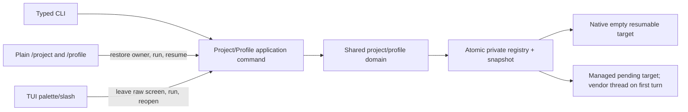

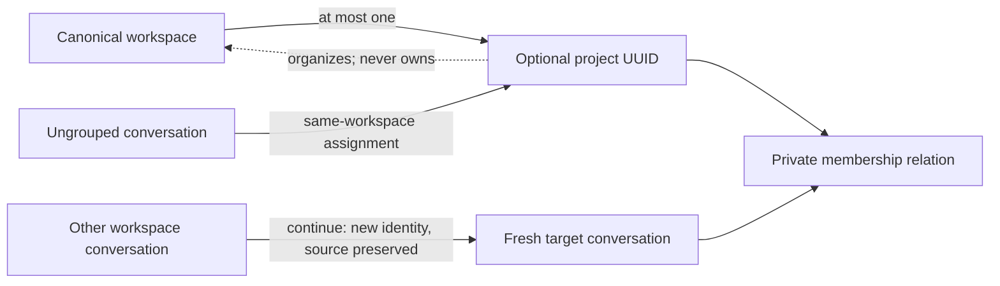

Registry inspection is read-only and distinguishes an available workspace from
a missing path or changed canonical identity. Relink is the only operation that
accepts a replacement workspace, and it rejects a canonical collision. Every
mutation runs beneath the private-record cross-process lock, so competing
creations cannot commit two project identities for one workspace.

### Portable project boundary

`.agents/xana/project.toml` is Xana-specific, versioned, bounded repository
metadata. Private project creation never writes it. An explicit share operation
creates the minimal file without secrets or local identity; subsequent
inspection validates a regular contained file, stable metadata across its
bounded read, strict fields/version, secret/path exclusions, and authority
subset before any registration mutation.

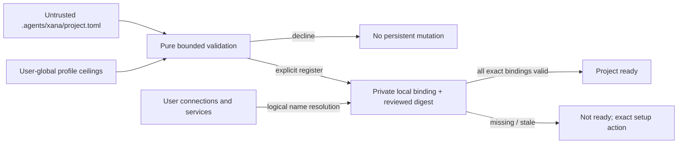

Portable profiles name a user-global authority profile and can only select
subsets or lower limits: deny/ask/allow rank, capabilities, tool rounds,
orchestration budgets, skills, plugins, MCP/A2A names, focused-service routes,
and outbound data classes. Logical connection/service requirements resolve
through the private binding record; no credential reference or endpoint crosses
into the repository. A changed manifest remains visibly stale until explicit
refresh records its reviewed digest. Stop-sharing removes only the contained
manifest and leaves private project, bindings, sessions, and workspace intact.

### Profile resolution and conversation snapshots

Profiles have stable UUID identity, arbitrary user-owned names, active/archived
lifecycle, and explicit primary/child applicability. User-global profiles live
in `config.toml`; project-local profiles live only in an explicitly shared
portable manifest. There is no inheritance graph. Duplication copies values into
a new independent profile identity.

`ProfileStore` is the application-domain boundary for lifecycle, pure
resolution, readiness, and immutable conversation snapshots. Resolution emits a
secret-safe `ResolvedProfile`: every effective field carries value and
provenance. User-global policy supplies the outer authority ceiling; a portable
project profile names one global ceiling and can only narrow it. AGENTS.md,
activated skills, and untrusted runtime data may supply guidance/context, but
they cannot change these typed permission, capability, egress, integration, or
budget fields.

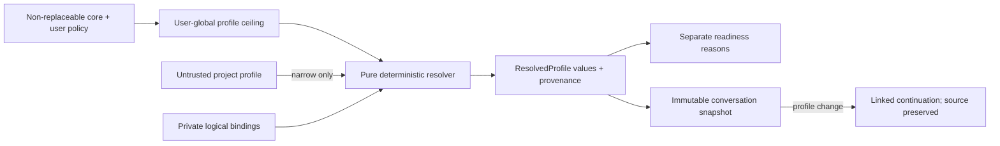

### Agent Skills discovery and activation

`SkillCatalog` implements the pinned Agent Skills metadata contract without a
general extension ABI. Discovery is metadata-only and bounded to direct child
directories. Identities are qualified by user, project, or plugin source; an
ambiguous unqualified name is an error rather than a precedence choice.

Activation revalidates the selected metadata, performs a bounded stable read of
`SKILL.md`, and follows only contained `references/` Markdown links under file,
aggregate, count, and depth limits. Symlinks, traversal, special files, invalid
UTF-8, cycles, and changing sources fail before prompt assembly. Mutable user
and project sources are re-read for activation; installed immutable plugin
sources can use validated cached reads. Scripts are never executed by the
catalog.

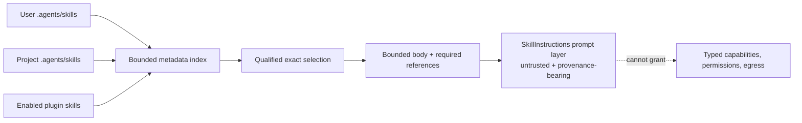

### Agent Plugin acquisition and scoped lifecycle

`PluginManager` owns inert Agent Plugins 1.0.0 inspection and private package
state. A local directory is read directly for preview and copied through a
bounded staging tree for install. An explicitly selected credential-free HTTPS
Git source is fetched at one exact 40-character commit into a temporary bare
repository with prompting, credential helpers, ambient Git configuration, URL
rewrites, hooks, and submodule recursion disabled, then extracted through a
path-validating bounded archive reader. Portable archive paths use bounded ASCII
components, avoiding case, normalization, device-name, and trailing-dot/space
aliases across supported filesystems. Linked development mode keeps a canonical
local path and remains visibly mutable.

`plugin.json` is the fatal package boundary. Invalid skills and MCP entries use
the narrower failure boundaries required by the standard. Review records only
safe capability summaries: skill identities, local executable tokens, remote
origins/paths, and environment/header names. It does not retain values,
credentials, or raw hostile terminal text.

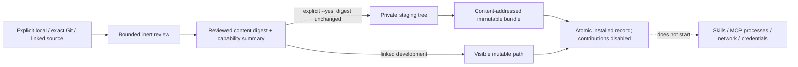

The package record and managed versions live below the private
`data/interoperable/` owner. A distinct lifecycle lock prevents cross-process
mutation races; versioned JSON replacement remains atomic. A crash before the
record commit can leave only unreachable staging/content data, never a partial
installed identity. Reinstalling an identical source/digest is idempotent;
source identity conflicts and changed content require explicit lifecycle
operations.

Enablement is a private exact binding at user, project, or profile scope. A
portable profile stores only the logical plugin name; deterministic resolution
checks the local binding and freezes the active content digest into
`ResolvedProfile.plugin_revisions`. Only those exact versions contribute
qualified Agent Skill sources to prompt assembly. Missing, disabled, drifted,
or invalid versions produce readiness failures.

Update check and apply are distinct reacquisition steps joined by the reviewed
digest. An unchanged capability digest may inherit the exact active scopes; a
changed skill/MCP declaration set begins disabled. The prior immutable revision
and its own approved scopes remain available for atomic rollback. Linked source
drift is degraded rather than trusted. Removal refuses enabled or portable
profile references, and garbage collection removes only unreachable managed
version trees. All lifecycle mutations serialize through the package lock and
atomically replace versioned state.

Plugin MCP declarations remain declarative data here. No plugin-origin process
or network connection can exist until the supervised MCP transport phase, which
consumes the exact resolved package revision and owns shutdown on lifecycle
changes. This preserves the process-ownership contract without pretending an
unimplemented runtime needs cleanup today.

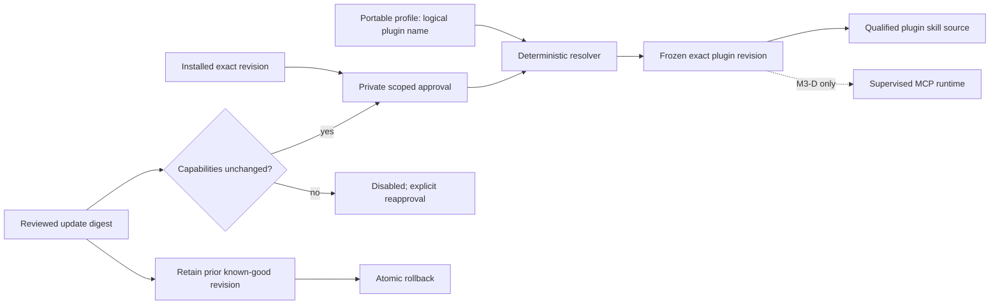

### Outbound data authorization boundary

`OutboundGuard` is the single application-policy gate for protected bytes sent
to an external recipient. `OutboundRequest` owns an immutable in-memory
snapshot of each explicitly selected item. It validates item and aggregate
limits before approval, computes content digests, and exposes only a redacted
`OutboundApprovalRequest` to controllers and observers. Request and payload
debug representations omit selected bytes.

Policy composition is a set intersection. The connection allowance is narrowed
by the user ceiling, frozen profile, and optional conversation ceiling; no
inner layer can add a data class. Allowed classes are prompt text, bounded Xana
summary, selected messages, selected file contents, selected artifacts, and
workspace metadata. Class availability never selects an item.

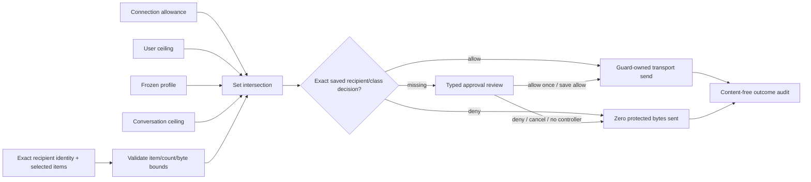

Recipient identity binds kind, connection, destination, and transport-owned
identity material into one BLAKE3 digest. Saved allow or deny records are exact
to that digest and one class, so endpoint or identity changes cannot inherit
approval. The bounded `outbound-decisions.json` record lives under the private
`data/interoperable/` owner and uses the same locked atomic versioned update
path as other interoperable state.

An interactive decision is carried with the complete redacted review that the
controller displayed. `OutboundGuard` compares that reviewed structure with
the request at the send seam; any recipient, purpose, class, item, byte-count,
or content-digest mismatch becomes a one-shot denial before transport or grant
persistence.

Audit events cover request, decision, send, cancellation, success, and failure.
They retain recipient identity, classes, counts, byte bounds, decision source,
and outcome, but never payload bytes, prompts, file content, artifact content,
credentials, or hidden reasoning. The request/decision/sending records are an
authoritative pre-send commit boundary: their failure prevents transport I/O.
Once transport I/O has completed, a success, cancellation, or failure audit
append is observational and cannot discard the original receipt/error or invite
an unsafe retry. Journal degradation is emitted separately to the bounded
diagnostic sink. Transport failures are reduced to typed safe categories before
they cross this boundary. Noninteractive unresolved approval fails closed.

MCP stdio and Streamable HTTP application requests, A2A delegation, focused
image generation, and specialist vision implement the guarded outbound seam
and revalidate the exact recipient digest before sending. Credentials and
network clients are resolved inside that seam after approval. Every application
integration calls `OutboundGuard::dispatch` as its only payload-bearing send
seam; denial performs zero protected transport work.

### MCP protocol and progressive catalog boundary

The private MCP wire adapter pins protocol `2026-07-28`. Every request owns the
required protocol, client-info, and client-capability metadata. Discovery uses
`server/discover`; older initialization/session behavior is neither emitted nor
accepted. Exact version negotiation keeps incompatibility separate from
disabled, unavailable, unhealthy, and profile-unauthorized states.

`McpCatalog` is transport-independent. A configured server identity and exact
profile allowlists are resolved before any primitive is indexed. Tools use the
stable `mcp.<server>.<source-name>` identity; resources, resource templates,
and prompts retain distinct indexes and APIs. Remote titles are display aliases
only. Prompt declarations remain user-controlled content rather than ambient
instructions.

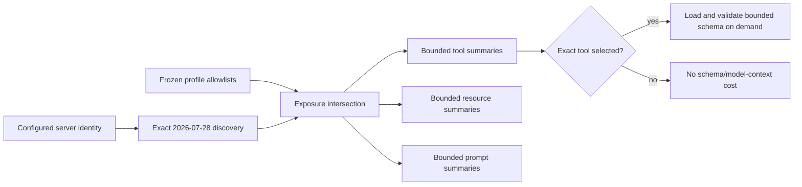

The application layer converts an exact, allowlisted tool into a dynamic
`ToolDefinition` and registers it with the ordinary tool registry. This keeps
native and remote tools behind one permission broker without turning the MCP
transport into an authority source. Resources and prompts use separate
explicit typed actions.

Profile activation never starts or contacts a newly configured MCP recipient.
An explicit `xana mcp refresh SERVER` renders the content-free discovery review
and records the exact recipient/`workspace_metadata` grant. A later conversation
may then discover that allowlisted server during activation; without the saved
grant it skips the server and remains usable. Tool invocation still performs a
separate exact `prompt_text` review, and saved grants remain revocable.

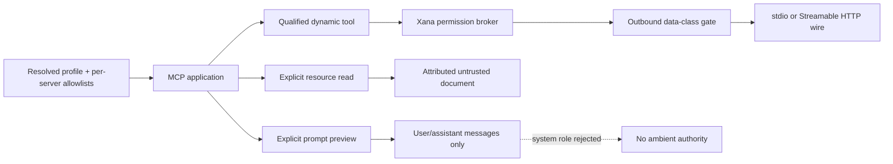

Page count, item count, metadata bytes, descriptions, URIs, and JSON Schema
bytes/depth/nodes are bounded. Truncation is deterministic. External schema
references are never dereferenced, and control/bidirectional characters are
sanitized before review or model exposure. The catalog does not own process or
network lifetime; the stdio and Streamable HTTP adapters consume it without
moving protocol ownership into a frontend.

The stdio adapter is the first such supervised transport. `McpStdioClient`
owns one actor, exact child process/process group, bounded writer, cancellation-
safe frame reader, independent stderr drain, typed health projection, and
cleanup deadline. UI and plugin code cannot own the child directly.

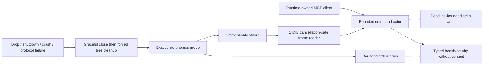

The command queue is capped at 64, the frame queue at 32, outstanding requests
at 32, and retained stderr at 64 KiB. Each frame is at most 1 MiB. Writes have a
two-second deadline and requests a 30-second default. The child environment is
cleared and rebuilt from a minimal platform bootstrap plus exact configured
entries; sensitive arguments and environment values never enter Debug output.
Restart means a new explicit spawn and never replays an interrupted request.

The Streamable HTTP adapter owns one exact HTTPS endpoint identity and one
request at a time. It resolves and validates the destination before building a
no-proxy, no-redirect client pinned to those addresses. Each JSON-RPC request
is a single `POST`; the response is either bounded JSON or request-scoped SSE.
There is no transport session, GET event stream, `Mcp-Session-Id`, reconnect,
or automatic replay.

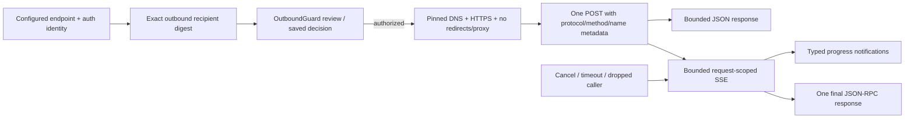

OAuth remains client-owned. A bounded bearer challenge leads to exact
protected-resource metadata and one reviewed authorization-server issuer.
PKCE S256, state, resource indicators, and optional authorization-response
issuer validation protect a temporary `127.0.0.1` callback. Tokens are one
atomic OS-credential-store value bound to issuer, client, resource, and scopes;
configuration retains only the reference and non-secret binding. In-process
and cross-process refresh locks re-read after acquisition, so concurrent expiry
performs one rotation and never returns a token that failed persistence.

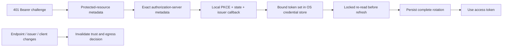

### Local MCP server boundary

`xana mcp serve` is the inverse, deliberately narrower adapter. Startup
canonicalizes one existing workspace and freezes one non-archived profile plus
an exact primitive allowlist. The current allowlist domain contains only
`xana_docs`; it reuses the native `ToolRegistry` and `PermissionBroker` but has
no provider, agent loop, conversation, frontend, session selector, or ambient
grant source. A noninteractive `ask` or `deny` outcome fails closed.

```mermaid
flowchart LR
    C["Local MCP client process"] -->|"newline JSON-RPC over stdio"| S["Isolated xana mcp serve process"]
    W["Canonical workspace"] --> F["Frozen startup scope"]
    P["Exact profile + allowlist"] --> F
    F --> S
    S --> R["Native ToolRegistry"]
    R --> B["Noninteractive PermissionBroker"]
    B --> D["Bounded Xana documentation"]
    A["Active Xana frontend/session"] -. "not reachable" .-> S
    E["EOF / cancel / shutdown deadline"] --> X["Cancel owned requests and broker"]
```

The adapter caps frames at 1 MiB, outstanding requests at 16, and internal
response queues at 32. It validates the pinned protocol and bounded client
metadata on every request, rejects duplicate IDs and unallowlisted names,
emits bounded progress, and correlates cancellation by request ID. EOF cancels
all outstanding work and shuts down the broker under a two-second cleanup
deadline. It never binds a socket or claims public API stability.

### External-agent discovery and trust

An `ExternalAgentDeclaration` is a logical A2A Agent Card URL plus optional
credential and egress-policy references. It is not a conversational connection
or execution owner. Generic startup and profile resolution never fetch the
endpoint. `xana external-agent refresh` is the only discovery effect; it uses
the pinned, no-proxy, no-redirect public-address HTTP boundary shared with MCP.

```mermaid
flowchart LR
    C["config.toml declaration\nCard URL + credential reference"] --> R["Explicit refresh"]
    R --> H["Pinned HTTPS GET\nno redirect/proxy/private address"]
    H --> V["Bounded A2A 1.0 Card validation"]
    V --> S["Sanitized private Card cache\nsemantic identity digest"]
    S --> U["Offline show + visible diff"]
    U --> T["Explicit trust of exact digest"]
    T --> P["Profile readiness"]
    D["Endpoint / owner / interface / capability / security / skill change"] --> X["review_required"]
    X --> T
```

The compatibility subset requires one tenant-free JSONRPC interface at
protocol `1.0`, `text/plain` input and output, and no required extension,
push-notification, or authenticated extended-Card behavior. Normalized Card
state lives in private `external-agents.json`; it contains no credential or raw
remote instructions. Trust binds the configured Card endpoint and normalized
owner/interface/capability/media/security/skill identity. A changed digest or
endpoint blocks readiness until refreshed and reapproved. Empty profile
selection returns before opening private state, preserving the zero-A2A-startup
path.

### External-agent delegation

Only a profile-selected agent whose exact normalized Card identity is trusted
contributes an `a2a__NAME__delegate` tool. Delegation is a normal planned tool
effect, so permission and typed outbound approval precede transport. The
payload contains the bounded task plus only caller-selected messages, regular
workspace files, immutable artifacts, or workspace metadata. It never derives
authority from remote content and never sends ambient transcript, hidden
reasoning, credentials, or a workspace tree.

```mermaid
flowchart LR
    M["Model proposes a2a__NAME__delegate"] --> P["Plan exact selected data"]
    P --> G["PermissionBroker + OutboundGuard"]
    G -->|"denied: zero bytes"| D["Typed denial"]
    G -->|"approved recipient + classes"| W["Pinned A2A JSONRPC transport"]
    W --> R["Remote agent-owned task loop"]
    R --> S["Bounded status and messages"]
    R --> A["Attributed artifact parts"]
    S --> E["Typed Xana activity stream"]
    A --> I["Immutable ArtifactStore or safe HTTPS reference"]
    R --> T["Bounded private task state"]
    C["Dropped or interrupted in-flight delegation"] --> L["Runtime-owned bounded cleanup lease"]
    L --> X["Best-effort remote CancelTask"]
    EC["Explicit tracked-task cancel"] --> DI["Durable cancellation intent"]
    DI --> B["Directly awaited bounded CancelTask"]
    B --> T
    X --> T
```

The remote agent owns its loop, context, tools, and side effects. Xana owns
recipient trust, disclosure, local observation, cancellation attempts, and
artifact provenance. Once the transport learns a remote task identity, it arms
a lease. Terminal task state disarms the lease; dropping a nonterminal
delegation transfers cancellation into the runtime's bounded deferred-cleanup
scope. The operation owner awaits that scope after normal tool execution and
after aborting an interrupted native turn, so dropping the request future does
not also drop its cancellation attempt. Each operation has its own cleanup
supervisor; cleanup tasks start under that supervisor and remain owned even if
one waiter is interrupted. Durable cancellation intent commits before cleanup
admission. The queue and drain deadline are bounded, and requested, confirmed,
failed, timed-out, unknown, and unscheduled outcomes remain distinct in task
state. Unconfirmed or unscheduled cancellation is reported as detached/unknown
rather than stopped. Abrupt operating-system
termination is outside that controlled-shutdown guarantee. A completed or
failed task yields a bounded receipt. All remote messages and artifacts remain
attributed, untrusted data.

Snapshot records reside beside project membership in the private versioned
project record and contain only the redacted resolved document plus its digest.
An existing snapshot cannot be replaced. A profile change allocates a new
conversation identity, copies only the optional project membership, records the
predecessor link, and freezes the new snapshot; owner-specific model/reasoning
history in the source remains untouched. Provider/process availability never
participates in resolution and appears only as readiness.

See [Configuration](../user/configuration.md) for the user-facing schema and
path rules.

## Paths and application identity

The canonical application identifier is:

```text
io.github.labcoder.xana
```

`ProjectDirs::from("io.github", "labcoder", "xana")` maps Xana-owned
configuration, data, cache, and runtime state to platform-standard locations.
The identifier is compatibility state: changing repository location or adding
a frontend does not justify orphaning existing user data.

An unset or empty `XANA_HOME` uses those platform defaults. A non-empty
override must be an absolute native path and maps Xana's backend state beneath
one portable root. Path resolution is pure policy; it does not create or
canonicalize the returned directories.

Static stored API keys remain in the operating-system credential service and
are not redirected by `XANA_HOME`. Codex credentials remain in Codex's owned
home unless the connection explicitly sets an absolute `codex_home`.

## Distribution boundary

Xana is a Cargo-installable source application pinned to Rust 1.97.1. The
checked-in lockfile is part of its package contract, and supported checkout or
Git installs use `cargo install ... --locked`. CI runs formatting,
warning-denied all-feature Clippy, all-feature and no-default-feature tests, a
reviewed package-path audit, and a locked source installation from the workspace on
Linux, macOS, and Windows. The application package remains `publish = false`
to prevent accidental registry publication, while its source archive is still
audited as part of the distribution contract. The package includes its license,
README, and User Documentation. Release builds retain Cargo's
default profile; the pre-protected-storage Windows smoke binary was about 8.1 MiB, and no
cross-platform evidence yet justifies custom LTO, stripping, panic, or codegen
settings.

The repository contains a pinned local `cargo-dist` 0.32.0 plan for exactly the
`xana` application on Windows x64 MSVC, macOS ARM64, macOS Intel, and Linux
x64 glibc. It produces conventional native archives containing `xana`, the
license, README, and installation documentation plus SHA-256 metadata. A
semantic plan check fixes that inventory and GitHub attestation intent; a
native archive audit verifies checksum, bounded contents, and version/help
execution. The planner uses Cargo's existing release profile and performs no
publish or install effect.

The source-controlled Bash installer is the Unix Release Preview activation
boundary. It accepts only the three planned macOS/Linux targets and one exact
four-target release manifest, verifies bounded SHA-256-addressed archives
before inspecting or extracting them, smokes the staged `xana`, and replaces a
per-user executable failure-safely. PATH mutation is a separate explicit
profile edit, and configuration readiness is delegated only to `setup
--if-needed`. Its local fixture authority requires three conspicuous test-only
arguments together and cannot redirect an ordinary production invocation.

The source-controlled PowerShell installer implements the equivalent boundary
for native Windows x64 MSVC. It uses bounded .NET HTTPS reads, validates the
same manifest grammar, inspects ZIP paths, entry types, expanded sizes, and
duplicates before extracting only `xana.exe`, and uses same-volume
failure-safe replacement. User PATH updates preserve the raw unrelated value
and are idempotent; failure restores the prior executable. Reparse points,
emulated or unsupported architectures, locked destinations, and unsigned or
incorrect staged executables fail closed.
Executable replacement and rollback retry only Windows sharing/lock violations,
with at most two seconds of backoff and unchanged source/destination presence.
Partial-rename errors are not retried. A persistent lock remains an error; the
installer never kills the process holding it or silently abandons a backup.

Ordinary CI is the source-quality authority for pushes to `main` and pull
requests. Its three-platform matrix uses a commit-pinned, dependency-only Rust
cache; pull requests can restore but only trusted `main` pushes can save cache
entries. Tag pushes do not start a duplicate ordinary CI run.

The manual-only [native qualification workflow](../contributing/native-qualification.md)
executes full workspace/root test modes on Linux and both macOS architectures,
plus disposable production OS-custody and source-installation checks. Its
explicit resource gate runs optimized protected-history fixtures at 10k/100k
messages with five independent opens, sampled process RSS/CPU, backup/restore,
and release CLI/Desktop executable sizes. It has
read-only repository permissions and uploads only synthetic test logs/metadata.
It does not publish artifacts as releases or claim native browser parity,
interactive OS consent, OS-cold-cache latency, graphical performance or acceptance.

The dedicated Release Preview workflow first requires a successful ordinary
CI push run for the exact commit being released, then binds the exact tag/input
to Cargo and the pinned dist plan. It rebuilds all four native archives from
that source rather than consuming CI binaries or mutable prebuilt artifacts. A
read-only assembly job refuses anything other than the exact fourteen-asset
bundle. A separate least-privilege job attests that bundle; only an exact
tag-push job receives `contents: write`. That job creates or reconciles an
explicitly `INCOMPLETE` draft, verifies the tag commit and remote inventory,
and only then gives the still-unpublished draft its clean final public title.
Draft discovery uses the GitHub CLI's draft-aware release view rather than the
published-release tag endpoint. Manual dispatch can build and attest but has no
draft job. Every action and release tool is commit/version pinned and ordinary
CI statically audits the authority boundary.

The repository publishes Xana 0.5.1 as its first four-platform developer
preview with the exact reviewed installers, checksums, manifests, release
notes, and provenance attestations. The earlier `v0.5.0` candidate remains an
unpublished immutable tag. There is still no crates.io publication,
package-manager channel, automatic updater, signing/notarization, or stable
support promise. Publication and tagging remain separate owner-controlled
effects, and the manifests set `publish = false` to prevent an accidental
registry upload. The separately
[implemented Release Preview contract](../proposals/0018-release-preview-distribution.md)
records the bounded native preview while keeping deferred Product Distribution
features out of the current descriptive architecture until they exist.

## Source organization

The application modules establish responsibility and I/O boundaries:

- `main.rs` is the thin process entry for the package's single `xana` binary;
  the library entry owns argument parsing, bounded application-thread startup,
  and handoff to `app`. Library visibility exists for that executable and
  integration tests, not as a stable public SDK.
- `app` owns command routing and dependency construction. Its private
  `chat`, `connections`, `hosting`, `one_shot`, `operations`, `recovery`, and
  `sessions` children keep chat composition, provider/catalog commands,
  loopback hosting, automation output, recovery, and durable inspection behind
  small app-facing interfaces.
- `plain_terminal`, `managed_execution`, `tui`, and `presentation` own surface
  behavior and managed-loop adaptation. Managed activity filtering/retention is isolated in
  `managed_execution/activity` so display policy does not enter the process or
  conversation loop. `tui` confines Ratatui/Crossterm types to its lifecycle,
  shared runner, terminal-independent `tui/state` update policy, and pure adaptive
  view modules. Conversation virtualization/selection and overlays are focused
  view children. Composer editing, input normalization, command reduction,
  native/managed effect interpretation, and execution-owner adapters are
  private focused children of that state/update interface.
- `frontend` owns the typed embedded application contract and its bounded
  `semantic` content, resource, activity, attention, usage, capability,
  execution-evidence, event, and replica children. `resource` owns immutable
  resource references and configurable admission beneath compiled ceilings.
  `controller` owns the transport-independent, Conversation-keyed lease state
  machine; `execution_host` owns bounded application-level workspace,
  Conversation, Run, collision, attachment, controller, and ordered-event
  coordination. `local_host` owns only its authenticated loopback projection,
  protected discovery descriptor, atomic host snapshot/sequence boundary,
  observer fan-out, bounded visible-artifact catalog, and exact foreground
  shutdown registry. Native and managed hosted execution adapters translate
  that authority back into their existing owners.
- `native_runtime` and `identity` own foreground state, typed commands and events,
  correlated permission control, and semantic work identifiers.
- `autonomy` owns durable task scope, calendar and receipt policy, detached-host
  lifecycle and explicit login registration. Its runner composes the existing
  native runtime under a read-only unattended ceiling; `storage::autonomy`
  owns job/policy transactions. It does not add a general event replay engine.
- `orchestration` owns exact route resolution, immutable child configuration,
  queued owner-neutral supervision, cancellation/inspection, durable
  handle/report types, native child composition, and the crate-private managed
  Codex child adapter. Its supervisor facade delegates admission, lifecycle,
  bounded activity projection, command-side handles, and allocation-free JSON
  size accounting to focused child modules. The native runtime remains the only
  session writer.
- `operation` owns invocation intent/result ordering, bounded durable values,
  replay classification, and explicit recovery execution.
- `permission` owns pure policy and scopes, pending controller decisions,
  session grants, and audit-fact values.
- `session` owns the versioned envelope, bounded JSONL store, pure reduction,
  incremental projection, durable context refresh, one writer, and
  resume/inspection summaries.
- `artifact` owns BLAKE3 content identity, immutable publication, bounded
  verified ranges with replacement detection, and logical artifact metadata.
- `agent` and `message` contain the headless loop and internal conversation
  model.
- `prompt` and `context` own per-turn versioned assembly, transient prompt
  selection, durable context records, provenance, previewing, and input-budget
  enforcement.
- `provider`, `model_catalog`, `connection_management`, `credential`, and
  `managed` separate native generation, catalogs/selection, presentation-neutral
  connection facts and receipts, static secret ownership, and foreign runtime control.
  `managed/codex/events` is the bounded wire-to-domain event normalizer;
  `managed/thread_store` owns only opaque managed thread handles.
- `process_capture` and `bounded_file` are shared constant-memory ingress
  primitives for child output and small structured state files.
- `tool` is a narrow facade over capability-composed private implementations.
- `config`, `paths`, and `init` own validated input and filesystem policy at
  the application edge. Advanced setup isolates machine-local appearance
  editing from structured runtime configuration, while `doctor` isolates live
  connection probes from redacted report and repair policy.

Initialization separates pure planning from create-new filesystem writes.
Large private test suites live in child modules; package-level executable smoke
tests live under `tests/`.

## Deliberate absences

Xana has no Xana-owned sandbox, general durable external event replay,
general persistent tool-session grants,
remote controller authentication, general context service, nested
project-instruction or skill discovery, artifact/session
garbage collection, automatic/background operation replay, generalized
idempotency, provider continuation after reconciliation, power-loss
durability, or crash-safe edit protocol. Session
grants live only in the foreground process. These absences are implementation
facts, not predictions about which proposals will be accepted. Model-aware
prompt budgets, deterministic artifact-backed compaction checkpoints, and
local foreground/embedded execution-host coordination already exist. Xana also
provides scoped personal learning/context and explicit bounded local schedules;
these are not general autonomous effect replay. [Personal-memory owner controls](../user/personal-memory.md) share
typed scoped records, checked corrections, independent use/learning/no-memory
flags and private exports through the [protected store](protected-storage.md).
The owner-input extractor uses an explicitly authorized native helper, shared
background limits, current source/consent checks and conservative activation.
Native and managed turns receive bounded current data without a bridge-agent
call. The detached host and [durable schedules](../user/durable-schedules.md)
retain exact task authority and expose cancellation/unknown outcomes; they do
not borrow an idle frontend's current Conversation or implicit credentials.
Fresh homes can opt into [protected storage](protected-storage.md): SQLCipher
owns Conversation records and private catalogs, and age protects immutable
artifact objects. Existing homes still use the legacy backend until explicitly
migrated; the presence of a protected store never permits plaintext fallback.
