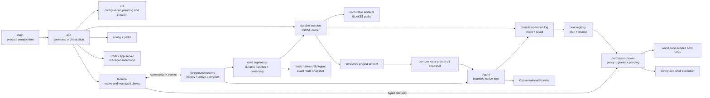
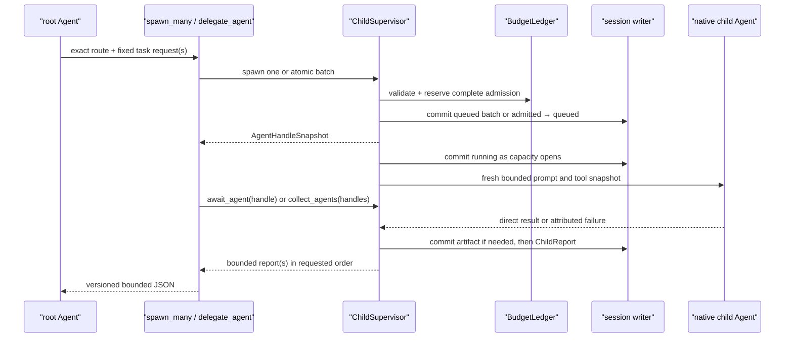

# Xana architecture

> Audience: Contributors and coding agents  
> Authority: Descriptive

This document describes what Xana is and how its implemented boundaries work.
Future system shapes belong in [proposals](../proposals/), while durable
constraints and philosophies belong in [Design Principles](../principles.md).

## System overview

Xana is a Cargo workspace running on Tokio's multi-thread runtime with a
terminal frontend. Native connections use one in-process foreground runtime;
the Codex connection supervises a vendor-owned app-server process. `xana-cli` is the
process composition root and delegates command execution to `xana-runtime`.
The application edge resolves paths, loads configuration, initializes
dependencies, and routes CLI commands. `xana-core` remains headless and has no
filesystem, terminal, HTTP, or process dependencies. See
[composition services](composition-services.md) for the capability,
self-documentation, and document-extraction boundaries.
[Connections, models, and managed runtimes](models-and-managed-runtimes.md)
describes native inference, Codex delegation, catalogs, selection, and
credential ownership.



`runtime` owns the sole open session writer, reduced conversation history, and
at most one active root operation. `terminal` is a protocol client that owns readline input, permission
answers, and human rendering. `presentation` owns terminal-mark selection and
its TTY, monochrome, suppression, and fallback behavior. None of those
frontend concerns enters the headless agent loop.

Control values cross a bounded Tokio channel as serializable
`RuntimeCommand`s. A single foreground receiver observes serializable
`AgentEvent`s over an unbounded channel. Commands submit turns, clear idle
history, identify explicit recovery work, correlate permission decisions, and
shut down the runtime. The dedicated CLI recovery controller consumes
`ResumeOperation`; merely opening a foreground chat never reconciles effects.
Events carry operation state, assistant deltas, permission requests and audit
facts, committed invocation facts, tool completion, final messages, failures,
clearing, rejections, and attributed child lifecycle/activity/reports. Except for the
explicit permission request, event delivery is passive: losing the receiver does
not alter an operation's result.

Child list, detail, cancellation-request, and permission-decision commands
address the in-process supervisor. They do not imply a daemon or remote runtime
host. A cancellation-request event confirms only that the signal was accepted;
the committed terminal lifecycle/report is the stop acknowledgement.

## Native child supervision boundary

When a native root has configured task routes, the application creates one
`ChildSupervisor` actor and registers `spawn_agent`, `spawn_many`,
`await_agent`, `collect_agents`, `cancel_agent`, and `delegate_agent` only in the root tool
registry. The
model-facing convenience calls the supervisor's distinct `spawn_agent` and
`await_agent` operations in one tool execution, so no outer model response is
needed between admission and collection. `AgentId` is the
durable handle key. A session's root `AgentId` is deterministically derived
from its public `SessionId`, keeping lineage stable across resume without a
write-on-open migration.

Admission prepares the exact route, native provider, immutable capability/tool
snapshot, authority intersection, prompt, and explicit task before a child
record exists. A runtime-owned `BudgetLedger` reserves fan-out, active
descendants, tool rounds, context capacity, report bytes, and artifact bytes in
one actor mutation. `spawn_many` validates and reserves every member before a
single durable batch record or observer event exists. Queued work is kept in a
FIFO admission queue and starts only while the root profile's concurrency
capacity is available. The child deadline begins at admission, so queue time is
bounded too. Reservations and running slots are released exactly once on every
terminal or failed-start path.

Single admission preserves explicit `admitted` and `queued` durable facts;
batch admission commits all queued handles in one atomic record. `running` is
always committed before its event. The supervisor, not the tool future, owns
the Tokio task and permission broker. Dropping or timing out an await therefore
leaves the child supervised unless cancel-on-timeout was explicit. Repeated
await/cancel operations are idempotent after terminal state. A terminal report
is committed before completed/failed/cancelled/interrupted events and contains
typed attribution. Usage is represented as measured, estimated, or unknown;
unknown is never treated as zero.

Each admission fixes a result schema (`summary` or canonical JSON). Completed
output at or below `max_report_bytes` stays inline. Larger output is written to
the immutable content-addressed artifact store, with `ArtifactRegistered`
committed before the child report that references it; the handle and collection
surface retain only a bounded preview and reference. Persistence or validation
failure becomes a bounded attributed failed report, never an unregistered
reference. Collection verifies artifact length and digest by streaming bytes
without loading artifact bodies into model context.



Native cancellation is structured: the supervisor marks the request, closes
the child's permission broker, signals its cancellation token, drops the
in-flight provider/tool future at the execution boundary, and waits for one
terminal completion. The command does not equate signalling with success.
Queued cancellation commits `Cancelled` without constructing an execution.
Runtime shutdown applies the same path to every queued/running child and waits
for terminal commits while the runtime continues servicing commit acks. A
bounded grace expiry aborts only the unresponsive task and commits
`Interrupted`; abort is not the normal cancellation path.

On restoration, the reducer leaves committed records unchanged. Its inspection
projection maps any nonterminal child prefix to `Interrupted` with an explicit
projection marker, performs no provider/tool call, and appends no
reconciliation fact. Active `/agents`, `/agent`, and `/cancel-agent` commands
reach only the owning foreground process. `xana session inspect` in another
process is read-only and cannot claim to cancel foreground work.

The child receives Xana's identity/guidelines, its exact task, applicable
bounded root `AGENTS.md`, environment facts, and only the tools selected by its
profile. A request may add a fixed set of parent-selected text previews and
immutable artifact-reference metadata. These sources keep explicit
`parent_handoff` provenance, remain untrusted prompt data, and pass through the
same context budget; artifact bodies and the parent transcript are never
copied. Its registry never contains orchestration tools, so child depth is
structurally one. Native children run in stable admission order up to the root
profile's bounded concurrency. Every native provider uses the same execution
contract while its adapter maps optional token fields; Xana aggregates a field
only when every request supplied it and separately measures request count.
`collect_agents` snapshots a fixed set of unique handles atomically, returns
entries in caller order regardless of completion timing, and preserves each
terminal status, attribution, typed usage, and report reference. Its explicit
continue-on-error or fail-fast policy never erases results already observed;
timeout and cancellation are separate choices. Collection serialization has a
hard bound independent of durable artifact size and makes no model call.
Managed Codex children are not yet implemented.

`OrchestrationPlan` is the separate closed child-work domain; the existing
prompt-selection `ContextPlan` is unchanged. A pure structural validator
checks the versioned, byte-bounded spawn/await/collect/cancel graph and only
prior spawn-handle references. The supervisor then resolves every exact route
and performs a reserve/release dry check of the aggregate ledger before any
record is appended. Execution commits `OrchestrationPlanStarted`, atomically
admits the complete static spawn set through the canonical batch path, and
executes remaining steps through the same await, collect, and cancel methods.
The durable start fingerprint rejects repeated plan ids across restoration;
each child admission carries plan id, spawn step id, and output index. No plan
interpreter, evaluator state, loop, branch, recursion, or second scheduler
exists.

`OperationId`, `StepId`, `ToolInvocationId`, `ToolResultId`, and `NamedValueId`
are distinct UUID v4 newtypes.
An operation moves through running or suspended state and always reports a
finished completed, failed, declined, or interrupted outcome. Conversation,
operation states, permission audits, artifacts, and context metadata have
separate durable records. Live deltas and events remain transient and are not
treated as a replay log.

## Agent and conversation boundary

`Agent` owns one asynchronous `ConversationalProvider`, a deterministic tool
registry, the session workspace, a base `PromptSnapshot`, and a configured
tool-round limit. The runtime supplies a project-context-aware snapshot for
each accepted root turn; that snapshot is unchanged across the turn's provider
calls. Before each provider call the agent charges the complete current
history and prepends the snapshot's system message. It executes
requested tools serially, appends correlated results, and returns the final
assistant message. The foreground runtime commits immutable user, assistant,
and tool-result entries and moves the thread head separately.

The provider-neutral conversation model carries ordered text, image,
tool-call, and tool-result content. Provider request and response shapes remain
private to their adapter. The native generation boundary is the focused
`ConversationalProvider`; account control, catalog discovery, credential
storage, and managed agent runtimes remain outside it. Native and managed
composition are described in [Provider contracts](providers.md) and
[Connections, models, and managed runtimes](models-and-managed-runtimes.md).

The native HTTP adapters share one incremental, line-oriented SSE decoder. It
supports arbitrary chunk boundaries, LF and CRLF frames, comments, multi-line
data, and bounded frames. Each adapter additionally caps aggregate text,
tool-input, and content-block accumulation for the complete response; a peer
cannot bypass the turn bound with many individually valid frames. Indexed
OpenAI-compatible tool-call deltas accumulate id, name, and JSON argument
fragments before they become one provider-neutral assistant message. Live text
deltas are rendered immediately but only the completed message becomes
conversation history.

The provider-neutral conversation model includes a system role. The
OpenAI-compatible adapter serializes that role and the changing conversation
at its private wire boundary; exact tool schemas remain a separate request
field.

`Agent` receives owned dependencies and limits. It does not load
configuration, inspect environment variables, resolve platform paths, or
render terminal output. It also does not read prompt or project files.

## Prompt and project-context boundary

The application edge owns a `PromptAssembler` built from embedded,
non-replaceable identity and guideline files; a concise tool catalog derived
from the immutable registry; owned operating-system, canonical session
workspace, configured-shell, and CLI-surface values; and fixed budgets. When a
root turn is accepted, the runtime refreshes durable project context and
assembles one `xana-prompt-v1` snapshot. Native composition supplies a concise
product-documentation layer that names the readable logical ids exposed by the
bounded `xana_docs` tool; documentation bodies are fetched only when needed.

Layers have transient ids, purpose, origin, trust, provenance, estimated cost,
and deterministic order. Dynamic layer text and attributes are XML-escaped,
line endings are canonicalized to LF, only outer blank lines are trimmed, and
layers are separated by one empty line. These properties make unchanged input
byte-stable across supported platforms. The labels are prompt structure, not a
security boundary.

Root `AGENTS.md` is optional, must be a non-symlink regular UTF-8 file no larger
than 64 KiB, and has independent 16 KiB and 1,024-estimated-token view limits. Discovery does not
walk parents or nested directories and ignores `XANA.md`, `.agents/`, skills,
and plugins. Project instructions can guide work but cannot mutate tools,
configuration, permission state, or Xana's non-replaceable core.

One estimated 32,768-token budget charges rendered system layers, exact tool
schemas, selected previews, and actual history while reserving 8,192 tokens
for conversation during assembly. The Phase 2 text estimator uses one token
per three Unicode scalar values, rounded up; image blocks reserve a
provider-neutral, pixel-based conservative estimate instead of a textual
placeholder. Neither estimate is a provider tokenizer. Over-budget required
input or history fails before provider I/O. Range and literal-search previews
remain bounded, Unicode-safe, and provenance-bearing.

Prompt-layer ids are transient to one snapshot. Durable `ContextRecord`s carry
id, monotonic version, artifact reference, kind, BLAKE3 hash, logical size,
provenance, trust, and owner. `ContextViewRecord`s bind source id/version,
selector, selected-content hash, and byte/token budgets. Full, inclusive line,
and capped literal-line-search selectors materialize from verified immutable
artifact bytes. Only the resulting bounded text can enter a prompt.

Root context refresh occurs only when a new turn is accepted. Unchanged bytes
reuse the version; changed bytes append one artifact/context version; a missing
live source does not erase the prior version. Opening or inspecting a session
does not read live project files. Xana has no general native context plan or
prompt compaction. The bounded catalog and `xana_docs` tool are included in the
resolved production tool snapshot.

Image attachments are reference-based and artifact-backed; see
[Image input and media resolution](vision.md). OpenAI-compatible and Anthropic
adapters resolve bytes only at the wire edge; Codex receives checked local
paths under the managed workspace.

## Session and artifact boundary

Native bare chat creates `data/sessions/<SessionId>.jsonl` and one thread before any
conversation entry. `xana --resume SESSION_ID` performs bounded read-only
inspection and pure ordered reduction, explicitly opens the verified file for
append, and restores the selected conversation path. The optional `xana
session inspect SESSION_ID` reports bounded metadata without conversation
content and never opens for writing.

Managed Codex threads remain Codex-owned and are not mirrored into Xana's
native session log. Xana stores only an opaque thread id per connection and
canonical workspace, then delegates `thread/resume` to Codex on the next
process's first turn. The bounded, atomically written handle is neither
history nor a credential. `--resume` therefore applies only to native
conversations; managed resumption is automatic and `/clear` replaces the
saved handle.

Every compact newline-terminated envelope has format version 1, record id,
session id, and one typed record. The initial record owns the thread and
canonical workspace. Other kinds append immutable conversation entries,
separate head moves, accepted operations, steps, invocation intents/results,
operation states and outcomes, permission and recovery decisions, named
durable values, artifact metadata, context versions, context views, and
named-context moves. The reducer rejects wrong or duplicate identities,
unknown references, non-monotonic versions, invalid heads/parents, second
creation, invalid transitions, mismatched preallocated result ids, second
results, and terminal operations with pending invocations. Only the
head-to-root conversation path becomes model history.

Inspection is bounded to 256 KiB per record, 10,000 records, and 16 MiB per
session. A malformed physical tail after a valid newline-terminated prefix
returns a truncate plan; a complete object without its final newline is also
uncommitted tail data. Interior malformed records are corruption. Opening for
resume acquires the writer lock before rechecking the inspected length and
BLAKE3 hash or truncating a tail, so repair cannot discard a concurrent
append. The same byte and record limits apply to active appends, not only
later inspection. Each record is semantically validated before it is written,
then incrementally applied to the in-memory projection after the append
succeeds; invalid state never enters the journal and appends do not replay the
full history. An append writes one object plus newline and flushes before a
corresponding committed runtime event is emitted. This promises process-crash
record boundaries, not power-loss durability or `fsync`. An append I/O failure
poisons that writer so later bytes cannot turn a partial tail into interior
corruption.

Artifact bytes live at `data/artifacts/<blake3-hex>` and are capped at 4 MiB.
Publishing writes and flushes a create-new temporary file, then uses a
non-overwriting hard link as the final publication step; the temporary name is
removed afterward. A racing or existing final path is reused only after length
and digest verification. Reads enforce the caller bound and verify the record's
length and digest. Logical `ArtifactId`, media type, and owner remain distinct
from byte equality.

The foreground runtime owns the only open `SessionStore`. A companion lock file
uses the standard library's nonblocking exclusive file lock, so a second
process cannot open the same session for writing or recovery concurrently.
There is no session deletion or garbage collection, automatic latest-session
choice, or portable-workspace rewrite. Restore reports unfinished operation
states but performs no provider, tool, context-refresh, or replay effect.

## Durable operation and recovery boundary

Each accepted root turn binds its committed input entry. Every assistant
tool-call batch starts one step and executes serially. For each invocation,
Xana plans normalized arguments and canonical scope, authorizes the exact
plan, commits its audit fact, preallocates a result id, and appends and flushes
intent before executing. The result and any bounded named output commit after
the effect and before the correlated conversation result. An append failure
before intent performs no effect; an intent without result means the external
outcome is unknown.

Built-in tool contract version starts at 1. `read_file`, `list_files`,
`read_document`, and `xana_docs` declare `ReplaySafety::Safe`; `edit_file` and
`run_command` declare `Never`.
Recovery never infers safety from a tool name or effect class: an exact
invocation is eligible only when saved and current declarations are both
`Safe`, the installed name/version still matches, replanning produces the same
arguments and scope, and current authorization permits it.

`xana operation plan --session SESSION_ID OPERATION_ID` reduces and classifies
records without effects or argument disclosure. `xana operation resume
--session SESSION_ID OPERATION_ID` is the only implemented reconciliation
controller. It preserves completed results, handles the first missing result
in original call order, and reauthorizes a safe replay. Unsafe, missing,
changed, or denied work gets a correlated declined/interrupted result with the
preallocated id and is not executed. Recovery then terminates the interrupted
operation; it does not call the provider to invent a continuation.

Committed-fact events follow successful appends. Live text deltas remain
transient. Large output uses an immutable artifact; bounded inline JSON,
artifact references, and context id/version pairs are the only authoritative
named values. No heap, process, channel, socket, or open file is recovery
state. These guarantees cover process crashes at flushed record boundaries,
not power loss, filesystem transactions, effect idempotency, containment, or
`fsync`. Unknown `Never` outcomes may require manual reconciliation.

## Tool boundary

Xana exposes six tools through a capability-resolved, provider-neutral
registry:

- `read_file` reads bounded UTF-8 content with an optional inclusive line
  range.
- `list_files` returns a bounded, sorted, non-recursive directory listing.
- `edit_file` replaces exactly one match in an existing bounded UTF-8 file.
- `run_command` executes one command string through a configured shell in an
  existing workspace directory after runtime authorization. It returns status
  plus independently bounded stdout and stderr.
- `read_document` performs one bounded workspace read and extracts bounded
  UTF-8 text or CSV-as-Markdown without executing or fetching content.
- `xana_docs` lists and reads Xana's curated, version-matched documentation by
  logical id.

All tool paths are relative to Xana's launch workspace and must remain beneath
that workspace after lexical and canonical resolution. Execution revalidates
the planned canonical path and filesystem identity; file tools also verify the
opened handle before reading or writing. This rejects ordinary replacement or
symlink-retargeting races between permission planning and execution. Reads and
resulting edits are capped at 64 KiB; directory listings are capped at 256
entries and 64 KiB of output.

The registry caches each validated, versioned definition beside its
implementation and reports effect class separately from replay safety. It is
the one invocation path: resolve a tool, build an immutable plan, authorize
the plan, durably bracket its effect when a session is active, and execute only
an allowed plan. Plans contain normalized final JSON arguments, canonical
scope, and type-erased executable data created and consumed by the same
concrete tool. No registry executor bypasses planning and authorization.

File scopes are canonical target paths beneath the canonical launch workspace.
Command scopes contain the selected shell, exact command, and canonical cwd.
Invalid arguments and escaping paths fail before policy evaluation. Planning
may validate metadata but performs no write, process, network, or external
effect.

`run_command` is `Execute` plus `ReplaySafety::Never`; its exact program argv,
command, shell, and canonical cwd exist before authorization and spawn. Stdout
and stderr are drained concurrently after their independent 32 KiB retention
limits, so child output cannot force unbounded capture memory or deadlock on a
full pipe. Shell selection resolves once at the application edge: macOS/Linux support POSIX
`sh -lc`, while Windows supports PowerShell, Git Bash, and `cmd` through
explicit configurations. A custom compatible program path may replace the
default executable.

One runtime-owned broker task owns policy, memory-only session grants, pending
requests, and controller presence for every built-in tool. Pure policy combines
all matching user rules with deny-before-ask-before-allow precedence, then uses
the configured default. An explicit or default deny cannot be overridden by a
grant. An ask suspends its operation and accepts deny, allow once, or an exact
current-session scope from the foreground terminal. Grants also bind tool and
effect and cover only the same or a narrower workspace scope or an exact
command scope. Exact duplicate grants reuse one entry and the in-memory set is
capped at 256. Unknown, stale, duplicate, mismatched, scope-widening, lost, and
unattended decisions fail closed.

Each outcome emits a `PermissionAuditFact` binding operation and
invocation ids, tool/effect, final arguments, scope, policy outcome, optional
controller decision, and effective decision. The runtime commits the fact as a
non-conversation session record before forwarding its audit event. Neither policy, metadata, workspace path
checks, nor authorization provides process containment. Tools run
asynchronously with the Xana process's ordinary host access, and `edit_file`
does not claim atomic or crash-safe writes.

## CLI, configuration, and initialization

Bare `xana` starts the selected native or managed route. Native chat creates a
session; `xana --resume SESSION_ID` resumes only a native session. The typed
command boundary exposes initialization/configuration, session inspection,
explicit operation recovery, unified `xana model`, and advanced `xana
connection` commands for static keys and Codex account control. Read-only
`xana route list` and `xana route check NAME` resolve exact child profile,
connection, configured/cached model, capabilities, permission ceiling, and
limits without provider network access or managed-process startup. This
diagnostic remains read-only. During native chat, a separately composed root
`delegate_agent` tool can admit one exact native child through the runtime
supervisor; route diagnostics themselves never start work.

Managed chat also exposes `/reasoning`, `/reasoning-summary`, `/activity`, and
`/details`. Model, effort, and summary selections persist separately from
human-authored configuration and apply to subsequent turns without replacing
the Codex thread. Activity level is process-local presentation of typed
runtime events and never changes model effort.

Initialization collects interactive or explicit noninteractive answers,
builds a typed Ollama, OpenAI-compatible, or managed Codex connection draft
without filesystem effects, renders the version 3 TOML shape, validates it
through the production configuration loader, and creates `config.toml`
without replacing an existing file. The variants keep HTTP provider fields
out of managed-runtime drafts and Codex process fields out of native-provider
drafts. Codex authentication remains an explicit subsequent action delegated
to app-server, and first-run guidance requires live catalog discovery followed
by explicit selection of an advertised model. Path and configuration
diagnostics do not construct an agent.

The guarded `reset`/`clean` boundary removes configuration last, after
configuration-derived selection, catalog, and managed-thread-handle state.
It enumerates exact Xana-owned targets, unlinks symlinks instead of following
them, and preserves session journals, artifacts, credential-manager entries,
and externally owned Codex state. Interactive reset requires confirmation and
noninteractive reset requires `--yes`; a partial derived-state failure leaves
the current configuration in place whenever possible.

Xana loads a strict version 1, 2, or 3 `config.toml`, capped at 1 MiB. It validates
named native and managed connections, tagged credential references,
connection-owned model overrides, complete agent profiles, exact task routes,
Codex-only fields, shell policy, permission rules, and bounded orchestration
limits.
Model selection (64 KiB maximum) and bounded non-secret catalogs (8 MiB each)
are stored separately so the control plane does not rewrite a user's normal
selection into TOML. Structured
connection add/remove edits preserve comments, migrate legacy profile
`provider` keys to canonical `connection`, write version 3, and validate the
complete result. Existing version 1 and 2 documents remain readable.

See [Configuration](../user/configuration.md) for the user-facing schema and
path rules.

## Paths and application identity

The canonical application identifier is:

```text
io.github.labcoder.xana
```

`ProjectDirs::from("io.github", "labcoder", "xana")` maps Xana-owned
configuration, data, cache, and runtime state to platform-standard locations.
The identifier is compatibility state: changing repository location or adding
a frontend does not justify orphaning existing user data.

An unset or empty `XANA_HOME` uses those platform defaults. A non-empty
override must be an absolute native path and maps Xana's backend state beneath
one portable root. Path resolution is pure policy; it does not create or
canonicalize the returned directories.

Static stored API keys remain in the operating-system credential service and
are not redirected by `XANA_HOME`. Codex credentials remain in Codex's owned
home unless the connection explicitly sets an absolute `codex_home`.

## Distribution boundary

Xana is a Cargo-installable source application pinned to Rust 1.97.1. The
checked-in lockfile is part of its package contract, and supported checkout or
Git installs use `cargo install ... --locked`. CI runs formatting, Clippy,
tests, a reviewed package-path audit, and `cargo package --package xana-core
--locked` on Linux, macOS, and Windows. The root runtime source archive is
audited with `cargo package --list --locked`; it is intentionally not verified
as a registry package because `xana-runtime` is `publish = false` and still
depends on the unpublished workspace crate `xana-core`. The package includes
its license, README, and User Documentation. Release builds retain Cargo's
default profile; the measured Windows smoke binary was about 8.1 MiB, and no
cross-platform evidence yet justifies custom LTO, stripping, panic, or codegen
settings.

There is no crates.io publication, prebuilt archive, platform installer,
package-manager channel, automatic updater, or release tag claimed by the
current repository. Publication and tagging remain separate owner-controlled
effects, and the manifest currently sets `publish = false` to prevent an
accidental registry upload.

## Source organization

The workspace and runtime modules establish responsibility and I/O boundaries:

- `main.rs` composes the process.
- `app` owns command routing and dependency construction.
- `terminal`, `managed_terminal`, and `presentation` own frontend behavior.
  Managed terminal activity filtering/retention is isolated in
  `managed_terminal/activity` so display policy does not enter the process or
  conversation loop.
- `runtime` and `identity` own foreground state, typed commands and events,
  correlated permission control, and semantic work identifiers.
- `orchestration` owns exact route resolution, immutable child configuration,
  queued native supervision, cancellation/inspection, durable handle/report
  types, and native child composition. The runtime remains the only session
  writer.
- `operation` owns invocation intent/result ordering, bounded durable values,
  replay classification, and explicit recovery execution.
- `permission` owns pure policy and scopes, pending controller decisions,
  session grants, and audit-fact values.
- `session` owns the versioned envelope, bounded JSONL store, pure reduction,
  incremental projection, durable context refresh, one writer, and
  resume/inspection summaries.
- `artifact` owns BLAKE3 content identity, immutable publication, bounded
  verified reads, and logical artifact metadata.
- `agent` and `message` contain the headless loop and internal conversation
  model.
- `prompt` and `context` own per-turn versioned assembly, transient prompt
  selection, durable context records, provenance, previewing, and input-budget
  enforcement.
- `provider`, `model`, `credential`, and `managed` separate native generation,
  catalogs/selection, static secret ownership, and foreign runtime control.
  `managed/codex/events` is the bounded wire-to-domain event normalizer;
  `managed/thread_store` owns only opaque managed thread handles.
- `process_capture` and `bounded_file` are shared constant-memory ingress
  primitives for child output and small structured state files.
- `tool` is a narrow facade over capability-composed private implementations.
- `config`, `paths`, and `init` own validated input and filesystem policy at
  the application edge.

Initialization separates pure planning from create-new filesystem writes.
Large private test suites live in child modules; package-level executable smoke
tests live under `tests/`.

See [Code organization](../development/code-organization.md) for the policy
that maintains these boundaries.

## Deliberate absences

Xana has no Xana-owned sandbox, background runtime, multi-client attachment,
durable event replay, persistent grants,
remote controller authentication, general context service, nested
project-instruction or skill discovery, prompt compaction, artifact/session
garbage collection, automatic/background operation replay, generalized
idempotency, provider continuation after reconciliation, power-loss
durability, or crash-safe edit protocol. Session
grants live only in the foreground process. These absences are implementation
facts, not predictions about which proposals will be accepted.
