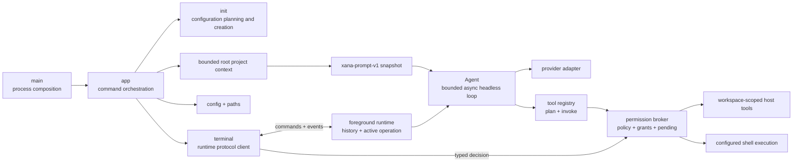

# Xana architecture

> Audience: Contributors and coding agents  
> Authority: Descriptive

This document describes what Xana is and how its implemented boundaries work.
Future system shapes belong in [proposals](../proposals/), while durable
constraints and philosophies belong in [Design Principles](../principles.md).

## System overview

Xana is one Rust binary crate running on Tokio's multi-thread runtime with a
terminal frontend and one in-process foreground runtime. `main.rs` is the
process composition root: it parses the optional `XANA_HOME` override and
delegates command execution to `app`. The application edge resolves paths,
loads configuration, initializes dependencies, and routes CLI commands.



`runtime` owns temporary conversation history and at most one active root
operation. `terminal` is a protocol client that owns readline input, permission
answers, and human rendering. `presentation` owns terminal-mark selection and
its TTY, monochrome, suppression, and fallback behavior. None of those
frontend concerns enters the headless agent loop.

Control values cross a bounded Tokio channel as serializable
`RuntimeCommand`s. A single foreground receiver observes serializable
`AgentEvent`s over an unbounded channel. Commands submit turns, clear idle
history, correlate permission decisions, and shut down the runtime.
Events carry operation state, assistant deltas, permission requests and audit facts, tool
completion, final messages, failures, clearing, and rejections. Except for the
explicit permission request, event delivery is passive: losing the receiver does
not alter an operation's result.

`OperationId`, `StepId`, and `ToolInvocationId` are distinct UUID v4 newtypes.
An operation moves through running or suspended state and always reports a
finished completed, failed, declined, or interrupted outcome. Conversation
and live deltas are transient; there is no replay or persistence contract.

## Agent and conversation boundary

`Agent` owns one asynchronous conversational transport, a deterministic tool
registry, the launch workspace, a frozen `PromptSnapshot`, and a configured
tool-round limit. Before each provider call it charges the complete current
history and prepends the snapshot's unchanged system message. It executes
requested tools serially, appends correlated results, and returns the final
assistant message. The foreground runtime commits the user and final assistant
messages to its history only after the turn succeeds.

The provider-neutral conversation model carries ordered text, tool-call, and
tool-result content. Provider request and response shapes remain private to
their adapter. The OpenAI-compatible adapter separates its wire structs,
conversion rules, asynchronous streaming HTTP client, and captured response
and stream fixtures.

The OpenAI-compatible adapter incrementally decodes bounded SSE bytes. It
supports arbitrary chunk boundaries, LF and CRLF frames, comments, multi-line
data, and `[DONE]`; incomplete and oversized frames fail the turn. Indexed
tool-call deltas accumulate id, name, and JSON argument fragments before they
become one provider-neutral assistant message. Live text deltas are rendered
immediately but only the completed message becomes conversation history.

The provider-neutral conversation model includes a system role. The
OpenAI-compatible adapter serializes that role and the changing conversation
at its private wire boundary; exact tool schemas remain a separate request
field.

`Agent` receives owned dependencies and limits. It does not load
configuration, inspect environment variables, resolve platform paths, or
render terminal output. It also does not read prompt or project files.

## Prompt and project-context boundary

The application edge builds one `xana-prompt-v1` snapshot from embedded,
non-replaceable identity and guideline files; a concise tool catalog derived
from the immutable registry; owned operating-system, canonical working
directory, configured-shell, and CLI-surface values; and an optional bounded
root `AGENTS.md` preview. A product-documentation layer exists only when the
runtime supplies readable logical references or a capability; normal Phase 2
composition omits it.

Layers have transient ids, purpose, origin, trust, provenance, estimated cost,
and deterministic order. Dynamic layer text and attributes are XML-escaped,
line endings are canonicalized to LF, only outer blank lines are trimmed, and
layers are separated by one empty line. These properties make unchanged input
byte-stable across supported platforms. The labels are prompt structure, not a
security boundary.

Root `AGENTS.md` is optional, must be a non-symlink regular UTF-8 file no larger
than 64 KiB, and has a 1,024-estimated-token preview limit. Discovery does not
walk parents or nested directories and ignores `XANA.md`, `.agents/`, skills,
and plugins. Project instructions can guide work but cannot mutate tools,
configuration, permission state, or Xana's non-replaceable core.

One estimated 32,768-token budget charges rendered system layers, exact tool
schemas, selected previews, and actual history while reserving 8,192 tokens
for conversation during assembly. The Phase 2 estimator uses one token per
three Unicode scalar values, rounded up; it is not a provider tokenizer.
Over-budget required input or history fails before provider I/O. Range and
literal-search previews remain bounded, Unicode-safe, and provenance-bearing.

Context source and preview identities are transient to one agent. Xana has no
artifact store, durable context reference, context service, native context
plan, or prompt compaction. The logical `xana.docs.read` capability and
`xana_docs` tool are also absent; the workspace file tool is never allowed to
escape its root to simulate product documentation.

## Tool boundary

Xana exposes four host tools through an object-safe `Tool` trait and a
provider-neutral registry:

- `read_file` reads bounded UTF-8 content with an optional inclusive line
  range.
- `list_files` returns a bounded, sorted, non-recursive directory listing.
- `edit_file` replaces exactly one match in an existing bounded UTF-8 file.
- `run_command` executes one command string through a configured shell in an
  existing workspace directory after runtime authorization. It returns status
  plus independently bounded stdout and stderr.

All tool paths are relative to Xana's launch workspace and must remain beneath
that workspace after lexical and canonical resolution. Reads and resulting
edits are capped at 64 KiB; directory listings are capped at 256 entries and
64 KiB of output.

The registry caches each validated definition beside its implementation and
reports effect class separately from replay safety. It is the one invocation
path: resolve a tool, build an immutable plan, authorize the plan, and execute
only an allowed plan. Plans contain normalized final JSON arguments, canonical
scope, and type-erased executable data created and consumed by the same
concrete tool. No registry executor bypasses planning and authorization.

File scopes are canonical target paths beneath the canonical launch workspace.
Command scopes contain the selected shell, exact command, and canonical cwd.
Invalid arguments and escaping paths fail before policy evaluation. Planning
may validate metadata but performs no write, process, network, or external
effect.

`run_command` is `Execute` plus `ReplaySafety::Never`; its exact program argv,
command, shell, and canonical cwd exist before authorization and spawn. Shell
selection resolves once at the application edge: macOS/Linux support POSIX
`sh -lc`, while Windows supports PowerShell, Git Bash, and `cmd` through
explicit configurations. A custom compatible program path may replace the
default executable.

One runtime-owned broker task owns policy, memory-only session grants, pending
requests, and controller presence for every built-in tool. Pure policy combines
all matching user rules with deny-before-ask-before-allow precedence, then uses
the configured default. An explicit or default deny cannot be overridden by a
grant. An ask suspends its operation and accepts deny, allow once, or an exact
current-session scope from the foreground terminal. Grants also bind tool and
effect and cover only the same or a narrower workspace scope or an exact
command scope. Unknown, stale, duplicate, mismatched, scope-widening, lost, and
unattended decisions fail closed.

Each outcome emits an in-memory `PermissionAuditFact` binding operation and
invocation ids, tool/effect, final arguments, scope, policy outcome, optional
controller decision, and effective decision. Audit facts do not enter the
conversation and are not durable. Neither policy, metadata, workspace path
checks, nor authorization provides process containment. Tools run
asynchronously with the Xana process's ordinary host access, and `edit_file`
does not claim atomic or crash-safe writes.

## CLI, configuration, and initialization

Bare `xana` starts terminal chat. The typed command boundary also exposes
`xana init`, `xana config path`, and `xana config check`.

Initialization collects interactive or explicit noninteractive answers,
builds a configuration draft without filesystem effects, renders the version
1 TOML shape, validates it through the production configuration loader, and
creates `config.toml` without replacing an existing file. Path and
configuration diagnostics do not construct an agent.

Xana loads a strict, versioned `config.toml`. It validates named
OpenAI-compatible provider connections and agent profiles, then resolves the
required default profile and shell configuration into owned values before
constructing `Agent`. Interactive initialization collects a platform shell
choice and defaults human setup to `ask`; noninteractive initialization
requires an explicit permission mode and accepts explicit shell kind and
program flags. Existing version 1 documents with explicit `allow` retain
automatic tool authority. The document also accepts default-empty permission
rules with tool, effect, workspace, and exact-command matchers. Existing
documents without `[shell]` use `platform`.

See [Configuration](../user/configuration.md) for the user-facing schema and
path rules.

## Paths and application identity

The canonical application identifier is:

```text
io.github.labcoder.xana
```

`ProjectDirs::from("io.github", "labcoder", "xana")` maps Xana-owned
configuration, data, cache, and runtime state to platform-standard locations.
The identifier is compatibility state: changing repository location or adding
a frontend does not justify orphaning existing user data.

An unset or empty `XANA_HOME` uses those platform defaults. A non-empty
override must be an absolute native path and maps Xana's backend state beneath
one portable root. Path resolution is pure policy; it does not create or
canonicalize the returned directories.

## Source organization

The crate establishes responsibility and I/O boundaries before it needs
physical package boundaries:

- `main.rs` composes the process.
- `app` owns command routing and dependency construction.
- `terminal` and `presentation` own frontend behavior.
- `runtime` and `identity` own foreground state, typed commands and events,
  correlated permission control, and semantic work identifiers.
- `permission` owns pure policy and scopes, pending controller decisions,
  session grants, and in-memory audit facts.
- `agent` and `message` contain the headless loop and internal conversation
  model.
- `prompt` and `context` own versioned assembly, transient source selection,
  provenance, previewing, and input-budget enforcement.
- `provider` and `tool` are narrow facades over private adapter and tool
  implementations.
- `config`, `paths`, and `init` own validated input and filesystem policy at
  the application edge.

Initialization separates pure planning from create-new filesystem writes.
Large private test suites live in child modules; package-level executable smoke
tests live under `tests/`.

See [Code organization](../development/code-organization.md) for the policy
that maintains these boundaries.

## Deliberate absences

Xana has no durable session store, sandbox,
background runtime, workspace crate split, runtime profile switching,
multi-client attachment, event replay, persistent grants, durable permission
audit store, remote controller authentication, artifact/context store, context service, nested
project-instruction or skill discovery, prompt compaction, or crash-safe edit
protocol. Session grants and permission audit facts live only in the foreground
process. These absences are implementation facts, not predictions about which
proposals will be accepted.
