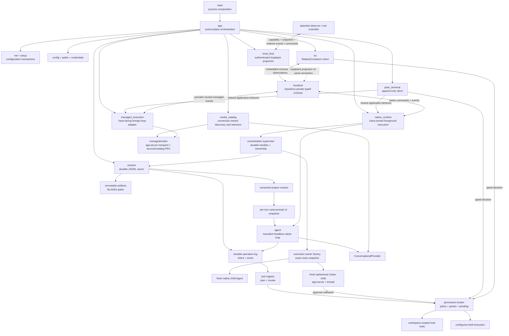
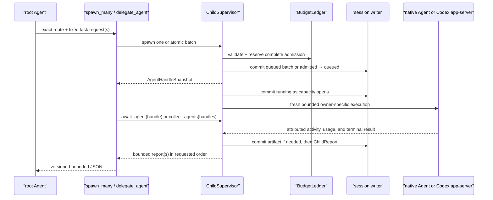
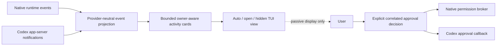

# Xana architecture

> Audience: Contributors and coding agents  
> Authority: Descriptive

This document describes what Xana is and how its implemented boundaries work.
Future system shapes belong in [proposals](../proposals/), while durable
constraints and philosophies belong in [Design Principles](../principles.md).

## System overview

Xana is a terminal-first agent application running on Tokio's multi-thread
runtime. Native connections use one in-process foreground runtime; the Codex
connection supervises a vendor-owned app-server process. One Cargo application
package named `xana` owns the installed `xana` executable, process composition,
headless agent, application policy, provider adapters, and current frontends.
The application edge resolves paths, loads configuration, initializes
dependencies, and routes CLI commands. Process startup gives that application
owner one named 4 MiB stack before it enters Tokio; this bounds the one extra
thread while preserving debug-build headroom for the large managed-runtime
future on platforms whose process-main stack is smaller. Tokio retains
ownership of asynchronous workers and cancellation beneath that edge.
The capability module owns validated capability/tool identifiers and an
immutable capability snapshot. Capability discovery remains pure metadata;
the headless agent is independently kept free of terminal, process-global,
and provider-wire concerns. See
[composition services](composition-services.md) for the capability,
self-documentation, and document-extraction boundaries.
[Connections, models, and managed runtimes](models-and-managed-runtimes.md)
describes native inference, Codex delegation, catalogs, selection, and
credential ownership.



`native_runtime` owns the sole open native session writer, reduced conversation history, and
at most one active root operation. `frontend` owns the repository-private
versioned client vocabulary and the reference embedded adapter.
`plain_terminal` is a client that owns readline input, permission answers, and
append-only human rendering. `managed_execution` adapts a vendor-owned loop
into the same Xana conversation/frontend vocabulary without owning Codex's
inner loop.
`presentation` owns semantic presentation tokens, adaptive terminal-mark
selection, and the pure resolution of injected terminal facts plus bounded
machine-local preferences. The application edge samples TTY state, color
depth, background hints, Unicode, width, and reduced-motion preferences once
per surface. Redirected, dumb, monochrome, and `NO_COLOR` profiles resolve to
plain text with no control sequences. Preference failure falls back safely and
cannot change runtime policy. None of those frontend concerns enters the
headless agent loop.

All of these boundaries currently live in the one `xana` application package.
Their Rust visibility is private or `pub(crate)` except for the executable
entry required by `main`. They are not a promised SDK. A public engine or
frontend crate should be extracted only after a second real frontend proves
the smallest reusable contract; desktop, web, or mobile intent alone is not an
extraction trigger.

The embedded client captures an initial snapshot before it begins forwarding
live events. The snapshot carries the native conversation, connection, model,
execution owner, child summaries, and artifact-backed image references under
explicit message-count and encoded-size limits. It then assigns monotonically
increasing sequence numbers to live observations and forwards them through a
256-entry bounded queue. An oversized observation becomes a bounded omission
fact. A full or closed observer queue ends that observation stream without
blocking or cancelling runtime work. Dropping the embedded owner closes the
runtime command lane and follows the foreground cancellation path.

`local_host` projects a bounded repository-private host vocabulary over a
loopback-only WebSocket. `xana serve` is explicit and foreground; it never
daemonizes or accepts a non-loopback bind. A canonical-workspace hash selects
one runtime descriptor. The protected descriptor carries a fresh per-launch
capability and endpoint, while normal logs and attach arguments carry neither.
The first bounded frame must match protocol version, host generation,
workspace identity, capability, and requested role before any snapshot
is sent. Browser handshakes additionally require a loopback Origin.

The host observation hub captures its bounded workspace snapshot and installs
a 256-entry observer queue while holding one lock. Each later event receives
one monotonically increasing host sequence under the same lock, so attachment
has no snapshot/live race. A full queue drops that observer rather than
blocking host execution; reconnect and sequence gaps take a new snapshot
instead of guessing replay. Observers receive correlated rejections and
bounded audit events without crossing the runtime command lane. One client may
explicitly acquire the hosted conversation's controller lease; acquisition,
release, and takeover update the same snapshot/event sequence. Controller
commands retain their independent command and operation ids and enter the same
embedded native owner or managed Codex driver used by local frontends.

A disconnected controller enters a three-second reconnect grace identified by
an in-memory per-lease capability. Reconnect authenticates the same authority
and begins from a fresh snapshot. Grace expiry or explicit release drains
pending approvals with deny/cancel and interrupts the exact active operation.
Observers never inherit control. The workspace host remains the sole root gate,
so changing clients cannot create a competing native or managed root.
Host snapshots expose bounded conversation
metadata and a workspace hash/display name, not the canonical path, provider
secrets, credential references, or capability. Frames are capped at 1 MiB.

Client isolation is structural: at most 32 client tasks exist, each has a
256-event queue, a 256-frame-per-second inbound budget, and a two-second write
deadline. Queue overflow or transport failure removes only that subscriber.
The authenticated artifact adapter indexes at most 512 immutable records found
in visible frontend messages. Lookup accepts `ArtifactId`, never a path, streams
full content through digest verification, and retains at most a 64 KiB preview.

Host shutdown cancels intake and controller authority, then gives the exact
owned execution two seconds to close normally. A shared five-second hard
deadline aborts only its retained Tokio task handle and client tasks. Dropping
the native owner enters runtime/child structured shutdown; dropping a managed
driver drops the `kill_on_drop` app-server child. Descriptor cleanup is tied to
the verified host-generation lease, so stale PID metadata is diagnostic only
and never process-kill authority.

Client commands use a provider-neutral, serializable value and an independent
correlation id. The embedded transport reports whether it accepted the
bounded command for delivery; semantic runtime outcomes remain ordered
observations. This contract is repository-private and makes no compatibility
promise to third-party clients or future network adapters.

`workspace_host` owns canonical local-workspace conversation discovery and the
single-root admission gate shared by embedded native and managed clients. A
bounded snapshot combines reducible native session records with retained
opaque managed handles and native modification metadata. Explicit native
history inspection reduces one selected session; managed inspection returns no
invented transcript. The TUI caps the projection to 512 deterministic rows,
derives bounded titles only from retained user text, and keeps viewed history,
the runtime transcript, and unsent draft as separate state. Switching view
focus cannot transfer control or dispatch work. A versioned workspace/frontend
file persists only the wide-rail Boolean; runtime selection, activity,
unread/error state, and ownership are recomputed. An OS file lock, acquired only for an active root
turn, is the cross-process authority; its bounded host-id/PID/conversation
descriptor is diagnostic and never authorizes process signalling. A second
plain client may hold an inactive session writer and draft input, but its turn
cannot cross the root gate. Dropping the active embedded client follows the
existing runtime cancellation path before its lease is released.

The append-only terminal and one-shot adapter are permanent clients of this
boundary. One-shot accepts exactly one bounded argument or stdin source,
denies unresolved approvals, and writes only the final payload to stdout.
Human activity and diagnostics use stderr. Its version-1 JSON result envelope
is redacted and maps invalid input, configuration, connection, approval,
runtime, and interruption outcomes to stable process categories. It is a
terminal result contract, not an event stream.

Behind the embedded adapter, control values cross a bounded Tokio channel as
serializable `RuntimeCommand`s. One internal foreground receiver drains
serializable `AgentEvent`s from the runtime's unbounded channel into the
bounded client queue. Commands submit turns, clear idle
history, identify explicit recovery work, correlate permission decisions, and
shut down the runtime. The dedicated CLI recovery controller consumes
`ResumeOperation`; merely opening a foreground chat never reconciles effects.
Events carry operation state, assistant deltas, permission requests and audit
facts, committed invocation facts, tool completion, final messages, failures,
clearing, rejections, and attributed child lifecycle/activity/reports. Except for the
explicit permission request, event delivery is passive: losing the receiver does
not alter an operation's result.

Each child has a 256-event bounded observation queue. Its permission-request
control lane remains separate so an activity flood cannot hide a decision that
must fail closed. The supervisor forwards at most 4,096 non-control child
events or 4 MiB of their serialized attribution and payload, then emits one
attributed truncation warning. Durable state records lifecycle and reports,
not transient deltas. The internal foreground root event stream remains a
single unbounded receiver; child contribution to it is bounded before
forwarding and frontend delivery is independently bounded.

Child list, detail, cancellation-request, and permission-decision commands
address the in-process supervisor. They do not imply a daemon or remote runtime
host. A cancellation-request event confirms only that the signal was accepted;
the committed terminal lifecycle/report is the stop acknowledgement.

## Child supervision boundary

When a native root has configured task routes, the application creates one
`ChildSupervisor` actor and registers `spawn_agent`, `spawn_many`,
`await_agent`, `collect_agents`, `cancel_agent`, and `delegate_agent` only in the root tool
registry. The
model-facing convenience calls the supervisor's distinct `spawn_agent` and
`await_agent` operations in one tool execution, so no outer model response is
needed between admission and collection. `AgentId` is the
durable handle key. A session's root `AgentId` is deterministically derived
from its public `SessionId`, keeping lineage stable across resume without a
write-on-open migration.

Admission prepares the exact route, execution owner, connection/model,
immutable capability/authority snapshot, and explicit task before a child
record exists. Native preparation also freezes its provider, prompt, and tool
registry; managed preparation freezes its Codex launch, model options, policy,
and bounded handoff. The root capability snapshot is a hard ceiling: a child
route may select a subset, never a capability absent from its parent. A
runtime-owned `BudgetLedger` reserves fan-out, total admitted descendants,
tool rounds, context capacity, report bytes, and artifact bytes in
one actor mutation. `spawn_many` validates and reserves every member before a
single durable batch record or observer event exists. Queued work is kept in a
FIFO admission queue and starts only while the root profile's concurrency
capacity is available. The child deadline begins at admission, so queue time is
bounded too. Failed pre-commit admission rolls back its reservation. Durable
descendant and aggregate reservations remain charged for the session so
sequential work cannot evade the total bounds; only running concurrency slots
are released at terminal state.

Single admission preserves explicit `admitted` and `queued` durable facts;
batch admission commits all queued handles in one atomic record. `running` is
always committed before its event. The supervisor, not the tool future, owns
the Tokio task and permission broker. Dropping or timing out an await therefore
leaves the child supervised unless cancel-on-timeout was explicit. Repeated
await/cancel operations are idempotent after terminal state. A terminal report
is committed before completed/failed/cancelled/interrupted events and contains
typed attribution. Usage is represented as measured, estimated, or unknown;
unknown is never treated as zero.

Each admission fixes a result schema (`summary` or canonical JSON). Completed
output at or below `max_report_bytes` stays inline. Larger output is written to
the immutable content-addressed artifact store, with `ArtifactRegistered`
committed before the child report that references it; the handle and collection
surface retain only a bounded preview and reference. When the durable store
recovers after a lifecycle-transition failure, the still-owned child records a
bounded attributed failed report. A continuing persistence failure remains a
typed live durability error and never creates an unregistered reference.
Collection verifies artifact length and digest by streaming bytes without
loading artifact bodies into model context.



Native cancellation is structured: the supervisor marks the request, closes
the child's permission broker, signals its cancellation token, drops the
in-flight provider/tool future at the execution boundary, and waits for one
terminal completion. The command does not equate signalling with success.
Managed Codex execution observes the same token inside its owner adapter,
sends one correlated `turn/interrupt`, and continues reading the terminal race
until one absolute three-second deadline established when cancellation is
observed before returning cancellation or completion. Cancellation can also win during process startup,
account validation, or thread creation, and no turn starts after cancellation
has been observed. If an incompatible app-server
rejects interruption, shutting down that child process is the bounded fallback
and the child fails with the typed remote error rather than being mislabeled
cancelled.
Queued cancellation commits `Cancelled` without starting its prepared execution.
Runtime shutdown applies the same path to every queued/running child and waits
for terminal commits while the runtime continues servicing commit acks. A
bounded grace expiry aborts only the unresponsive task and commits
`Interrupted`; abort is not the normal cancellation path.

On restoration, the reducer leaves committed records unchanged. Its inspection
projection maps any nonterminal child prefix to `Interrupted` with an explicit
projection marker, performs no provider/tool call, and appends no
reconciliation fact. Active `/agents`, `/agent`, and `/cancel-agent` commands
reach only the owning foreground process. `xana session inspect` in another
process is read-only and cannot claim to cancel foreground work. List and
detail control events project only bounded handle metadata and report
references; full report bodies remain on await and collection paths.

The child receives Xana's identity/guidelines, its exact task, applicable
bounded root `AGENTS.md`, environment facts, and only the tools selected by its
profile. A request may add a fixed set of parent-selected text previews and
immutable artifact-reference metadata. These sources keep explicit
`parent_handoff` provenance, remain untrusted prompt data, and pass through the
same context budget; artifact bodies and the parent transcript are never
copied. Its registry never contains orchestration tools, so child depth is
structurally one. Native children run in stable admission order up to the root
profile's bounded concurrency. Every native provider uses the same execution
contract while its adapter maps optional token fields; Xana aggregates a field
only when every request supplied it and separately measures request count.
`collect_agents` snapshots a fixed set of unique handles atomically, returns
entries in caller order regardless of completion timing, and preserves each
terminal status, attribution, typed usage, and report reference. Its explicit
continue-on-error or fail-fast policy never erases results already observed;
timeout and cancellation are separate choices. Collection serialization has a
hard bound independent of durable artifact size and makes no model call.
A managed Codex child uses the same supervisor, budget ledger, permission
owner, lifecycle, report, artifact overflow, and collection path. Its internal
owner seam starts one app-server and a fresh ephemeral thread per admission;
it never resumes the foreground managed handle or another child's thread.
Codex receives Xana's identity developer instruction, the explicit task, exact
route model/options, workspace policy, and only bounded parent-selected
handoff data. It owns inference, inner history, project discovery, tools, and
sandbox. App-server activity is re-attributed to the child for terminal
projection; approval callbacks cross the child permission broker. `deny` maps
to no managed Codex child route: the current app-server contract cannot prove
that all inner tool effects are disabled, so route resolution fails closed.
`ask` and `allow` remain workspace-write; no route maps to
danger-full-access. Token-usage notifications map to measured
fields when emitted; otherwise the fields and spend remain unknown. One
managed turn is counted as one request without claiming knowledge of private
upstream calls. No outer conversational-provider call summarizes or relays the
managed result.

Xana session grants remain owned by Xana: every authorized app-server callback
receives only a one-effect `accept`, even when the broker reused a matching
grant, and session-only vendor acceptance fails closed. Managed JSON framing is
cancellation-safe, and cancellation has priority over continuously ready input
so the interrupt boundary cannot lose a partial frame or be starved by activity.

`OrchestrationPlan` is the separate closed child-work domain; the existing
prompt-selection `ContextPlan` is unchanged. A pure structural validator
checks the versioned, byte-bounded spawn/await/collect/cancel graph and only
prior spawn-handle references. The supervisor then resolves every exact route
and performs a reserve/release dry check of the aggregate ledger before any
record is appended. Execution commits `OrchestrationPlanStarted`, atomically
admits the complete static spawn set through the canonical batch path, and
executes remaining steps through the same await, collect, and cancel methods.
The durable start fingerprint rejects repeated plan ids across restoration;
each child admission carries plan id, spawn step id, and output index. No plan
interpreter, evaluator state, loop, branch, recursion, or second scheduler
exists.

`OperationId`, `StepId`, `ToolInvocationId`, `ToolResultId`, and `NamedValueId`
are distinct UUID v4 newtypes.
An operation moves through running or suspended state and always reports a
finished completed, failed, declined, or interrupted outcome. Conversation,
operation states, permission audits, artifacts, and context metadata have
separate durable records. Live deltas and events remain transient and are not
treated as a replay log.

## Agent and conversation boundary

`Agent` owns one asynchronous `ConversationalProvider`, a deterministic tool
registry, the session workspace, a base `PromptSnapshot`, and a configured
tool-round limit. The runtime supplies a project-context-aware snapshot for
each accepted root turn; that snapshot is unchanged across the turn's provider
calls. Before each provider call the agent charges the complete current
history and prepends the snapshot's system message. It executes
requested tools serially, appends correlated results, and returns the final
assistant message. The foreground runtime commits immutable user, assistant,
and tool-result entries and moves the thread head separately.

The provider-neutral conversation model carries ordered text, image,
tool-call, and tool-result content. Provider request and response shapes remain
private to their adapter. The native generation boundary is the focused
`ConversationalProvider`; account control, catalog discovery, credential
storage, and managed agent runtimes remain outside it. Native and managed
composition are described in [Provider contracts](providers.md) and
[Connections, models, and managed runtimes](models-and-managed-runtimes.md).

The native HTTP adapters share one incremental, line-oriented SSE decoder. It
supports arbitrary chunk boundaries, LF and CRLF frames, comments, multi-line
data, and bounded frames. Each adapter additionally caps aggregate text,
tool-input, and content-block accumulation for the complete response; a peer
cannot bypass the turn bound with many individually valid frames. Indexed
OpenAI-compatible tool-call deltas accumulate id, name, and JSON argument
fragments before they become one provider-neutral assistant message. Live text
deltas are rendered immediately but only the completed message becomes
conversation history.

The provider-neutral conversation model includes a system role. The
OpenAI-compatible adapter serializes that role and the changing conversation
at its private wire boundary; exact tool schemas remain a separate request
field.

`Agent` receives owned dependencies and limits. It does not load
configuration, inspect environment variables, resolve platform paths, or
render terminal output. It also does not read prompt or project files.

## Prompt and project-context boundary

The application edge owns a `PromptAssembler` built from embedded,
non-replaceable identity and guideline files; a concise tool catalog derived
from the immutable registry; owned operating-system, canonical session
workspace, configured-shell, and CLI-surface values; and fixed budgets. When a
root turn is accepted, the runtime refreshes durable project context and
assembles one `xana-prompt-v1` snapshot. Native composition supplies a concise
product-documentation layer that names the readable logical ids exposed by the
bounded `xana_docs` tool; documentation bodies are fetched only when needed.

Layers have transient ids, purpose, origin, trust, provenance, estimated cost,
and deterministic order. Dynamic layer text and attributes are XML-escaped,
line endings are canonicalized to LF, only outer blank lines are trimmed, and
layers are separated by one empty line. These properties make unchanged input
byte-stable across supported platforms. The labels are prompt structure, not a
security boundary.

Root `AGENTS.md` is optional, must be a non-symlink regular UTF-8 file no larger
than 64 KiB, and has independent 16 KiB and 1,024-estimated-token view limits. Discovery does not
walk parents or nested directories and ignores `XANA.md`, `.agents/`, skills,
and plugins. Project instructions can guide work but cannot mutate tools,
configuration, permission state, or Xana's non-replaceable core.

One estimated 32,768-token budget charges rendered system layers, exact tool
schemas, selected previews, and actual history while reserving 8,192 tokens
for conversation during assembly. The Phase 2 text estimator uses one token
per three Unicode scalar values, rounded up; image blocks reserve a
provider-neutral, pixel-based conservative estimate instead of a textual
placeholder. Neither estimate is a provider tokenizer. Over-budget required
input or history fails before provider I/O. Range and literal-search previews
remain bounded, Unicode-safe, and provenance-bearing.

Prompt-layer ids are transient to one snapshot. Durable `ContextRecord`s carry
id, monotonic version, artifact reference, kind, BLAKE3 hash, logical size,
provenance, trust, and owner. `ContextViewRecord`s bind source id/version,
selector, selected-content hash, and byte/token budgets. Full, inclusive line,
and capped literal-line-search selectors materialize from verified immutable
artifact bytes. Only the resulting bounded text can enter a prompt.

Root context refresh occurs only when a new turn is accepted. Unchanged bytes
reuse the version; changed bytes append one artifact/context version; a missing
live source does not erase the prior version. Opening or inspecting a session
does not read live project files. Xana has no general native context plan or
prompt compaction. The bounded catalog and `xana_docs` tool are included in the
resolved production tool snapshot.

Image attachments are reference-based and artifact-backed; see
[Image input and media resolution](vision.md). OpenAI-compatible and Anthropic
adapters resolve bytes only at the wire edge; Codex receives checked local
paths under the managed workspace.

## Session and artifact boundary

Native bare, plain, and default one-shot chat create
`data/sessions/<SessionId>.jsonl` and one thread before any conversation entry.
`xana --continue` chooses the latest reducible session from a bounded directory
scan only when its canonical workspace matches. `xana --resume SESSION_ID`
performs bounded read-only
inspection and pure ordered reduction, explicitly opens the verified file for
append, verifies the launch workspace matches, and restores the selected
conversation path. The optional `xana
session inspect SESSION_ID` reports bounded metadata without conversation
content and never opens for writing.

Managed Codex threads remain Codex-owned and are not mirrored into Xana's
native session log. Xana stores a bounded version-2 catalog of opaque thread
ids per connection and canonical workspace, including the current selection,
then delegates `thread/resume` to Codex on the next
process's first interactive turn. The bounded, atomically written handle is
neither history nor a credential. `--resume` therefore applies only to native
conversations; managed one-shot starts fresh unless `--continue` selects the
workspace handle. `/clear` deselects the current handle and starts a new
thread while retaining the prior catalog entry. `session archive` and
the TUI's `/sessions archive` atomically remove one inactive local handle; they
do not call a vendor deletion API or claim to delete managed history.

Every compact newline-terminated envelope has format version 1, record id,
session id, and one typed record. The initial record owns the thread and
canonical workspace. Other kinds append immutable conversation entries,
separate head moves, accepted operations, steps, invocation intents/results,
operation states and outcomes, permission and recovery decisions, named
durable values, artifact metadata, context versions, context views, and
named-context moves. The reducer rejects wrong or duplicate identities,
unknown references, non-monotonic versions, invalid heads/parents, second
creation, invalid transitions, mismatched preallocated result ids, second
results, and terminal operations with pending invocations. Only the
head-to-root conversation path becomes model history.

Inspection is bounded to 256 KiB per record, 10,000 records, and 16 MiB per
session. A malformed physical tail after a valid newline-terminated prefix
returns a truncate plan; a complete object without its final newline is also
uncommitted tail data. Interior malformed records are corruption. Opening for
resume acquires the writer lock before rechecking the inspected length and
BLAKE3 hash or truncating a tail, so repair cannot discard a concurrent
append. The same byte and record limits apply to active appends, not only
later inspection. Each record is semantically validated before it is written,
then incrementally applied to the in-memory projection after the append
succeeds; invalid state never enters the journal and appends do not replay the
full history. An append writes one object plus newline and flushes before a
corresponding committed runtime event is emitted. This promises process-crash
record boundaries, not power-loss durability or `fsync`. An append I/O failure
poisons that writer so later bytes cannot turn a partial tail into interior
corruption.

Artifact bytes live at `data/artifacts/<blake3-hex>` and are capped at 4 MiB.
Publishing writes and flushes a create-new temporary file, then uses a
non-overwriting hard link as the final publication step; the temporary name is
removed afterward. A racing or existing final path is reused only after length
and digest verification. Reads enforce the caller bound and verify the record's
length and digest. Logical `ArtifactId`, media type, and owner remain distinct
from byte equality.

The foreground runtime owns the only open `SessionStore`. A companion lock file
uses the standard library's nonblocking exclusive file lock, so a second
process cannot open the same session for writing or recovery concurrently.
There is no session deletion, garbage collection, or portable-workspace
rewrite. Interactive launch and `--continue` use a bounded, canonical-workspace
latest-session query. Restore reports unfinished operation
states but performs no provider, tool, context-refresh, or replay effect.

## Durable operation and recovery boundary

Each accepted root turn binds its committed input entry. Every assistant
tool-call batch starts one step and executes serially. For each invocation,
Xana plans normalized arguments and canonical scope, authorizes the exact
plan, commits its audit fact, preallocates a result id, and appends and flushes
intent before executing. The result and any bounded named output commit after
the effect and before the correlated conversation result. An append failure
before intent performs no effect; an intent without result means the external
outcome is unknown.

Built-in tool contract version starts at 1. `read_file`, `list_files`,
`read_document`, and `xana_docs` declare `ReplaySafety::Safe`; `edit_file` and
`run_command` declare `Never`.
Recovery never infers safety from a tool name or effect class: an exact
invocation is eligible only when saved and current declarations are both
`Safe`, the installed name/version still matches, replanning produces the same
arguments and scope, and current authorization permits it.

`xana operation plan --session SESSION_ID OPERATION_ID` reduces and classifies
records without effects or argument disclosure. `xana operation resume
--session SESSION_ID OPERATION_ID` is the only implemented reconciliation
controller. It preserves completed results, handles the first missing result
in original call order, and reauthorizes a safe replay. Unsafe, missing,
changed, or denied work gets a correlated declined/interrupted result with the
preallocated id and is not executed. Recovery then terminates the interrupted
operation; it does not call the provider to invent a continuation.

Committed-fact events follow successful appends. Live text deltas remain
transient. Large output uses an immutable artifact; bounded inline JSON,
artifact references, and context id/version pairs are the only authoritative
named values. No heap, process, channel, socket, or open file is recovery
state. These guarantees cover process crashes at flushed record boundaries,
not power loss, filesystem transactions, effect idempotency, containment, or
`fsync`. Unknown `Never` outcomes may require manual reconciliation.

## Tool boundary

Xana exposes six tools through a capability-resolved, provider-neutral
registry:

- `read_file` reads bounded UTF-8 content with an optional inclusive line
  range.
- `list_files` returns a bounded, sorted, non-recursive directory listing.
- `edit_file` replaces exactly one match in an existing bounded UTF-8 file.
- `run_command` executes one command string through a configured shell in an
  existing workspace directory after runtime authorization. It returns status
  plus independently bounded stdout and stderr.
- `read_document` performs one bounded workspace read and extracts bounded
  UTF-8 text or CSV-as-Markdown without executing or fetching content.
- `xana_docs` lists and reads Xana's curated, version-matched documentation by
  logical id.

All tool paths are relative to Xana's launch workspace and must remain beneath
that workspace after lexical and canonical resolution. Execution revalidates
the planned canonical path and filesystem identity; file tools also verify the
opened handle before reading or writing. This rejects ordinary replacement or
symlink-retargeting races between permission planning and execution. Reads and
resulting edits are capped at 64 KiB; directory listings are capped at 256
entries and 64 KiB of output.

The registry caches each validated, versioned definition beside its
implementation and reports effect class separately from replay safety. It is
the one invocation path: resolve a tool, build an immutable plan, authorize
the plan, durably bracket its effect when a session is active, and execute only
an allowed plan. Plans contain normalized final JSON arguments, canonical
scope, and type-erased executable data created and consumed by the same
concrete tool. No registry executor bypasses planning and authorization.

File scopes are canonical target paths beneath the canonical launch workspace.
Command scopes contain the selected shell, exact command, and canonical cwd.
Invalid arguments and escaping paths fail before policy evaluation. Planning
may validate metadata but performs no write, process, network, or external
effect.

`run_command` is `Execute` plus `ReplaySafety::Never`; its exact program argv,
command, shell, and canonical cwd exist before authorization and spawn. Stdout
and stderr are drained concurrently after their independent 32 KiB retention
limits, so child output cannot force unbounded capture memory or deadlock on a
full pipe. Shell selection resolves once at the application edge: macOS/Linux support POSIX
`sh -lc`, while Windows supports PowerShell, Git Bash, and `cmd` through
explicit configurations. A custom compatible program path may replace the
default executable.

One runtime-owned broker task owns policy, memory-only session grants, pending
requests, and controller presence for every built-in tool. Pure policy combines
all matching user rules with deny-before-ask-before-allow precedence, then uses
the configured default. An explicit or default deny cannot be overridden by a
grant. An ask suspends its operation and accepts deny, allow once, or an exact
current-session scope from the foreground terminal. Grants also bind tool and
effect and cover only the same or a narrower workspace scope or an exact
command scope. Exact duplicate grants reuse one entry and the in-memory set is
capped at 256. Unknown, stale, duplicate, mismatched, scope-widening, lost, and
unattended decisions fail closed.

Each outcome emits a `PermissionAuditFact` binding operation and
invocation ids, tool/effect, final arguments, scope, policy outcome, optional
controller decision, and effective decision. The runtime commits the fact as a
non-conversation session record before forwarding its audit event. Neither policy, metadata, workspace path
checks, nor authorization provides process containment. Tools run
asynchronously with the Xana process's ordinary host access, and `edit_file`
does not claim atomic or crash-safe writes.

## CLI, configuration, and initialization

Bare `xana` chooses the Ratatui/Crossterm full-screen frontend only when stdin
and stdout are interactive. `--plain` selects the permanent append-only client;
non-TTY launch chooses it automatically, and `--tui` makes terminal
initialization mandatory. The TUI owns an explicit state/update/view architecture,
consumes the same bounded embedded snapshot/events as plain native chat, and
emits only typed runtime commands. It paints a local starting frame before
configuration/provider composition. The startup header is expanded identity
and status state, collapses on draft input, and reopens through the same update
model. It adapts side panes into drawer labels at medium/narrow widths, hides a
wide sessions panel at zero width, and bounds composer, message, activity,
staged images, and an ordered follow-up queue. Frontend protocol version 2 adds exact
interrupt and capability-gated steer commands. The native TUI maps keyboard,
mouse, bracketed-paste, and runtime events through one terminal-independent
update model; slash input and the searchable palette share one typed command
registry. Native runtime and managed Codex are two private adapters to one TUI
runner, which owns input ordering, follow-up dispatch, shutdown, and a dirty
frame clock capped at roughly 60 draws per second. Input and execution events
mark view state dirty; a biased frame tick renders the newest state and skips
missed ticks, so streaming text and pointer motion cannot force one synchronous
full redraw per event. Registry rows separate command names, modes/parameters,
descriptions, and optional exact palette arguments. A Ratatui stateful table
keeps its heading fixed and selected row visible; normalized search accepts an
optional leading slash and indexes modes as well as names. One shared layout
calculation owns both rendering rectangles and mouse hit-testing. The sessions
title owns a distinct hide action instead of falling through to its first row.
The composer grows through six visual rows, then uses a cursor-following
bounded viewport. Conversation rendering selects a bounded suffix, measures
visual rows, anchors at the bottom, and interprets scroll state as rows rather
than messages. A bounded terminal-input adapter preserves ordinary keys but
uses a short, adaptive quiet window to coalesce key-stream paste, including
fallback newlines, before command interpretation. Once a paste is detected, a
wider quiet window absorbs terminal delivery jitter. Replaceable pointer-drag
motion is sampled at its latest queued coordinate instead of replaying stale
cursor positions through separate renders. Bracketed and detected fallback
paste therefore enter one normalized confirmation as untrusted draft data
rather than repeated submits. Model
selection persists through `ModelManager` and restarts into a new conversation
rather than translating history. Activity visibility is presentation state,
not reasoning configuration. The bounded activity projection groups typed
cards by root, native child, managed Codex item, and approval identity. It
labels exposed reasoning separately, never requests an extra summary, and
forces approvals and critical failures into a modal even when activity is
hidden. Native and managed decisions return through their original correlated
control path rather than through display text.
Ratatui supplies terminal-native layout/widgets and its deterministic test
backend; Crossterm owns input and terminal modes. Xana keeps the composer,
session projection, and command policy as small domain modules instead of
adding a second opinionated widget framework. Current textarea crates would
still require Xana-owned byte bounds, sanitization, paste confirmation, Enter
policy, and pointer semantics, so they do not yet pass the deletion test. The direct `unicode-width`
dependency is the shared visual-column metric for composer rendering, cursor
placement, scrolling, and pointer hit-testing.
Conversation-only normal-drag selection is Xana-owned because terminal mouse
reporting is process-global rather than panel-aware. It retains only the
explicitly selected cells from the bounded visible Ratatui projection. Ctrl+C
copies the retained text and otherwise remains the exact interrupt key;
mouse-down panel targets remain independent and an ordinary click away clears
the selection. Copying uses a lazy, long-lived text-only `arboard` adapter. The
adapter disables image features, initializes only after an explicit copy, and
keeps Linux clipboard ownership alive for the TUI session. Clipboard failure is
reported as presentation status and does not affect runtime authority. The
typed `/sessions new` action is idle-only: it shuts down the current frontend
owner and re-enters the application composition boundary with `NewNative` or
`NewManaged`, preserving the prior session and current resolved configuration
without translating history. The workspace root gate prevents the action while
a root turn is active.
One idempotent terminal lifecycle owner restores raw mode, alternate screen,
cursor, mouse capture, and bracketed paste after normal exit, input EOF,
transport error, cancellation, panic unwind, or partial initialization.
Implicit initialization failure restores then falls back to plain; explicit
failure exits nonzero. Managed Codex runs behind a bounded actor that owns the
app-server and thread store while the TUI consumes provider-neutral events.
The actor keeps event delivery bounded, routes approval replies exactly once,
supports exact cancellation and in-thread advertised model/reasoning changes,
and shuts app-server down with the embedded frontend.

Rich conversation presentation is derivative frontend state. A bounded
Rust-native parser sanitizes terminal controls and bidi controls, retains only
supported Markdown/link metadata, and produces semantic lines for the current
viewport. The renderer visits a height-derived window (never more than 128
messages), not the complete projected transcript. Historical native sessions
use a two-pass journal index: the first bounded scan retains entry ancestry and
byte offsets, and the second reads only the requested page of at most 128
messages. The TUI retains at most 512 projected messages and preserves the
scroll anchor when prepending a page. Durable records remain authoritative.

Artifacts stay immutable content-addressed records. A visible reference may
open an explicit action card for bounded preview, draft-reference insertion,
OS reveal, or OS open. Rendering has no side effect. Before an OS action the
artifact store re-verifies declared size, content location, and digest; raw
artifact paths and bytes never enter frontend snapshots.



Native
chat creates a session; `--continue` selects the latest compatible execution
owner/workspace conversation and `--resume SESSION_ID` resumes only an exact
native session. `-p`/`--print` runs one noninteractive turn with text or
versioned JSON output. The typed
command boundary exposes initialization/configuration, session inspection,
explicit operation recovery, unified `xana model`, and advanced `xana
connection` commands for static keys and Codex account control. Read-only
`xana route list` and `xana route check NAME` resolve exact child profile,
connection, configured/cached model, capabilities, permission ceiling, and
limits without provider network access or managed-process startup. This
diagnostic remains read-only. During native chat, a separately composed root
`delegate_agent` tool can admit one exact native child through the runtime
supervisor; route diagnostics themselves never start work.

Managed chat also exposes `/reasoning`, `/reasoning-summary`, `/activity`, and
`/details`. Model, effort, and summary selections persist separately from
human-authored configuration and apply to subsequent turns without replacing
the Codex thread. Activity level is process-local presentation of typed
runtime events and never changes model effort.

Provider-neutral guided setup is the canonical first-run and rerunnable entry.
Bare interactive `setup` first chooses Quick, Full, or a focused setup path;
Quick is the setup-path default and `--quick` selects it directly. This default
does not recommend or preselect a provider. The Quick connection flow stages a
typed native or managed connection without filesystem effects,
establishes the endpoint/executable and credential/account, and performs a
non-persistent live catalog fetch before accepting model and managed reasoning
choices. The validated version 3 document and any hidden OS-store secret stay
in memory through the bounded redacted review. After confirmation, the prior
file is backed up exactly and config is atomically replaced; secret mutation
and the separate foreground model selection are reconciled within the same
rollback boundary, so a stale selection cannot outlive a replaced default
connection. Those mutations are rolled back if the config commit fails. Codex
OAuth is vendor-owned and is
reported outside that transaction. Bare interactive startup and `/setup`
enter the same application operation after restoring any full-screen terminal;
non-TTY startup emits the exact flag-driven form. The legacy hidden `init`
command remains create-new compatibility only. Path and configuration
diagnostics do not construct an agent.

Full Custom Setup extends that staged transaction across shell, permission
rules, logical capabilities, exact profiles/routes, orchestration limits, and
machine-local presentation. Focused connection, permissions/shell, and
profiles/routes operations use `toml_edit` to preserve unrelated fields and
comments, then validate the complete document before one atomic replacement.
Appearance is a separately versioned frontend file and applies immediately;
when included in Full Custom, its write participates in config/credential
rollback. Receipts classify managed model/reasoning as subsequent-turn state
and resolved owner/policy/profile changes as new-conversation state. No setup
operation mutates an already running agent or managed thread implicitly.
The completion receipt derives config, backup, data, and cache locations from
`XanaPaths`, identifies API keys as OS-store state, and prints only commands
Xana actually implements.

The installer-facing `setup --if-needed` operation is a thin readiness owner
over that same setup transaction. It classifies the bounded local config as
healthy, missing, invalid, incompatible, or indeterminate through Xana's
existing schema and path policy. Healthy state returns without credential,
provider, or filesystem effects; recognized repair state enters canonical
setup only when both input and output are terminals. Otherwise Xana emits a
versioned pending receipt and distinct process status. Shell installers consume
that outcome but never parse, migrate, or repair configuration themselves.

The diagnostic boundary emits a versioned redacted set of stable findings
across the production config/credential/model/Codex/path/presentation/terminal/
host probes. Native catalog checks are live but non-persisting. Default doctor
does not construct an agent or mutate Xana state. `doctor --fix` admits only
typed deterministic repairs: owner-only Unix modes and exact stale descriptor
removal after proving the owner lock is free. Its preview and confirmation are
separate from observation.

Manual config editing stages an owner-protected bounded sibling file, invokes
an exact editor executable without a shell, validates the complete schema,
detects a concurrent live-file change, writes an exact backup, and atomically
replaces config. Invalid or failed drafts never replace live state. Scoped
`reset`/`clean` derives exact setup, session, cache, and referenced credential
targets from typed paths. It unlinks symlinks, refuses active workspace locks,
confirms filesystem and OS-credential effects separately, and removes config
last. Every scope preserves Codex-owned authentication/conversations and
unverified runtime state. The hidden `init` implementation is deprecated
compatibility during the 0.5.x preview; provider-neutral setup is canonical.

Xana loads a strict version 1, 2, or 3 `config.toml`, capped at 1 MiB. It validates
named native and managed connections, tagged credential references,
connection-owned model overrides, complete agent profiles, exact task routes,
Codex-only fields, shell policy, permission rules, and bounded orchestration
limits.
Model selection (64 KiB maximum) and bounded non-secret catalogs (8 MiB each)
are stored separately so the control plane does not rewrite a user's normal
selection into TOML. Structured
connection add/remove edits preserve comments, migrate legacy profile
`provider` keys to canonical `connection`, write version 3, and validate the
complete result. Existing version 1 and 2 documents remain readable.

See [Configuration](../user/configuration.md) for the user-facing schema and
path rules.

## Paths and application identity

The canonical application identifier is:

```text
io.github.labcoder.xana
```

`ProjectDirs::from("io.github", "labcoder", "xana")` maps Xana-owned
configuration, data, cache, and runtime state to platform-standard locations.
The identifier is compatibility state: changing repository location or adding
a frontend does not justify orphaning existing user data.

An unset or empty `XANA_HOME` uses those platform defaults. A non-empty
override must be an absolute native path and maps Xana's backend state beneath
one portable root. Path resolution is pure policy; it does not create or
canonicalize the returned directories.

Static stored API keys remain in the operating-system credential service and
are not redirected by `XANA_HOME`. Codex credentials remain in Codex's owned
home unless the connection explicitly sets an absolute `codex_home`.

## Distribution boundary

Xana is a Cargo-installable source application pinned to Rust 1.97.1. The
checked-in lockfile is part of its package contract, and supported checkout or
Git installs use `cargo install ... --locked`. CI runs formatting,
warning-denied all-feature Clippy, all-feature and no-default-feature tests, a
reviewed package-path audit, and `cargo package --package xana --locked` on
Linux, macOS, and Windows. The application package remains `publish = false`
to prevent accidental registry publication, while its source archive is still
audited as part of the distribution contract. The package includes its license,
README, and User Documentation. Release builds retain Cargo's
default profile; the measured Windows smoke binary was about 8.1 MiB, and no
cross-platform evidence yet justifies custom LTO, stripping, panic, or codegen
settings.

The repository contains a pinned local `cargo-dist` 0.32.0 plan for exactly the
`xana` application on Windows x64 MSVC, macOS ARM64, macOS Intel, and Linux
x64 glibc. It produces conventional native archives containing `xana`, the
license, README, and installation documentation plus SHA-256 metadata. A
semantic plan check fixes that inventory and GitHub attestation intent; a
native archive audit verifies checksum, bounded contents, and version/help
execution. The planner uses Cargo's existing release profile and performs no
publish or install effect.

The source-controlled Bash installer is the Unix Release Preview activation
boundary. It accepts only the three planned macOS/Linux targets and one exact
four-target release manifest, verifies bounded SHA-256-addressed archives
before inspecting or extracting them, smokes the staged `xana`, and replaces a
per-user executable failure-safely. PATH mutation is a separate explicit
profile edit, and configuration readiness is delegated only to `setup
--if-needed`. Its local fixture authority requires three conspicuous test-only
arguments together and cannot redirect an ordinary production invocation.

The source-controlled PowerShell installer implements the equivalent boundary
for native Windows x64 MSVC. It uses bounded .NET HTTPS reads, validates the
same manifest grammar, inspects ZIP paths, entry types, expanded sizes, and
duplicates before extracting only `xana.exe`, and uses same-volume
failure-safe replacement. User PATH updates preserve the raw unrelated value
and are idempotent; failure restores the prior executable. Reparse points,
emulated or unsupported architectures, locked destinations, and unsigned or
incorrect staged executables fail closed.

Ordinary CI is the source-quality authority for pushes to `main` and pull
requests. Its three-platform matrix uses a commit-pinned, dependency-only Rust
cache; pull requests can restore but only trusted `main` pushes can save cache
entries. Tag pushes do not start a duplicate ordinary CI run.

The dedicated Release Preview workflow first requires a successful ordinary
CI push run for the exact commit being released, then binds the exact tag/input
to Cargo and the pinned dist plan. It rebuilds all four native archives from
that source rather than consuming CI binaries or mutable prebuilt artifacts. A
read-only assembly job refuses anything other than the exact fifteen-asset
bundle. A separate least-privilege job attests that bundle; only an exact
tag-push job receives `contents: write`. That job creates or reconciles an
explicitly `INCOMPLETE` draft, verifies the tag commit and remote inventory,
and only then labels the still-unpublished draft `REVIEW READY`. Manual
dispatch can build and attest but has no draft job. Every action and release
tool is commit/version pinned and ordinary CI statically audits the authority
boundary.

The repository has a `v0.5.0` candidate tag, but its workflow did not complete
the draft handoff and it is not a published release. There is still no
crates.io publication, public prebuilt archive, published installer asset,
package-manager channel, automatic updater, or completed release draft. The
corrected candidate advances as 0.5.1 rather than moving the existing tag.
Publication and tagging remain separate owner-controlled effects, and the
manifests set `publish = false` to prevent an accidental registry upload. The
separately
[accepted Release Preview contract](../proposals/0018-release-preview-distribution.md)
prescribes a bounded native preview without making any of those future
artifacts part of the current descriptive architecture before they exist.

## Source organization

The application modules establish responsibility and I/O boundaries:

- `main.rs` is the thin process entry for the package's single `xana` binary;
  the library entry owns argument parsing, bounded application-thread startup,
  and handoff to `app`. Library visibility exists for that executable and
  integration tests, not as a stable public SDK.
- `app` owns command routing and dependency construction. Its private
  `chat`, `connections`, `hosting`, `one_shot`, `operations`, `recovery`, and
  `sessions` children keep chat composition, provider/catalog commands,
  loopback hosting, automation output, recovery, and durable inspection behind
  small app-facing interfaces.
- `plain_terminal`, `managed_execution`, `tui`, and `presentation` own surface
  behavior and managed-loop adaptation. Managed activity filtering/retention is isolated in
  `managed_execution/activity` so display policy does not enter the process or
  conversation loop. `tui` confines Ratatui/Crossterm types to its lifecycle,
  shared runner, terminal-independent `tui/state` update policy, and pure adaptive
  view modules. Conversation virtualization/selection and overlays are focused
  view children. Composer editing, input normalization, command reduction,
  native/managed effect interpretation, and execution-owner adapters are
  private focused children of that state/update interface.
- `frontend` owns the typed embedded application contract; `local_host` owns
  only its authenticated loopback projection, protected discovery descriptor,
  atomic host snapshot/sequence boundary, observer fan-out, and one explicit
  controller/reconnect lease, bounded visible-artifact catalog, and exact
  foreground shutdown registry. Native and managed hosted execution adapters
  translate that authority back into their existing owners.
- `native_runtime` and `identity` own foreground state, typed commands and events,
  correlated permission control, and semantic work identifiers.
- `orchestration` owns exact route resolution, immutable child configuration,
  queued owner-neutral supervision, cancellation/inspection, durable
  handle/report types, native child composition, and the crate-private managed
  Codex child adapter. Its supervisor facade delegates admission, lifecycle,
  bounded activity projection, command-side handles, and allocation-free JSON
  size accounting to focused child modules. The native runtime remains the only
  session writer.
- `operation` owns invocation intent/result ordering, bounded durable values,
  replay classification, and explicit recovery execution.
- `permission` owns pure policy and scopes, pending controller decisions,
  session grants, and audit-fact values.
- `session` owns the versioned envelope, bounded JSONL store, pure reduction,
  incremental projection, durable context refresh, one writer, and
  resume/inspection summaries.
- `artifact` owns BLAKE3 content identity, immutable publication, bounded
  verified reads, and logical artifact metadata.
- `agent` and `message` contain the headless loop and internal conversation
  model.
- `prompt` and `context` own per-turn versioned assembly, transient prompt
  selection, durable context records, provenance, previewing, and input-budget
  enforcement.
- `provider`, `model_catalog`, `credential`, and `managed` separate native generation,
  catalogs/selection, static secret ownership, and foreign runtime control.
  `managed/codex/events` is the bounded wire-to-domain event normalizer;
  `managed/thread_store` owns only opaque managed thread handles.
- `process_capture` and `bounded_file` are shared constant-memory ingress
  primitives for child output and small structured state files.
- `tool` is a narrow facade over capability-composed private implementations.
- `config`, `paths`, and `init` own validated input and filesystem policy at
  the application edge. Advanced setup isolates machine-local appearance
  editing from structured runtime configuration, while `doctor` isolates live
  connection probes from redacted report and repair policy.

Initialization separates pure planning from create-new filesystem writes.
Large private test suites live in child modules; package-level executable smoke
tests live under `tests/`.

See [Code organization](../development/code-organization.md) for the policy
that maintains these boundaries.

## Deliberate absences

Xana has no Xana-owned sandbox, background runtime, durable event replay,
persistent grants,
remote controller authentication, general context service, nested
project-instruction or skill discovery, prompt compaction, artifact/session
garbage collection, automatic/background operation replay, generalized
idempotency, provider continuation after reconciliation, power-loss
durability, or crash-safe edit protocol. Session
grants live only in the foreground process. These absences are implementation
facts, not predictions about which proposals will be accepted.
