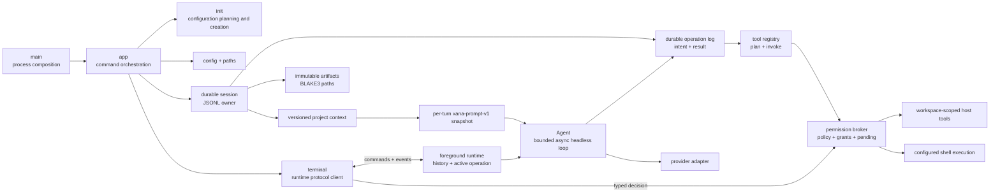

# Xana architecture

> Audience: Contributors and coding agents  
> Authority: Descriptive

This document describes what Xana is and how its implemented boundaries work.
Future system shapes belong in [proposals](../proposals/), while durable
constraints and philosophies belong in [Design Principles](../principles.md).

## System overview

Xana is a Cargo workspace running on Tokio's multi-thread runtime with a
terminal frontend and one in-process foreground runtime. `xana-cli` is the
process composition root and delegates command execution to `xana-runtime`.
The application edge resolves paths, loads configuration, initializes
dependencies, and routes CLI commands. `xana-core` remains headless and has no
filesystem, terminal, HTTP, or process dependencies. See
[Phase 3 composition services](phase3-composition.md) for the capability,
self-documentation, and document-extraction boundaries.



`runtime` owns the sole open session writer, reduced conversation history, and
at most one active root operation. `terminal` is a protocol client that owns readline input, permission
answers, and human rendering. `presentation` owns terminal-mark selection and
its TTY, monochrome, suppression, and fallback behavior. None of those
frontend concerns enters the headless agent loop.

Control values cross a bounded Tokio channel as serializable
`RuntimeCommand`s. A single foreground receiver observes serializable
`AgentEvent`s over an unbounded channel. Commands submit turns, clear idle
history, identify explicit recovery work, correlate permission decisions, and
shut down the runtime. The dedicated CLI recovery controller consumes
`ResumeOperation`; merely opening a foreground chat never reconciles effects.
Events carry operation state, assistant deltas, permission requests and audit
facts, committed invocation facts, tool completion, final messages, failures,
clearing, and rejections. Except for the
explicit permission request, event delivery is passive: losing the receiver does
not alter an operation's result.

`OperationId`, `StepId`, `ToolInvocationId`, `ToolResultId`, and `NamedValueId`
are distinct UUID v4 newtypes.
An operation moves through running or suspended state and always reports a
finished completed, failed, declined, or interrupted outcome. Conversation,
operation states, permission audits, artifacts, and context metadata have
separate durable records. Live deltas and events remain transient and are not
treated as a replay log.

## Agent and conversation boundary

`Agent` owns one asynchronous conversational transport, a deterministic tool
registry, the session workspace, a base `PromptSnapshot`, and a configured
tool-round limit. The runtime supplies a project-context-aware snapshot for
each accepted root turn; that snapshot is unchanged across the turn's provider
calls. Before each provider call the agent charges the complete current
history and prepends the snapshot's system message. It executes
requested tools serially, appends correlated results, and returns the final
assistant message. The foreground runtime commits immutable user, assistant,
and tool-result entries and moves the thread head separately.

The provider-neutral conversation model carries ordered text, tool-call, and
tool-result content. Provider request and response shapes remain private to
their adapter. The OpenAI-compatible adapter separates its wire structs,
conversion rules, asynchronous streaming HTTP client, and captured response
and stream fixtures. The focused OpenRouter and Anthropic Messages contracts
and their private wire adapters are described in [Provider contracts](providers.md).

The OpenAI-compatible adapter incrementally decodes bounded SSE bytes. It
supports arbitrary chunk boundaries, LF and CRLF frames, comments, multi-line
data, and `[DONE]`; incomplete and oversized frames fail the turn. Indexed
tool-call deltas accumulate id, name, and JSON argument fragments before they
become one provider-neutral assistant message. Live text deltas are rendered
immediately but only the completed message becomes conversation history.

The provider-neutral conversation model includes a system role. The
OpenAI-compatible adapter serializes that role and the changing conversation
at its private wire boundary; exact tool schemas remain a separate request
field.

`Agent` receives owned dependencies and limits. It does not load
configuration, inspect environment variables, resolve platform paths, or
render terminal output. It also does not read prompt or project files.

## Prompt and project-context boundary

The application edge owns a `PromptAssembler` built from embedded,
non-replaceable identity and guideline files; a concise tool catalog derived
from the immutable registry; owned operating-system, canonical session
workspace, configured-shell, and CLI-surface values; and fixed budgets. When a
root turn is accepted, the runtime refreshes durable project context and
assembles one `xana-prompt-v1` snapshot. A product-documentation layer exists
only when the runtime supplies readable logical references or a capability;
normal composition omits it.

Layers have transient ids, purpose, origin, trust, provenance, estimated cost,
and deterministic order. Dynamic layer text and attributes are XML-escaped,
line endings are canonicalized to LF, only outer blank lines are trimmed, and
layers are separated by one empty line. These properties make unchanged input
byte-stable across supported platforms. The labels are prompt structure, not a
security boundary.

Root `AGENTS.md` is optional, must be a non-symlink regular UTF-8 file no larger
than 64 KiB, and has independent 16 KiB and 1,024-estimated-token view limits. Discovery does not
walk parents or nested directories and ignores `XANA.md`, `.agents/`, skills,
and plugins. Project instructions can guide work but cannot mutate tools,
configuration, permission state, or Xana's non-replaceable core.

One estimated 32,768-token budget charges rendered system layers, exact tool
schemas, selected previews, and actual history while reserving 8,192 tokens
for conversation during assembly. The Phase 2 estimator uses one token per
three Unicode scalar values, rounded up; it is not a provider tokenizer.
Over-budget required input or history fails before provider I/O. Range and
literal-search previews remain bounded, Unicode-safe, and provenance-bearing.

Prompt-layer ids are transient to one snapshot. Durable `ContextRecord`s carry
id, monotonic version, artifact reference, kind, BLAKE3 hash, logical size,
provenance, trust, and owner. `ContextViewRecord`s bind source id/version,
selector, selected-content hash, and byte/token budgets. Full, inclusive line,
and capped literal-line-search selectors materialize from verified immutable
artifact bytes. Only the resulting bounded text can enter a prompt.

Root context refresh occurs only when a new turn is accepted. Unchanged bytes
reuse the version; changed bytes append one artifact/context version; a missing
live source does not erase the prior version. Opening or inspecting a session
does not read live project files. Xana has no general context service, native
context plan, or prompt compaction. The bounded catalog and `xana_docs` tool
exist as runtime composition services; the default foreground composition does
not yet advertise them in the prompt.

Image attachments are reference-based and artifact-backed; see
[Image input and media resolution](vision.md). The current Anthropic adapter
rejects image blocks until its provider-specific conversion is accepted.

## Session and artifact boundary

Bare chat creates `data/sessions/<SessionId>.jsonl` and one thread before any
conversation entry. `xana --resume SESSION_ID` performs bounded read-only
inspection and pure ordered reduction, explicitly opens the verified file for
append, and restores the selected conversation path. The optional `xana
session inspect SESSION_ID` reports bounded metadata without conversation
content and never opens for writing.

Every compact newline-terminated envelope has format version 1, record id,
session id, and one typed record. The initial record owns the thread and
canonical workspace. Other kinds append immutable conversation entries,
separate head moves, accepted operations, steps, invocation intents/results,
operation states and outcomes, permission and recovery decisions, named
durable values, artifact metadata, context versions, context views, and
named-context moves. The reducer rejects wrong or duplicate identities,
unknown references, non-monotonic versions, invalid heads/parents, second
creation, invalid transitions, mismatched preallocated result ids, second
results, and terminal operations with pending invocations. Only the
head-to-root conversation path becomes model history.

Inspection is bounded to 256 KiB per record, 10,000 records, and 16 MiB per
session. A malformed physical tail after a valid newline-terminated prefix
returns a truncate plan; a complete object without its final newline is also
uncommitted tail data. Interior malformed records are corruption. Opening for
resume rechecks the inspected length and BLAKE3 hash before truncating a tail.
An append writes one object plus newline and flushes before a corresponding
committed runtime event is emitted. This promises process-crash record
boundaries, not power-loss durability or `fsync`.

Artifact bytes live at `data/artifacts/<blake3-hex>` and are capped at 4 MiB.
Publishing writes and flushes a create-new temporary file, then uses a
non-overwriting hard link as the final publication step; the temporary name is
removed afterward. A racing or existing final path is reused only after length
and digest verification. Reads enforce the caller bound and verify the record's
length and digest. Logical `ArtifactId`, media type, and owner remain distinct
from byte equality.

The foreground runtime owns the only open `SessionStore`. A companion lock file
uses the standard library's nonblocking exclusive file lock, so a second
process cannot open the same session for writing or recovery concurrently.
There is no session deletion or garbage collection, automatic latest-session
choice, or portable-workspace rewrite. Restore reports unfinished operation
states but performs no provider, tool, context-refresh, or replay effect.

## Durable operation and recovery boundary

Each accepted root turn binds its committed input entry. Every assistant
tool-call batch starts one step and executes serially. For each invocation,
Xana plans normalized arguments and canonical scope, authorizes the exact
plan, commits its audit fact, preallocates a result id, and appends and flushes
intent before executing. The result and any bounded named output commit after
the effect and before the correlated conversation result. An append failure
before intent performs no effect; an intent without result means the external
outcome is unknown.

Built-in tool contract version starts at 1. `read_file` and `list_files`
declare `ReplaySafety::Safe`; `edit_file` and `run_command` declare `Never`.
Recovery never infers safety from a tool name or effect class: an exact
invocation is eligible only when saved and current declarations are both
`Safe`, the installed name/version still matches, replanning produces the same
arguments and scope, and current authorization permits it.

`xana operation plan --session SESSION_ID OPERATION_ID` reduces and classifies
records without effects or argument disclosure. `xana operation resume
--session SESSION_ID OPERATION_ID` is the only implemented reconciliation
controller. It preserves completed results, handles the first missing result
in original call order, and reauthorizes a safe replay. Unsafe, missing,
changed, or denied work gets a correlated declined/interrupted result with the
preallocated id and is not executed. Recovery then terminates the interrupted
operation; it does not call the provider to invent a continuation.

Committed-fact events follow successful appends. Live text deltas remain
transient. Large output uses an immutable artifact; bounded inline JSON,
artifact references, and context id/version pairs are the only authoritative
named values. No heap, process, channel, socket, or open file is recovery
state. These guarantees cover process crashes at flushed record boundaries,
not power loss, filesystem transactions, effect idempotency, containment, or
`fsync`. Unknown `Never` outcomes may require manual reconciliation.

## Tool boundary

Xana exposes four host tools through an object-safe `Tool` trait and a
provider-neutral registry:

- `read_file` reads bounded UTF-8 content with an optional inclusive line
  range.
- `list_files` returns a bounded, sorted, non-recursive directory listing.
- `edit_file` replaces exactly one match in an existing bounded UTF-8 file.
- `run_command` executes one command string through a configured shell in an
  existing workspace directory after runtime authorization. It returns status
  plus independently bounded stdout and stderr.

All tool paths are relative to Xana's launch workspace and must remain beneath
that workspace after lexical and canonical resolution. Reads and resulting
edits are capped at 64 KiB; directory listings are capped at 256 entries and
64 KiB of output.

The registry caches each validated, versioned definition beside its
implementation and reports effect class separately from replay safety. It is
the one invocation path: resolve a tool, build an immutable plan, authorize
the plan, durably bracket its effect when a session is active, and execute only
an allowed plan. Plans contain normalized final JSON arguments, canonical
scope, and type-erased executable data created and consumed by the same
concrete tool. No registry executor bypasses planning and authorization.

File scopes are canonical target paths beneath the canonical launch workspace.
Command scopes contain the selected shell, exact command, and canonical cwd.
Invalid arguments and escaping paths fail before policy evaluation. Planning
may validate metadata but performs no write, process, network, or external
effect.

`run_command` is `Execute` plus `ReplaySafety::Never`; its exact program argv,
command, shell, and canonical cwd exist before authorization and spawn. Shell
selection resolves once at the application edge: macOS/Linux support POSIX
`sh -lc`, while Windows supports PowerShell, Git Bash, and `cmd` through
explicit configurations. A custom compatible program path may replace the
default executable.

One runtime-owned broker task owns policy, memory-only session grants, pending
requests, and controller presence for every built-in tool. Pure policy combines
all matching user rules with deny-before-ask-before-allow precedence, then uses
the configured default. An explicit or default deny cannot be overridden by a
grant. An ask suspends its operation and accepts deny, allow once, or an exact
current-session scope from the foreground terminal. Grants also bind tool and
effect and cover only the same or a narrower workspace scope or an exact
command scope. Unknown, stale, duplicate, mismatched, scope-widening, lost, and
unattended decisions fail closed.

Each outcome emits a `PermissionAuditFact` binding operation and
invocation ids, tool/effect, final arguments, scope, policy outcome, optional
controller decision, and effective decision. The runtime commits the fact as a
non-conversation session record before forwarding its audit event. Neither policy, metadata, workspace path
checks, nor authorization provides process containment. Tools run
asynchronously with the Xana process's ordinary host access, and `edit_file`
does not claim atomic or crash-safe writes.

## CLI, configuration, and initialization

Bare `xana` creates a session and starts terminal chat; `xana --resume
SESSION_ID` resumes only that session. The typed command boundary also exposes
`xana init`, `xana config path`, `xana config check`, and read-only `xana
session inspect SESSION_ID`. Recovery adds read-only `xana operation plan
--session SESSION_ID OPERATION_ID` and effectful, explicit `xana operation
resume --session SESSION_ID OPERATION_ID`.

Initialization collects interactive or explicit noninteractive answers,
builds a configuration draft without filesystem effects, renders the version
1 TOML shape, validates it through the production configuration loader, and
creates `config.toml` without replacing an existing file. Path and
configuration diagnostics do not construct an agent.

Xana loads a strict, versioned `config.toml`. It validates named
OpenAI-compatible provider connections and agent profiles, then resolves the
required default profile and shell configuration into owned values before
constructing `Agent`. Interactive initialization collects a platform shell
choice and defaults human setup to `ask`; noninteractive initialization
requires an explicit permission mode and accepts explicit shell kind and
program flags. Existing version 1 documents with explicit `allow` retain
automatic tool authority. The document also accepts default-empty permission
rules with tool, effect, workspace, and exact-command matchers. Existing
documents without `[shell]` use `platform`.

See [Configuration](../user/configuration.md) for the user-facing schema and
path rules.

## Paths and application identity

The canonical application identifier is:

```text
io.github.labcoder.xana
```

`ProjectDirs::from("io.github", "labcoder", "xana")` maps Xana-owned
configuration, data, cache, and runtime state to platform-standard locations.
The identifier is compatibility state: changing repository location or adding
a frontend does not justify orphaning existing user data.

An unset or empty `XANA_HOME` uses those platform defaults. A non-empty
override must be an absolute native path and maps Xana's backend state beneath
one portable root. Path resolution is pure policy; it does not create or
canonicalize the returned directories.

## Distribution boundary

Xana is a Cargo-installable source application pinned to Rust 1.97.1. The
checked-in lockfile is part of its package contract, and supported checkout or
Git installs use `cargo install ... --locked`. CI runs formatting, Clippy,
tests, a reviewed package-path audit, and `cargo package --package xana-core
--locked` on Linux, macOS, and Windows. The root runtime source archive is
audited with `cargo package --list --locked`; it is intentionally not verified
as a registry package because `xana-runtime` is `publish = false` and still
depends on the unpublished workspace crate `xana-core`. The package includes
its license, README, and User Documentation. Release builds retain Cargo's
default profile; the measured Windows smoke binary was about 8.1 MiB, and no
cross-platform evidence yet justifies custom LTO, stripping, panic, or codegen
settings.

There is no crates.io publication, prebuilt archive, platform installer,
package-manager channel, automatic updater, or release tag claimed by the
current repository. Publication and tagging remain separate owner-controlled
effects, and the manifest currently sets `publish = false` to prevent an
accidental registry upload.

## Source organization

The crate establishes responsibility and I/O boundaries before it needs
physical package boundaries:

- `main.rs` composes the process.
- `app` owns command routing and dependency construction.
- `terminal` and `presentation` own frontend behavior.
- `runtime` and `identity` own foreground state, typed commands and events,
  correlated permission control, and semantic work identifiers.
- `operation` owns invocation intent/result ordering, bounded durable values,
  replay classification, and explicit recovery execution.
- `permission` owns pure policy and scopes, pending controller decisions,
  session grants, and audit-fact values.
- `session` owns the versioned envelope, bounded JSONL store, pure reduction,
  durable context refresh, one writer, and resume/inspection summaries.
- `artifact` owns BLAKE3 content identity, immutable publication, bounded
  verified reads, and logical artifact metadata.
- `agent` and `message` contain the headless loop and internal conversation
  model.
- `prompt` and `context` own per-turn versioned assembly, transient prompt
  selection, durable context records, provenance, previewing, and input-budget
  enforcement.
- `provider` and `tool` are narrow facades over private adapter and tool
  implementations.
- `config`, `paths`, and `init` own validated input and filesystem policy at
  the application edge.

Initialization separates pure planning from create-new filesystem writes.
Large private test suites live in child modules; package-level executable smoke
tests live under `tests/`.

See [Code organization](../development/code-organization.md) for the policy
that maintains these boundaries.

## Deliberate absences

Xana has no sandbox, background runtime, workspace crate split, runtime
profile switching, multi-client attachment, event replay, persistent grants,
remote controller authentication, general context service, nested
project-instruction or skill discovery, prompt compaction, artifact/session
garbage collection, automatic/background operation replay, generalized
idempotency, provider continuation after reconciliation, power-loss
durability, or crash-safe edit protocol. Session
grants live only in the foreground process. These absences are implementation
facts, not predictions about which proposals will be accepted.
