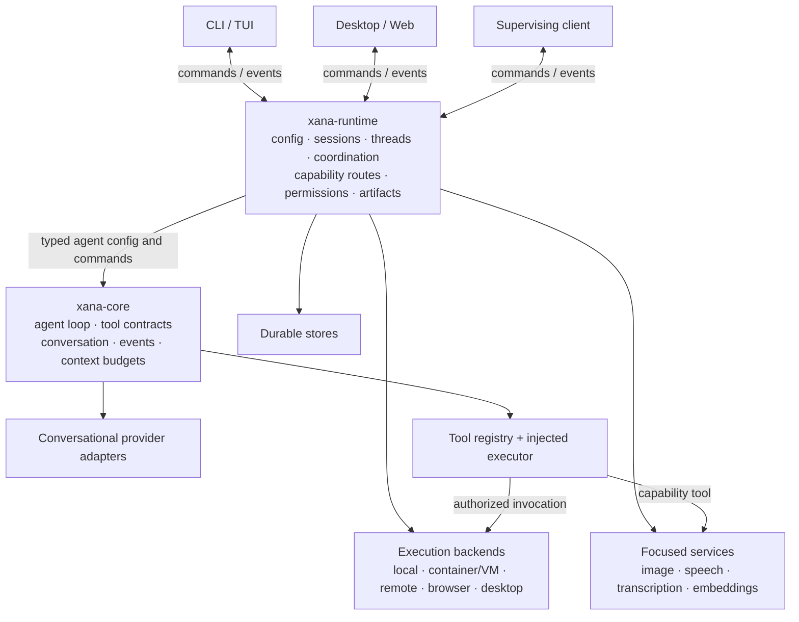
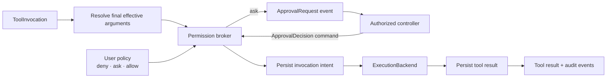

# Xana Architecture

This document describes both Xana's current implementation and its intended
component boundaries. Sections marked **Target** are directional contracts,
not claims about code that has already shipped.

## Current state

Xana is currently one Rust binary crate with a blocking terminal interface.
Its provider-neutral conversation model carries ordered text, tool-call, and
correlated tool-result content. OpenAI-compatible request and response types,
including the conversion of those calls and results, remain private to the
provider adapter.

The current host-tool surface contains three workspace-scoped tools behind a
provider-neutral, object-safe `Tool` trait. `read_file` reads bounded UTF-8
content and retains its optional inclusive line ranges. `list_files` returns a
bounded, sorted, non-recursive directory listing. `edit_file` replaces exactly
one match in an existing bounded UTF-8 file. A deterministic registry caches
each definition beside its implementation, dispatches requested calls, and
declares broad effect class separately from replay safety.

A headless `Agent` value owns the concrete provider, tool registry, launch
workspace, and eight-round tool limit. It executes requested calls serially,
appends correlated results to conversation history, and returns the final
assistant message. The CLI continues to own terminal input, rendering,
configuration and process-path loading, and temporary Phase 1 history.

Startup resolves platform-standard config, data, cache, and runtime locations
through one path policy. An optional non-empty absolute `XANA_HOME` maps those
shared backend categories beneath one portable root; an unset or empty value
uses platform defaults. Xana loads a strict, versioned `config.toml`, validates
every named OpenAI-compatible provider connection and agent profile, and
resolves the required default profile into owned values before constructing
`Agent`. Only the current automatic `allow` permission mode is accepted;
permission enforcement has not shipped.

Those checks and metadata are path and resource policy, not user authorization,
durable recovery, or process containment. The current implementation has no
permission broker, sandbox, runtime crate split, runtime profile switching, or
crash-safe edit protocol; the process still runs with its ordinary host access.

The early single-crate layout is intentional. Module boundaries establish the
design first. They become workspace crate boundaries only after the engine,
runtime policy, and frontend responsibilities are concrete enough to test.

## Product identity

Xana takes its name from Asturian folklore, where xanas are mysterious
figures associated with water, forests, and hidden places. The product
reinterprets that idea as a guide living within the system: quietly navigating
its paths and becoming visible when needed.

Xana's canonical reverse-domain identifier is:

```text
io.github.labcoder.xana
```

It corresponds to `github.com/labcoder/xana` through the GitHub Pages namespace
`labcoder.github.io`. Code resolves platform application directories with:

```rust
ProjectDirs::from("io.github", "labcoder", "xana")
```

The identifier is a compatibility boundary. Repository moves, a future
project domain, or new frontends do not justify changing it and orphaning
existing state.

## Component model

**Target**



### `xana-core`

The headless engine owns:

- the agent loop as a value;
- internal message, content, tool-call, and event types;
- the conversational provider abstraction and focused tool contracts;
- child-agent orchestration primitives;
- context assembly and token budgets.

It does not load configuration files, inspect environment variables, persist
sessions, grant permissions, select an operating-system path, or render a
frontend. Tool implementations and executors are injected; core does not gain
ambient authority merely because the process can access the host.

### `xana-runtime`

The application layer owns:

- resolving and validating shared configuration;
- provider connections, model descriptors, profile/task-route resolution, and
  immutable per-agent configuration snapshots;
- provider, focused service, tool, and execution-backend construction;
- permission policy evaluation, approval correlation, and audit events;
- artifact storage and reference resolution;
- project, thread, turn, and agent identity;
- session persistence, lineage, durable operation state, and recovery;
- turn admission, cancellation, and concurrency limits;
- command routing, atomic client snapshots, and event fan-out.

A foreground CLI can embed this layer in its own process. `xana serve` can host
the same layer for multiple attached frontends. Xana does not yet promise a
global background daemon; cross-process ownership and locking must be made
explicit before several independent processes can write one home safely.

### Frontends

Frontends translate user interaction into runtime commands and render runtime
events. CLI coloring, TUI layout, desktop panels, window state, themes, and
shortcuts are frontend concerns. They may offer editors for shared Xana
configuration, but the runtime remains responsible for validation and shared
state mutation.

Several frontends may observe the same run. Observation does not imply
authority: only an authorized controlling client may resolve an approval,
and the runtime atomically accepts at most one decision for an approval id.
An attached client receives an atomic runtime snapshot followed by a gap-free
live event stream. Reconnecting creates a fresh snapshot rather than treating
the live stream as a replayable source of truth.

## Providers, models, capabilities, and routes

**Target**

Xana keeps four related concepts separate:

- A **provider connection** describes a protocol, base URL, credential
  reference, headers, timeouts, and provider-specific compatibility settings.
- A **model descriptor** names a model on that connection and describes its
  input/output modalities, tool and reasoning support, context/output limits,
  and optional user overrides.
- An **agent profile** selects a primary provider/model pair plus tools,
  budgets, and a permission ceiling.
- A **task route** maps a named side task such as `summarize`, `title`, or
  `vision` to an agent profile or focused service.

The runtime resolves these values before constructing an agent. It rejects a
route whose target lacks the requested capability; it does not silently remove
an image, tool, or other unsupported content from a request.

The initial Provider trait is specifically conversational generation. Other
operations use focused interfaces such as `ImageGenerator`,
`SpeechSynthesizer`, `Transcriber`, and `Embedder`. One account may supply
several interfaces and reuse credentials, but their request and lifecycle
contracts remain distinct.

## Tool authority and execution

**Target**

Capability, authority, and containment are independent:

| Layer | Question | Owner |
|---|---|---|
| Capability | Can this model, tool, service, or backend perform the operation? | Descriptor or extension manifest; runtime validates |
| Authority | May this action run with this scope now? | User policy through `xana-runtime` |
| Containment | What can the process physically reach if policy or model behavior fails? | OS, container/VM, or remote execution boundary |

All built-in and extension-originated side effects use the same flow:



Policy evaluates `deny` before `ask` before `allow`. Grants are explicitly
scoped—for example, to one call, a session, a canonical workspace path, a
command, a network destination, an application, or an external side effect.
Prompts, on-screen text, repository configuration, extension code, profiles,
foreign agents, and child agents cannot grant themselves more authority. A
child's effective policy is no broader than the intersection of its parent's
ceiling and its selected profile.

When a required approval has no authorized interactive controller,
noninteractive execution fails closed. Approval requests and decisions carry
stable correlation ids and are recorded as audit events without copying
secrets into sessions. A decision is bound to the invocation id and final
effective arguments it approved; an extension cannot alter those arguments
after the check and reuse the approval for a different action.

The first local executor may run with the Xana process's host permissions and
must say so. Later execution backends may route work into containers, VMs,
remote workers, isolated browsers, or platform desktop adapters. An in-process
allowlist or command classifier is useful policy; it is not called a sandbox.

## Durable operations and recovery

**Target**

Xana distinguishes durable conversation from durable execution:

| Record kind | Purpose | Enters model context? |
|---|---|---|
| Conversation entry | User, assistant, and tool-result content with immutable identity and optional parent link | Yes, subject to context assembly |
| Operation record | Accepted work, steps, invocation intents/results, suspension, cancellation, and recovery state | No |
| Audit fact | Permission request/decision and other security-relevant facts | No |
| Live event | Rendering committed facts or explicitly transient in-progress state | No; not authoritative persistence |
| Telemetry | Durations, counts, status, and diagnostic correlation | No |

A root turn is a durable operation composed of one or more steps. A step
contains an assistant response and the complete batch of tool calls requested
by that response. The runtime assigns stable `OperationId`, `StepId`, and
`ToolInvocationId` values. These identities are transport-safe values rather
than references to live Rust objects.

Before a tool effect starts, the runtime appends an invocation-intent record
containing:

- the invocation and preallocated result identities;
- the final effective arguments after allowed transformations;
- the permission decision and relevant scope;
- the tool's declared replay safety.

After the effect completes, the runtime appends the result using the
preallocated identity. A missing result therefore means that the outcome is
unknown, not that the effect definitely did not occur.

Tool metadata keeps broad effect class separate from replay behavior:

```rust
pub enum ReplaySafety {
    Safe,
    Never,
}
```

`Safe` means the exact persisted invocation may be attempted again after an
unknown outcome. It is not inferred from a `read`, `write`, `execute`,
`network`, or `external` effect class. `Never` is the conservative default for
unknown tools and external side effects. Recovery may repeat an unfinished
invocation only when both its persisted intent and the currently installed
tool declaration say it is safe; otherwise it appends a typed interrupted
result rather than guessing.

Operations may be accepted, running, suspended, aborting, or finished with a
completed, failed, aborted, declined, or interrupted outcome. Suspension covers
approval waits and future deferred provider or focused-service work without
pretending the thread is idle.

Restoration reduces append-only records into current state and performs no
effects. Resumption is a separate explicit `ResumeOperation` command. It
reconciles interrupted work, rechecks current authority where an effect may
occur, and continues from a durable boundary. Opening a session in a frontend
can therefore never send a message, repeat a tool, or redeem a provider handle
by itself.

The first JSONL store promises process-crash recovery at record boundaries. It
may truncate a malformed final record produced by a torn append, but malformed
interior records are corruption and fail visibly. Any stronger power-loss or
`fsync` guarantee must be stated and tested rather than implied. A later
SQLite backend may change storage mechanics without changing the operation
semantics.

## Commands, events, hooks, and telemetry

**Target**

Xana exposes three different planes:

- **Control:** runtime commands, permission decisions, and installed hooks may
  start, stop, transform, or reject work.
- **Observation:** `AgentEvent` subscribers render or relay runtime state;
  subscriber failures cannot change execution.
- **Telemetry:** diagnostic spans and metrics describe execution but do not
  participate in it.

Hooks are sequential and explicitly awaited when ordering matters. A hook that
changes tool arguments runs before permission evaluation; the permission
broker evaluates and persists the resulting effective invocation. Hook output
needed for recovery is persisted before execution so a resumed operation does
not silently recompute a different action under changed extension code.
Permission remains runtime-owned and fail-closed: a hook may narrow or block an
action but cannot grant authority beyond user policy.

Public events are typed, serializable, secret-free observations. An event that
reports a durable fact is emitted only after that fact commits. Transient
content deltas and similar in-progress observations are explicitly live-only
and appear in snapshots while active; they are not evidence that a completed
message was persisted. Durable approval and audit facts are not discarded
merely because the live event stream is not replayed. Telemetry captures
identifiers, counts, durations, and status by default; prompt content,
completions, tool arguments, headers, and secrets require an explicit
redaction-aware opt-in.

To attach without a registration race, a client subscription has atomic
snapshot-and-stream semantics:

1. the runtime captures one consistent snapshot and begins buffering later
   events;
2. the client receives the snapshot;
3. buffered events flush in order, followed by live events.

The implementation may use buffering or durable sequence cursors, but it must
not leave an observation gap between snapshot and live delivery. Runtime
command and result types remain asynchronous, serializable, and suitable for a
remote proxy. This transport-facing contract does not require every pure
function inside `xana-core` to become asynchronous.

## Media and artifacts

**Target**

The internal conversation model carries ordered `ContentBlock` values. Text
and tool blocks ship first; image input later joins the same model and provider
adapter boundary.

Large binary content is not repeated in session JSONL or command/event
protocols. The runtime stores images, audio, and other media according to
their durable or disposable lifecycle and exposes a typed `ArtifactRef`.
Provider adapters resolve and encode bytes at the wire edge. Frontends fetch
or render artifacts by reference.

Image generation is a focused service normally surfaced to an agent as a
tool. TTS subscribes to text events, and transcription produces user commands;
neither belongs in the conversational Provider trait. Browser and desktop
control are optional execution backends that combine screenshots with typed
actions and remain behind both capability checks and the permission broker.

## Threads, turns, and agents

**Target**

Xana distinguishes these identities:

- A **project** associates work with a directory or repository.
- A **thread** is a durable conversation lineage with a runtime-owned current
  head.
- A **turn** is one root request operating on a thread.
- An **agent** is an execution value with a conversational provider/model,
  tools, limits, task routes, a permission ceiling, and an optional parent
  agent.

One root turn may mutate a thread at a time. This preserves deterministic
history and prevents two frontends from racing to append incompatible next
states. The runtime may concurrently execute:

- root turns belonging to different threads;
- bounded child agents spawned by an admitted root turn;
- read-only frontend subscriptions.

Child work carries parent/thread lineage and participates in structured
cancellation, depth limits, turn limits, token budgets, and permission
inheritance.

Conversation entries are immutable and may identify a parent entry. Moving a
thread head or creating a future branch does not rewrite or duplicate the
shared prefix. Xana does not currently expose a separate public "lane"
abstraction; if concurrent branch heads become a real product need, they can
be added over this storage model without changing entry identity.

## Paths and state ownership

The platform default comes from
`ProjectDirs::from("io.github", "labcoder", "xana")`. The resolver maps each
kind of state to the corresponding operating-system category rather than
assuming `~/.xana` or `~/.config`.

**Target**

| State | Platform default | `XANA_HOME` override | Authority | Lifecycle |
|---|---|---|---|---|
| Shared config | `config_dir()/config.toml` | `config.toml` | User edits; runtime validates | Durable, portable |
| Sessions and shared data | `data_dir()` | `data/` | Runtime | Durable |
| Generated/attached artifacts and audit records | `data_dir()` | `data/` | Runtime | Durable according to declared lifecycle |
| Caches, downloads, indexes | `cache_dir()` | `cache/` | Runtime implementation | Disposable |
| Locks, sockets, process state | `runtime_dir()` or an explicit platform fallback | `run/` | Active runtime | Ephemeral |
| Secrets | OS credential storage or explicit environment references | Not redirected | Credential provider | Sensitive |
| Frontend preferences | Frontend-owned application storage | Not redirected by backend `XANA_HOME` | Owning frontend | Durable but implementation-specific |

User-installed skills, plugins, and runtime-owned artifacts will be shared
durable data, but their exact directory contracts belong to the features that
introduce them.

`XANA_HOME` is an explicit portable/backend override, not an excuse for core
code to read environment variables. The runtime path resolver consumes it at
the application boundary and passes resolved paths inward.

## Configuration

**Target**

The permanent shared configuration is human-authored TOML:

```text
config.toml
```

It holds named provider connections, optional model metadata overrides, agent
profiles, named task routes, enabled features, user-owned permission policy,
and extension declarations. It does not hold plaintext credentials, session
history, artifacts, caches, audit logs, or frontend implementation state.

The first production schema requires one default provider/profile and a
permission mode. Later named profiles, routes, capability overrides, and
fine-grained rules extend the versioned document rather than replacing a flat
`model`/`base_url` format a second time.

Project-local policy may restrict what Xana can do, but it cannot silently
grant authority beyond user-owned policy. Likewise, an extension manifest may
declare what it needs, but declaration is not approval.

Xana validates configuration into typed values before constructing an agent.
When Xana eventually performs structured edits, it must preserve comments and
human organization rather than serializing a typed value over the user's
document.

Formats are selected by boundary:

- TOML for shared human-authored configuration;
- JSON for network and process protocols;
- JSONL for append-oriented conversation, operation, and audit records;
- Markdown for prompts, skills, and documentation;
- frontend-owned formats for private UI state.

Live `AgentEvent` delivery is not itself the durable log. Snapshots are derived
from committed conversation, operation, audit, and runtime state.

## Planned physical workspace

Once the single-crate boundaries have been exercised, the workspace separates
into:

```text
xana-core       headless engine and public internal types
xana-runtime    application policy, capability routing, permissions,
               artifacts, persistence, and coordination
xana-cli        terminal frontend and xana serve entry points
```

Additional frontend packages consume the runtime protocol; they do not link
provider wire types or reimplement session mutation.
