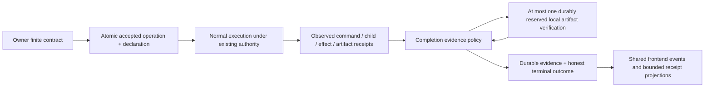

# Finite-work completion evidence

> Audience: Contributors and coding agents
> Authority: Descriptive

`completion_evidence` is a private policy module over typed execution receipts.
It cannot call providers, run commands, grant permission or retry effects.
Ordinary `SubmitTurn` remains conversational. Native `SubmitFiniteTurn` freezes
an explicit contract and work kind; one-shot requests use this path, with an
empty delivery-only contract unless the owner declares a supported check.

`SessionRecord::FiniteOperationAccepted` commits operation acceptance and its
initial evidence together. A crash cannot retain accepted finite work while
losing its conditions. Revision 1 is the declaration, revision 2 contains
observations and any verifier reservation, and revision 3 can contain only that
reservation's result. The reducer rejects changed contracts, duplicate or
out-of-order transitions, and unsupported generations. Active declarations and
reservations cannot be evicted to make room for newer terminal receipts.

The command adapter records a typed process status in the ToolResult and durable
invocation result before bounded text projection. Evidence binds exact command/
cwd fingerprints, invocation identity, execution generation and the current
possibly-mutating-work revision. A fresh successful instance of the same check
can resolve its earlier known failure. It cannot resolve an unknown effect,
an unrelated failure or a different check. Model text and confidence are not
check receipts. Output delivery is independently hashed and counted.

Child execution uses native ToolResult observations and its immutable result
report; parent evidence incorporates observed child outcomes. Scheduled runs use
the same finite native owner, and retained workers preserve the evidence in their
existing lifecycle. Context operations use their actual bounded artifact-write
receipt. Known budget values remain typed; unavailable values are not invented.

Artifact verification is one owner-held blocking worker with a 16 MiB total
read ceiling, over already registered immutable identities and hashes. Its
reservation precedes I/O. The owner services interruption/shutdown while waiting
and joins its worker; cancellation cannot turn into successful verification.
A lost or unresolved reservation stays needs-attention after restart, not a
new verification authorization. No command, browser effect or model call is
available to this worker.

Unsupported completion claims become incomplete/needs-attention evidence rather
than completed finite work. Native one-shot adapters expose exit 7 for this
case. Conversation journals retain details; shared snapshots carry bounded
receipt projections (including an encoded-byte ceiling) for plain, TUI, Desktop
and attached clients. A delivery-only receipt explicitly disclaims independent
task correctness. Managed Codex remains vendor-owned: unavailable checks are not
inferred from its output, and native declared checks are rejected before a
managed turn starts.

See the [user guide](../user/completion-evidence.md) for flags and interpretation.
General model judges, evaluator datasets, automatic repairs and harness promotion
are not part of this policy.
