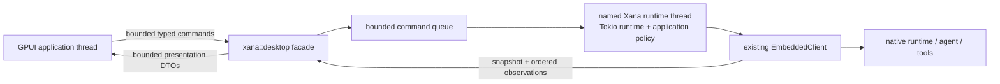
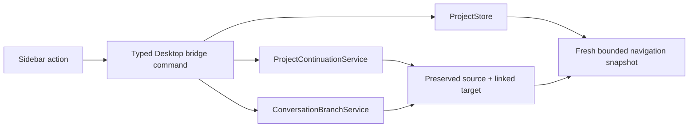
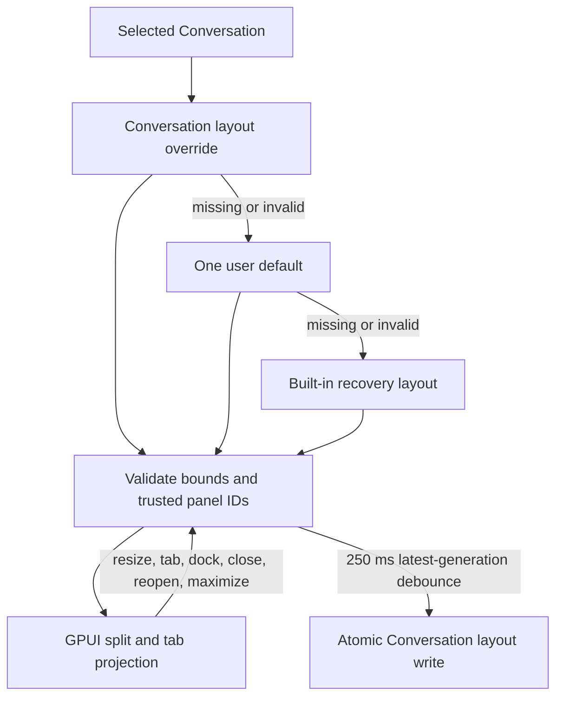

# Desktop architecture

> Audience: Contributors and coding agents  
> Authority: Descriptive

Xana Desktop is a native GPUI application in `crates/xana-desktop`. It is a
thin presentation client around the matching Xana runtime linked into the same
binary. It does not find a CLI on `PATH`, download a runtime, or own a second
agent loop.

## Process and lifecycle

An argument-free icon launch resolves `XANA_HOME`, claims one Desktop instance,
and renders a read-only catalog before it owns any workspace runtime. The
catalog reads existing Project records plus bounded, validated recent launch
preferences; missing state remains an empty state and is not initialized as a
side effect. A Project, recent Conversation, explicit `--workspace` argument,
or native folder-picker result selects the workspace. Only then does Xana
canonicalize it and start one named runtime thread. Choosing a folder presents
separate open-latest and force-new-ungrouped actions, so launch never disguises
a lifecycle mutation.

A later same-home launch authenticates over a loopback-only
channel, forwards one closed focus/navigation intent, and exits; a different
Xana home has a distinct owner. A locked owner file prevents races, while a
private atomic descriptor contains only protocol versions, canonical instance
root, loopback endpoint, process ID, and a random 256-bit capability. Payloads
and queues are bounded, and neither arbitrary commands nor paths cross this
process boundary. An explicit primary-process workspace path never enters the
forwarding protocol.

The runtime also owns a bounded Desktop navigation projection assembled from
the Project store and each available workspace host. It exposes Projects,
ungrouped Conversations, workspace availability, running/attention state, and
opaque stable identities without giving GPUI filesystem or provider authority.
The presentation adapter persists the full/mini sidebar preference and a
bounded twelve-entry recent-launch list containing canonical workspace and
opaque Conversation identity. Invalid, moved, missing, or no-longer-retained
entries are omitted from the cold catalog rather than trusted. Selecting or
creating a Conversation sends a typed
intent through the same bridge; the current native runtime shuts down cleanly,
the application composition layer resolves the requested workspace and
Conversation, and the existing GPUI window receives the next authoritative
snapshot. A navigation change therefore does not create a second agent loop or
make the sidebar authoritative.

Project rename/archive/restore and Conversation assignment/ungroup operations
go through the runtime bridge to `ProjectStore`. Cross-workspace moves first
review and then commit through the shared `ProjectContinuationService`; it owns
target Profile resolution, fresh Conversation creation, predecessor provenance,
and rollback. Branch requests carry the exact projected committed entry/thread
point into `ConversationBranchService`. GPUI supplies neither a filesystem path
nor a fabricated identity for either operation.

The runtime publishes an atomic initial
snapshot before the window opens. A 32-entry command queue and 256-entry update
queue bound cross-thread work. Replaceable streaming deltas may be dropped
under pressure; finals, failures, approvals, command receipts, and terminal
operation states receive a five-second delivery grace. A sequence gap causes
the application projection to request a fresh snapshot instead of guessing.

Closing an idle last window first asks the execution host to stop admission and
expire controller authority, then requests runtime shutdown. The host records
any remaining Run as interrupted only after the runtime accepts shutdown and
publishes an idempotent cleanup receipt. If exact owned-execution cleanup cannot
be proven, shutdown remains incomplete rather than claiming success. The window
is removed only after the ordered expected-stop acknowledgment. While a Run is
active, a native prompt offers keep-open, cancel-and-quit, or return; it does
not infer intent from window destruction. Explicit test shutdown joins the
runtime thread with a ten-second bound. Managed Codex
presentation is not part of the initial M4 walking skeleton and is rejected
before an app-server child can be started; M4-22 owns the final adapter and
parity proof.

The Activity projection exposes an unresolved native round-budget suspension
with exact operation/suspension identity, committed-result count, and typed
Continue/Stop controls. Continue retains the existing root lease and operation;
Stop releases it only after the runtime projects the terminal decision. The
GPUI layer cannot manufacture identities or infer a decision from display
text.

The Desktop backend acquires one application-host controller identity for its
Conversation before it publishes the initial snapshot. Every submission,
clear, interrupt, approval, round-budget decision, and shutdown command is
revalidated against that identity; snapshot requests remain observer-safe.
Initial snapshots and ordered host observations project only the controller's
public identity, generation, state, takeover fact, disconnect reason, and
remaining grace. Reconnect capabilities and client transport identities never
cross the Desktop presentation boundary. Clean shutdown expires the lease
before shutdown work and publishes the ordered lifecycle and receipt before
reporting that the backend stopped.

The facade also projects bounded global notices, notification preferences, and
the host lifecycle. A pure focus-aware notification planner exposes fixed
redacted candidates and exact Conversation/Operation correlation. The GPUI
adapter delivers them only while unfocused, and activation focuses the existing
window. Notification payloads contain no prompt, output, reasoning, filename,
tool argument, or credential and cannot become state authority.

## Authority boundary

The GPUI package receives:

- bounded message projections and artifact identifiers, never artifact bytes
  or backing paths;
- opaque operation and permission identifiers;
- typed commands, command receipts, semantic errors, snapshots, and ordered
  observations; and
- display-only connection, model, activity, usage, and permission summaries.

It does not receive provider implementations, credential references or secret
values, arbitrary path/file handles, executable command authority, unrestricted
URLs, session writers, or tool registries. Runtime and durable state remain
authoritative; Desktop state is a controlled projection with optimistic input
only until the authoritative final arrives.

## Presentation system

Desktop initializes `gpui-ai` once, applies one Xana-owned semantic visual
system, and wraps each window in one `gpui-component::Root`. Light, dark, and
high-contrast palettes, density, 100–200% text scaling, and full/reduced/no
motion are application preferences projected into the pinned UI stack. Raw
product colors are isolated to `design_system.rs`; individual features consume
semantic tokens.

Retained `Chat`, `PromptBar`, `ThreadList`, `SidebarNav`, and `CommandSearch`
entities own component interaction mechanics. Xana owns their bounded
snapshots, stable domain IDs, progressive lifecycle, subscriptions, and typed
intent handling. Other AI surfaces are stateless projections rebuilt from
bounded data. Semantic client copy is addressed by stable message code with
typed, bounded parameters; unknown or untranslated codes remain visible and
cannot change action identity or authority.

`xana-desktop --catalog` selects a provider-free deterministic review surface
before runtime launch. It exercises the same visual globals and real pinned
components but has no provider, credential, filesystem, or tool authority.

The shared command registry supplies stable semantic IDs, authority, and
availability. Desktop supplies native labels, a bounded essential shortcut
set, conventional menus, and a retained searchable palette. Every invocation
path converges on one typed dispatcher; commands not implemented in the
current Workbench remain visible but disabled with a reason. The status bar is
a bounded projection of host lifecycle, current destination, active Runs,
approvals, notices, and latest activity.

The Workbench uses `SidebarNav` as a virtualized Project/Conversation tree.
Project and Conversation labels are display values; every selection is routed
by a prefixed stable ID. The sidebar remains full or mini—never secretly
hidden—and keeps Espejo and Settings as fixed bottom destinations. Filtering,
disclosure, focus, and scrolling remain component-owned while lifecycle work
returns to Xana through typed commands. A contextual menu and matching keyboard
actions use the same handlers; destructive Project changes and any operation
that crosses a workspace require an exact review prompt.

Workbench layout is a separate Xana-owned, versioned domain model. It is a
bounded binary split tree whose leaves are tab stacks containing only trusted
built-in panel IDs. GPUI resizable groups render that model and report pointer
resizes back as bounded ratios; they do not become state authority and their
internal layout representation is never serialized.

Layouts have strict depth, node, panel-count, ID, active-tab, and split-ratio
bounds. Conversation overrides resolve before the single user default and the
built-in recovery layout. Corrupt or future state cannot block startup. The
Message panel cannot be closed, and the panel library, reset action, and
command palette remain outside the mutable tree. Import and export accept only
bounded, non-symbolic-link `.toml` files containing the version, panel IDs,
split structure, ratios, active tabs, and maximized panel. Unknown panel IDs
become inert placeholders; paths, prompts, messages, commands, credentials,
and artifacts are not representable.

Native GPUI has no WebView, browser DOM, navigation surface, CSP, JavaScript
bridge, or general renderer IPC. Consequently the WebView threats considered
during M4 framework selection are absent rather than configured open. External
documentation and Xana-owned configuration/log paths are exposed as narrow
typed actions with fixed HTTPS and regular-file/directory checks. Arbitrary
external URLs and paths remain unavailable.

## Dependency boundary

The workspace lockfile pins `gpui-ai`, the matching `gpui-component` family,
and one Zed/GPUI source revision. `default-members = ["."]` keeps an ordinary
`cargo build` on the root CLI/TUI package. CI verifies that the root package has
no GPUI dependency and that Desktop resolves one coordinated GPUI source
family. Upgrades are isolated dependency changes with source/changelog review
and cross-platform validation.
