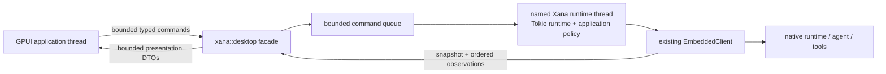

# Desktop architecture

> Audience: Contributors and coding agents  
> Authority: Descriptive

Xana Desktop is a native GPUI application in `crates/xana-desktop`. It is a
thin presentation client around the matching Xana runtime linked into the same
binary. It does not find a CLI on `PATH`, download a runtime, or own a second
agent loop.

## Process and lifecycle

Startup resolves and canonicalizes the workspace once, resolves `XANA_HOME`,
and starts one named runtime thread. The runtime publishes an atomic initial
snapshot before the window opens. A 32-entry command queue and 256-entry update
queue bound cross-thread work. Replaceable streaming deltas may be dropped
under pressure; finals, failures, approvals, command receipts, and terminal
operation states receive a five-second delivery grace. A sequence gap causes
the application projection to request a fresh snapshot instead of guessing.

Closing the application first asks the execution host to stop admission and
expire controller authority, then requests runtime shutdown. The host records
any remaining Run as interrupted only after the runtime accepts shutdown and
publishes an idempotent cleanup receipt. If exact owned-execution cleanup cannot
be proven, shutdown remains incomplete rather than claiming success. Explicit
test shutdown joins the runtime thread with a ten-second bound. Managed Codex presentation is not part
of the initial M4 walking skeleton and is rejected before an app-server child
can be started; M4-22 owns the final adapter and parity proof.

The Activity projection exposes an unresolved native round-budget suspension
with exact operation/suspension identity, committed-result count, and typed
Continue/Stop controls. Continue retains the existing root lease and operation;
Stop releases it only after the runtime projects the terminal decision. The
GPUI layer cannot manufacture identities or infer a decision from display
text.

The Desktop backend acquires one application-host controller identity for its
Conversation before it publishes the initial snapshot. Every submission,
clear, interrupt, approval, round-budget decision, and shutdown command is
revalidated against that identity; snapshot requests remain observer-safe.
Initial snapshots and ordered host observations project only the controller's
public identity, generation, state, takeover fact, disconnect reason, and
remaining grace. Reconnect capabilities and client transport identities never
cross the Desktop presentation boundary. Clean shutdown expires the lease
before shutdown work and publishes the ordered lifecycle and receipt before
reporting that the backend stopped.

The facade also projects bounded global notices and the host lifecycle. A pure
focus-aware notification planner exposes fixed redacted candidates and exact
Conversation/Operation correlation; native OS delivery belongs to the later
Desktop lifecycle adapter and cannot become state authority.

## Authority boundary

The GPUI package receives:

- bounded message projections and artifact identifiers, never artifact bytes
  or backing paths;
- opaque operation and permission identifiers;
- typed commands, command receipts, semantic errors, snapshots, and ordered
  observations; and
- display-only connection, model, activity, usage, and permission summaries.

It does not receive provider implementations, credential references or secret
values, arbitrary path/file handles, executable command authority, unrestricted
URLs, session writers, or tool registries. Runtime and durable state remain
authoritative; Desktop state is a controlled projection with optimistic input
only until the authoritative final arrives.

Native GPUI has no WebView, browser DOM, navigation surface, CSP, JavaScript
bridge, or general renderer IPC. Consequently the WebView threats considered
during M4 framework selection are absent rather than configured open. External
links, filesystem picking, clipboard, notifications, and richer OS integration
must be added later as narrow typed capabilities with explicit policy and tests.

## Dependency boundary

The workspace lockfile pins `gpui-ai`, the matching `gpui-component` family,
and one Zed/GPUI source revision. `default-members = ["."]` keeps an ordinary
`cargo build` on the root CLI/TUI package. CI verifies that the root package has
no GPUI dependency and that Desktop resolves one coordinated GPUI source
family. Upgrades are isolated dependency changes with source/changelog review
and cross-platform validation.
