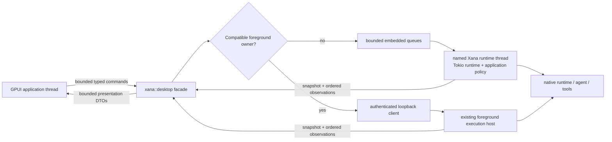
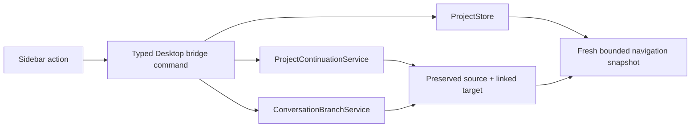
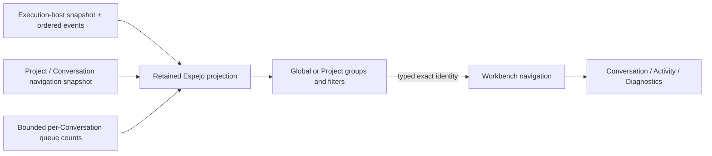
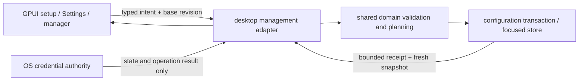
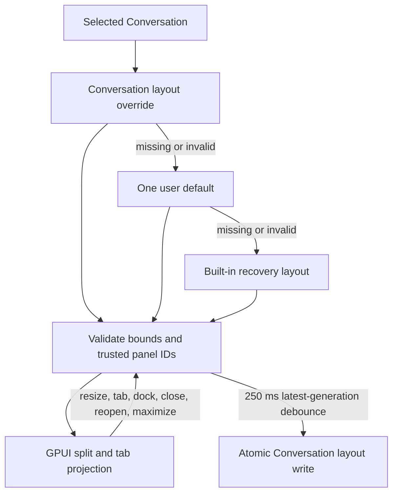

# Desktop architecture

> Audience: Contributors and coding agents
>
> Authority: Descriptive

Xana Desktop is a native GPUI application in `crates/xana-desktop`. It is a
thin presentation client around the matching Xana runtime linked into the same
binary. It can own that embedded runtime or attach to a compatible live local
foreground host; it does not find a CLI on `PATH`, download a runtime, or own a
second agent loop for the same workspace.

## Process and lifecycle

An argument-free icon launch resolves `XANA_HOME`, claims one Desktop instance,
and renders a read-only catalog before it owns any workspace runtime. The
catalog reads existing Project records plus bounded, validated recent launch
preferences; missing state remains an empty state and is not initialized as a
side effect. A Project, recent Conversation, explicit `--workspace` argument,
or native folder-picker result selects the workspace. Only then does Xana
canonicalize it and either attach to the compatible live foreground owner or
start one named runtime thread after proving the domain is unowned. Choosing a folder presents
separate open-latest and force-new-ungrouped actions, so launch never disguises
a lifecycle mutation.

A later same-home launch authenticates over a loopback-only
channel, forwards one closed focus/navigation intent, and exits; a different
Xana home has a distinct owner. A locked owner file prevents races, while a
private atomic descriptor contains only protocol versions, canonical instance
root, loopback endpoint, process ID, and a random 256-bit capability. Payloads
and queues are bounded, and neither arbitrary commands nor paths cross this
process boundary. An explicit primary-process workspace path never enters the
forwarding protocol.

The runtime also owns a bounded Desktop navigation projection assembled from
the Project store and each available workspace host. It exposes Projects,
ungrouped Conversations, workspace availability, running/attention state, and
opaque stable identities without giving GPUI filesystem or provider authority.
The presentation adapter persists the full/mini sidebar preference and a
bounded twelve-entry recent-launch list containing canonical workspace and
opaque Conversation identity. Invalid, moved, missing, or no-longer-retained
entries are omitted from the cold catalog rather than trusted. Selecting or
creating a Conversation sends a typed
intent through the same bridge; the current native runtime shuts down cleanly,
the application composition layer resolves the requested workspace and
Conversation, and the existing GPUI window receives the next authoritative
snapshot. A navigation change therefore does not create a second agent loop or
make the sidebar authoritative.

Project rename/archive/restore and Conversation assignment/ungroup operations
go through the runtime bridge to `ProjectStore`. Cross-workspace moves first
review and then commit through the shared `ProjectContinuationService`; it owns
target Profile resolution, fresh Conversation creation, predecessor provenance,
and rollback. Branch requests carry the exact projected committed entry/thread
point into `ConversationBranchService`. GPUI supplies neither a filesystem path
nor a fabricated identity for either operation.

The runtime publishes an atomic initial snapshot before the Workbench opens. A
32-entry command queue and 256-entry update queue bound cross-thread work.
Replaceable streaming deltas may be dropped under pressure. Critical updates
enter a separate bounded 64-entry deferred queue when presentation is paused;
the runtime never waits for GPUI, command results and terminal stop retain
priority, and overflow requires an authoritative snapshot resync. A sequence
gap likewise causes the application projection to request a fresh snapshot
instead of guessing.

Closing an idle last window first asks the execution host to stop admission and
expire controller authority, then requests runtime shutdown. The host records
any remaining Run as interrupted only after the runtime accepts shutdown and
publishes an idempotent cleanup receipt. If exact owned-execution cleanup cannot
be proven, shutdown remains incomplete rather than claiming success. The window
is removed only after the ordered expected-stop acknowledgment. While a Run is
active, a native prompt offers keep-open, cancel-and-quit, or return; it does
not infer intent from window destruction. Explicit test shutdown joins the
runtime thread with a ten-second bound. Managed Codex uses the same Desktop
projection and command queues but delegates its inner loop to the vendor-owned
app-server. Xana keeps the app-server thread identity, exposed activity,
approvals, completion state, and later-turn selection receipts inside the same
Conversation boundary; it never represents the managed loop as native work.

The Activity projection exposes an unresolved native round-budget suspension
with exact operation/suspension identity, committed-result count, and typed
Continue/Stop controls. Continue retains the existing root lease and operation;
Stop releases it only after the runtime projects the terminal decision. The
GPUI layer cannot manufacture identities or infer a decision from display
text.

An embedded Desktop backend acquires one application-host controller identity
for its Conversation before it publishes the initial snapshot. An attached
Desktop requests an unclaimed controller lease but remains an observer when an
incumbent controller exists; it never takes over implicitly. Every submission,
clear, interrupt, approval, round-budget decision, and shutdown command is
revalidated against the current authority; snapshot requests remain
observer-safe. Attached shutdown detaches the client rather than stopping the
external owner.
Initial snapshots and ordered host observations project only the controller's
public identity, generation, state, takeover fact, disconnect reason, and
remaining grace. Reconnect capabilities and client transport identities never
cross the Desktop presentation boundary. Clean shutdown expires the lease
before shutdown work and publishes the ordered lifecycle and receipt before
reporting that the backend stopped.

The facade also projects bounded global notices, notification preferences, and
the host lifecycle. A pure focus-aware notification planner exposes fixed
redacted candidates and exact Conversation/Operation correlation. The GPUI
adapter delivers them only while unfocused, and activation focuses the existing
window. Notification payloads contain no prompt, output, reasoning, filename,
tool argument, or credential and cannot become state authority.

Desktop Espejo is a retained feature entity over the host and navigation
snapshots, not a second coordinator. Its pure projection joins Conversation
placement with bounded host state and application-owned queued-input counts,
then classifies cards into Needs-you, in-motion, blocked/failed, completed, or
idle groups. Snapshot replacement remains authoritative; ordered host events
only keep the view current between replacements. The feature owns filter and
scope presentation state and emits typed navigation events back to Workbench.
It cannot approve, submit, cancel, access artifacts, or infer detailed usage.

## Authority boundary

The GPUI package receives:

- bounded typed message projections and artifact identifiers; a private
  capability-scoped reader may return re-verified bytes for an eligible static
  raster preview, but never an artifact-store handle or backing path;
- opaque operation and permission identifiers;
- typed commands, command receipts, semantic errors, snapshots, and ordered
  observations; and
- display-only connection, model, activity, usage, and permission summaries.

It does not receive provider implementations, credential references or secret
values, arbitrary path/file handles, executable command authority, unrestricted
URLs, session writers, or tool registries. Runtime and durable state remain
authoritative; Desktop state is a controlled projection with optimistic input
only until the authoritative final arrives.

## Configuration and recovery control plane

Graphical setup, Settings, focused managers, and maintenance views are adapters
over runtime-owned typed commands. `src/desktop/management` owns bounded
snapshots, drafts, previews, revisions, exact repair/reset plans, and receipts.
The GPUI package owns selection, layout, focus, local draft presentation, and
semantic copy; it never parses or writes `config.toml`, private records, model
catalogs, layout files, or credentials. Snapshot reads, validation, provider or
managed-account work, and mutations run on GPUI's background executor and
return bounded typed results before foreground entities update.

Scalar configuration and presentation preferences use one bounded staged draft
with redacted preview, complete-record validation, optimistic revision check,
atomic replacement, rollback, and an authoritative receipt. Connections,
credentials, model catalogs, Profiles, Projects, permission rules, capability
readiness, media resource policy, and Workbench defaults retain their focused
domain commands rather than being flattened into generic key/value writes.
Credential snapshots carry state and authority identity only; stored values and
length-derived masks never cross into presentation.

Desktop's focused mutation controls currently cover connections, credentials,
models, Profiles, Projects, permissions, resource policy, Workbench preferences,
repair, migration, and reset. Skills, Agent Plugins, MCP servers, external
agents, focused routes, image generation, outbound-decision history, and
operation reconciliation are projected as typed capability or diagnostic state,
but their lifecycle mutations remain in Xana's typed terminal management flow.
Palette rows that open those status views disclose that boundary; navigation is
not presented as a completed mutation workflow.

Missing configuration enters graphical setup. Invalid, incompatible, or
interrupted state enters a separate maintenance surface. Doctor snapshots are
read-only; repairs, migration, and reset each require an exact reviewed plan
whose revision is checked again at execution. Migration reuses the existing
backup and interrupted-transaction recovery boundary. Reset enumerates exact
targets and preserved state and treats OS credential deletion as a separate
confirmation. Support exports are bounded metadata-only projections.

Settings exposes twelve stable presentation sections and preserves unknown
kinds/codes as inspectable read-only rows. Wide layouts use rail, form, and
inspector panes; compact layouts stack the same semantic controls. Search and
large model catalogs filter retained stable identities without moving policy or
discovery into the render path.

## Presentation system

Desktop initializes `gpui-ai` once, applies one Xana-owned semantic visual
system, and wraps each window in one `gpui-component::Root`. Light, dark, and
high-contrast palettes, density, 100–200% text scaling, and full/reduced/no
motion are application preferences projected into the pinned UI stack. Raw
product colors are isolated to `design_system.rs`; individual features consume
semantic tokens.

Retained `Chat`, `PromptBar`, `ThreadList`, `SidebarNav`, and `CommandSearch`
entities own component interaction mechanics. Xana owns their bounded
snapshots, stable domain IDs, progressive lifecycle, subscriptions, and typed
intent handling. Other AI surfaces are stateless projections rebuilt from
bounded data. Semantic client copy is addressed by stable message code with
typed, bounded parameters; unknown or untranslated codes remain visible and
cannot change action identity or authority.

Conversation and Message are separate trusted Workbench panels. Xana retains a
bounded `Chat`/`PromptBar` pair per recently visited Conversation, matching the
bounded composer-state store. That preserves component-owned cursor/selection,
focus, virtual-list scroll, and follow-tail state while Xana separately retains
draft text, staged attachment references, and queued turns by stable
Conversation identity. Eviction drops only inactive presentation state; it can
never move input or authority to another Conversation.

The embedded runtime publishes into a bounded 256-update channel and wakes GPUI
through a coalescing signal that contains no data or authority. The Workbench
drains at most 64 typed updates in one UI batch, continues immediately when a
batch saturates, and otherwise sleeps until the next runtime or same-instance
launch signal. There is no periodic runtime poll or settled repaint clock.
Initial transcript projection retains a recent contiguous suffix of at most
512 messages and 2 MiB; the durable Conversation remains authoritative.

The Desktop projection preserves bounded text, Markdown, code, table, diff,
math, link, resource, and unknown parts. Code, table, and diff parts become
selectable Markdown structures understood by `gpui-ai`; math uses an explicit
LaTeX-source fallback because the pinned stack has no production formula
renderer. Before model-authored Markdown reaches the clickable component,
Desktop reparses it and removes raw HTML/MDX, all remote-image syntax,
credential-bearing or fragment URLs, and schemes other than absolute HTTP(S).

Resource cards retain declared and detected media types, validation, lineage,
and per-operation capability facts. A private `DesktopArtifactReader` repeats
the immutable artifact's length/digest and policy checks before returning bytes
for accepted PNG, JPEG, or WebP previews. The Workbench admits only the newest
eight eligible previews totaling at most 20 MiB of source data and an estimated
32 MiB of decoded RGBA data. Missing dimensions and checked-arithmetic overflow
remain typed cards. Snapshot replacement evicts decoded entries outside that
window; per-resource pixel and edge limits remain policy-owned.
Animated images, SVG, Lottie, audio, video, binary, unknown, rejected, missing,
or oversized resources stay typed cards. Desktop therefore advertises neither
audio/video playback nor rich math. Activating a card opens the Artifacts panel;
copy is a presentation action, while open, save, and reveal use typed runtime
commands. Save accepts only an explicit native-dialog destination and streams a
fully verified copy without overwrite. Open and reveal re-verify the complete
artifact before passing only its owned store path to the fixed platform action.

The runtime—not GPUI—validates picker and drag/drop resources plus clipboard
image inputs and returns typed staged-attachment projections. A resource whose
selected route has no verified input adapter remains retained with an explicit
unsupported fact; submitting it is rejected before provider disclosure.
Submission, interruption,
permission decisions, retries, and managed selection changes all carry exact
command or Operation identity. Managed model/reasoning changes wait for the
app-server actor's acknowledgment and affect later turns without replacing the
thread. Native provider/model/Profile changes use the settings transaction and
a fresh Conversation. Failed-response retry is available only while a bounded
application cache still holds the exact originating submission; edit and
regenerate copy text into the composer and never rewrite history.

`xana-desktop --catalog` selects a provider-free deterministic review surface
before runtime launch. It exercises the same visual globals and real pinned
components but has no provider, credential, filesystem, or tool authority.

The shared command registry supplies stable semantic IDs, authority, and
availability. Desktop supplies native labels, a bounded essential shortcut
set, conventional menus, and a retained searchable palette. Every invocation
path converges on one typed dispatcher; commands not implemented in the
current Workbench remain visible but disabled with a reason. The status bar is
a bounded projection of host lifecycle, current destination, active Runs,
approvals, notices, and latest activity.

The Workbench uses `SidebarNav` as a virtualized Project/Conversation tree.
Project and Conversation labels are display values; every selection is routed
by a prefixed stable ID. The sidebar remains full or mini—never secretly
hidden—and keeps Espejo and Settings as fixed bottom destinations. Filtering,
disclosure, focus, and scrolling remain component-owned while lifecycle work
returns to Xana through typed commands. A contextual menu and matching keyboard
actions use the same handlers; destructive Project changes and any operation
that crosses a workspace require an exact review prompt.

Workbench layout is a separate Xana-owned, versioned domain model. It is a
bounded binary split tree whose leaves are tab stacks containing only trusted
built-in panel IDs. GPUI resizable groups render that model and report pointer
resizes back as bounded ratios; they do not become state authority and their
internal layout representation is never serialized.

Layouts have strict depth, node, panel-count, ID, active-tab, and split-ratio
bounds. Conversation overrides resolve before the single user default and the
built-in recovery layout. Corrupt or future state cannot block startup. The
Message panel cannot be closed, and the panel library, reset action, and
command palette remain outside the mutable tree. Import and export accept only
bounded, non-symbolic-link `.toml` files containing the version, panel IDs,
split structure, ratios, active tabs, and maximized panel. Unknown panel IDs
become inert placeholders; paths, prompts, messages, commands, credentials,
and artifacts are not representable.

Native GPUI has no WebView, browser DOM, navigation surface, CSP, JavaScript
bridge, or general renderer IPC. Consequently the WebView threats considered
during M4 framework selection are absent rather than configured open. External
documentation and Xana-owned configuration/log paths are exposed as narrow
typed actions with fixed HTTPS and regular-file/directory checks. Arbitrary
external URLs and paths remain unavailable.

## Dependency boundary

The workspace lockfile pins `gpui-ai`, the matching `gpui-component` family,
and one Zed/GPUI source revision. `default-members = ["."]` keeps an ordinary
`cargo build` on the root CLI/TUI package. CI verifies that the root package has
no GPUI dependency, that Desktop resolves one coordinated GPUI source family,
and that Desktop has only the reviewed direct production dependencies. A
source-level authority gate rejects process spawning, raw networking, direct
provider HTTP clients, and credential-store access in the GPUI presentation
crate; those effects must remain behind typed `xana::desktop` adapters. Upgrades
are isolated dependency changes with source/changelog, license, authority,
accessibility, load, and cross-platform validation.
