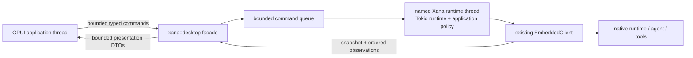

# Desktop architecture

> Audience: Contributors and coding agents  
> Authority: Descriptive

Xana Desktop is a native GPUI application in `crates/xana-desktop`. It is a
thin presentation client around the matching Xana runtime linked into the same
binary. It does not find a CLI on `PATH`, download a runtime, or own a second
agent loop.

## Process and lifecycle

Startup resolves and canonicalizes the workspace once, resolves `XANA_HOME`,
claims one Desktop instance for that canonical home, and starts one named
runtime thread. A later same-home launch authenticates over a loopback-only
channel, forwards one closed focus/navigation intent, and exits; a different
Xana home has a distinct owner. A locked owner file prevents races, while a
private atomic descriptor contains only protocol versions, canonical instance
root, loopback endpoint, process ID, and a random 256-bit capability. Payloads
and queues are bounded, and neither arbitrary commands nor paths cross this
process boundary.

The runtime publishes an atomic initial
snapshot before the window opens. A 32-entry command queue and 256-entry update
queue bound cross-thread work. Replaceable streaming deltas may be dropped
under pressure; finals, failures, approvals, command receipts, and terminal
operation states receive a five-second delivery grace. A sequence gap causes
the application projection to request a fresh snapshot instead of guessing.

Closing an idle last window first asks the execution host to stop admission and
expire controller authority, then requests runtime shutdown. The host records
any remaining Run as interrupted only after the runtime accepts shutdown and
publishes an idempotent cleanup receipt. If exact owned-execution cleanup cannot
be proven, shutdown remains incomplete rather than claiming success. The window
is removed only after the ordered expected-stop acknowledgment. While a Run is
active, a native prompt offers keep-open, cancel-and-quit, or return; it does
not infer intent from window destruction. Explicit test shutdown joins the
runtime thread with a ten-second bound. Managed Codex
presentation is not part of the initial M4 walking skeleton and is rejected
before an app-server child can be started; M4-22 owns the final adapter and
parity proof.

The Activity projection exposes an unresolved native round-budget suspension
with exact operation/suspension identity, committed-result count, and typed
Continue/Stop controls. Continue retains the existing root lease and operation;
Stop releases it only after the runtime projects the terminal decision. The
GPUI layer cannot manufacture identities or infer a decision from display
text.

The Desktop backend acquires one application-host controller identity for its
Conversation before it publishes the initial snapshot. Every submission,
clear, interrupt, approval, round-budget decision, and shutdown command is
revalidated against that identity; snapshot requests remain observer-safe.
Initial snapshots and ordered host observations project only the controller's
public identity, generation, state, takeover fact, disconnect reason, and
remaining grace. Reconnect capabilities and client transport identities never
cross the Desktop presentation boundary. Clean shutdown expires the lease
before shutdown work and publishes the ordered lifecycle and receipt before
reporting that the backend stopped.

The facade also projects bounded global notices, notification preferences, and
the host lifecycle. A pure focus-aware notification planner exposes fixed
redacted candidates and exact Conversation/Operation correlation. The GPUI
adapter delivers them only while unfocused, and activation focuses the existing
window. Notification payloads contain no prompt, output, reasoning, filename,
tool argument, or credential and cannot become state authority.

## Authority boundary

The GPUI package receives:

- bounded message projections and artifact identifiers, never artifact bytes
  or backing paths;
- opaque operation and permission identifiers;
- typed commands, command receipts, semantic errors, snapshots, and ordered
  observations; and
- display-only connection, model, activity, usage, and permission summaries.

It does not receive provider implementations, credential references or secret
values, arbitrary path/file handles, executable command authority, unrestricted
URLs, session writers, or tool registries. Runtime and durable state remain
authoritative; Desktop state is a controlled projection with optimistic input
only until the authoritative final arrives.

## Presentation system

Desktop initializes `gpui-ai` once, applies one Xana-owned semantic visual
system, and wraps each window in one `gpui-component::Root`. Light, dark, and
high-contrast palettes, density, 100–200% text scaling, and full/reduced/no
motion are application preferences projected into the pinned UI stack. Raw
product colors are isolated to `design_system.rs`; individual features consume
semantic tokens.

Retained `Chat`, `PromptBar`, `ThreadList`, `SidebarNav`, and `CommandSearch`
entities own component interaction mechanics. Xana owns their bounded
snapshots, stable domain IDs, progressive lifecycle, subscriptions, and typed
intent handling. Other AI surfaces are stateless projections rebuilt from
bounded data. Semantic client copy is addressed by stable message code with
typed, bounded parameters; unknown or untranslated codes remain visible and
cannot change action identity or authority.

`xana-desktop --catalog` selects a provider-free deterministic review surface
before runtime launch. It exercises the same visual globals and real pinned
components but has no provider, credential, filesystem, or tool authority.

The shared command registry supplies stable semantic IDs, authority, and
availability. Desktop supplies native labels, a bounded essential shortcut
set, conventional menus, and a retained searchable palette. Every invocation
path converges on one typed dispatcher; commands not implemented in the
current Workbench remain visible but disabled with a reason. The status bar is
a bounded projection of host lifecycle, current destination, active Runs,
approvals, notices, and latest activity.

Native GPUI has no WebView, browser DOM, navigation surface, CSP, JavaScript
bridge, or general renderer IPC. Consequently the WebView threats considered
during M4 framework selection are absent rather than configured open. External
documentation and Xana-owned configuration/log paths are exposed as narrow
typed actions with fixed HTTPS and regular-file/directory checks. Arbitrary
external URLs and paths remain unavailable.

## Dependency boundary

The workspace lockfile pins `gpui-ai`, the matching `gpui-component` family,
and one Zed/GPUI source revision. `default-members = ["."]` keeps an ordinary
`cargo build` on the root CLI/TUI package. CI verifies that the root package has
no GPUI dependency and that Desktop resolves one coordinated GPUI source
family. Upgrades are isolated dependency changes with source/changelog review
and cross-platform validation.
