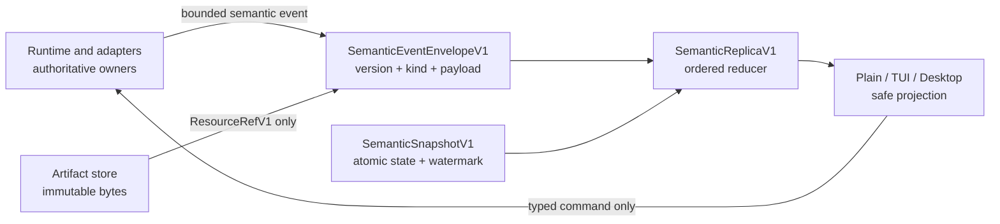
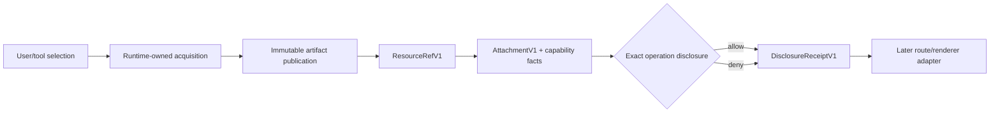

# Frontend semantic protocol

> Audience: Contributors and coding agents
> Authority: Descriptive

Xana's repository-private frontend protocol has two layers. The transport
layer carries bounded commands, snapshots, ordered observations, and omission
facts. Protocol version 4 adds a surface-neutral semantic layer for content,
resources, activity, attention, usage, approvals, execution facts,
capabilities, disclosures, and completion evidence.

The semantic layer is implemented vocabulary and deterministic reduction
logic. It is not yet a claim that every runtime emits every semantic event or
that every frontend has a specialized renderer. During the M4 migration,
legacy native and managed observations remain present beside the semantic
snapshot. Later M4 tickets add producers and projections family by family.

## Authority and data flow

Frontends receive facts and submit typed intent. They never receive provider
objects, credentials, filesystem handles, shell handles, callbacks, policy
authority, or runtime ownership.

The initial embedded snapshot is captured before forwarding starts. One
monotonic observation sequence is shared by legacy and semantic events. A
semantic delta applies only at the next exact sequence. Duplicates are ignored;
an unprovable gap stops delta application until a fresh validated snapshot is
installed. Authoritative final content replaces ambiguity from progress
deltas. Snapshot and event payloads are capped at 2 MiB and 1 MiB respectively.

Unknown event versions and kinds remain bounded, inspectable values. They do
not become commands or capabilities. Unknown content parts use the same rule.
Malformed known values fail validation rather than silently changing meaning.

## Content and resources

`ContentPartV1` represents inert text, bounded Markdown source, code, tables,
diffs, constrained math source, safe HTTP(S) links, artifact-backed resources,
and safe unknown parts. It does not contain HTML, scripts, terminal escape
authority, frontend callbacks, or provider-native payloads.

`ResourceRefV1` contains an immutable `ArtifactRecord`, a forward-compatible
kind, separately declared and detected media types, bounded metadata,
accessibility provenance, validation state, and optional derived-artifact
lineage. The known kinds are static raster, animated raster, SVG, Lottie,
audio, video, binary, and safe unknown. Raw bytes and ambient paths never
cross this boundary.

An `AttachmentV1` adds the stable attachment identity, display-only basename,
acquisition provenance, capability facts, and the validated resource. The
basename rejects path separators. Capability facts keep availability,
selection, authorization, source, and freshness separate.

Disclosure is an operation-specific receipt, not a mutable flag on an
artifact. It records the exact resource, operation, destination,
connection/model when relevant, source byte count, derivative, decision, and
time. Acquisition, inline presentation, playback, external open, provider
input, focused analysis, and transformation therefore remain independent.

The current artifact `put` path retains its historical 4 MiB limit. Resource
adapters can use `put_bounded` with a stricter effective kind or route limit,
but cannot raise the compiled 512 MiB resource ceiling. Collision verification
streams fixed-size chunks through BLAKE3 rather than loading a large existing
artifact into memory.

## Resource admission policy

`ResourcePolicyV1` is defaulted configuration under immutable compiled hard
ceilings. It bounds total resources and source bytes per turn, concurrent
jobs/players, cache and in-memory buffers, transform time, and kind-specific
dimensions or work. Zero and values above the ceiling are invalid. Route
policy can only take the minimum of configured and route limits. Turn totals
use checked `u128` arithmetic before comparison.

The validated configured policy is frozen into the initial semantic snapshot.
`AttachmentPolicySnapshotV1` may later add an exact route limit and derives the
effective policy without widening either input. Current image ingestion still
enforces the established image defaults; general resource acquisition and
route-specific admission are later M4 adapter work.

## Activity, attention, and completion

Activity forms a bounded acyclic tree inside one Conversation and Run. Owners
are Xana root, native child, managed runtime, MCP, or A2A. An item carries a
stable identity, state, semantic summary, optional provider-visible disclosed
text, disclosure classification, source, freshness, and timing. It never
carries hidden chain-of-thought.

Attention is durable semantic state with stable IDs. Its states are Working,
Needs you, Blocked, Failed, Completed, and Idle. Acknowledgement names one exact
attention item and time; opening a Conversation does not clear unrelated
attention.

Approvals retain exact Conversation, Run, invocation, capability, request,
and decision state. Execution facts identify runtime owner, host/location
class, workspace and tool authority, connection/model, capability grants,
egress, controller, approval policy, source, and freshness. Missing facts stay
missing; clients do not infer them.

A completion receipt binds one Conversation and Run to durable terminal
status, execution facts, artifact references, check receipts, usage IDs,
warnings, and completion time. A client may present this evidence but cannot
forge it or turn it into authority.

## Usage observations

Each `UsageObservationV1` has a stable ID and independently states:

- scope: request, thread, run, connection, model, account, or context;
- accounting: a per-request delta or a cumulative snapshot with sequence;
- period identity and optional reset time;
- input, output, cache-read, cache-write, reasoning, and tool token categories;
- request count, serialized prompt/tool-schema bytes, provider-reported cost,
  redacted request-affinity evidence, context occupancy, rate limit, quota,
  and credits;
- source, authority, freshness, and availability.

The ledger deduplicates observation IDs. For one source/scope/period, a newer
cumulative snapshot replaces the older snapshot; older or replayed snapshots
do not inflate totals. Deltas remain additive. A new period remains separate,
and unavailable or unsupported values are never converted to zero.

`usage_observation` is the runtime-owned acquisition and normalization edge.
Native provider deltas and managed cumulative snapshots enter the same model.
Explicit account refresh reads or replaces a bounded per-connection cache;
ordinary rendering never polls. A failed refresh can return marked-stale facts,
while cancellation remains control flow rather than a fabricated unavailable
account value. Raw provider responses, credentials, authorization headers, and
account identifiers never enter semantic state.

## Deterministic capability projection

Capability entries are sorted and deduplicated by stable ID. Availability,
selected state, and authorization are separate facts. “Available but not
selected” and “selected but permission required” are therefore representable
without presentation-layer provider branching.

| Semantic fact | Specialized presentation may do | Required fallback |
|---|---|---|
| Text/Markdown/code/table/diff/math | Rich, accessible rendering | Sanitized bounded text |
| Safe link | Explicit clickable action | Visible label and URL |
| Known resource | Reviewed preview/player/card | Metadata card and explicit external action |
| Unknown resource/content | Nothing type-specific | Non-executable unknown card |
| Activity | Nested timeline or collapsible detail | Owner, state, summary, provenance |
| Attention | Badge, Espejo item, notification | Stable state and required action text |
| Usage | Meter or grouped table | Source-qualified values or unavailable reason |
| Approval | Modal or inline decision | Exact request plus typed allow/deny action |
| Execution/completion | Evidence panel | Bounded factual receipt |

Official surfaces must preserve semantic outcomes, not identical pixels. A
renderer may omit optional richness only when it supplies the safe fallback.
Rendering cannot fetch remote content, disclose an attachment, grant a
capability, or acknowledge attention as a side effect.

## Localization and future voice seam

Errors, attention, approvals, recovery, capability, and receipt outcomes use a
stable lowercase semantic code plus at most 16 bounded typed parameters.
Clients may localize copy without changing the code or action. Unknown codes
remain visible as safe generic outcomes.

The only voice seam is a future submission origin containing a validated
adapter ID and idempotent request UUID. No microphone samples, audio streams,
endpointing policy, provider realtime handles, or speech authority enter this
protocol. A future speech adapter must submit an ordinary authenticated command
and consume authoritative content/activity through the same boundary.

## Source ownership

- `resource` owns artifact-backed resource identity, validation, defaults,
  immutable ceilings, policy narrowing, and turn admission.
- `frontend::semantic::content` owns content, attachments, capabilities, and
  disclosure receipts.
- `frontend::semantic::activity` owns activity, attention, approvals,
  execution facts, and completion receipts.
- `frontend::semantic::usage` owns observations and deterministic accounting.
- `frontend::semantic::event` owns event envelopes and unknown decoding.
- `frontend::semantic::state` owns snapshots and ordered replication.
- `frontend::protocol` owns transport bounds, sequence assignment, and the
  bounded transition from legacy observations to semantic projections.

These types are repository-private. They are not a public SDK or a remote
protocol compatibility promise.
