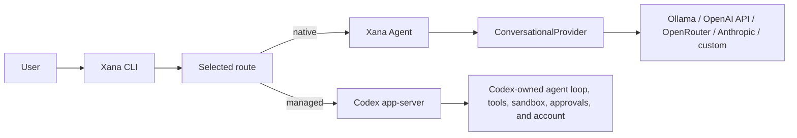
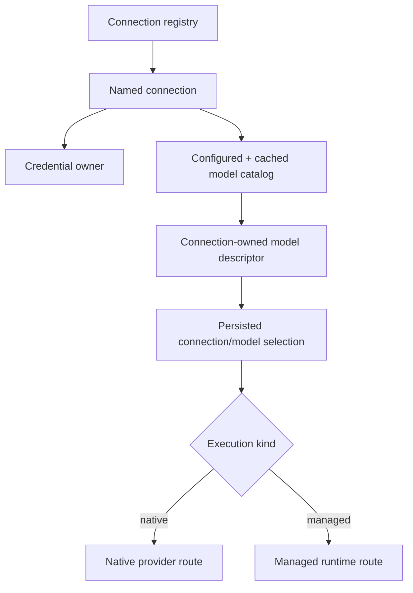
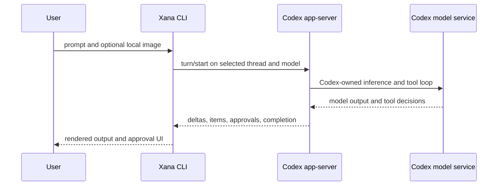
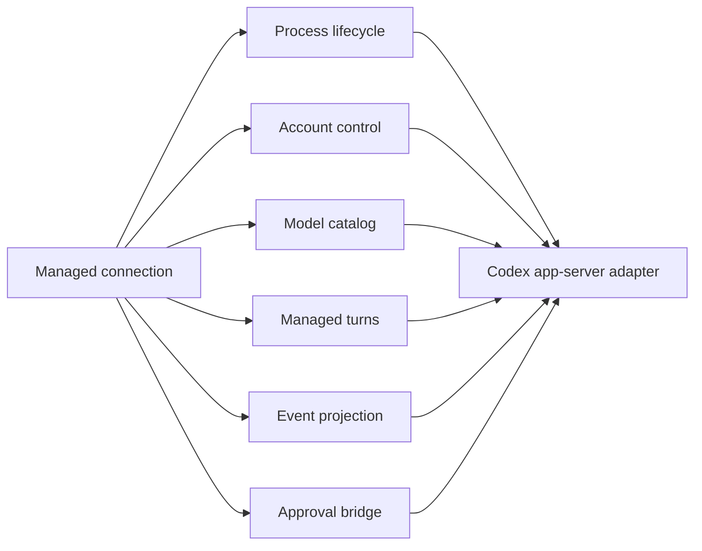

# Connections, models, and managed runtimes

> Audience: Contributors and coding agents
> Authority: Descriptive

Xana has two execution paths. A native connection supplies model inference to
Xana's own agent loop. A managed connection delegates the complete inner agent
loop to another local runtime. The selected connection and model determine
which path is composed for a new conversation.

There is no outer Xana model call around a direct Codex turn. JSON-RPC control
messages do not consume model tokens, so selecting Codex does not introduce an
automatic agent-to-agent token tax. Agent-to-agent protocols are a separate
future interoperability concern; Codex app-server is a local managed-runtime
protocol, not A2A.

## Domain model

A **connection** is a named configured route. It owns a provider or runtime
kind, endpoint/process policy, credential owner, configured model overrides,
and cached model catalog. A **model descriptor** is owned by one connection and
records its id, display name, known modalities, tool/reasoning support, limits,
source, and default status. A **selection** is the pair
`(connection_id, model_id)` stored outside the human-authored configuration.

Catalog refresh is explicit. Startup reads only configured and cached
non-secret metadata. Implemented sources are Ollama `/api/tags`, OpenAI and
custom `/v1/models`, OpenRouter `/api/v1/models/user`, Anthropic `/v1/models`,
and Codex `model/list`. Remote claims and explicit overrides are merged by
field; unknown capabilities remain unknown and image input fails closed.
Catalog responses and caches are bounded and contain no credentials.

`xana model` lists the unified catalog. `xana model use
CONNECTION/MODEL` persists the next-conversation selection. `/model` lists or
selects from chat. Native selection restarts Xana's foreground conversation;
switching between native and managed execution never copies history silently.
Within one Codex process, selecting another advertised Codex model keeps the
managed thread and applies the model to subsequent turns.

## Native conversational providers

`ConversationalProvider` is the single generation contract consumed by Xana's
headless native agent. It receives provider-neutral messages, the frozen tool
schema snapshot, a step id, and a text-delta sink. Account management,
credential lookup, catalog discovery, model selection, and unrelated media
services are deliberately absent.

The OpenAI-compatible adapter is used by Ollama, custom endpoints, the OpenAI
API, and OpenRouter. Authentication and attribution remain connection policy.
The Anthropic Messages adapter separately maps the same internal semantics to
Anthropic's top-level system field, structured content and tool blocks, and
typed SSE sequence. Both adapters resolve artifact-backed images only at the
wire edge.

## Codex managed runtime

The Codex connection launches the installed `codex app-server --stdio` and
speaks bounded JSONL JSON-RPC. Xana initializes the process, projects account
status and rate limits, pages `model/list`, starts threads and turns, streams
assistant deltas, and responds to command/file-change approvals. It supervises
process lifetime and rejects oversized, malformed, unsupported, or timed-out
protocol exchanges.

Codex owns its OAuth flow, access and refresh tokens, model backend, inner
history, tools, sandbox, and approval semantics. Xana never reads or copies
`auth.json`. `xana connection login codex` delegates browser or device-code
login to account RPCs; status, logout, and catalog operations delegate in the
same way. An explicit `codex_home` can isolate an account; otherwise the
installed Codex default is shared. Logout therefore requires confirmation.

This is a direct control handoff, not an agent-to-agent conversation. Only the
Codex-owned service request consumes model tokens; Xana does not ask a second
model to summarize, route, or relay the turn.

These are intentionally narrow responsibilities even though the first adapter
is one `CodexAppServer` facade. A future managed runtime can implement the same
responsibilities without pretending to be a conversational provider. Native
and managed routes may share UI concepts, connection/model selection, and
event presentation; they do not share ownership of the inner loop.

## Credential ownership

`config.toml` stores only tagged references:

- `source = "environment"` names one environment variable;
- `source = "stored"` names one operating-system credential entry; or
- a Codex connection declares no Xana credential because Codex owns it.

Static stored keys use the OS credential service `dev.xana.credentials`:
Windows Credential Manager, macOS Keychain, or Linux Secret Service. There is
no plaintext fallback. Resolution uses exactly the declared source and never
silently falls back to another key. Deleting a Xana API key and logging out of
Codex are separate operations.

Anthropic is API-key-only in Xana. Claude subscription OAuth is not offered.
OpenRouter is treated as an API/credit provider; an OAuth-created OpenRouter
key, if obtained outside Xana, is still just an API key from Xana's
perspective. Direct reimplementation of ChatGPT/Codex OAuth or backend
transport is not shipped.
