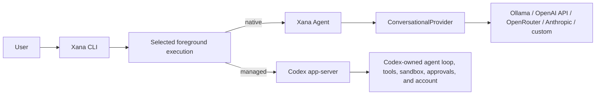
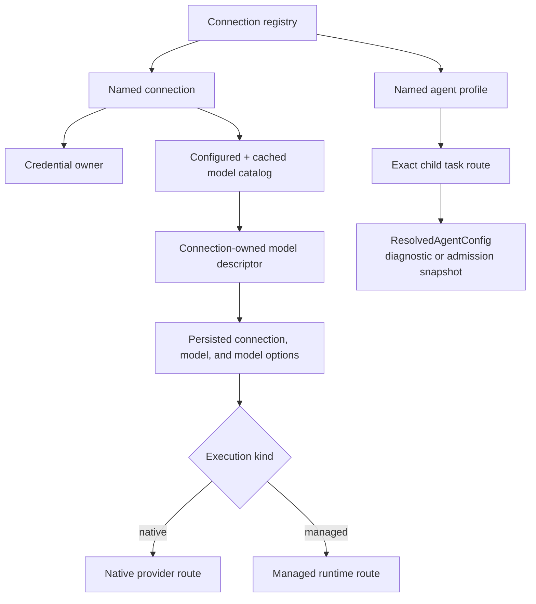
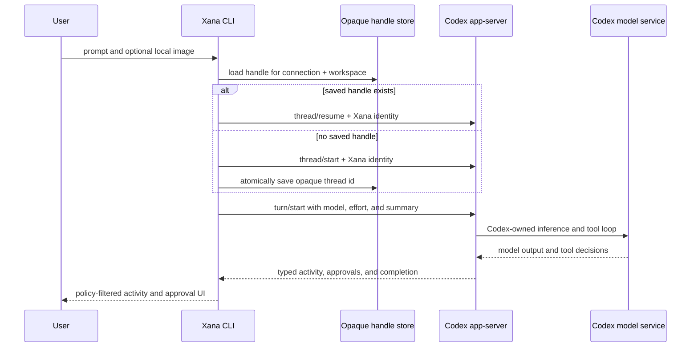
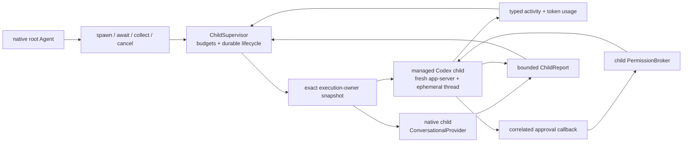
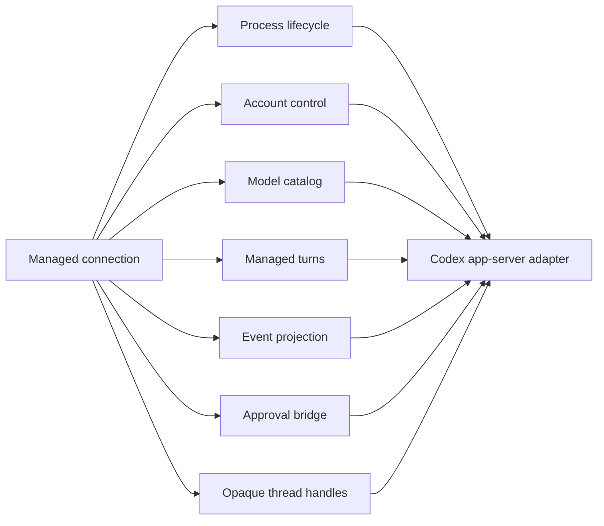

# Connections, models, and managed runtimes

> Audience: Contributors and coding agents
> Authority: Descriptive

Xana has two execution paths. A native connection supplies model inference to
Xana's own agent loop. A managed connection delegates the complete inner agent
loop to another local runtime. The selected connection and model determine
which path is composed for a new conversation.

There is no outer Xana model call around a direct Codex turn. JSON-RPC control
messages do not consume model tokens, so selecting Codex does not introduce an
automatic agent-to-agent token tax. Agent-to-agent protocols are a separate
future interoperability concern; Codex app-server is a local managed-runtime
protocol, not A2A.

## Domain model

A **connection** is a named provider or managed-runtime configuration. It owns a
kind, endpoint/process policy, credential owner, configured model overrides,
and cached model catalog. A **model descriptor** is owned by one connection and
records its id, display name, known input/output modalities, tool/reasoning
support, limits, provider-published pricing fields, source, and default status.
Pricing is preserved as non-secret catalog evidence and is never promoted into
an exact billing claim. Managed descriptors also retain the reasoning
efforts advertised by the runtime, their descriptions, and the model default.
A **selection** contains `(connection_id, model_id)` plus route-specific model
options. Today those options are Codex reasoning effort and summary mode. The
selection is stored outside the human-authored configuration.

An **agent profile** is a named immutable configuration template for an exact
connection/model/options pair, logical capability selection, permission
ceiling, tool-round limit, and orchestration limits. A **task route** maps one
stable child-task name to exactly one profile. `xana route list` and `xana
route check NAME` resolve configured/cached metadata, local credential
availability, model options, and built-in capabilities without network or
process activation. The commands do not start a child. Native chat uses the
same resolver before its runtime admits a supervised native or managed child;
the immutable result drives owner-specific execution, permission, and budget
composition. A native result also freezes its provider, prompt and tool
snapshot. A Codex result requires an empty Xana capability snapshot because
Codex owns its tools, and freezes the app-server launch, model options and
workspace policy instead. Routes can mix owners and model pairs, each with an
independent history and bounded explicit context handoff. Interactive
foreground model selection remains separate and cannot mutate a task route.
Atomic batch admission, bounded parallel execution, typed collection, and
closed owner-neutral plans share the same supervisor.

Control-plane catalog refresh is explicit. Native startup reads only configured
and cached non-secret metadata. A managed Codex chat performs a bounded live
`model/list` negotiation before accepting turns so the selected model and its
reasoning options match the running app-server/account. Xana caches that
bounded non-secret live result before compatibility validation. An unavailable
selection therefore fails with bounded advertised choices and can be repaired
immediately with `model use`, without a redundant refresh. Implemented sources
are Ollama `/api/tags` followed by bounded `/api/show` capability probes,
OpenAI and
custom `/v1/models`, OpenRouter `/api/v1/models/user`, Anthropic `/v1/models`,
and Codex `model/list`. Remote claims and explicit overrides are merged by
field; unknown capabilities remain unknown and image input fails closed.
Catalog responses and caches are bounded and contain no credentials. OpenRouter
catalog parsing retains advertised output modalities and per-token/request/image
prices alongside its input modalities and supported parameters. Providers that
omit these fields remain explicitly unknown.

Quick Setup is the one deliberate pre-install discovery path. It constructs a
staged registry, establishes the endpoint/executable plus credential/account,
and fetches a live catalog before committing anything. Only an id from that
result can become the installed default model. After the configuration commit,
Xana writes the same bounded non-secret result to the normal catalog cache so
the first conversation sees the capabilities that setup validated. A hidden API key
is held in zeroizing memory until confirmation; configuration contains only
its OS-store id or environment-variable name. A successful replacement clears
the separate foreground selection in the rollback-safe transaction, making
the installed default connection/model effective for the next conversation
instead of resuming an older valid or now-orphaned override. This transaction
does not turn ordinary startup into implicit network discovery.

`xana model` lists the unified catalog, distinguishes the effective foreground
selection from the configured profile default, and exposes known input, tool,
reasoning, context, output-modality, and pricing facts. `xana model use
CONNECTION/MODEL` persists the next-conversation selection. `/model` lists or
selects from chat. Native selection restarts Xana's foreground conversation;
switching between native and managed execution never copies history silently.
Within one Codex process, selecting another advertised Codex model keeps the
managed thread and applies the model to subsequent turns. Reasoning effort and
summary mode behave the same way. Xana validates effort against that model's
live advertised choices rather than maintaining a vendor-specific enum.

## Native conversational providers

`ConversationalProvider` is the single generation contract consumed by Xana's
headless native agent. It receives provider-neutral messages, the frozen tool
schema snapshot, a step id, and a text-and-reasoning delta sink. Account management,
credential lookup, catalog discovery, model selection, and unrelated media
services are deliberately absent.

The OpenAI-compatible adapter is used by Ollama, custom endpoints, the OpenAI
API, and OpenRouter. Authentication and attribution remain connection policy.
It preserves provider-exposed reasoning separately from assistant output,
classifies safe request, transport, rejection, invalid-stream, and timeout
failures, and bounds connection, response-start, and stream-idle waits.
The Anthropic Messages adapter separately maps the same internal semantics to
Anthropic's top-level system field, structured content and tool blocks, and
typed SSE sequence. Both adapters resolve artifact-backed images only at the
wire edge.

## Codex managed runtime

The Codex connection launches the installed `codex app-server --stdio` and
speaks bounded JSONL JSON-RPC. Xana initializes the process, projects account
status and rate limits, pages `model/list`, starts or resumes threads, and
starts turns with the selected model options. It normalizes assistant text,
reasoning summaries and provider-exposed reasoning text, plans, command/tool
activity, file changes, diffs, context compaction, collaboration items, model
reroutes, warnings, completion, and approvals into typed managed events. It
supervises process lifetime and rejects oversized, malformed, unsupported, or
timed-out protocol exchanges. Version-probe stdout is drained with fixed
retention, turn-level assistant accumulation and pending activity items are
bounded, and a timed-out or interrupted exchange poisons that process
connection rather than allowing a later request to consume an ambiguous
response.

Application composition passes Xana's canonical, versioned built-in identity
to every thread start and delegated resume as `developerInstructions`. The
adapter intentionally does not set `baseInstructions`: Codex retains its
vendor-owned base behavior, tools, sandbox, approvals, and project-context
discovery while presenting a newly created managed assistant as Xana. Xana
does not send its native guidelines, native tool catalog, or native
project-context snapshot through this boundary. The handoff adds one
instruction layer to the same managed request; it does not create an outer
model turn.

Codex fixes the effective developer identity when it creates the rollout. A
resume override does not retrofit a different identity onto a thread created
without it, and a fork preserves that original identity with the copied
history. Xana therefore records the creating identity version beside its local
opaque handle. A missing or mismatched version is treated as a detectable
legacy handle: Xana warns before the first prompt and requires an explicit
`/clear` to start a new identity-aware thread. It does not silently discard,
translate, summarize, fork, or delete the old Codex-owned conversation. Threads
created with the current identity retain it across process restarts, model
changes, and later resumes.

Thread start and resume use the app-server request-form `workspace-write`
sandbox preset. Codex's response policy is a different tagged shape whose
`type` may be `workspaceWrite`; Xana does not reuse that response spelling in
requests. Protocol tests cover both lifecycle request builders. Connection
status reports the exact Codex CLI executable version that Xana launched so a
wire-compatibility failure can be distinguished from the separately updated
desktop application.

Codex owns its OAuth flow, access and refresh tokens, model backend, inner
history, tools, sandbox, and approval semantics. Xana never reads or copies
`auth.json`. `xana connection login codex` delegates browser or device-code
login to account RPCs; status, logout, and catalog operations delegate in the
same way. An explicit `codex_home` can isolate an account; otherwise the
installed Codex default is shared. Logout therefore requires confirmation.

This is a direct control handoff, not an agent-to-agent conversation. Only the
Codex-owned service request consumes model tokens; Xana does not ask a second
model to summarize, route, or relay the turn.

The same adapter also supports a separate supervised-child mode. The native
root remains the control plane and the child supervisor remains the lifecycle,
budget, permission, attribution, and report owner. For every managed admission,
the execution-owner factory starts a new app-server and a fresh ephemeral
thread; it never borrows the foreground handle or reuses another child thread.
The exact task plus bounded, explicitly selected handoff data enters that
thread once. Codex owns the child inner loop and returns its final text directly
to the normal bounded child-report path, so there is no model-to-model relay.

Managed cancellation is cooperative across that boundary: the child adapter
sends one `turn/interrupt` for the active thread/turn and keeps consuming
events until one absolute three-second post-cancellation deadline while Codex resolves the
completion race. Cancellation also races process startup, account validation,
and thread creation; once observed, it prevents the model turn from starting.
An older app-server that does
not support the request is closed and yields an attributed failed child with
the typed remote error, not a claimed successful cancellation. Thread token-usage updates retain thread/turn correlation and map
to provider-neutral input/output/total observations; missing updates remain
unknown, spend is never inferred, and the single managed turn count does not
claim to expose Codex's private upstream request count.

Child approval callbacks pass through the existing child permission broker.
An effective `deny` policy makes a managed Codex child route unavailable:
app-server does not currently expose a stable setting that proves all inner
tool effects are disabled. `ask` chooses workspace-write with on-request
callbacks, and `allow` chooses workspace-write without prompts. Managed
children never select danger-full-access. All app-server activity is
transiently re-attributed to the child through a 256-event producer queue and
a separate permission-request control lane. The supervisor forwards at most
4,096 non-control events or 4 MiB per child and then emits one truncation
warning; durable state records lifecycle and bounded report facts rather than
hidden reasoning or all streaming deltas.

The broker may remember an exact Xana session grant, but the adapter still
returns only app-server's one-effect `accept` response for every authorized
callback. It never delegates session-grant scope to the managed runtime; an
app-server request that offers only `acceptForSession` fails closed. The
newline-framed JSON transport retains an incomplete frame across cancellation
races, and cancellation is polled before continuously ready app-server input,
so an interrupted request cannot corrupt the following frame or starve the
interrupt path.

Xana stores a bounded catalog of opaque managed thread ids, their non-secret
creating identity versions, and one current selection beneath
`data/managed-threads/`, keyed by connection and canonical
workspace. A companion lock gives one local writer ownership of that route.
The selected handle lets a later Xana process ask Codex to resume its own
thread; retained handles can be selected without copying vendor history. This is
not a transcript, portable session, auth token, or claim that Xana owns the
inner state. `/clear` atomically records an empty handle and creates a new
thread on the next prompt. It does not delete the external Codex thread. Native
`--resume` remains a separate session protocol.

## Managed activity and reasoning controls

Managed activity is a typed event stream, not assistant prose. Xana first
converts that stream to the bounded provider-neutral frontend vocabulary, then
projects it through the selected frontend. Vendor
thread and turn identifiers, login notifications, and private RPC method names
do not cross that frontend boundary:

- `quiet` shows assistant output, approvals, reroutes, warnings, and failures;
- `normal` additionally shows summaries, plans, and concise work lifecycle
  updates; and
- `verbose` additionally shows provider-emitted reasoning text, command
  output, bounded diff previews, and plan deltas.

In plain mode `/details` replays a byte- and event-bounded verbose projection
of the last turn. Assistant text is not duplicated in that buffer. The TUI
instead offers persisted `auto`, `open`, and `hidden` pane modes and bounded
cards grouped by managed item identity. Approval and critical-failure cards
remain modal when hidden. These controls only filter already-emitted events
and therefore make no extra model request. Plain scrollback cannot collapse
already-written content; the TUI can collapse its retained projection.

Reasoning effort and reasoning-summary mode are model options, not display
options. `/reasoning` and `/reasoning-summary` persist the selection and send
the values on later `turn/start` calls. Changing either, or changing to another
advertised Codex model, retains the same thread. Xana displays only summaries
or reasoning blocks that Codex exposes through its protocol and does not claim
access to hidden chain-of-thought.

Collaboration and subagent activity in this stream describes work supervised
inside the Codex-owned loop. Xana renders that progress but does not inject an
extra prompt, copy context between two agents, or turn a Codex child into a
Xana-native child handle. Xana-owned subagent admission, budgets, context
handoff, and collection remain separate orchestration functionality.

These are intentionally narrow responsibilities even though the first adapter
is one `CodexAppServer` facade. A future managed runtime can implement the same
responsibilities without pretending to be a conversational provider. Native
and managed routes may share UI concepts, connection/model selection, and
event presentation; they do not share ownership of the inner loop.

## Credential ownership

`config.toml` stores only tagged references:

- `source = "environment"` names one environment variable;
- `source = "stored"` names one operating-system credential entry; or
- a Codex connection declares no Xana credential because Codex owns it.

Static stored keys use the OS credential service `dev.xana.credentials`:
Windows Credential Manager, macOS Keychain, or Linux Secret Service. There is
no plaintext fallback. Resolution uses exactly the declared source and never
silently falls back to another key. Deleting a Xana API key and logging out of
Codex are separate operations. Xana's owned Rust secret buffers zeroize on
drop and move directly into native provider clients; operating-system,
environment, allocator, and HTTP-library internals remain outside that narrow
guarantee.

Anthropic is API-key-only in Xana. Claude subscription OAuth is not offered.
OpenRouter is treated as an API/credit provider; an OAuth-created OpenRouter
key, if obtained outside Xana, is still just an API key from Xana's
perspective. Direct reimplementation of ChatGPT/Codex OAuth or backend
transport is not shipped.

The native OpenAI connection still uses Chat Completions. Managed Codex is the
only current route with first-class reasoning effort and summary controls; a
future native OpenAI Responses adapter must add its own wire mapping before
Xana can truthfully expose equivalent controls there.
