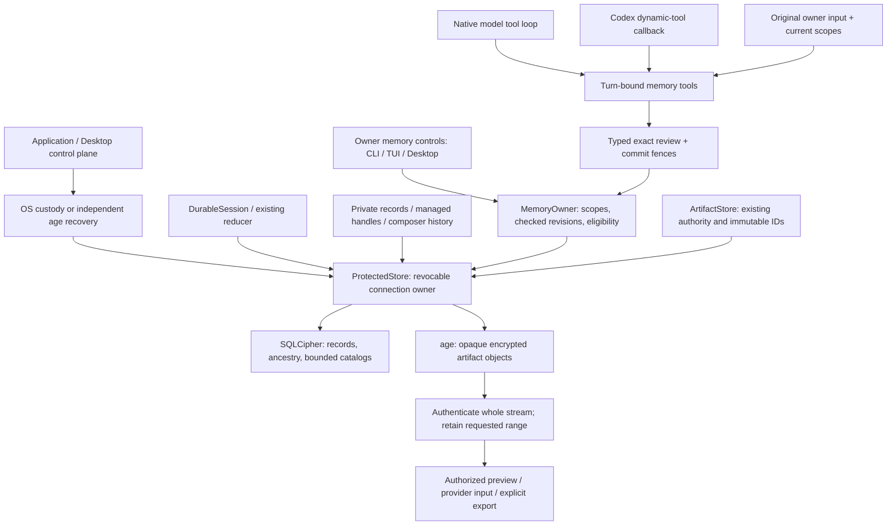

# Protected managed storage

> Audience: Contributors and coding agents  
> Authority: Descriptive

`storage::ProtectedStore` owns one SQLCipher connection and zeroizing secret
bundle behind an `Arc<Mutex<Option<Database>>>`. Clones share revocation, not a
process-global key cache. The composition edge selects OS custody or the explicit
recovery-file environment setting. `Agent` remains unaware of either.

`usage_budget` receives an owned store and dispatch attribution from composition;
`storage::usage` serializes admission and settlement in immediate transactions.
Per-request receipts, conservative unknown reservations and managed cumulative
observations remain distinct from the existing provider/account observation API.
Canonical opens upgrade the accounting schema under an exclusive owner lease;
inspection of a recovery snapshot does not upgrade its schema. See the
[usage policy guide](../user/usage-budgets.md).

`memory::MemoryOwner` is injected into trusted owner management and the narrow
`memory::tools` adapter. CLI/plain/TUI and Desktop management remain local.
Free-form owner requests use model-selected `memory_lookup` / `memory_update`
through the ordinary native registry or managed Codex dynamic-tool bridge, not
an English interception grammar or a pre-turn classifier. Children and background
work receive no foreground owner-input capability. `storage::memory`
owns indexed records, immutable revision history and scoped controls. Current
records validate their indexed ID/revision/scope before exposure. Immediate
transactions serialize checked edits; read transactions hold coherent eligible
snapshots and exports. No SQL, provider, key-custody or filesystem work runs in
Desktop render methods.

Composition advertises memory schemas only when it supplies a `MemoryOwner`.
An absent owner instead installs fixed, unadvertised registry rejections with
typed `Unavailable` results; neither approval nor store I/O is attempted. Native
and managed prompt assembly use availability-specific guidance rather than
combining absent-memory facts with active-tool instructions. Explicit storage
management retains detailed diagnostics; ordinary recall is not a save request.

The native progress guard keeps bounded capability-name hashes for unavailable
results in addition to its existing denial and transient-error windows. After
one rejection it allows an answer or useful alternative; another attempt at that
same unavailable capability stops the turn without dispatch, regardless of changed
arguments. Current-turn history rebuilds that guard on continuation. A new owner
turn resets it. Tool prose is never parsed into this failure classification.

Managed foreground and eager-host registration use the same composition snapshot.
The durable thread receipt records either no memory tools (0), exact v1 tools (1),
or unknown legacy registration (absent). Resumption requires an exact match with
current availability; a mismatch retains the old vendor thread and requests a new
Conversation. Codex owns its retry loop; Xana supplies a short nonretryable error
and retains the existing bounded callback contract, not a second hidden agent.

Schema 3 adds memory tables to accounting schema 2. Canonical upgrades from 1/2
require the exclusive lifecycle lease, commit atomically, close while exclusive,
then reopen through lifecycle checks. Recovery inspection never upgrades.
Statements/encoded records/pages are bounded at 4,096 bytes/8 KiB/64 records.
Eligible inspection lazily merges at most four covering-index cursors in global
sequence order. It reads at most 1,024 matching bodies plus one next sequence
per scope, stopping when 64 active unexpired records are found. Exact-scope
inspection pages use the scope/sequence index without scanning unrelated scopes.
It does not sort an unbounded set of BLOBs in SQLite. A
bounded incomplete view is explicit, not a relevance guarantee. Chat previews
further cap this to eight records and 256 characters per statement. Exports are
coherent create-only private JSON copies capped at 32 MiB, with identity-checked
cleanup of failed output; no plaintext mirror or auto-import exists.

Use/learning/no-memory flags are independent per User/Profile/Project/
Conversation scope. Any applicable restriction and the restore-review gate
limit eligible use. Explicit owner review remains possible. Correction changes
the next eligible read, never an in-flight snapshot. The separate memory
selection and learning modules use those controls before disclosure and commit;
transactional forgetting also invalidates derived work and persists restore
suppression. See [personal memory](../user/personal-memory.md) for the implemented
selection, learning and forgetting policies and their limits.

Semantic tools receive an immutable host-created `OwnerTurnInput`: operation,
source ID, original owner text and cancellation. Native source IDs refer to the
committed user entry; managed source IDs are Xana request identities, not invented
local/vendor transcript entries. The model chooses action and scope aliases, not
provenance or arbitrary Profile/Project IDs. Exact current-source quotations bind
saves/corrections; they do not prove semantic intent or sensitivity. Default-Ask
admits eligible reads and ordinary explicit current-Conversation saves; broader,
sensitive, uncertain, corrective/destructive operations use exact typed memory
review. Explicit deny and background ceilings remain authoritative.
The advertised update schema requires the model's risk interpretation. A caller
that nevertheless omits it is treated as uncertain and still requires review;
an ordinary label never bypasses independent scope or correction/forget review.

`storage::memory::tools` commits privacy/source/controls/revision checks and a
metadata-only idempotent receipt atomically. Receipts are bounded to 16 updates
per owner operation. A successful save/correction marks its source explicitly
handled, preventing queued or in-flight background extraction from duplicating it.
Lookup searches at most 64 scope-indexed records and returns up to eight previews
plus continuation; disclosure IDs are committed with the read. No plaintext
memory file, embedding model or helper request is introduced.
The disclosure ledger separately rechecks up to 1,024 previously exposed record
identities for forgetting; the 64-record search bound does not include those
privacy checks. Reaching the disclosure ceiling requires a fresh Conversation.

Native per-request prompt refresh strips prior PersonalMemory layers and reselects
under existing budgets before dispatch. Managed Codex owns its inner context;
it receives current tool results and next-turn bounded selection. Its bridge
registers only these two tools, validates acknowledged thread/turn/call identity,
bounds callbacks and arguments, and refuses legacy threads lacking a registration
receipt. Vendor file tools do not become a second path into Xana memory.

Homes without the explicit protected bootstrap retain the legacy JSONL/files
backend. A present but incomplete, locked, unsupported, unauthenticated or
unavailable protected store is an error, never a legacy selector. Database
identity and schema version are authenticated before use. Schema creation is one
transaction; activation follows an actual recovery-envelope verification.

SQLite immediate transactions serialize commits. Independent connection owners
hold shared lifetime leases; each native Conversation has one exclusive writer
and append checks the inspected revision. Lifecycle operations require the
exclusive home lease. Lock first drops requesting clones' usable key/connection;
if any independent owner remains it reports failure, not Locked. Frontends must
stop work and release content projections before this final operation.

Native records retain their original parser/reducer and 256 KiB record limit.
Legacy JSONL and explicit full-journal inspection retain their 10,000-record /
16 MiB caps. Protected durable retention is separately bounded at 1,000,000
records / 1 GiB per Conversation; this is not the amount loaded into execution.
Schema 5 maintains encrypted active-path positions in the same
transaction as each head change. Normal advancement appends one index row;
rewind removes a suffix, and a non-prefix branch rebuilds positions through
constant-memory ancestry traversal. Strictly decreasing record sequence rejects
cycles and forward references without collecting every entry ID.

Message-page reads hold one SQLite read transaction and fetch at most 128
records/2 MiB directly by position, validating the active head, contiguous
positions, parent links and decoded identities. They no longer materialize the
whole ancestry index before selecting a page. Exclusive schema upgrade builds
the index; read-only recovery inspection never migrates.

Schema 7 adds typed historical subjects, a cumulative original-record digest and
one bounded execution checkpoint per Conversation. `DurableSession` retains at
most 2,048 message entries and 16 MiB of encoded execution state, keeping exact
unfinished operations and their dependencies. Completed operations and verified
compacted prefixes leave the resident cache, not the canonical journal. Every
64 records and at compaction/clear boundaries, a revision-fenced transaction
binds the checkpoint body to its original-journal prefix. Resume reads that
checkpoint and a bounded exact suffix. Missing checkpoints use the old bounded
reducer path; corrupt or oversized state fails closed.

Complete-history APIs never silently return a suffix. Frontends receive explicit
page positions/totals; selected old operations, artifacts and context versions
use identity-checked indexed inspection. Historical object responses have their
own count/byte bounds. Large branching streams original entries and referenced
artifacts into an atomic new journal, retaining lineage and a compatible verified
checkpoint; a point without a sufficiently bounded continuation is refused.
Forgotten-source quarantine also blocks branching, so copying text cannot make
it newly eligible for memory or recall.

Compaction digests remain hashes of original messages, not previous summaries.
A private, nonserialized hash accumulator advances only newly retired originals
after matching the prior checkpoint; the first compaction after resume streams
the old prefix once. Offline verification streams original records, subject
projections and digest links, validates historical operation/child transitions,
and authenticates old compaction sources even after branch/clear. Offline
verification reuses one transaction-local verified original-prefix accumulator
only for an exact predecessor and source-end boundary; clear/rewind/branch or
an unmatched predecessor require a fresh proof, and inconsistent ancestry fails
closed. This adds no schema, API or persisted digest cache. Current-schema
backup/restore use this bounded verification; old recovery snapshots retain their
original read-only bounded verification path. These are storage/execution bounds,
not a claim about native GUI FPS or process RSS.

Artifacts use opaque UUID filenames, an encrypted content-hash manifest and
standard age streaming encryption. Whole-object authentication, length/hash and
file identity checks precede successful ranges/exports. Explicit export is
create-only and cleans only its own failed output. Managed image input uses
data URLs with an independent 32 MiB outbound RPC bound; inbound Codex frames
retain the 2 MiB bound. No transparent editor temporary-file decryption exists.

See [protected storage](../user/protected-storage.md) for privacy boundaries and
[native storage build inputs](../contributing/native-storage.md) for exact pins.

## Generation lifecycle

`storage::migration` inventories/hashes a selected legacy data directory, verifies
independent recovery before fencing, preserves ordinary settings/package code,
and imports records through existing history semantics. Unknown derived files
become explicit encrypted archives. Config version 5 blocks older readers;
a bounded sibling restart journal blocks current admissions during conversion
and recoverable rename gaps. Source and prepared generations remain distinct.
Windows writer locks are reacquired after directory renames and the source is
revalidated before activation. An unexpected mutation fails closed.

`storage::backup` uses keyed SQLite backup connections with matching SQLCipher
settings and separately copies immutable ciphertext. Full page authentication,
structural/referential validation and complete artifact authentication precede
publication and retention cleanup. A shared backup-directory lock serializes
maintenance. Count/age/byte bounds never delete the last usable copy before its
replacement verifies. These are explicit/due-checked maintenance calls, not an
independent background scheduler.

`storage::restore` publishes a verified protected generation while leaving
ordinary files untouched and retaining the prior encrypted generation. A
durable review-required marker blocks current memory eligibility and prevents future automation services from
treating restored eligibility/grants as current authority. There is no automatic
effect replay, deletion of plaintext legacy copies, or secure-erasure promise.

## Personal context and derived work

`memory` owns scoped records, deterministic next-turn selection and incremental
owner-input learning; `storage::memory`, `storage::forgetting` and
`storage::learning` own the corresponding encrypted transactions. Model helpers
can propose data but cannot commit permissions, broaden scope or override
source/consent revisions. Learning routes are exact native connection/model
approvals. A shared process-level background lease serializes maintenance and
scheduled work; foreground intent preempts it before acquiring a competing
workspace owner.

Forgetting increments a privacy generation, records statement suppression and
quarantines originating Conversations. Selection and extraction recheck that
generation at commit; supported Codex handoff records selected IDs without a
bridge turn. The prompt layer is data with bounded token accounting, never new
instructions. A previously disclosed forgotten fact requires a fresh
Conversation because native/vendor history cannot be claimed erased.

Explicit native source deletion checks a revision-bound preview and an inactive
writer, while retaining shared artifacts. Restore reconciles known later
exclusions from a compatible prior home. A separate reviewed-memory marker can
enable current eligible context without clearing restored automation or usage
gates. See [personal memory](../user/personal-memory.md) for the exact controls,
initial automatic-activation policy and residual-copy limits.

## Governed learning candidates

`memory::candidates` defines typed Memory/inert-Skill payloads and owner intents;
`storage::candidates` owns their indexed encrypted envelope and immediate
publication transaction. The existing learning worker inserts a memory target
and its candidate proof in the same transaction. Ordinary whole-owner-statement
activation records its closed ordinary-preference validation; inferred/ambiguous
facts remain staged. Conflicting duplicate inferred classifications stay staged,
independent of suggestion order. A sensitive helper result creates metadata only,
including when a duplicate suggests a less restrictive classification. Explicit
owner `remember` stays on the separate direct governed path.

The helper proposes a closed preference enum rather than matching English
sentences. Only stated whole-source nonsensitive suggestions can activate a
canonical ordinary value; arbitrary prose stays inactive. Conflicting preference
classifications also stay staged. `OrdinaryPreferenceV2` distinguishes new proof
from historical `OrdinaryStatedAllowlistV1` without rewriting old records.

The envelope binds candidate/target revisions, source IDs/hashes, typed origin,
scope/consent/privacy generation, payload hash, risk, declared validation and
ordered review events. Exact memory publication preserves claim/scope and saves
its pre-image. Undo disables only the unchanged publication. Source/base/control
or restore changes fail closed without rebasing. Generation invalidation is
deliberately conservative, not an inferred merge. Approval, rejection, archive
and rollback are not model tools. Skill review only records `reviewed_only`:
there is no discovery/install/execution dependency or filesystem export side
effect. A real Skill still requires the independent explicit installation path.

Schema 10 adds a scope/sequence page index, lifecycle count index and indexed
memory-target lookup. Canonical schema upgrades use the exclusive lifecycle
lease; old inactive candidates are imported as stale legacy evidence without
inventing provenance. Recovery-snapshot inspection remains read-only. Restore
invalidates the generation even for a new destination, so later memory review
cannot revive pre-restore candidate tokens.

Payloads, pre-images and rejection text are suppressed when a candidate source
is excluded/forgotten; current-memory read/export and prompt selection apply the
same fence to candidate-owned text. Later explicit owner Active revisions,
including a confirmed Restore, remain independently inspectable and usable;
they do not revive excluded candidate evidence. Explicit owner-created records
retain their separate contract. Pages return at most 32 metadata summaries;
one explicit inspection may read a 64 KiB envelope (Skill Markdown <=32 KiB).
Review history is capped at 64 candidate revisions. These controls run off the
frontend render path. Prompt selection uses an indexed candidate-target check
inside its existing bounded read transaction; homes without candidates skip
per-record candidate checks. Inert Skill review/undo does not invalidate memory
generations, and no model call or full draft-catalog load is introduced.
