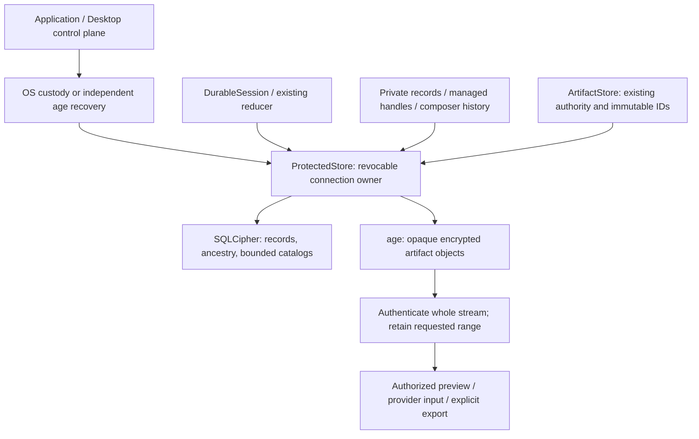

# Protected managed storage

> Audience: Contributors and coding agents  
> Authority: Descriptive

`storage::ProtectedStore` owns one SQLCipher connection and zeroizing secret
bundle behind an `Arc<Mutex<Option<Database>>>`. Clones share revocation, not a
process-global key cache. The composition edge selects OS custody or the explicit
recovery-file environment setting. `Agent` remains unaware of either.

Homes without the explicit protected bootstrap retain the legacy JSONL/files
backend. A present but incomplete, locked, unsupported, unauthenticated or
unavailable protected store is an error, never a legacy selector. Database
identity and schema version are authenticated before use. Schema creation is one
transaction; activation follows an actual recovery-envelope verification.

SQLite immediate transactions serialize commits. Independent connection owners
hold shared lifetime leases; each native Conversation has one exclusive writer
and append checks the inspected revision. Lifecycle operations require the
exclusive home lease. Lock first drops requesting clones' usable key/connection;
if any independent owner remains it reports failure, not Locked. Frontends must
stop work and release content projections before this final operation.

Native records retain their original parser/reducer and size/record limits.
Encrypted ancestry metadata permits bounded message-page selection without
loading every body, but full execution restore still has the existing bounded
history limit. This is not the future unbounded-history/retained-worker design.

Artifacts use opaque UUID filenames, an encrypted content-hash manifest and
standard age streaming encryption. Whole-object authentication, length/hash and
file identity checks precede successful ranges/exports. Explicit export is
create-only and cleans only its own failed output. Managed image input uses
data URLs with an independent 32 MiB outbound RPC bound; inbound Codex frames
retain the 2 MiB bound. No transparent editor temporary-file decryption exists.

See [protected storage](../user/protected-storage.md) for privacy boundaries and
[native storage build inputs](../contributing/native-storage.md) for exact pins.

## Generation lifecycle

`storage::migration` inventories/hashes a selected legacy data directory, verifies
independent recovery before fencing, preserves ordinary settings/package code,
and imports records through existing history semantics. Unknown derived files
become explicit encrypted archives. Config version 5 blocks older readers;
a bounded sibling restart journal blocks current admissions during conversion
and recoverable rename gaps. Source and prepared generations remain distinct.
Windows writer locks are reacquired after directory renames and the source is
revalidated before activation. An unexpected mutation fails closed.

`storage::backup` uses keyed SQLite backup connections with matching SQLCipher
settings and separately copies immutable ciphertext. Full page authentication,
structural/referential validation and complete artifact authentication precede
publication and retention cleanup. A shared backup-directory lock serializes
maintenance. Count/age/byte bounds never delete the last usable copy before its
replacement verifies. These are explicit/due-checked maintenance calls, not an
independent background scheduler.

`storage::restore` publishes a verified protected generation while leaving
ordinary files untouched and retaining the prior encrypted generation. A
durable review-required marker prevents future memory/automation services from
treating restored eligibility/grants as current authority. There is no automatic
effect replay, deletion of plaintext legacy copies, or secure-erasure promise.
