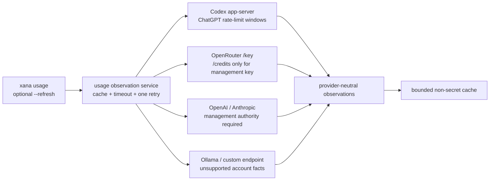

# Provider contracts

> Audience: Contributors and coding agents
> Authority: Descriptive

Xana's native agent depends on one `ConversationalProvider` contract. It
streams one provider-neutral assistant message from ordered internal messages,
the frozen tool definitions, a step identity, and separate assistant-text and
provider-reasoning deltas. Authentication,
catalog discovery, model selection, and managed agent runtimes are separate
composition concerns.

## OpenAI-compatible family

Ollama, custom OpenAI-compatible endpoints, the OpenAI API, and OpenRouter use
the same private Chat Completions wire adapter. Connection policy supplies the
base URL, optional bearer key, and OpenRouter's `X-Title` attribution. The
shared SSE decoder bounds frames, accepts platform-independent chunking,
requires the `[DONE]` marker for this family, and assembles tool arguments
before exposing an internal tool call. A missing or malformed terminal stream
condition remains visible in the safe typed error instead of collapsing to an
opaque provider failure. Connection, response-start, and stream-idle waits are
bounded. Complete-response accumulation is
bounded independently for text, tool bytes, and tool-call count. Unsupported
internal message shapes fail before HTTP.

OpenAI and OpenRouter require a declared static credential reference. Ollama
and custom endpoints may be unauthenticated or use a declared bearer
credential. A missing declared credential never falls back silently. Bearer
and attribution headers use the HTTP client's validated request builder;
malformed values fail the request instead of silently removing authentication.

## Anthropic Messages

Anthropic uses its own private adapter and `x-api-key`. Leading system content
maps once to the top-level `system` field. Ordered text, image, tool-use, and
correlated tool-result blocks map to the Messages API without adding vendor
types to Xana's internal model. The typed stream accumulator uses the same SSE
framing and enforces message and content-block order, per-block and aggregate
text/tool-input bounds, a bounded block count, complete tool JSON, and a final
`message_stop`.

Xana supports Anthropic API keys only. It does not offer Claude Free/Pro/Max
subscription OAuth.

## Model metadata

Each model belongs to a connection. Descriptors retain display name, input
modalities, tool and reasoning support, optional context/output limits,
default status, and whether a field came from configuration, remote discovery,
or a managed runtime. Codex descriptors additionally retain each advertised
reasoning effort, its description, and the default effort. Configuration
overrides and cached remote evidence merge per field. Unknown capability does
not become an optimistic `true`.

Catalog refresh is explicit and bounded; it writes non-secret JSON to the
cache. Native startup performs no catalog request. Managed Codex launch is the
exception: it negotiates a bounded live catalog with the running app-server
before accepting a turn. See
[Connections, models, and managed runtimes](models-and-managed-runtimes.md) for
selection and managed Codex behavior.

Ollama discovery first lists installed models through `/api/tags`, then probes
each bounded model through `/api/show` with bounded concurrency. Xana maps
Ollama's advertised `vision`, `tools`, and `thinking` capabilities plus context
length into the provider-neutral descriptor. This is why a locally installed
vision model can accept images without a manual capability override.
Incoming Chat Completions streams accumulate text and indexed tool-call fields
independently because providers may interleave those sibling delta fields.
Xana then canonicalizes one internal assistant message as answer text followed
by tool calls in index order; wire arrival order is not treated as an internal
content-block ordering guarantee.

The native OpenAI-compatible adapter currently uses Chat Completions and has
no first-class reasoning-effort or reasoning-summary wire mapping. Those model
options are therefore accepted only for managed Codex selections. Supporting
them for the OpenAI API requires a future native Responses adapter rather than
silently dropping the user's requested setting.

## Usage and account observations

Provider execution and account inspection are separate. Native response
adapters retain only provider-reported input, output, cache-read, cache-write,
reasoning, tool, total-token, and cost fields. Xana also measures serialized
prompt and tool-schema byte counts as local resource facts. Request IDs are
reduced to a bounded BLAKE3 affinity digest before they leave the adapter; raw
IDs and headers are never retained in frontend state.

`usage_observation` normalizes those per-request deltas alongside managed
cumulative snapshots. It also owns explicit, bounded account refresh:

OpenRouter's configured inference key may inspect its own key facts. Xana calls
the credit endpoint only when that response identifies the credential as a
management key. Ordinary OpenAI and Anthropic inference keys are never tried
against organization-management APIs; the current configuration has no
separate admin-credential slot, so those account facts report permission
required. Ollama and generic compatible endpoints report unsupported rather
than zero or unlimited. A Codex ChatGPT account exposes app-server rate-limit
windows; API-key Codex mode does not pretend those are subscription limits.

Account responses and caches are capped at 256 KiB, observations at 128 per
refresh, source work at 15 seconds, and retryable failure at one retry. Cache
freshness defaults to 60 seconds and explicit refreshes within one second reuse
the cache. There is no background poller. Failures preserve a marked-stale
cache when available and cannot block conversational generation.
