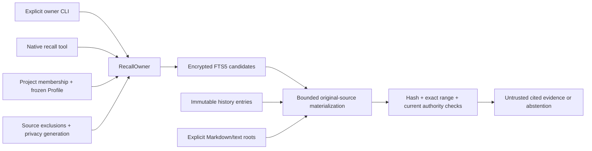

# Project and selected-knowledge recall

> Audience: Contributors and coding agents
> Authority: Descriptive

`recall::RecallOwner` owns selection and materialization. `storage::recall`
owns a rebuildable FTS5 index inside the existing SQLCipher database. CLI and
native-tool adapters call the same owner; they do not implement separate
retrieval policy or write personal memory.

Default eligibility is exact Project plus frozen Profile identity; Ungrouped
means exact Conversation. Explicit inclusion can select up to 32 same-Project
Conversations across Profiles. Neither scope strings from callers nor model
claims establish membership. Source membership, frozen metadata, exclusions,
root grants and privacy generation are rechecked before results are returned.

`recall_sources` stores bounded source identity/hash metadata; `recall_search`
contains lexical chunks; `recall_progress` keeps per-Conversation indexing
cursors and their actual scope. A scope change restarts incremental traversal.
An index hit is never source authority: original entries are selected by exact
ID and original note files are opened with canonical/link/identity checks.
Changed, deleted, revoked or forgotten sources abstain even before index cleanup.
Index mutations check the protected privacy generation in their transaction.
Deleting native history cascades its derived source/cursor rows and removes its
lexical chunks; independently selected notes are unaffected. Shared source
eligibility follows native branch lineage through bounded point lookups (at
most 32 identities), so preexisting descendants inherit ancestor quarantine.
Missing declared parents, cycles and excess depth deny automatic reuse without
requiring a whole-history scan or erasing inspectable descendants.

Native history indexing is an explicit bounded refresh with counts and a
resumable cursor, not a provider call or hidden full-history scan during chat.
Notes refresh scans only an explicit selected directory under fixed file,
byte, depth and traversal bounds; matching hashes avoid rewriting chunks.
An encrypted, bounded metadata manifest fixes the scan's file inventory and
next-file position. Each 1,000-file/100-MiB processing batch checks current originals
and persists its cursor using compare-and-swap plus the privacy generation.
Cancellation preserves the cursor; crash replay is bounded and idempotent. Only
completed scans atomically remove missing-source rows and the cursor, so partial
or competing scans cannot prune unprocessed evidence. Selection/policy changes
invalidate old cursors; explicit restart captures a fresh inventory.
Explicit rebuild deletes only scoped derived rows/cursors; it does not mutate
history, original files, selected roots, or disclosure grants. Registered text
artifacts use the same Conversation authority and the existing content-hash
verified bounded artifact reader; arbitrary blobs/media are not scanned.
Originals remain externally editable. Managed copies and indexes remain in
the encrypted database. Recalled content is labeled untrusted evidence and
does not enter the personal-memory store.

Local indexing and provider disclosure are separate capabilities. A root stores
exact native route digests, including configured endpoint and credential
reference rather than a credential value. CLI inspection is local. The native
tool supplies its actual active route; ungranted notes are not materialized for
that route. Managed Codex has no native recall-tool bridge.

The retrieval facade bounds query bytes, term count, candidate count, original
bytes per candidate and returned excerpts. It does not deserialize the entire
session journal. Historical operation inspection, continuation checkpoints and
the paged transcript remain responsibilities of `session` and `storage::history`.

See [user controls and exact bounds](../user/project-recall.md). SQLite's
[FTS5 documentation](https://www.sqlite.org/fts5.html) describes the embedded
lexical primitive; it introduces no server or vector-store dependency.
