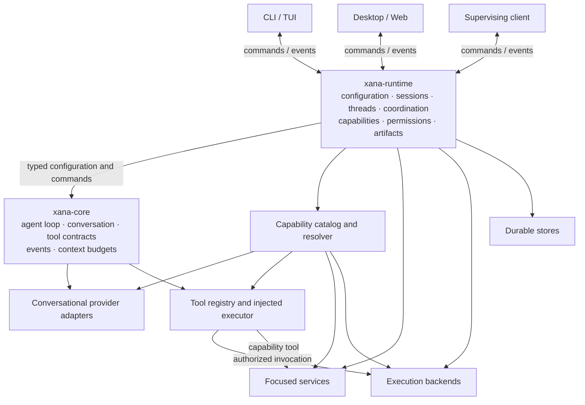

# Runtime and frontend boundaries

> Audience: Contributors and coding agents  
> Authority: None  
> Status: Proposed

## Context

[Architecture](../architecture/README.md) describes Xana's implemented
single-crate boundaries. This proposal explores a physical separation that
keeps the engine headless, puts application policy in one runtime layer, and
treats every frontend as a client of that layer.

## Proposed component model



### Headless engine

The proposed `xana-core` package owns:

- the agent loop as a value;
- internal message, content, tool-call, and event types;
- conversational-provider and focused-tool contracts;
- child-agent orchestration primitives;
- context assembly and token budgets.

It does not load configuration files, inspect environment variables, persist
sessions, grant permissions, choose operating-system paths, or render a
frontend. Tool implementations and executors are injected rather than obtained
through ambient process authority.

### Application runtime

The proposed `xana-runtime` package owns:

- resolving and validating shared configuration;
- capability discovery, dependency resolution, and immutable per-agent tool
  snapshots;
- provider connections, model descriptors, profiles, and task routes;
- provider, focused-service, tool, and execution-backend construction;
- permission evaluation, approval correlation, and audit facts;
- artifact storage and resolution;
- project, thread, turn, operation, and agent identity;
- persistence, recovery, admission, cancellation, and concurrency limits;
- command routing, client snapshots, and event fan-out.

A foreground CLI could embed the runtime. A future `xana serve` process could
host the same runtime for attached clients. This proposal does not promise a
global daemon; cross-process ownership and locking need an explicit design
before independent processes can safely write one Xana home.

### Frontends

Frontends translate interaction into runtime commands and render runtime
observations. Terminal colors, TUI layout, desktop panels, themes, window
state, and shortcuts remain frontend concerns. A frontend may edit shared
configuration through runtime-owned validation, but it does not independently
mutate shared state or implement another agent loop.

The exact command, event, snapshot, and concurrency contracts are developed in
[Proposal 0005](0005-runtime-protocol-threads-and-concurrency.md).

## Proposed physical workspace

After the logical boundaries have been exercised, the Rust workspace would
separate into:

```text
xana-core       headless engine and public internal types
xana-runtime    application policy, capability routing, permissions,
                artifacts, persistence, and coordination
xana-cli        terminal frontend and process entry points
```

Additional frontend packages consume the runtime protocol. They do not link
provider wire types or reimplement session mutation. Focused bundled
capability packs may become additional crates or adapters registered at a
composition root; the engine does not depend outward on document, media, MCP,
WASM, or service implementations.

## Open questions

- Which exercised module seams are strong enough to become public crate
  boundaries?
- Does `xana serve` belong in the CLI package or a separate host package?
- What process owns shared state, locks, and migrations when more than one
  frontend attaches?
- Which runtime types form a stable cross-process protocol rather than an
  internal Rust API?
