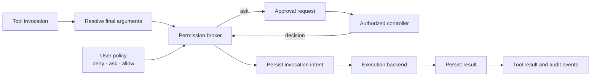

# Tool authority and execution

> Audience: Contributors and coding agents  
> Authority: None  
> Status: Proposed

## Context

Workspace path checks, resource bounds, effect labels, permission decisions,
and process isolation solve different problems. This proposal keeps capability,
authority, and containment distinct while routing built-in and extension
effects through one decision point.

## Proposed layers

| Layer | Question | Proposed owner |
|---|---|---|
| Capability | Can this model, tool, service, or backend perform the operation? | Descriptor or extension manifest, validated by the runtime |
| Authority | May this action run with this scope now? | User policy evaluated by the runtime |
| Containment | What can the process physically reach if policy or model behavior fails? | OS, container/VM, or remote execution boundary |

An in-process allowlist or command classifier is policy, not a sandbox. Only an
OS- or virtualization-enforced boundary is described as containment.

## Proposed invocation flow

Policy evaluates `deny` before `ask` before `allow`. Grants have explicit
scope—for example, one call, a session, a canonical workspace path, a command,
a network destination, an application, or an external side effect. Prompts,
screen text, repository configuration, extension code, profiles, foreign
agents, and child agents cannot grant themselves authority. A child's
effective authority is no broader than the intersection of its parent's
ceiling and selected profile.

When required approval has no authorized interactive controller,
noninteractive execution fails closed. Approval requests and decisions carry
stable correlation identifiers and are recorded without copying secrets into
sessions. A decision binds to the invocation and final effective arguments;
changing those arguments requires another evaluation.

Invocation-intent and result durability are developed in
[Proposal 0004](0004-durable-operations-and-recovery.md). Hooks that transform
effective arguments are developed in
[Proposal 0005](0005-runtime-protocol-threads-and-concurrency.md).

## Execution backends

The first local executor may use the Xana process's host permissions and must
say so plainly. Other backends may route work into containers, VMs, remote
workers, isolated browsers, or platform desktop adapters. Every backend still
crosses the capability and authority layers; containment does not imply
permission, and permission does not imply containment.

Typed native context/agent plans should cover bounded selection, fan-out, and
aggregation before Xana considers arbitrary generated computation. A language
kernel is not a universal interface and does not belong in the headless core.
If evaluations later justify a general-code adapter, it enters through an
`ExecutionBackend`, receives only explicit capabilities and typed references,
and reports its real containment. Xana must remain fully functional without it.
See [Proposal 0008](0008-artifact-backed-context-and-native-plans.md).

## Open questions

- What user-owned policy language represents deny, ask, allow, and scoped
  grants?
- How is a controlling client authenticated and authorized to approve work?
- Which transformations may occur before approval, and how are they displayed?
- What execution backends are worth standardizing before a sandbox is offered?
- Which measured native-plan gap, if any, justifies a general-code backend?
