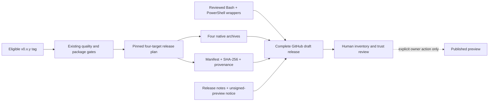
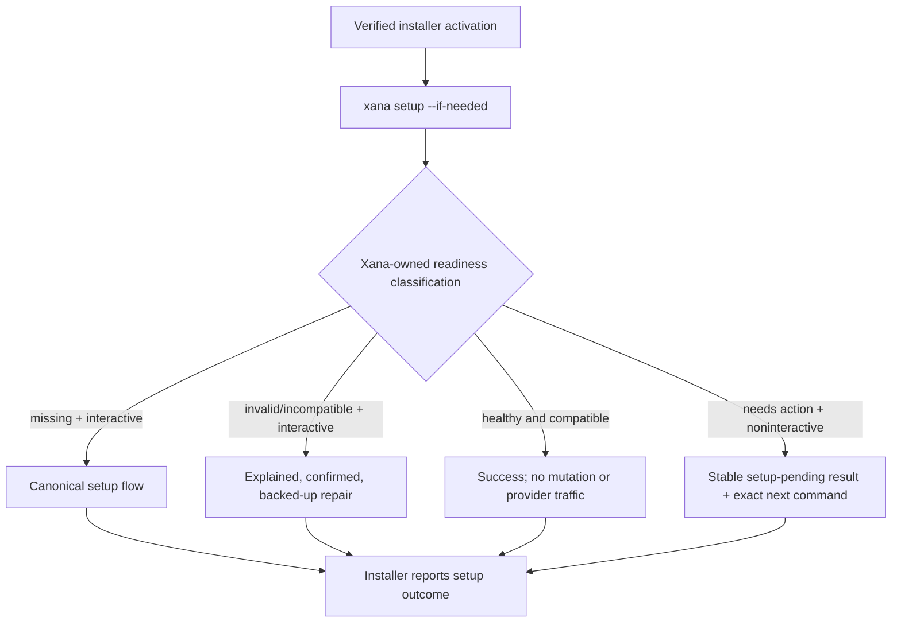

# Bounded native Release Preview distribution

> Audience: Contributors and coding agents  
> Authority: Prescriptive  
> Status: Accepted

## Context

Xana is currently installable from a checkout or a locked Git Cargo build. It
has no prebuilt archive, installer, package-manager channel, automatic updater,
or crates.io publication. That source-only boundary is appropriate for
contributors but prevents a person without Rust from evaluating the terminal
application.

The first native binary release must be useful and attributable without
claiming the signing, support, platform breadth, package channels, desktop
delivery, or update lifecycle of mature Product Distribution. This proposal
accepts a narrow Release Preview after Course 1. It is a delivery gate, not a
numbered product milestone or a stable compatibility promise.

## Accepted product boundary

The public `labcoder/xana` repository is the source and release authority. One
terminal application, built from the `xana-cli` package, is distributed. Core,
runtime, and development compatibility packages do not become separate
end-user products or crates.io promises.

The initial target matrix is exactly:

- `x86_64-pc-windows-msvc`;
- `aarch64-apple-darwin`;
- `x86_64-apple-darwin`; and
- `x86_64-unknown-linux-gnu`.

Every release carries platform-conventional archives, a machine-readable
manifest, SHA-256 data, the reviewed Bash and PowerShell installers, release
notes, and GitHub build-provenance attestations. Unsupported targets fail
explicitly; no nearest-looking artifact is substituted.

A pinned release planner owns target planning, native builds, archive layout,
manifest and checksum generation, and provenance intent. Small
source-controlled Xana wrappers own product behavior that generated installers
cannot express honestly: platform selection, verification before activation,
install/update receipts, PATH consent, and the post-install readiness handoff.

An eligible tag assembles or updates one complete draft GitHub Release. A
workflow never publishes it automatically. Missing targets, installers,
checksums, manifest data, attestations, or notes prevent a reviewable draft.
The owner publishes only after verifying the exact tag, commit, inventory,
checksums, provenance, platform smokes, and limitations. A published tag and
its assets are immutable by policy; a correction receives a new patch version.

## Accepted install and update model

The installers acquire a prebuilt executable without Rust, Node, Python,
elevation, or a repository checkout. The defaults are
`~/.local/bin/xana` on macOS/Linux and
`%LOCALAPPDATA%\Programs\Xana\bin\xana.exe` on Windows. An explicit install
directory may override the default. `XANA_HOME` never selects executable
placement.

Latest means the newest published ordinary preview. A requested semantic
version selects one immutable release. Repeating the installer is the preview
update mechanism and must distinguish a new install, same-version reinstall,
upgrade, and downgrade. Downloads, manifest values, archive paths, and existing
executables are untrusted inputs. Both wrappers require HTTPS, verify SHA-256
before extraction, reject unsafe archive contents, smoke the staged executable,
and replace the destination failure-safely without discarding a working prior
binary on earlier failure.

PATH mutation is separate, explicit authority. An interactive installer may
offer a user-scoped change when the selected directory is absent. A
noninteractive installer changes PATH only when an explicit flag requests it.
Every change and any new-shell requirement is reported. Neither wrapper reads,
parses, repairs, removes, or migrates Xana configuration or credentials.

Git Cargo installation remains a supported alternative using the checked-in
lockfile and an optional exact tag. That source channel requires Rust. It does
not imply crates.io publication.

## Accepted readiness handoff

Executable state and configuration readiness are independent. After successful
activation, an installer delegates readiness to exactly one Xana-owned process
contract, `xana setup --if-needed`, unless the user selected `--no-setup`.

Xana alone owns platform paths, schema parsing, compatibility, backup,
migration, repair confirmation, and diagnostics. Healthy readiness is local,
read-only, and performs no provider or credential operation. Missing setup or
invalid/incompatible configuration enters the canonical setup or confirmed
repair path only with a usable terminal. Without one, Xana never prompts or
mutates state; it returns a stable setup-pending result with exact next steps.
Cancellation remains pending. Unexpected filesystem, schema, or permission
failures remain failures rather than being mislabeled as readiness.

## Trust and support limits

SHA-256 detects bytes that differ from the release manifest. GitHub
attestations link artifacts to the public workflow, repository, commit, and
digest. Neither mechanism is an operating-system publisher signature or a
claim that the program is safe. Release Preview does not include Apple
Developer ID signing or notarization, Windows Authenticode, a support SLA, or a
stable third-party manifest API. Documentation states these limitations beside
installation and verification commands and does not recommend weakening host
security controls.

## Lifecycle and removal

Preview updates rerun an installer for latest or an exact version. There is no
`xana update`, background check, channel selection, retained rollback, or
automatic launch-time update. Removal is documented as exact cleanup of the
installer-owned executable and any installer-owned PATH entry. It never aliases
`xana reset`, deletes configuration, sessions, artifacts, credentials, or
workspaces, or alters external Codex state. No purge or installer uninstall
command is accepted here.

## Explicit deferrals to Product Distribution

Product Distribution remains responsible for:

- Apple signing/notarization and Windows Authenticode;
- Windows ARM64 and evidence-backed wider Linux ARM64/glibc/musl coverage;
- Homebrew, WinGet, finalized Cargo/crates.io policy, and any demand-driven npm
  channel;
- `xana update`, signed update metadata, channels, retained rollback, and a
  first-class uninstall lifecycle;
- separately built and publisher-signed desktop artifacts; and
- a mature release/support policy.

The Release Preview cannot grow those guarantees implicitly. Each requires a
later accepted contract and measured platform evidence.

## Implementation and status

Implementation proceeds through independently testable slices: reproducible
native planning, Xana-owned setup readiness, two equivalent installers, an
attributable draft workflow, complete user/contributor documentation, and a
four-platform release gate. Architecture and User Documentation must be
updated in the same change as each shipped slice.

The reproducible native plan, Xana-owned `setup --if-needed` readiness
contract, four-target manifest grammar, and verified macOS/Linux Bash installer
are implemented. The Windows installer, draft workflow, reconciled public
documentation, and four-platform release gate remain outstanding.

Until every slice exists, this proposal remains Accepted and Architecture's
source-only distribution description remains authoritative. Publishing a
draft or public release is an external owner-controlled effect and is never
inferred from implementation completion.
