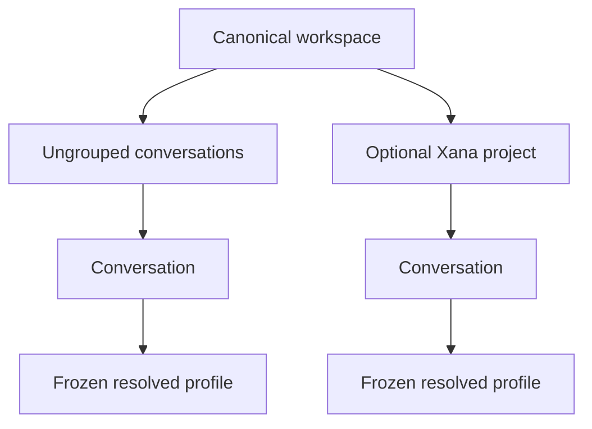
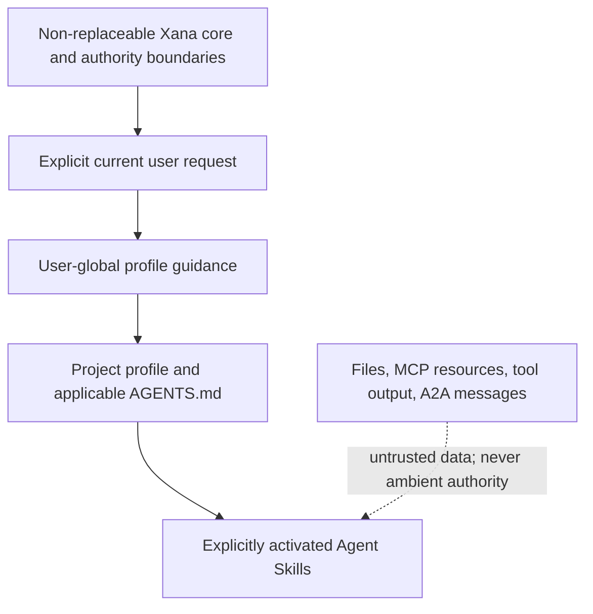

# Projects, profiles, and portable configuration

> Audience: Contributors and coding agents  
> Authority: Prescriptive  
> Status: Implemented

## Context

Xana currently identifies work by a canonical workspace and stores conversations
independently. Its named agent profiles are installation-global child execution
templates, not a complete user-facing profile system, and there is no project
registry or portable project configuration. Milestone 3 adds these concepts
without making a project mandatory, rewriting conversation history, or treating
workspace files as private application state.

This proposal accepts only the project, profile, portable-configuration,
instruction-precedence, and migration slice needed for Xana: Interoperable. The
broader state, runtime, context, remote-hosting, and retained-agent designs in
Proposals 0001 through 0009 remain Proposed.

## Vocabulary and ownership

- A **workspace** is the canonical filesystem root that bounds host tools and
  root execution. Xana does not own its files.
- A **project** is an optional Xana organizational record anchored to exactly
  one canonical workspace. Xana's private data store owns its identity,
  display name, lifecycle, and local bindings.
- An **ungrouped conversation** has a workspace but no project membership.
- A **profile** is a named immutable input template. It may select identity
  guidance, a conversational connection/model, reasoning, skills, services,
  external connections, permissions, budgets, task routes, and primary/child
  applicability. It is configuration, not a running agent.
- A **resolved profile snapshot** is the exact redacted value frozen for a
  conversation. Changing a profile never silently changes existing authority.
- **Portable project configuration** is explicitly shared non-secret TOML under
  `.agents/xana/`. Detection is an invitation to inspect or register, not
  authority or installation state.

Human-authored global configuration remains in Xana's configuration owner.
Private project identity, membership, local bindings, and package/trust state
remain in versioned runtime-owned records. Credentials remain in the OS
credential store or explicit environment references. Frontend preferences,
sessions, artifacts, and provider-owned histories keep their existing owners.

## Workspace, project, conversation, and profile contract

The following invariants are mandatory:

1. Every tool-capable conversation has one canonical workspace.
2. A project is explicitly created or registered and is never inferred from
   historical conversations.
3. At most one non-forgotten project is anchored to a canonical workspace.
   Any number of conversations in that workspace may remain ungrouped.
4. Same-workspace membership changes are atomic metadata transitions. They do
   not rewrite immutable conversation entries or provider thread handles.
5. Moving work across workspaces creates a continuation with a new conversation
   identity and a bounded, reviewable handoff. The source remains unchanged.
6. Rename, archive, relink, unarchive, and local forget never delete workspace
   files, sessions, artifacts, credentials, or provider-owned history.
7. A conversation freezes its resolved profile. Selecting a different profile
   creates an explicit continuation. Existing owner-specific model/reasoning
   changes retain their current documented semantics.
8. Canonical path identity uses platform path APIs and existing workspace
   identity rules, never display strings or prefix comparisons.

## Profile resolution

Profiles may be user-global or project-local and may be allowed for primary
use, child use, or both. Profiles do not inherit. A user may explicitly
duplicate one as a starting point, but resolution always produces one complete
value. Project-local configuration may narrow user authority and expose only
locally bound resources; it cannot grant authority beyond user-owned policy.

Resolution is deterministic and inspectable. It validates referenced
connections, models, routes, skills, plugins, services, external agents,
budgets, and permission ceilings, while preserving typed unavailable reasons.
The snapshot stores stable references and redacted values, never credential
material. Missing local bindings make the profile or project visibly not ready
instead of triggering fallback.

## Instruction precedence and trust

This ordering resolves prose guidance only. Capability exposure, permission
ceilings, egress policy, and containment are enforced outside prompt text. A
file, skill body, plugin manifest, MCP response, remote-agent message, or model
output cannot promote itself, install software, enable a capability, add a
credential, or expand authority. Conflicts that cannot be resolved within this
model are surfaced to the user rather than silently guessed.

## Portable configuration and local bindings

Project creation is private and does not modify the workspace. An explicit
share operation writes validated non-secret configuration beneath
`.agents/xana/`, initially `project.toml` plus referenced safe profile material.
Portable data may declare:

- project metadata without machine-specific identity;
- project-local profiles and instruction references;
- skill and plugin requirements pinned by their supported identity/version;
- MCP, external-agent, and focused-service binding requirements;
- safe defaults and permission ceilings that only narrow authority.

Portable data never contains credentials, tokens, private paths, conversation
history, artifacts, personal presentation settings, trust grants, package
install state, or endpoint identity approvals. Import is plan/review/apply: Xana
validates and displays the proposed registration and missing local bindings,
then writes private state only after explicit confirmation. Local setup maps
portable references to installation-owned connections without editing secrets
into the workspace.

## Lifecycle and failure contract

Human-authored configuration and every authoritative private record are
versioned. Milestone 3 migration must preserve existing connections, model
metadata, credential references, permissions, task routes, shell behavior,
presentation ownership, sessions, artifacts, Codex handles, comments, and
human organization. Existing profiles become equivalent user-global profiles;
existing conversations remain ungrouped.

Migration and project/profile mutations use cross-process exclusion,
plan/review/apply semantics, validation before commit, atomic replacement,
recoverable backup, idempotent rerun, and typed recovery. An interrupted
multi-record change must leave the prior authoritative state usable or an exact
recovery plan; it must not publish a new version marker before all required
writes are durable. Unknown required schema versions fail closed. Unknown
optional declarations remain preserved and inspectably unavailable.

Project and profile commands are application control-plane operations. Agent
turns and discovered content cannot create, register, relink, forget, share, or
change them. Concurrent processes cannot create conflicting project identities
or conversation membership.

## Security and resource limits

- Paths are canonicalized and compared through platform-aware identity rules;
  symlinks, junctions, UNC paths, missing paths, case behavior, and worktrees
  receive explicit tests.
- Portable files are bounded untrusted input. Parsing, referenced-file counts,
  text size, and diagnostic output are limited before materialization.
- Redacted inspection never emits environment values, credential-store data,
  tokens, headers, transcript content, or private endpoint metadata.
- Profile resolution and project indexes are bounded and may cache only
  derivable non-secret data. Optional project support must not materially slow
  startup for users who have no projects.

## User surfaces

Typed application commands own create, inspect, list, rename, archive,
unarchive, relink, forget, share/import, profile creation/duplication/editing,
resolution preview, and conversation placement. CLI, plain mode, TUI, setup,
doctor, and future frontends invoke the same commands; frontends do not own a
second registry or resolver. Diagnostics distinguish missing paths, missing
bindings, invalid portable data, unsupported versions, unavailable optional
integrations, and authority conflicts.

## Explicit deferrals

This proposal does not accept mandatory projects, multi-root projects,
automatic project creation, nested project instruction discovery, profile
inheritance, mutable profiles inside existing conversations, project-granted
authority, remote/multi-user hosting, public frontend protocol stability,
retained/background agents, general context compaction, or workspace-file
deletion. Those broader ideas remain non-authoritative unless separately
accepted.

## Relationship to broader proposals

- Proposal 0001 remains Proposed for its broader physical workspace and public
  runtime/frontend decomposition.
- Proposal 0005 remains Proposed for remote/multi-client durable thread and
  retained-work designs; only the project/conversation rules above are
  accepted here.
- Proposal 0007 remains Proposed for its wider state and extension model; this
  proposal owns the accepted project/profile/portable-state slice.
- Proposal 0008 remains Proposed for generalized artifact-backed context plans
  and compaction. A bounded continuation handoff does not accept that design.

## Implementation status

The accepted Milestone 3 slice is implemented. Xana now owns optional private
projects and membership, user-global and portable project profiles, immutable
resolved conversation snapshots, explicit same-workspace placement and
cross-workspace continuation, bounded `.agents/xana/` import/share, and locked
plan/review/apply migration. Architecture and User Documentation describe the
current behavior. The broader deferrals above remain proposed work.
