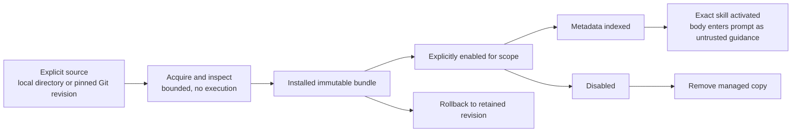
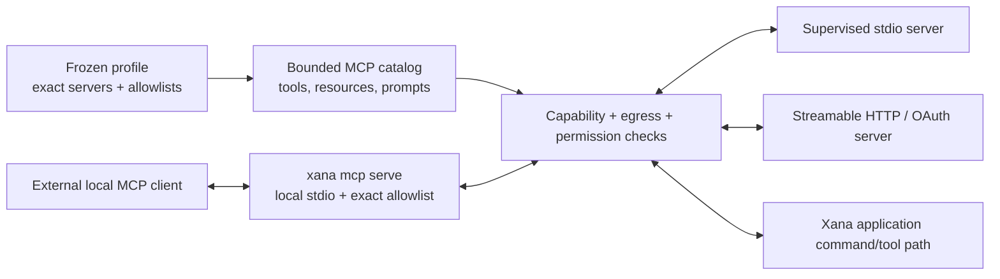
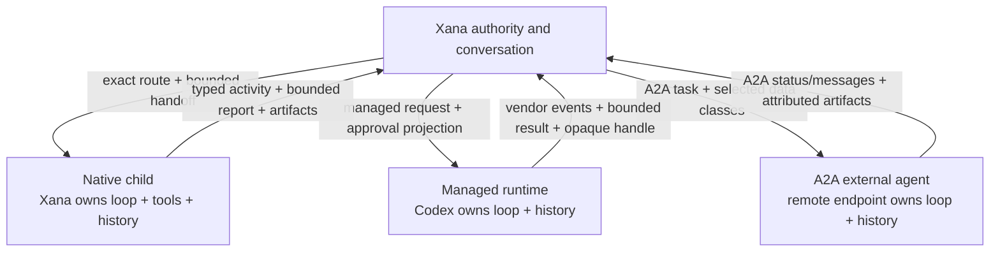
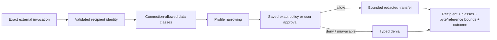

# Standards interoperability and external-agent boundaries

> Audience: Contributors and coding agents  
> Authority: Prescriptive  
> Status: Accepted

## Context

Xana needs to consume portable Agent Skills and Agent Plugins, connect to MCP
servers, expose one bounded local MCP surface, and delegate tasks to external
A2A agents. Treating these as arbitrary in-process plugins or as ordinary
conversational providers would collapse discovery, installation, enablement,
availability, exposure, authorization, process ownership, and trust.

This proposal accepts the bounded Milestone 3 interoperability slice. It does
not accept a general plugin ABI, remote Xana server, A2A server, retained remote
agents, MCP experimental features, or automatic package acquisition.

## Roles and owners

- An **Agent Skill** is a standards-compatible instruction package. Its
  metadata can be indexed; its body becomes prompt input only when activated.
- An **Agent Plugin** is a standards-compatible manifest plus skills and MCP
  configuration. It contributes no arbitrary code to Xana's process.
- An **MCP connection** is an explicitly configured stdio or Streamable HTTP
  peer. Xana owns transport supervision, namespace projection, permissions,
  egress, credentials, cancellation, and bounded disclosure.
- The **local Xana MCP server** is an explicit stdio process surface exposing
  one exact allowlist. It is not an ambient attachment to an active
  conversation and is not a public stable Xana protocol.
- An **ExternalAgentConnection** is a trusted A2A endpoint. The remote agent
  owns its loop, history, tools, and reasoning; Xana owns endpoint trust,
  bounded handoff, egress, observation, cancellation, artifact ingestion, and
  local accounting.

Compatibility with a standard establishes syntax and protocol behavior, not
authority. All standards are pinned to an explicit supported version or date,
and unsupported required versions fail with typed diagnostics.

## Standards baseline

Milestone 3 targets these primary-source baselines:

- [Agent Skills specification](https://agentskills.io/specification), upstream
  snapshot `69ef37e9424c0a7ea9dd2293b559e43ec8176379` retrieved 2026-08-11. The
  upstream format has no independent numbered release, so Xana records the
  source revision and supports the required `SKILL.md` contract from that
  snapshot.
- [Agent Plugins Specification 1.0.0](https://agent-plugins.org/specification),
  including the canonical `plugin.schema.json` and `mcp.schema.json` identifiers
  for `1.0.0`. Its Working Draft label is surfaced in diagnostics and does not
  permit Xana to reinterpret unknown fields.
- [Model Context Protocol 2026-07-28](https://modelcontextprotocol.io/specification/2026-07-28),
  limited by this proposal to stdio and Streamable HTTP client behavior, tools,
  resources, prompts, and client-owned OAuth. Extensions including Tasks,
  sampling, and elicitation remain excluded.
- [A2A Protocol 1.0.0](https://a2a-protocol.org/v1.0.0/specification), tag
  `173695755607e884aa9acf8ce4feed90e32727a1`, limited to client-side Agent Card
  discovery, task/message exchange, streaming status, cancellation, and
  artifact ingestion.

These pins are compatibility floors for Milestone 3 tests, not permission to
fetch schemas or executable content during discovery. Supporting a later
breaking standard requires an explicit compatibility change and fixtures.

## Skills and plugin lifecycle

Skill sources are user-global `.agents/skills/`, workspace/project
`.agents/skills/`, and enabled plugin `skills/`. Discovery reads bounded
metadata without executing content, following arbitrary links, starting
processes, accessing credentials, or using the network. Full bodies load only
through explicit user activation or a model request that the immutable profile
allows and the application approves. Name collisions require qualification or
user resolution; there is no silent precedence.

Plugin acquisition accepts an explicit local directory or Git source pinned to
an exact revision. Normal installation copies a validated bundle into an
immutable runtime-owned store. Explicit linked development mode remains
visibly mutable and unavailable to ordinary unattended execution. Install,
inspect, enable, disable, update, rollback, and remove are distinct recoverable
control-plane operations. Discovery and invocation never install or update.

Enabled plugin contributions are declarative skills and MCP configuration only.
Availability still depends on platform, local bindings, process health,
credentials, profile exposure, and policy. A profile snapshot freezes the
exact selected package revisions and qualified capabilities for a conversation.

## MCP client and local-server ownership

The MCP client supports current stdio and Streamable HTTP transports. It models
tools, resources, and prompts as different primitives:

- tools become qualified, permission-aware capabilities;
- resources are bounded untrusted data and never ambient instructions; and
- prompts are user-invoked templates, not system authority.

Names include stable server identity and detect collisions. Large catalogs use
bounded metadata indexes and on-demand schema/content retrieval so disabled or
unused integrations do not consume prompt budget materially. Profiles select
exact servers and allowlisted primitives. Catalog refresh and endpoint identity
changes are explicit and observable; invocation never changes the visible tool
schema silently.

Stdio peers receive a minimal explicit environment and run under Xana-owned
structured supervision with bounded frames, stdout/stderr capture, concurrency,
timeouts, cancellation, graceful shutdown, and forced-deadline cleanup.
Streamable HTTP validates endpoints and redirects, applies bounded request and
response policy, and stores OAuth credentials through Xana's existing
credential owner. A local callback may complete OAuth where the server contract
permits; no hosted Xana backend is required.

`xana mcp serve` is local stdio only. Startup requires an exact workspace,
resolved profile, and allowlist. Each call traverses the same application
policy and permission path as a local user action. It does not attach to an
ambient conversation, reuse a frontend controller lease, expose secrets, or
permit unresolved noninteractive approvals.

## Execution ownership

These owners are not interchangeable. A profile may expose native task routes,
managed execution, and selected external agents, but route resolution records
which owner receives the request. No hidden outer model call translates
between them. Xana never claims remote history or reasoning it cannot observe.

For A2A, setup fetches and validates an Agent Card only on explicit request.
The user reviews endpoint identity and declared capabilities before creating a
trust record. Identity changes invalidate trust and require re-approval. A
delegation sends a bounded task plus explicitly selected data classes, streams
observable protocol status/messages into attributed activity, supports
cancellation, and ingests only validated bounded artifacts. The remote agent's
content remains untrusted and cannot expand Xana authority.

## Outbound data and approval

Outbound classes are prompt text, a bounded Xana summary, selected messages,
selected file contents, selected artifacts, and workspace metadata. A
connection declares the classes it may receive; a profile can only narrow that
set. New recipient/class combinations require approval unless saved policy
authorizes that exact combination. Noninteractive unresolved approval fails
closed.

Audit/activity records contain recipient identity, data classes, byte or
reference bounds, operation identity, and outcome. They do not retain the
transferred secret/content itself, hidden reasoning, authorization headers, or
credential material. Redirects and endpoint identity changes are new
recipients, not transparent transport details.

## Failure, recovery, and resource contract

- Package stores, locks, enablement, endpoint trust, and catalog indexes have
  explicit versioned owners. Mutation is atomic, cross-process exclusive,
  recoverable, and idempotent where safe.
- Malformed manifests, path traversal, symlink escapes, oversized archives,
  unsupported versions, duplicate identities, and mutable-source drift fail
  before enablement.
- Protocol negotiation, framing, namespace collisions, partial responses,
  authentication failures, timeouts, reconnect, process death, cancellation
  races, and oversized content produce typed bounded outcomes.
- Optional integrations allocate no process and perform no network request
  until explicitly configured and used. Process counts, queues, frame sizes,
  schemas, catalogs, A2A messages, and artifact ingestion are bounded.
- Shutdown follows ownership: cancel intake, request graceful protocol close,
  wait to a deadline, then terminate only the exact owned process. No detached
  integration outlives its application owner.

## Security boundaries

Skills, manifests, MCP schemas/resources/prompts/results, Agent Cards, A2A
messages, artifacts, and stderr are untrusted inputs. They are sanitized for
terminal output, cannot inject authority, and are independently bounded before
parsing or persistence. Xana never loads third-party native/WASM code into its
process through this contract. Executable integrations stay in supervised
processes for the reasons recorded in ADR 0002.

## Explicit deferrals

This proposal excludes arbitrary in-process plugin hooks or Rust ABI, WASM,
automatic install/update, a package marketplace or publisher trust service,
legacy MCP SSE, MCP Tasks/sampling/elicitation, remote Xana MCP serving, A2A
server mode, retained/background/recursive external agents, external-agent
inboxes, remote multi-user hosting, public protocol stability, and general
automatic provider/agent routing.

## Relationship to broader proposals

- Proposal 0001 remains Proposed for general runtime/plugin decomposition; this
  proposal accepts only the out-of-process interoperability boundary.
- Proposal 0002 remains Proposed for general package/capability routing; this
  proposal owns the exact Agent Skills, Agent Plugins, MCP, and A2A lifecycle.
- Proposal 0003 remains Proposed for broader execution backends and containment;
  this proposal owns only external recipient, egress, and authorization rules.
- Proposal 0005 remains Proposed for remote Xana clients and retained work; the
  A2A client here delegates one bounded external task.
- Proposal 0007 remains Proposed for its broader extension state model; this
  proposal owns the accepted package, enablement, and endpoint-trust records.

## Implementation status

This proposal is Accepted and prescriptive. Agent Skills discovery/activation
and Agent Plugin inspection, exact acquisition, scoped enablement, explicit
update/reapproval, rollback, removal, and garbage collection are implemented.
The shared outbound data-class gate, exact recipient/class decisions,
fail-closed noninteractive behavior, private saved-policy state, and
content-free audit model are implemented. MCP, local-server, and A2A slices
now include the pinned MCP 2026-07-28 private wire adapter, exact version
negotiation, qualified identities, per-profile primitive allowlists, bounded
progressive catalogs, schema hardening, and distinct readiness states. MCP
stdio transport now adds exact process configuration, minimal environment,
bounded protocol/stderr queues, cancellation/timeouts, typed health, and
cross-platform process-tree cleanup. Streamable HTTP adds exact endpoint and
OAuth identity, pinned DNS/address policy, no redirects or inherited proxy,
bounded JSON/request-scoped SSE, local PKCE completion, OS-store token binding,
and serialized atomic refresh. MCP application integration now adds typed
client commands, dynamic qualified tool registration, explicit resource reads
and prompt previews, exact permission/egress gates, bounded results, and
CLI/plain/TUI command parity. The local Xana MCP server now exposes only the
allowlisted `xana_docs` surface through an isolated stdio process with exact
workspace/profile policy, bounded progress/cancellation, and no ambient
session authority. A2A remains unimplemented.
Current behavior remains described by Architecture
and User Documentation. Once every accepted slice ships, this proposal must be
marked Implemented.
