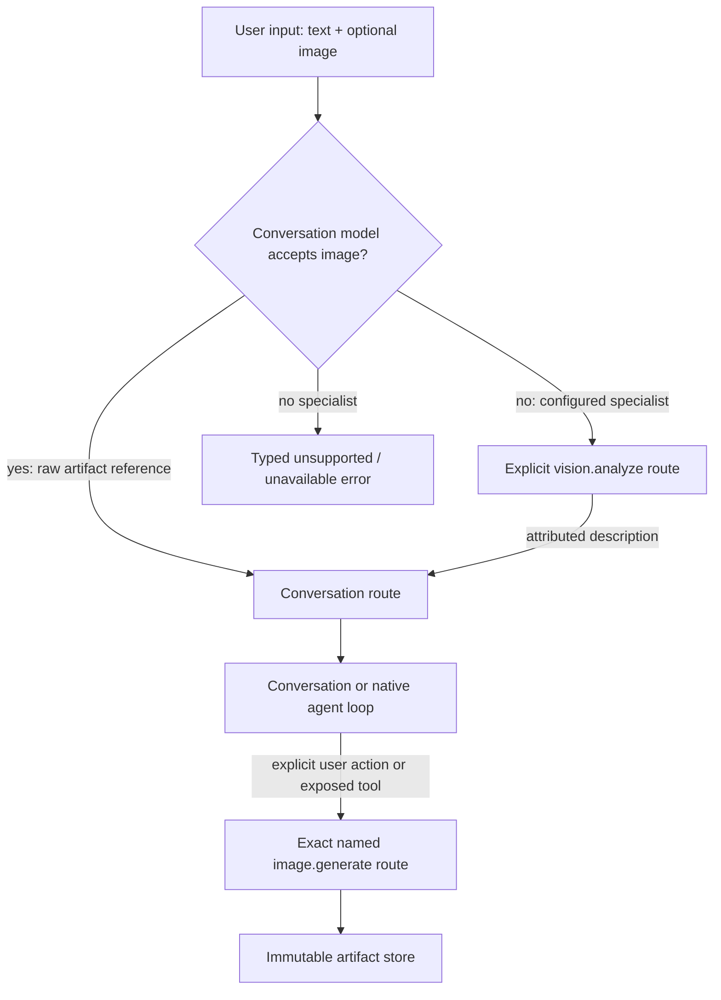
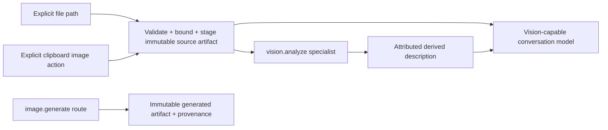

# Focused multimodal services and routing

> Audience: Contributors and coding agents  
> Authority: Prescriptive  
> Status: Accepted

## Context

Xana currently supports artifact-backed image input on compatible
conversational connections, but it does not expose image generation, a vision
specialist for text-only models, named service routes, or clipboard-image
acquisition. These operations have capabilities, costs, payloads, and failure
modes different from conversational generation and must not inflate the
conversational provider interface.

This proposal accepts only the Milestone 3 focused image-generation and vision
slice. Audio, speech, transcription, video, OCR, general automatic routing,
browser/computer control, and broader document/media pipelines remain Proposed.

## Model modalities and focused services

- A **model modality** describes what one conversational model can consume or
  produce, including text and image input.
- A **focused service** implements one typed operation independently of the
  conversational provider contract, initially `image.generate` and
  `vision.analyze`.
- A **service connection** owns protocol, endpoint, credential reference,
  catalog behavior, and transport policy for focused operations.
- A **named route** selects one connection, model, options, description,
  capability descriptor, and policy defaults for one operation.
- A **service invocation** is an exact, permission-aware request resolved from
  a frozen profile. The route name and final arguments are visible before
  authorization.

Sharing a vendor or credential does not merge these types. A conversational
connection and image service may reuse an application-owned credential
reference while keeping distinct adapters, catalogs, capabilities, and
request/response models.

## Routing contract

Native image input is preferred when the selected conversational model
truthfully supports it. A `vision.analyze` specialist is used only when the
model is text-only and the frozen profile exposes a bridge, or when the user
explicitly selects it. Its derived description is labeled untrusted and keeps
source artifact, provider/model, route, and operation provenance. Xana never
pretends it is the original image.

Image generation is never an implicit continuation or silent fallback. The
user or agent selects an exact route from those exposed by the profile. A
missing, unavailable, unauthorized, incompatible, or over-budget route fails
with a typed reason; Xana does not substitute another provider or make a paid
call silently.

## Image input, generation, and artifacts

Path-based attachment remains supported. Clipboard acquisition is an explicit
platform-adapted action because terminal input does not carry raw clipboard
image bytes. Acquisition validates supported image identity, dimensions,
encoded size, decoded work, and artifact limits before the next turn can
reference it. Platform absence is an actionable unavailable reason, not a Xana
startup failure.

Generation adapters return typed metadata and bytes through bounded staging.
Large payloads are never duplicated in session, event, or frontend records.
The immutable artifact record includes content identity, media type,
dimensions where known, source invocation, route, provider, model, relevant
options, usage/cost facts when supplied, creation time, and trust/provenance.
Provider-specific wire fields remain private to adapters.

At least two genuinely different provider adapters must prove the contract.
The planned first adapter is direct OpenAI image generation; the second is FAL
or OpenRouter, selected only after ticket-level review of its current official
API. Deterministic fake adapters are the CI authority. Live smokes are opt-in,
explicitly authorized, redacted, and never required for ordinary tests.

## Capability, authority, and UX

Focused service descriptors report operation, input/output modalities,
generation/editing support, limits, cost/usage availability, cancellation, and
provider-specific constraints without exposing wire types. Profiles expose an
exact set of named routes and may select one default, but a default does not
authorize a call.

Agent use occurs through a typed capability/tool registered outside the
headless loop. CLI, plain mode, TUI, setup, doctor, and future frontends invoke
the same application command. The invocation preview identifies route,
provider, model, outbound data classes, estimated cost when known, permission
scope, and artifact destination. Noninteractive unresolved approvals fail
closed.

Progress, cancellation, partial failure, usage, and artifact completion become
typed application observations. Frontend rendering is bounded and fetches
media by artifact reference. Optional service routes do not change the
conversation model or reconstruct its history.

## Failure and resource contract

- Route resolution is deterministic over a frozen profile and returns typed
  missing connection, model, credential, capability, platform, policy, and
  health reasons.
- Transport enforces endpoint, redirect, timeout, retry, response-size, image,
  metadata, and concurrency limits. Retries occur only where request semantics
  and provider identity make them safe.
- Cancellation stops owned network/process work where supported and records an
  explicit unknown/partial outcome where the provider cannot prove abortion.
- Binary bytes flow through bounded files/streams and immutable artifact
  publication. Session and protocol values carry references only.
- Route catalogs, previews, and model-visible schemas are bounded. Disabled
  services perform no network request and add no material startup work.
- Secret-shaped provider metadata, URLs, headers, prompts, and image metadata
  are redacted or rejected before logs and terminal output.

## Security boundaries

User prompts, source images, provider metadata, generated images, specialist
descriptions, and embedded metadata are untrusted data. Image parsing does not
execute content or fetch embedded links. Service output cannot install a
plugin, activate a skill, grant authority, select a different route, or become
system guidance. Credentials retain Xana's existing owner and never enter
portable project configuration, artifacts, or provenance.

## Explicit deferrals

This proposal excludes audio, TTS, transcription, voice mode, video generation,
OCR, automatic provider/model/service selection, silent fallback, image URL
fetching, Files API upload as a general service, browser/computer control,
general media editing pipelines, and desktop-only clipboard assumptions.

## Relationship to broader proposals

- Proposal 0002 remains Proposed for general automatic capability routing; this
  proposal accepts exact named focused-service routes only.
- Proposal 0006 remains Proposed for audio, OCR, broader document/media
  services, and general parser isolation; this proposal owns the accepted
  image-generation and specialist-vision slice.
- Proposal 0007 remains Proposed for its broader extension state model; route
  declarations and local bindings follow Proposal 0019's accepted ownership.
- Proposal 0008 remains Proposed for generalized context views and native
  plans. Artifact references here do not accept automatic context expansion.

## Implementation status

This proposal is Accepted and prescriptive but not yet implemented. Current
behavior remains described by Architecture and User Documentation. Once all
accepted slices ship, the implementation change must update those documents
and mark this proposal Implemented.
