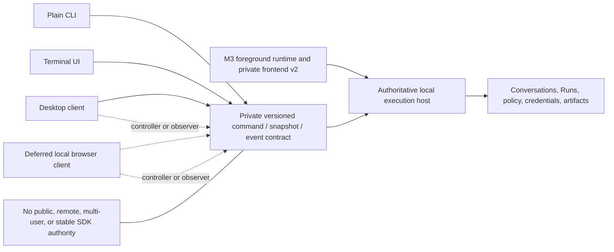
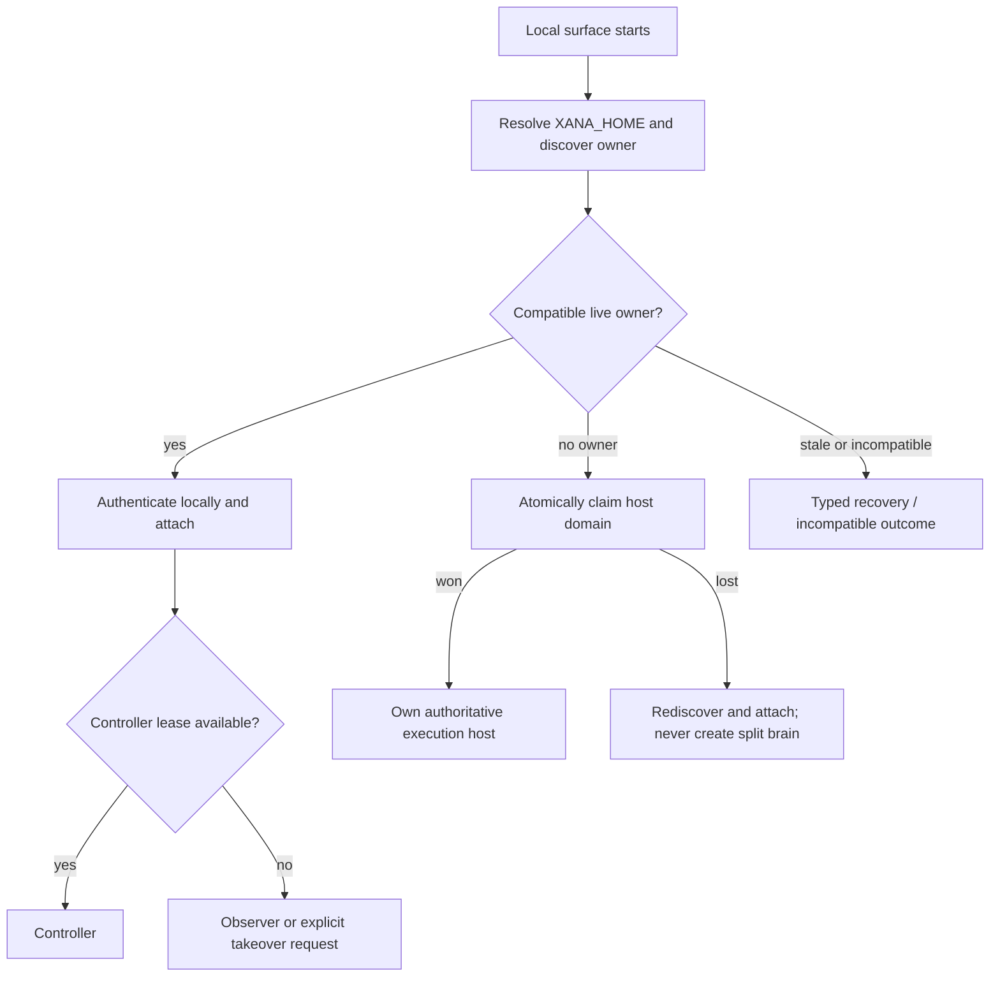
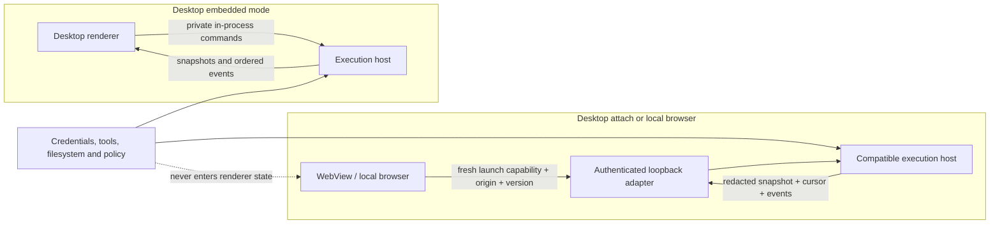
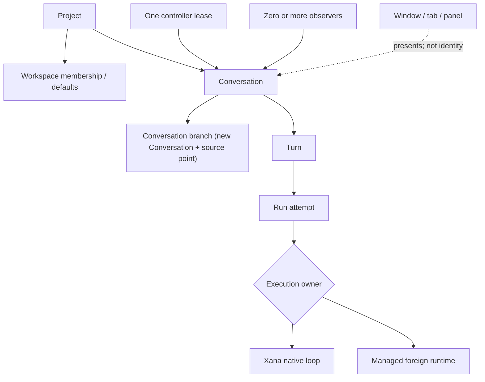
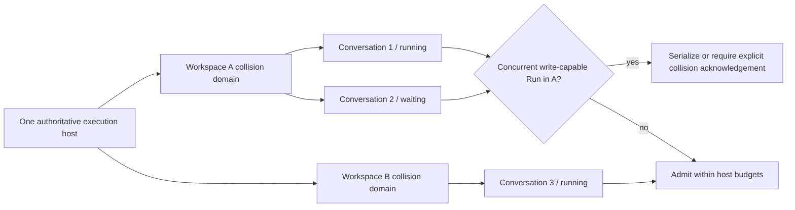
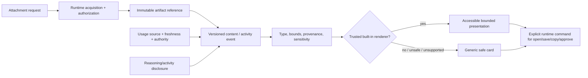
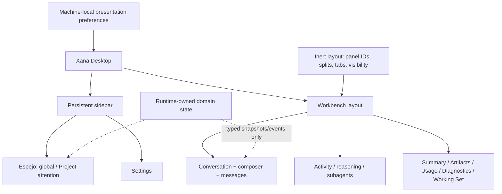
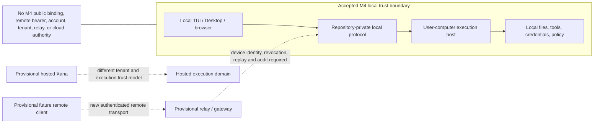

# Local multi-surface Workbench and execution host

> Audience: Contributors and coding agents  
> Authority: Prescriptive  
> Status: Accepted

## Context

Xana will add a separately delivered native Desktop application. It must reuse
the headless engine and repository-private frontend semantics already exercised
by the terminal UI and local foreground host. A graphical surface is a view and
command producer; it does not become a second owner of conversations, tools,
credentials, policy, artifacts, or managed processes. A local browser client
remains a deferred possibility rather than a Milestone 4 deliverable.

The owner selected native GPUI after equivalent disposable Tauri and GPUI
slices, a component-corrected follow-up, and a bounded GPUI/WASM viability
check. Xana Desktop uses `gpui-ai` for AI-native surfaces and
`gpui-component` for general desktop controls. Raw GPUI remains the rendering,
entity, input, window, and platform foundation. The experiment remains ignored
and non-production; production code is reimplemented against Xana's real
runtime contract rather than copied wholesale.

The required native source-build targets remain Windows x64, macOS ARM64,
macOS Intel, and Linux x64 glibc. A framework that cannot satisfy a target must
make that limitation decision evidence; it cannot replace the target silently.

## 1. Official local surfaces and authority

Plain mode and the terminal UI are current official Xana surfaces. Native
Desktop is the accepted next official surface. A later local browser client may
join them only through a separate implementation decision. These surfaces share
domain meaning but may use different presentations. Desktop and any later local
browser are private local clients, not a public API, remote control plane,
multi-user service, stable third-party SDK, or promise of wire compatibility
outside the repository.

The **execution host** is the process domain that owns conversation mutation,
runs, tools, approvals, policy, credentials, artifacts, provider and managed
runtime adapters, ordered events, and durable reconciliation. A client can be:

- the **controller**, which may submit commands for one Conversation under a
  bounded lease; or
- an **observer**, which receives redacted snapshots and ordered events but
  cannot mutate the Conversation.

Client identity and controller leases are local coordination facts, not user
authentication. An embedded client crosses the same logical command/event
boundary as a loopback client even when the transport is an in-process channel.

The M3 embedded and foreground-host implementations are the migration source,
not a license to preserve accidental wire shapes. M4 may evolve the private
protocol transactionally while retaining explicit version/capability checks,
typed unsupported results, fresh-snapshot recovery, and safe unknown-content
fallbacks.

## 2. Attach or own without split brain

For each `XANA_HOME`, canonical workspace collision domain, and Conversation,
one compatible local process owns authoritative mutation. A process may:

1. claim an unowned foreground host domain and publish bounded local discovery;
2. attach to the compatible live owner as controller or observer; or
3. fail with a typed busy, incompatible, stale, or recovery-required outcome.

It may not start another authoritative host merely because attach failed.
Discovery is advisory until ownership is proven with an atomic platform-aware
claim. Stale records are reconciled only after bounded liveness and ownership
checks. A different `XANA_HOME` is a different application domain.

Controller takeover is explicit, visible to both clients, correlated to the
Conversation, and cannot approve an outstanding effect by accident. A client
losing its lease becomes an observer before it can issue further mutations.

## 3. Embedded and authenticated loopback topology

Every separately delivered Desktop artifact includes a matching Rust runtime
and remains usable when no `xana` CLI executable is installed. Desktop may run
that runtime as its execution host or attach to an existing compatible host. A
live compatible owner wins: Desktop must attach instead of starting a competing
writer, and an incompatible owner produces a typed recovery or update outcome
instead of silent split brain.

The CLI and Desktop may therefore coexist under one `XANA_HOME`. They share
runtime-owned Projects, Profiles, Conversations, connection references,
artifacts, permissions, and durable coordination state, while each surface owns
only its presentation preferences. They do not depend on, replace, or load each
other's installed executable. The bounded duplicate compiled runtime code in
independently usable native artifacts is preferable to a mutable shared runtime
installation whose removal or partial update could break another surface.

If the deferred browser client is later implemented, it uses an authenticated
loopback transport. The native Desktop decision does not change these domain
rules:

- embedded transport uses private in-process channels and no network listener;
- loopback binds only an operating-system-selected loopback endpoint;
- every launch creates a fresh, bounded capability that is not placed in a URL,
  command line, browser storage, log, or durable configuration;
- browser origin and protocol/capability negotiation are validated in addition
  to the launch capability;
- WebView or browser code receives no provider key, OAuth token, secret-store
  handle, raw filesystem authority, or direct tool authority;
- reconnect starts from a fresh redacted snapshot and unambiguous event cursor.

No M4 process binds a LAN/public address, opens an Internet-facing WebSocket,
accepts a durable browser bearer, or becomes an indefinite machine daemon.

## 4. Domain identity and execution ownership

The interface uses the following terms consistently:

- **Project**: optional durable Xana grouping and defaults.
- **Workspace**: canonical local execution context and collision domain.
- **Conversation**: durable user-visible history and configuration lineage.
- **Conversation branch**: a new Conversation derived from a source point; the
  source remains immutable.
- **Turn**: one user submission and its resulting model/tool activity.
- **Run**: one bounded execution attempt for a Turn.
- **execution owner**: native Xana loop or managed foreign runtime responsible
  for that Run.
- **controller / observer**: client roles for one Conversation.

A window, tab, panel, or browser route is never the identity of one of these
objects. Changing a view does not transfer runtime ownership. Branching a
managed Conversation creates a new Xana Conversation with explicit source and
managed-runtime provenance; Xana never fabricates foreign continuation support.

## 5. Multiple workspaces and concurrent Conversations

The host may keep bounded Conversations active across multiple workspaces. Each
Run retains its exact workspace, profile, model/runtime owner, permission
scope, and cancellation lineage. Concurrency admission is explicit and bounded.

Two Conversations that can write the same canonical workspace form a collision
domain. Read-only coexistence is allowed; overlapping write-capable Runs require
an explicit acknowledgement or serialization policy. A graphical layout cannot
grant that acknowledgement. Different workspaces do not imply different host
processes, and one Project may contain Conversations from several workspaces.

## 6. Typed content, disclosure, and safe fallback

A Conversation renders ordered, inert **content parts**, not provider wire
objects or executable markup. The initial shared vocabulary must cover text,
bounded Markdown source, code, diffs, tables, math source, reasoning/activity
disclosure, tool calls/results, approvals, artifact-backed resources, usage
observations, attention, progress, errors, and unknown parts. One versioned
resource reference covers raster and animated images, vector and animation
documents, audio, video, opaque binary, and unknown future kinds; raw bytes and
provider-native content objects never enter frontend or session payloads.

An **attachment** is user-selected input awaiting authorization and staging. An
**artifact** is immutable runtime-owned content with an opaque identity,
provenance, media type, size, sensitivity, and lifecycle. Large bytes stay in
the artifact store and cross frontend boundaries by bounded reference.
Declared and detected media types remain distinct. Typed bounded metadata may
describe dimensions, frames, duration, codecs, tracks, accessibility, and
animation, while unknown fields and kinds fall back safely.

Acquisition, inline presentation, playback, external open, conversational
provider input, focused analysis, and transformation are independent
capability facts with source and freshness. A surface renderer never grants
provider input, and provider support never grants local capture or playback.
Disclosure is an operation-scoped decision naming the exact artifact or
derivative, destination, route/model, byte count, and transform; it is not a
mutable `approved` flag on an artifact. Each resize, poster, selected frame,
waveform, metadata-stripped copy, or safe SVG raster is a new immutable artifact
with source lineage and normalized transformer identity and parameters.

Reasoning and activity are disclosure data distinct from the final answer.
Surfaces may collapse them, but cannot discard terminal state, approvals,
errors, provenance, or accessible summaries. Usage facts include source,
freshness, authority (`provider-reported`, `measured`, or `estimated`), and an
explicit unavailable/stale state. Xana does not invent provider quota.

Unknown, unsupported, oversized, unsafe, or failed content renders a generic
non-executable card with safe metadata and explicit actions. Renderers never
fetch remote previews or execute HTML, SVG, script, terminal controls, plugin
code, or model-authored commands.

### Accepted media and resource policy

M4 preserves the current image defaults—eight images, 4 MiB per image, 20 MiB
of images per turn, and 40 million decoded pixels per image—while generalizing
admission to checked, configurable soft limits below immutable compiled
ceilings. `0` and “unlimited” are invalid. Limits are checked before read,
decode, transform, cache reservation, allocation, or upload; route/provider
limits may only reduce the effective allowance.

The initial cross-resource defaults are eight resources per turn, 64 MiB total
encoded source bytes, two active metadata/decoder jobs, one playing time-based
resource, a 128 MiB decoded/derived cache, an 8 MiB in-memory media buffer, and
a 10-second transform deadline. Corresponding immutable ceilings are 32
resources, 512 MiB encoded source, four jobs, two players, a 512 MiB cache, a
64 MiB buffer, and 120 seconds. Per-kind limits additionally bound source bytes,
dimensions and decoded pixels, frames and pixel-frame work, duration, tracks,
sample rate/channels, structured-document nodes/items, embedded assets, and
transform work. Checked `u128` intermediates precede every narrowing conversion.

M4 presents PNG/JPEG/WebP and bounded animated GIF/WebP where a reviewed adapter
passes. SVG is secure-static or runtime-rasterized and never embedded as source
in a privileged UI. Lottie receives a typed card/poster fallback; native Lottie
is not an M4 exit requirement. Audio and video/WebM receive bounded local cards,
open/save/reveal, and optional playback only through a small maintained adapter
that passes platform, accessibility, cancellation, and resource gates. Unknown
binaries are never rendered, transformed, executed, or sent to a provider.
Remote media never auto-loads.

M4 does not add microphone capture, live PCM, endpointing, STT, TTS, barge-in,
or speech-provider routing. Future STT produces an authenticated Xana command;
future TTS consumes authoritative Xana content/events. Neither belongs in the
conversational-provider trait.

## 7. Workbench, panels, and Espejo

The **Workbench** is local presentation state arranging trusted Xana panels. It
does not contain or own domain state. The baseline layout includes a persistent
sidebar plus Conversation, composer, Message, and Activity regions. Trusted
built-in panels may include Summary, Artifacts, Usage, Diagnostics, and an
optional Working Set. **Espejo** is the attention and supervision surface for
global and Project-scoped activity; it does not schedule work merely by being
visible.

Layout state may persist panel kind, stable panel instance identity, docking,
split ratios, tabs, visibility, last-used Conversation layout, one user default,
and non-sensitive visual preferences. It must not persist messages, prompts,
commands, code, raw paths, credentials, capabilities, approval decisions, or
artifact bytes. Import/export previews and validates the inert layout before an
atomic commit. Missing/unknown panels use placeholders; corrupt, offscreen, or
impossible layouts recover to the safe default.

Presentation preferences such as theme, density, typography, reduced motion,
sidebar form, disclosure defaults, and window geometry remain machine-local.
They do not silently mutate Project, Profile, Conversation, or runtime policy.

Official clients provide semantic parity, not pixel parity. Plain mode may emit
text where Desktop has a dock; the TUI may show an artifact card where Desktop
shows an image. Every surface preserves the same domain outcome and a safe
fallback.

## 8. Attention, notifications, diagnostics, and recovery

Attention is a typed runtime observation such as approval required, input
required, failure, disconnect, completed background work, or collision review.
Espejo, badges, native notifications, and terminal indicators project that same
fact. Notifications are privacy-redacted by default and never become authority.

Diagnostics remain available from every Workbench layout. A renderer failure
cannot hide the recovery path. Startup and reconnect reconcile host ownership,
Conversation/Run terminal state, controller lease, artifacts, presentation
records, and provably owned child processes before accepting new mutation.

On close, Xana distinguishes window close, hide/minimize, detach, graceful host
shutdown, and force exit. The client cannot promise background work after its
execution owner exits. Work continues only under an explicit owner and bounded
lifecycle that the UI identifies. Shutdown stops admission, resolves pending
approvals safely, cancels or preserves only explicitly supported work, flushes
bounded durable records, terminates provably owned children, and removes owned
discovery state. Unknown external effect outcomes remain unknown.

```mermaid
stateDiagram-v2
    [*] --> Discover
    Discover --> Attach: compatible owner
    Discover --> Own: atomic claim
    Discover --> Recover: stale / corrupt / unclean state
    Recover --> Attach: live owner found
    Recover --> Own: ownership safely reclaimed
    Attach --> Active
    Own --> Active
    Active --> Detached: client closes; owner continues explicitly
    Active --> Draining: authoritative owner exits
    Draining --> Reconcile: stop admission, settle approvals, bounded cancel, flush
    Reconcile --> Stopped: owned children and discovery cleaned
    Detached --> Attach: compatible client reconnects
    Stopped --> [*]
```

Single-instance behavior is scoped to one `XANA_HOME`: a second Desktop launch
for the same home forwards a bounded open/attention request or attaches; it
does not create a second host. Different homes remain isolated instances.

## 9. Local trust boundary and the provisional remote seam

M4 accepts only trusted-computer local clients. A future remote-control or
hosted topology may reuse domain concepts, but it requires a different trust,
identity, authentication, authorization, transport, audit, retention, tenant,
and operations design. The dashed path below is a non-authoritative seam. It
does not promise a milestone number, product, protocol, relay, mobile client,
cloud host, or compatibility with the private M4 wire contract.

## Selected Desktop stack and source layout

Xana Desktop uses native GPUI with these dependency and ownership rules:

- `gpui-ai` is the application-facing layer for AI-native presentation such as
  controlled conversations, streaming content, thinking/activity, tool calls,
  approvals, attachments, message queues, and agent-aware navigation.
- `gpui-component` supplies ordinary desktop controls, overlays, layout, theme,
  focus, and accessibility behavior. `gpui-base` is used directly only when a
  measured presentation need requires its reusable behavior. Raw GPUI is used
  for framework and platform primitives, not to recreate available controls.
- Xana owns requests, tools, durable state, clocks, domain identifiers, and
  lifecycle transitions. Components receive bounded snapshots and emit typed
  intent; they do not perform runtime work or become a second source of truth.
- `gpui_ai::init` initializes the component stack once before windows open, and
  every window uses one `gpui_component::Root` at its first level.
- The application pins `gpui-ai` to an exact Git revision. It uses the matching
  `gpui-component` revision selected by that checkout and declares GPUI with the
  same Git source identity used by `gpui-component`; the committed `Cargo.lock`
  pins the exact Zed commit. A dependency-graph gate rejects duplicate GPUI type
  families. Upgrades are isolated changes with source/changelog review and
  cross-platform, accessibility, input, performance, size, and launch evidence.
- Xana does not fork or vendor GPUI, GPUI Component, or `gpui-ai` implicitly.
  A reusable missing AI component is first reduced to a component-library issue
  or contribution; Xana-specific workflow composition stays in Xana. A
  Xana-maintained fork requires its own ADR and maintenance budget.

Desktop source lives in this repository and Cargo workspace. The first
production slice adds one workspace member, `crates/xana-desktop`, which owns
native process startup, windows, GPUI entities, presentation state, and narrow
platform adapters. It consumes a repository-private typed seam from the
existing `xana` library; it does not create a sibling repository, a second
workspace, or a stable public SDK. Additional Desktop or feature crates are
created only when actual ownership and independent test/compile boundaries
justify them.

Tauri is the rejected Desktop alternative. It remains useful comparison
evidence, but its easier browser path did not outweigh the selected native Rust
stack, lower measured process footprint, simpler process topology, and owner
preference. GPUI/WASM is not the accepted browser renderer. Local web is
deferred; any later browser surface must preserve Rust-owned authority and earn
its own accessibility, security, bundle, input, and maintenance decision.

## Implementation sequence

1. Record the exact implemented M3 handoff and accept this proposal.
2. Build and measure the equal disposable framework slices.
3. Record the owner's native GPUI and `gpui-ai` decision in ADR 0003.
4. Extend the private content and host contracts while building the first
   in-repository Desktop walking skeleton.
5. Improve the terminal surfaces and grow Desktop through the shared typed
   semantics. Keep local web deferred unless separately accepted.

Current Architecture and User Documentation remain unchanged until each part
exists in production. When this proposal is implemented, its shipped portions
move into those authorities and this document becomes historical.

## Explicit non-goals

- Remote control, remote execution, public web access, mobile delivery, cloud
  hosting, multi-user or tenant operation.
- A public/stable frontend SDK or arbitrary executable plugin UI.
- Provider, tool, credential, or filesystem authority in renderer code.
- A built-in editor, terminal emulator, browser, media engine, or preview
  fetcher.
- M6 history virtualization, memory, compaction, or RLM behavior.
- Signing, installers, update channels, release publication, or distribution
  policy.

## Consequences

Xana gains one explicit local topology and vocabulary before graphical code is
written. The cost is additional host coordination, accessibility, protocol,
and recovery work that a single-process TUI did not need. That cost is accepted
because multiple official clients without one authority contract would create
split-brain state, duplicated security policy, and UI-specific domain models.

The consequential framework and source-layout choice is recorded in
[ADR 0003](../adr/0003-build-desktop-with-native-gpui-and-gpui-ai.md). Native
GPUI and its pre-1.0 dependency graph add upgrade and platform-validation cost,
but they keep Xana Desktop in Rust, avoid a privileged browser renderer, and
let `gpui-ai` carry reusable AI interaction behavior without transferring
runtime authority into components.
