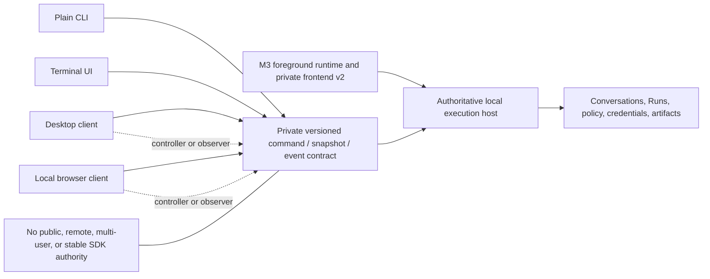
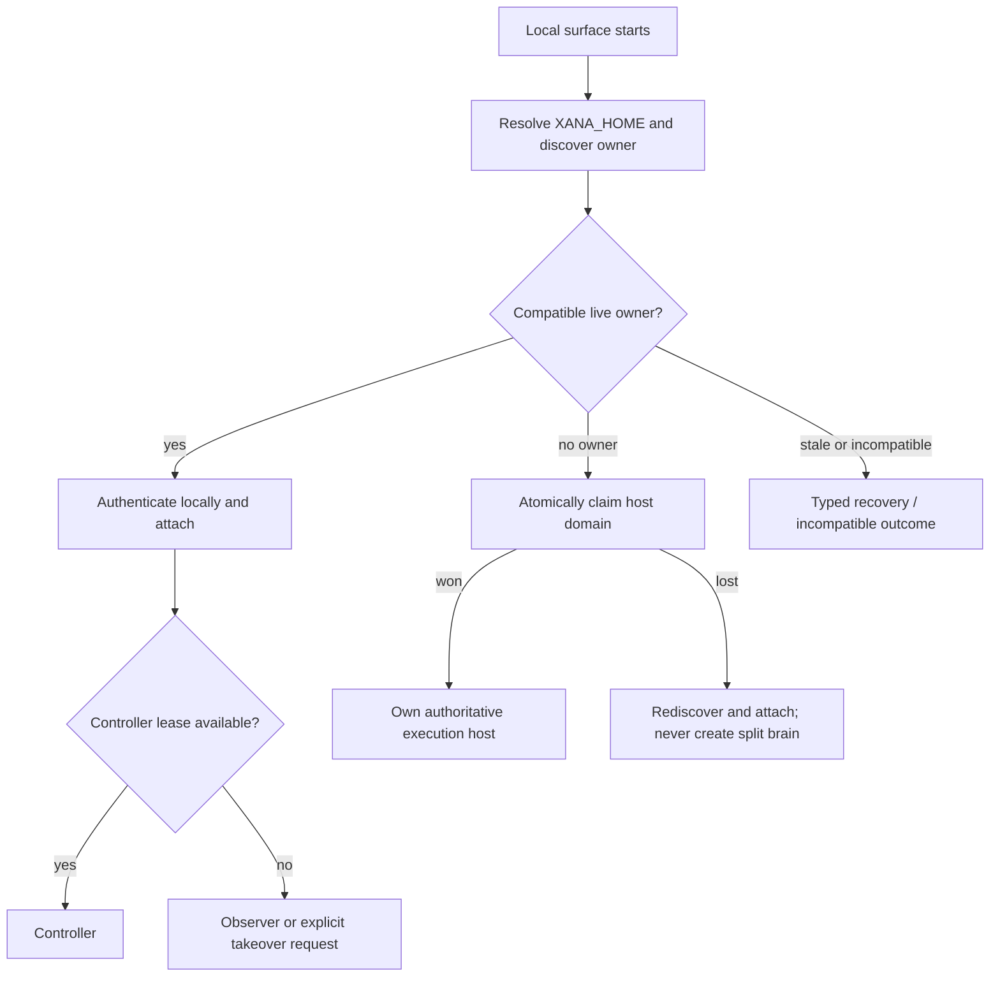
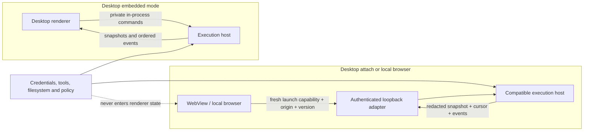
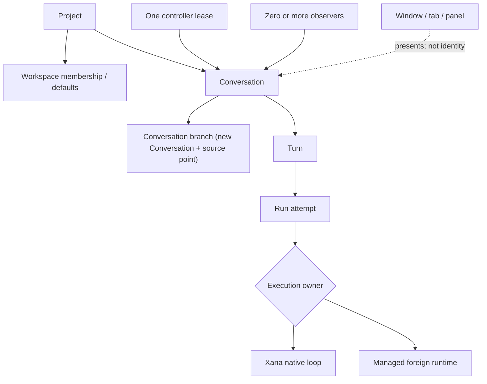
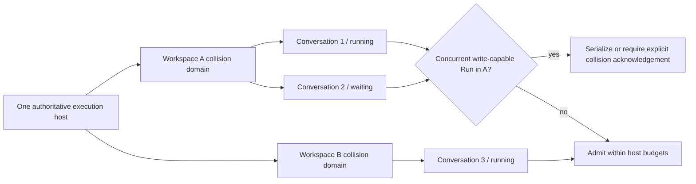
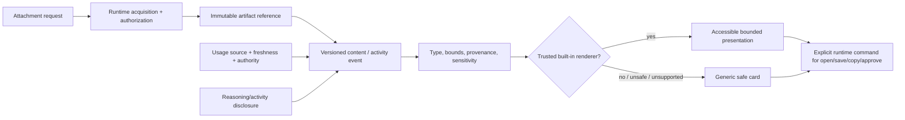
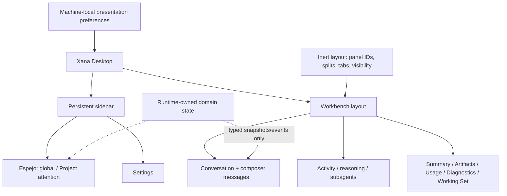
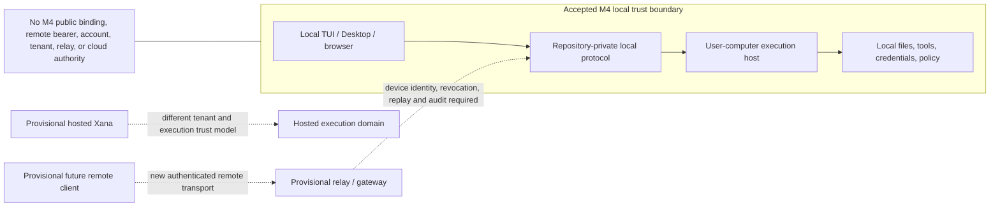

# Local multi-surface Workbench and execution host

> Audience: Contributors and coding agents  
> Authority: Prescriptive  
> Status: Accepted

## Context

Xana will add two richer local surfaces: a separately delivered Desktop
application and a local browser client. They must reuse the headless engine and
repository-private frontend semantics already exercised by the terminal UI and
local foreground host. A graphical surface is a view and command producer; it
does not become a second owner of conversations, tools, credentials, policy,
artifacts, or managed processes.

This proposal accepts the local interface architecture required before those
surfaces are implemented. It does not select a Desktop framework. Tauri 2 with
React and GPUI must first render and operate the same disposable fixture, and
the owner selects the stack from measured evidence. Until that decision is
recorded, neither prototype is production architecture.

The required native source-build targets remain Windows x64, macOS ARM64,
macOS Intel, and Linux x64 glibc. A framework that cannot satisfy a target must
make that limitation decision evidence; it cannot replace the target silently.

## 1. Official local surfaces and authority

Plain mode, the terminal UI, local browser, and Desktop are official Xana
surfaces. They share domain meaning but may use different presentations. The
local browser and Desktop are private local clients. They are not a public API,
remote control plane, multi-user service, stable third-party SDK, or promise of
wire compatibility outside the repository.

The **execution host** is the process domain that owns conversation mutation,
runs, tools, approvals, policy, credentials, artifacts, provider and managed
runtime adapters, ordered events, and durable reconciliation. A client can be:

- the **controller**, which may submit commands for one Conversation under a
  bounded lease; or
- an **observer**, which receives redacted snapshots and ordered events but
  cannot mutate the Conversation.

Client identity and controller leases are local coordination facts, not user
authentication. An embedded client crosses the same logical command/event
boundary as a loopback client even when the transport is an in-process channel.

The M3 embedded and foreground-host implementations are the migration source,
not a license to preserve accidental wire shapes. M4 may evolve the private
protocol transactionally while retaining explicit version/capability checks,
typed unsupported results, fresh-snapshot recovery, and safe unknown-content
fallbacks.

## 2. Attach or own without split brain

For each `XANA_HOME`, canonical workspace collision domain, and Conversation,
one compatible local process owns authoritative mutation. A process may:

1. claim an unowned foreground host domain and publish bounded local discovery;
2. attach to the compatible live owner as controller or observer; or
3. fail with a typed busy, incompatible, stale, or recovery-required outcome.

It may not start another authoritative host merely because attach failed.
Discovery is advisory until ownership is proven with an atomic platform-aware
claim. Stale records are reconciled only after bounded liveness and ownership
checks. A different `XANA_HOME` is a different application domain.

Controller takeover is explicit, visible to both clients, correlated to the
Conversation, and cannot approve an outstanding effect by accident. A client
losing its lease becomes an observer before it can issue further mutations.

## 3. Embedded and authenticated loopback topology

Desktop may embed the execution host or attach to an existing compatible host.
The browser client always uses an authenticated loopback transport. Desktop
framework choice does not change these domain rules:

- embedded transport uses private in-process channels and no network listener;
- loopback binds only an operating-system-selected loopback endpoint;
- every launch creates a fresh, bounded capability that is not placed in a URL,
  command line, browser storage, log, or durable configuration;
- browser origin and protocol/capability negotiation are validated in addition
  to the launch capability;
- WebView or browser code receives no provider key, OAuth token, secret-store
  handle, raw filesystem authority, or direct tool authority;
- reconnect starts from a fresh redacted snapshot and unambiguous event cursor.

No M4 process binds a LAN/public address, opens an Internet-facing WebSocket,
accepts a durable browser bearer, or becomes an indefinite machine daemon.

## 4. Domain identity and execution ownership

The interface uses the following terms consistently:

- **Project**: optional durable Xana grouping and defaults.
- **Workspace**: canonical local execution context and collision domain.
- **Conversation**: durable user-visible history and configuration lineage.
- **Conversation branch**: a new Conversation derived from a source point; the
  source remains immutable.
- **Turn**: one user submission and its resulting model/tool activity.
- **Run**: one bounded execution attempt for a Turn.
- **execution owner**: native Xana loop or managed foreign runtime responsible
  for that Run.
- **controller / observer**: client roles for one Conversation.

A window, tab, panel, or browser route is never the identity of one of these
objects. Changing a view does not transfer runtime ownership. Branching a
managed Conversation creates a new Xana Conversation with explicit source and
managed-runtime provenance; Xana never fabricates foreign continuation support.

## 5. Multiple workspaces and concurrent Conversations

The host may keep bounded Conversations active across multiple workspaces. Each
Run retains its exact workspace, profile, model/runtime owner, permission
scope, and cancellation lineage. Concurrency admission is explicit and bounded.

Two Conversations that can write the same canonical workspace form a collision
domain. Read-only coexistence is allowed; overlapping write-capable Runs require
an explicit acknowledgement or serialization policy. A graphical layout cannot
grant that acknowledgement. Different workspaces do not imply different host
processes, and one Project may contain Conversations from several workspaces.

## 6. Typed content, disclosure, and safe fallback

A Conversation renders ordered, inert **content parts**, not provider wire
objects or executable markup. The initial shared vocabulary must cover text,
bounded Markdown source, code, diffs, tables, math source, reasoning/activity
disclosure, tool calls/results, approvals, images, generic attachments,
artifacts, usage observations, attention, progress, errors, and unknown parts.

An **attachment** is user-selected input awaiting authorization and staging. An
**artifact** is immutable runtime-owned content with an opaque identity,
provenance, media type, size, sensitivity, and lifecycle. Large bytes stay in
the artifact store and cross frontend boundaries by bounded reference.

Reasoning and activity are disclosure data distinct from the final answer.
Surfaces may collapse them, but cannot discard terminal state, approvals,
errors, provenance, or accessible summaries. Usage facts include source,
freshness, authority (`provider-reported`, `measured`, or `estimated`), and an
explicit unavailable/stale state. Xana does not invent provider quota.

Unknown, unsupported, oversized, unsafe, or failed content renders a generic
non-executable card with safe metadata and explicit actions. Renderers never
fetch remote previews or execute HTML, SVG, script, terminal controls, plugin
code, or model-authored commands.

## 7. Workbench, panels, and Espejo

The **Workbench** is local presentation state arranging trusted Xana panels. It
does not contain or own domain state. The baseline layout includes a persistent
sidebar plus Conversation, composer, Message, and Activity regions. Trusted
built-in panels may include Summary, Artifacts, Usage, Diagnostics, and an
optional Working Set. **Espejo** is the attention and supervision surface for
global and Project-scoped activity; it does not schedule work merely by being
visible.

Layout state may persist panel kind, stable panel instance identity, docking,
split ratios, tabs, visibility, last-used Conversation layout, one user default,
and non-sensitive visual preferences. It must not persist messages, prompts,
commands, code, raw paths, credentials, capabilities, approval decisions, or
artifact bytes. Import/export previews and validates the inert layout before an
atomic commit. Missing/unknown panels use placeholders; corrupt, offscreen, or
impossible layouts recover to the safe default.

Presentation preferences such as theme, density, typography, reduced motion,
sidebar form, disclosure defaults, and window geometry remain machine-local.
They do not silently mutate Project, Profile, Conversation, or runtime policy.

Official clients provide semantic parity, not pixel parity. Plain mode may emit
text where Desktop has a dock; the TUI may show an artifact card where Desktop
shows an image. Every surface preserves the same domain outcome and a safe
fallback.

## 8. Attention, notifications, diagnostics, and recovery

Attention is a typed runtime observation such as approval required, input
required, failure, disconnect, completed background work, or collision review.
Espejo, badges, native notifications, and terminal indicators project that same
fact. Notifications are privacy-redacted by default and never become authority.

Diagnostics remain available from every Workbench layout. A renderer failure
cannot hide the recovery path. Startup and reconnect reconcile host ownership,
Conversation/Run terminal state, controller lease, artifacts, presentation
records, and provably owned child processes before accepting new mutation.

On close, Xana distinguishes window close, hide/minimize, detach, graceful host
shutdown, and force exit. The client cannot promise background work after its
execution owner exits. Work continues only under an explicit owner and bounded
lifecycle that the UI identifies. Shutdown stops admission, resolves pending
approvals safely, cancels or preserves only explicitly supported work, flushes
bounded durable records, terminates provably owned children, and removes owned
discovery state. Unknown external effect outcomes remain unknown.

```mermaid
stateDiagram-v2
    [*] --> Discover
    Discover --> Attach: compatible owner
    Discover --> Own: atomic claim
    Discover --> Recover: stale / corrupt / unclean state
    Recover --> Attach: live owner found
    Recover --> Own: ownership safely reclaimed
    Attach --> Active
    Own --> Active
    Active --> Detached: client closes; owner continues explicitly
    Active --> Draining: authoritative owner exits
    Draining --> Reconcile: stop admission, settle approvals, bounded cancel, flush
    Reconcile --> Stopped: owned children and discovery cleaned
    Detached --> Attach: compatible client reconnects
    Stopped --> [*]
```

Single-instance behavior is scoped to one `XANA_HOME`: a second Desktop launch
for the same home forwards a bounded open/attention request or attaches; it
does not create a second host. Different homes remain isolated instances.

## 9. Local trust boundary and the provisional remote seam

M4 accepts only trusted-computer local clients. A future remote-control or
hosted topology may reuse domain concepts, but it requires a different trust,
identity, authentication, authorization, transport, audit, retention, tenant,
and operations design. The dashed path below is a non-authoritative seam. It
does not promise a milestone number, product, protocol, relay, mobile client,
cloud host, or compatibility with the private M4 wire contract.

## Framework comparison and owner decision gate

M4 must build disposable Tauri 2/React and GPUI slices from one versioned
fixture and interaction checklist. Both must account for the complete product
topology: Tauri must prove its presentation can serve both Desktop and a local
browser peer; GPUI must include the measured cost and maintenance of a separate
browser presentation. Both report inactive CLI/TUI impact, target availability,
startup, input/event-to-paint latency, frame behavior, idle CPU/redraw, memory,
size, build complexity, dependencies/licenses, accessibility, IME, rich content,
security boundary, testing, and maintenance.

The comparison cannot connect providers, read credentials, mutate Xana state,
execute tools, or expose a network listener. It cannot select a winner. At the
decision gate, the owner may select one stack, reject both, or request one
bounded follow-up. A selected stack requires a later accepted decision and
production security boundary before prototype code can be adopted.

## Implementation sequence

1. Record the exact implemented M3 handoff and accept this proposal.
2. Build and measure the equal disposable framework slices.
3. Stop for the owner framework decision.
4. Only after that decision, extend the private content and host contracts,
   improve the TUI, and build production local browser/Desktop surfaces.

Current Architecture and User Documentation remain unchanged until each part
exists in production. When this proposal is implemented, its shipped portions
move into those authorities and this document becomes historical.

## Explicit non-goals

- Remote control, remote execution, public web access, mobile delivery, cloud
  hosting, multi-user or tenant operation.
- A public/stable frontend SDK or arbitrary executable plugin UI.
- Provider, tool, credential, or filesystem authority in renderer code.
- A built-in editor, terminal emulator, browser, media engine, or preview
  fetcher.
- M6 history virtualization, memory, compaction, or RLM behavior.
- Signing, installers, update channels, release publication, or distribution
  policy.

## Consequences

Xana gains one explicit local topology and vocabulary before graphical code is
written. The cost is additional host coordination, accessibility, protocol,
and recovery work that a single-process TUI did not need. That cost is accepted
because multiple official clients without one authority contract would create
split-brain state, duplicated security policy, and UI-specific domain models.

No ADR is created yet. The consequential framework choice remains unresolved;
the owner comparison is the evidence required before recording that decision.
